<properties
	pageTitle="Azure Backup for SQL Server workloads using DPM | Microsoft Azure"
	description="An introduction to backing up SQL Server databases using the Azure Backup service"
	services="backup"
	documentationCenter=""
	authors="adigan"
	manager="Nkolli1"
	editor=""/>

<tags
	ms.service="backup"
	ms.workload="storage-backup-recovery"
	ms.tgt_pltfrm="na"
	ms.devlang="na"
	ms.topic="article"
	ms.date="07/01/2016"
	ms.author="giridham; jimpark;markgal;trinadhk"/>

# Azure Backup for SQL Server workloads using DPM

This article will lead you through the configuration steps for backup of SQL Server databases using Azure Backup.

To back up SQL Server databases to Azure you need an Azure account. If you don’t have an account, you can create a free trial account in just couple of minutes. For details, see [Azure Free Trial](https://azure.microsoft.com/pricing/free-trial/).

The management of SQL Server database backup to Azure and recovery from Azure involves three steps:

1. Create a backup policy to protect SQL Server databases to Azure.
2. Create on-demand backup copies to Azure.
3. Recover the database from Azure.

## Before you start
Before you begin, ensure that all the [prerequisites](../backup-azure-dpm-introduction.md#prerequisites) for using Microsoft Azure Backup to protect workloads have been met. The prerequisites cover tasks such as creating a backup vault, downloading vault credentials, installing the Azure Backup Agent and registering the server with the vault.

## Create a backup policy to protect SQL Server databases to Azure

1. In the DPM server, configure a new backup policy for SQL Server databases by creating a new **Protection Group**. Click the **Protection** workspace.

2. Click **New** to create a new protection group.

    

3. DPM shows the start screen with the guidance on creating a **Protection Group**. Click **Next**.

4. Select **Servers**.

    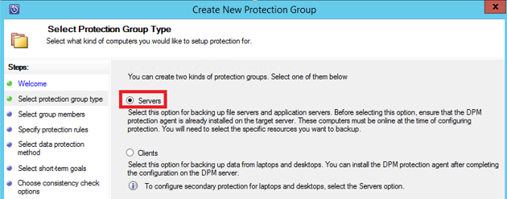

5. Expand the SQL Server machine where the databases to be backed up are present. DPM shows various data sources that can be backed up from that server. Expand the **All SQL Shares** and select the databases (in this case we selected ReportServer$MSDPM2012 and ReportServer$MSDPM2012TempDB) to be backed up. Click **Next**.

    You will find a screen similar to the one below.

    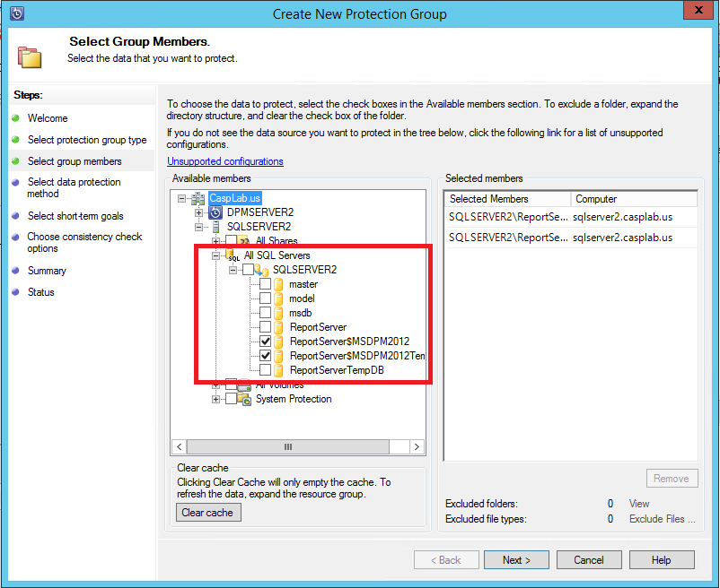

6. Provide name for the protection group you are going to create. Make sure you select the  “**I want online Protection**” option.

    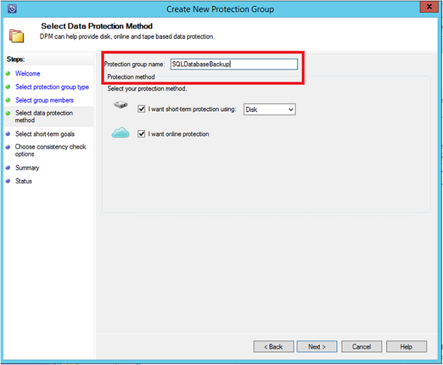

7. In the **Specify Short-Term Goals** screen, include the necessary inputs to create backup points to disk.

    Here we see that **Retention range** is set to *5 days*, **Synchronization frequency** is set to once every *15 minutes* which is the frequency at which backup is taken. **Express Full Backup** is set to *8:00 P.M*.

    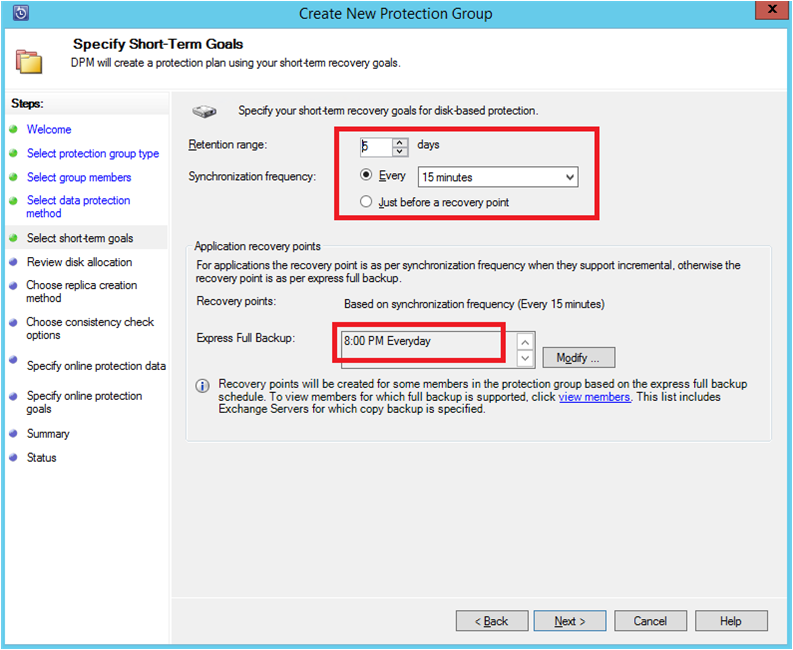

    >[AZURE.NOTE] At 8:00 PM (according to the screen input) a backup point is created every day by transferring the data that has been modified from the previous day’s 8:00 PM backup point. This process is called **Express Full Backup**. While the transaction logs are synchronized every 15 minutes, if there is a need to recover the database at 9:00 PM – then the point is created by replaying the logs from the last express full backup point (8pm in this case).

8. Click **Next**

    DPM shows the overall storage space available and the potential disk space utilization.

    

    DPM creates one volume per data source (SQL Server database) for creating initial backup copy. With this approach, the Logical Disk Manager (LDM) limits DPM to protect up to 300 data sources (SQL Server databases) only. In order to avoid this DPM has implemented another approach which uses a single volume for multiple data sources. This is enabled using the **Co-locate data in DPM Storage Pool**. With this approach DPM can protect up to 2000 SQL databases.

    DPM can account for the backup volume increase as the production data grows, if **Automatically grow the volumes** is selected. If you uncheck **Automatically grow the volumes**, it will limit the backup storage used to back up the data sources in the protection group.

9. Administrators are given the choice of transferring this initial backup manually (off network) to avoid bandwidth congestion or over the network. They can also configure the time at which the initial transfer can happen. Click **Next**.

    

    The initial backup copy requires transfer of the entire data source (SQL Server database) from production server (SQL Server machine) to the DPM server. This data might at times be very large and transferring this over network might exceed bandwidth. Hence, Admins are given a choice on whether they want to transfer this initial backup **Manually** to avoid bandwidth clogging or they want it to happen **Automatically** over the network. Also, when Admins choose **Network** they are given a choice of whether to create initial backup copy **Now** or **Later**, at a specified time.

    Once the initial backup is complete, the remainder of the backups are incremental backups on top of initial backup copy which in general are very small and get transferred on the network.

10. Choose when you want the consistency check to run and click **Next**.

    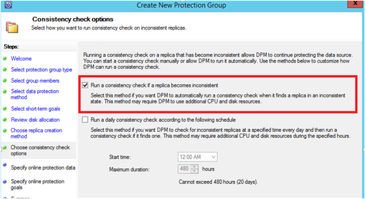

    DPM can perform a consistency check to check the integrity of the backup point. It calculates the checksum of the backup file on the production server (SQL Server machine in this scenario) and the backed up data for that file at DPM. In the case of a conflict it is assumed that the backed up file at DPM is corrupt. DPM rectifies the backed up data by sending the blocks corresponding to the checksum mismatch. As the consistency check is a performance intensive operation, administrators are provided with the option of scheduling it or running it automatically.

11. To specify online protection of the datasources, select the databases to be protected to Azure and click **Next**.

    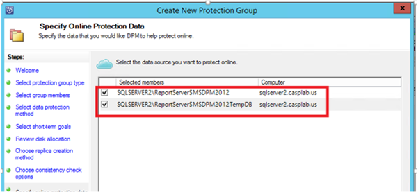

12. Administrators can choose backup schedules and retention policies that suit their organization policies.

    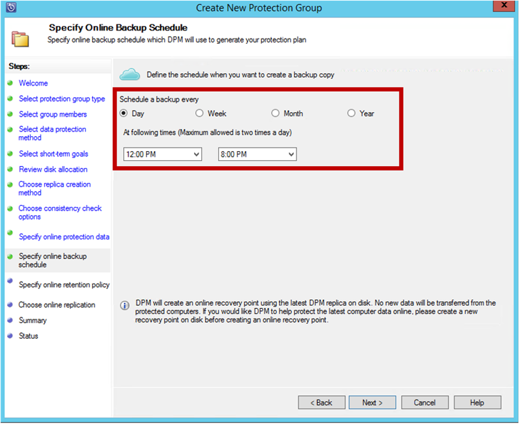

    In this example, backups are taken once a day at 12:00 PM and 8 PM (bottom part of the screen)

    >[AZURE.NOTE] It’s a good practice to have a few recovery points for short term on disk for quick recovery. This is called “operational recovery”. Azure serves as a good offsite location with higher SLAs and guaranteed availability.

    **Best Practice**: Make sure that Azure Backups are scheduled after the completion of local disk backups using DPM. This enable the latest disk backup to be copied to Azure.

13. Choose the retention policy schedule. The details on how the retention policy works are provided at [Use Azure Backup to replace your tape infrastructure article](backup-azure-backup-cloud-as-tape.md).

    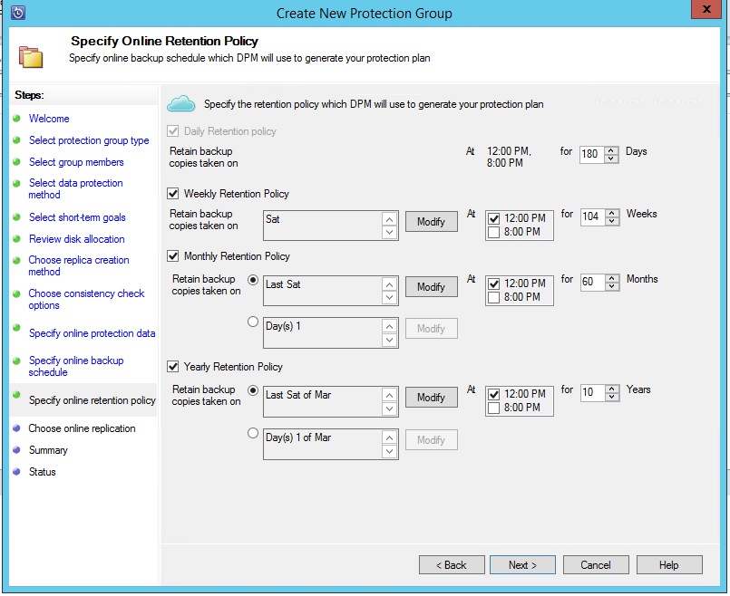

    In this example:

    - Backups are taken once a day at 12:00 PM and 8 PM (bottom part of the screen) and are retained for 180 days.
    - The backup on Saturday at 12:00 P.M. is retained for 104 weeks
    - The backup on Last Saturday at 12:00 P.M. is retained for 60 months
    - The backup on Last Saturday of March at 12:00 P.M. is retained for 10 years

14. Click **Next** and select the appropriate option for transferring the initial backup copy to Azure. You can choose **Automatically over the network** or **Offline Backup**.

    - **Automatically over the network** will transfer the backup data to Azure as per the schedule chosen for backup.
    - How **Offline Backup** works is explained at [Offline Backup workflow in Azure Backup](backup-azure-backup-import-export.md).

    Choose the relevant transfer mechanism to send the initial backup copy to Azure and click **Next**.

15. Once you review the policy details in the **Summary** screen, click on the **Create group** button to complete the workflow. You can click the **Close** button and monitor the job progress in Monitoring workspace.

    

## On demand backup of a SQL Server database
While the previous steps created a backup policy, a “recovery point” is created only when the first backup occurs. Rather than waiting for the scheduler to kick in, the steps below will trigger the creation of a recovery point manually.

1. Wait until the protection group status shows **OK** for the database before creating the recovery point.

    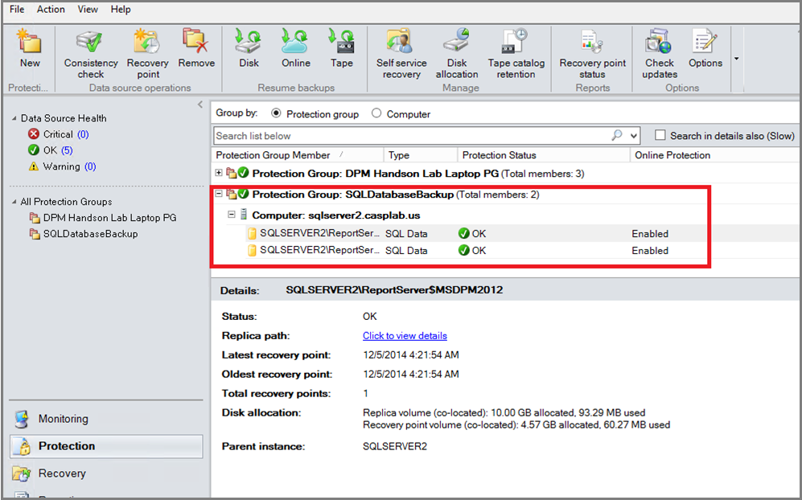

2. Right click on the database and select **Create Recovery Point**.

    

3. Choose **Online Protection** in the drop down and click **OK**. This will start the creation of a recovery point in Azure.

    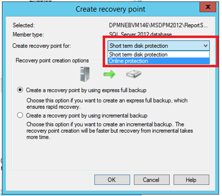

4. You can view the job progress in the **Monitoring** workspace where you will find an in progress job like the one depicted in the next figure.

    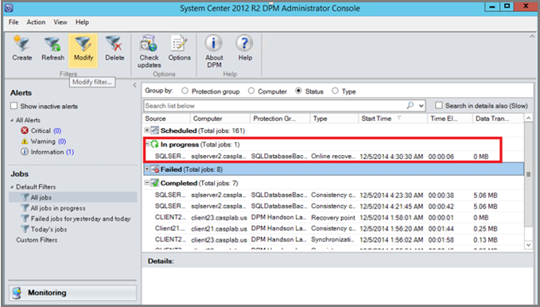

## Recover a SQL Server database from Azure
The following steps are required to recover a protected entity (SQL Server database) from Azure.

1. Open the DPM server Management Console. Navigate to **Recovery** workspace where you will be able to see the servers backed up by DPM. Browse the required database (in this case ReportServer$MSDPM2012). Select a **Recovery from** time which ends with **Online**.

    

2. Right click the database name and click **Recover**.

    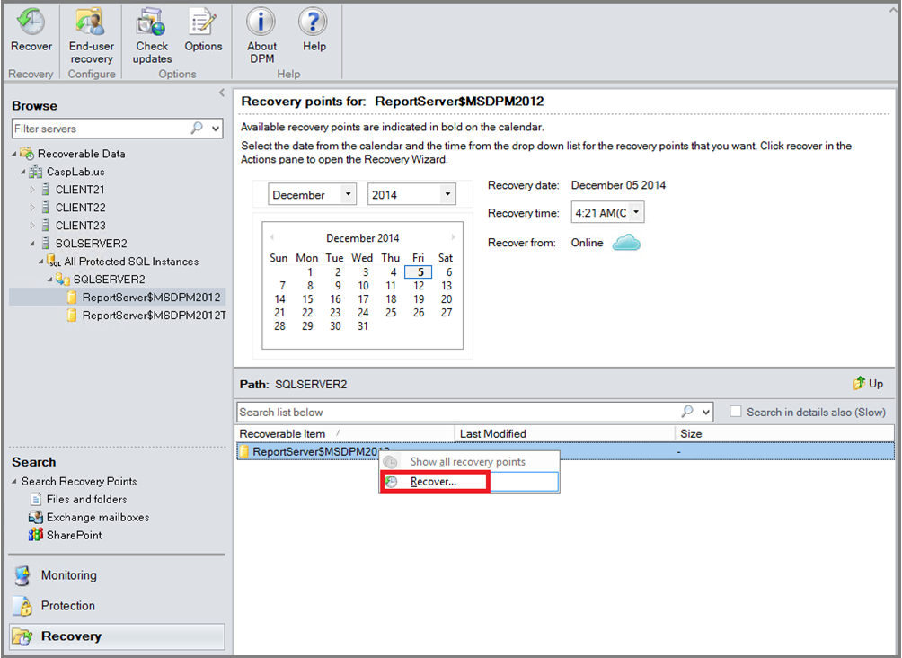

3. DPM shows the details of the recovery point. Click **Next**. Select the recovery type **Recover to original instance of SQL Server**. This will overwrite the database. Click **Next**.

    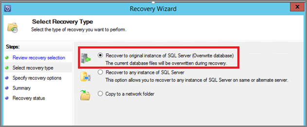

    In this example, DPM allows recovery of the database to another SQL Server instance or to a standalone network folder.

4. In the **Specify Recovery options** screen, you can select the recovery options like Network bandwidth usage throttling to throttle the bandwidth used by recovery. Click **Next**.

5. In the **Summary** screen, you will see all the recovery configurations provided so far. Click **Recover**.

    The Recovery status shows that the database being recovered. You can click **Close** to close the wizard and view the progress in the **Monitoring** workspace.

    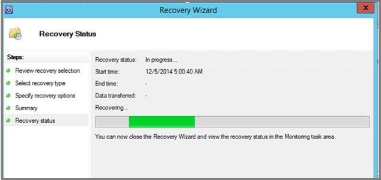

    Once the recovery is completed, the database copy restored will be application consistent.

### Next Steps:

•	[Azure Backup FAQ](backup-azure-backup-faq.md)
