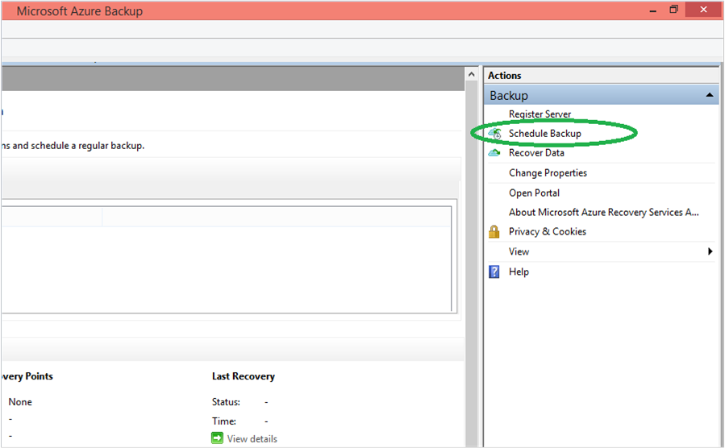
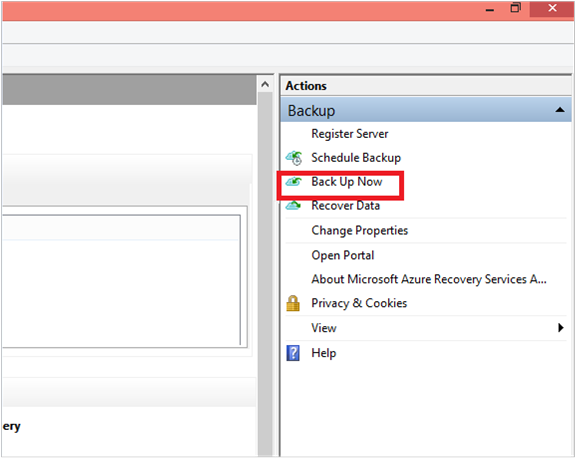

<properties
   pageTitle="Back up Windows Server or Windows Client files and folders to Azure | Microsoft Azure"
   description="Learn how to backup from a Windows Server or Windows Client to Azure."
   services="backup"
   documentationCenter=""
   authors="aashishr"
   manager="jwhit"
   editor=""/>

<tags
   ms.service="backup"
   ms.workload="storage-backup-recovery"
	 ms.tgt_pltfrm="na"
	 ms.devlang="na"
	 ms.topic="article"
	 ms.date="10/21/2015"
	 ms.author="jimpark"; "aashishr"/>

# Back up Windows Server or Windows Client files and folders to Azure
This article covers the steps required to back up Windows server or Windows client files and folders to Azure.

## Before you start
Before you proceed, ensure that all the  [prerequisites](backup-configure-vault.md#before-you-start) for using Microsoft Azure Backup to protect Windows Server and Windows Client are met. The prerequisites cover tasks such as: creating a backup vault, downloading vault credentials, installing the Azure Backup Agent, and registering the machine with the vault.

## Backup files
1. Once the machine is registered, open the Microsoft Azure Backup mmc snap-in.

    

2. Click **Schedule Backup**

    

3. Select the items you wish to back up. Azure Backup on a Windows Server/Windows Client (i.e without System Center Data Protection Manager) enables you to protect files and folders.

    

4. Specify the backup schedule and retention policy which is explained in detail in the following [article](backup-azure-backup-cloud-as-tape.md).

5. Choose the method for sending the initial backup. Your choice of completing the initial seeding is dependent on the amount of data you wish to back up and your internet upload link speed. If you plan to back up GB’s/TB’s of data over a high latency, low bandwidth connection, it is recommended that you complete the initial backup by shipping a disk to the nearest Azure data center. This is called “Offline Backup” and is covered in detail in this [article](backup-azure-backup-import-export.md). If you have a sufficient bandwidth connection we recommend that you complete the initial backup over the network.

    

6. After the schedule backup process is completed, go back to the mmc snap in and click **Back up Now** to complete the initial seeding over the network.

    

7. After the initial seeding is completed, the **Jobs** view in the Azure Backup console indicates the status.

    

## Next Steps
- [Manage Windows Server or Windows Client](backup-azure-manage-windows-server.md)
- [Restore Windows Server or Windows Client from Azure](backup-azure-restore-windows-server.md)
- [Azure Backup FAQ](backup-azure-backup-faq.md)
