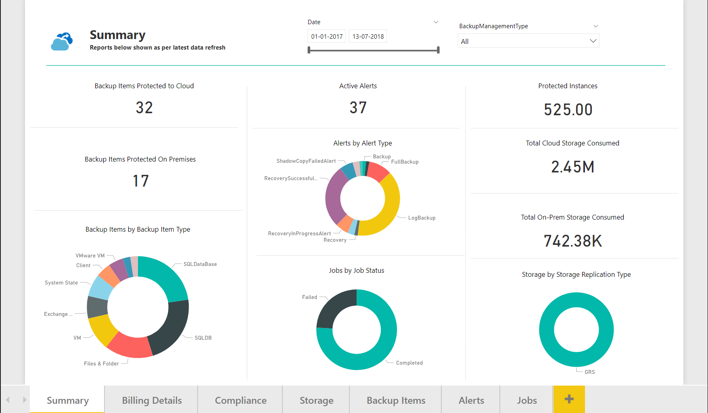
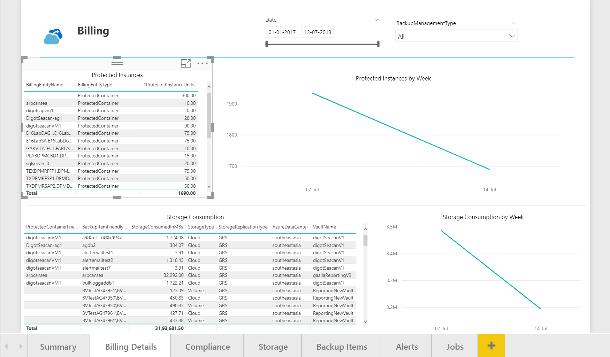
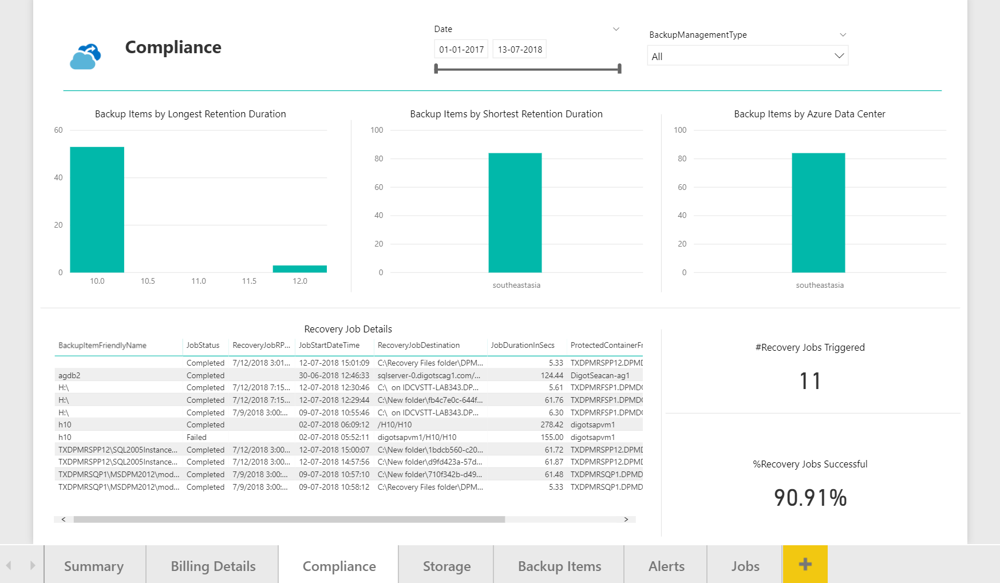
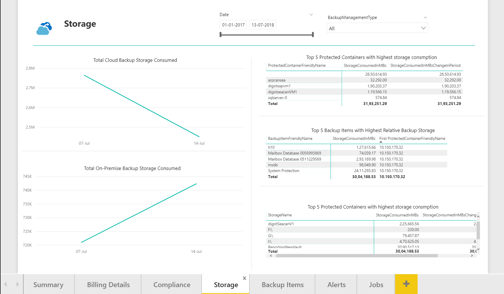
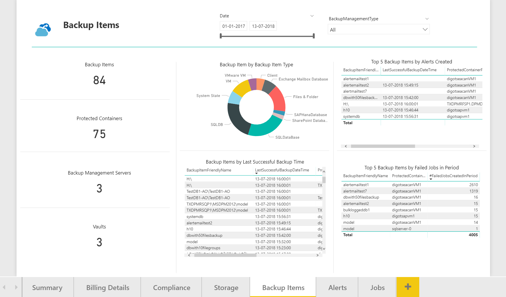
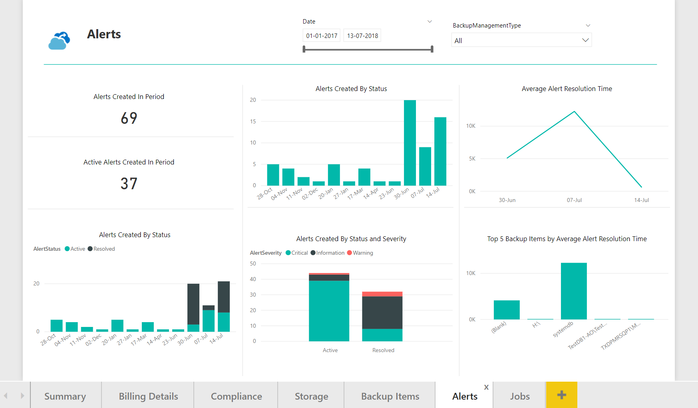
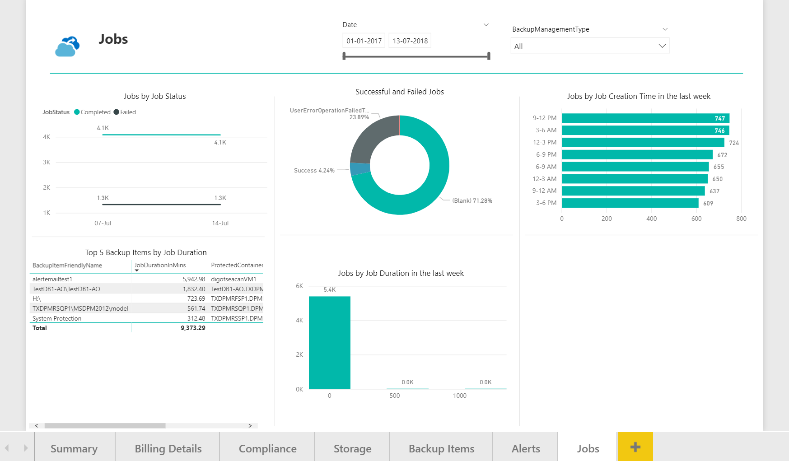

# Update the Azure Backup central reporting content pack 

The [Azure Backup content pack](https://docs.microsoft.com/azure/backup/backup-azure-configure-reports#view-reports-in-power-bi) can be used to view reports about central backup. The content pack is updated regularly to add more features and fix bugs. This article tells you how to update the content pack. It also tells you how to postpone the update and see the updates made over time.

## Get updates to the content pack

### Get the updated content pack
If you haven't made any changes to your copy of the content pack, it updates automatically. When the content pack changes, you receive a notification in Power BI and an email notification. You can choose to get the updated content pack at your convenience. 

### Postpone the update
The best practice is to import the content pack into a [custom workspace](https://youtu.be/26zyOtyHPJM?t=1m57s). You can now edit the reports.
As previously mentioned, if the content pack changes, you see a notification in Power BI. You can choose to get the content pack later. 

## Coming soon
   
The Azure Backup content pack is updated to support more workloads. Workloads include Azure SQL Database for IaaS VM backup and System Center Data Protection Manager. This support adds to the current support for Azure backup and Azure VM backups. This support means that you can view and analyze all your backup data in one central place. [Reports also can be customized](https://youtu.be/26zyOtyHPJM) to suit the needs of your organization.

The preconfigured reports that come with the Azure Backup content pack are changing. The changes make the reports more meaningful across workloads. A sneak peek at the upcoming set of reports is available here.

### Summary
   

### Billing

### Compliance

### Storage

### Backup items

### Alerts

### Jobs

    

## Next steps

* [Share reports across your organization](https://youtu.be/26zyOtyHPJM)
* [Azure Backup FAQ](backup-azure-backup-faq.md)
