# Configure Azure Backup reports
This article shows steps to follow to configure reports for Azure Backup by using a Recovery Services vault. It also shows how to access reports by using Power BI. After you finish these steps, you can go directly to Power BI to view, customize, and create reports.

> [!IMPORTANT]
> From 1st November, 2018, some customers may see issues in loading the data in Azure Backup App in Power BI, saying “We found extra characters at the end of JSON input. The exception was raised by the IDataReader interface.”
This is due to a change in the format in which data is loaded into the storage account.
Please download the latest App (version 1.8) to avoid this issue.
>
>

## Supported scenarios
- Azure Backup reports are supported for Azure virtual machine backup and file and folder backup to the cloud by using the Azure Recovery Services Agent.
- Reports for Azure SQL Database, Azure File Shares, Data Protection Manager, and Azure Backup server aren't supported at this time.
- You can view reports across vaults and subscriptions, if the same storage account is configured for each of the vaults. The storage account selected must be in the same region as the Recovery Services vault.
- The frequency of scheduled refresh for the reports is 24 hours in Power BI. You also can perform an ad hoc refresh of the reports in Power BI. In this case, the latest data in the customer storage account is used to render reports.

## Prerequisites
- Create an [Azure storage account](../storage/common/storage-quickstart-create-account.md) to configure it for reports. This storage account is used to store reports-related data.
- [Create a Power BI account](https://powerbi.microsoft.com/landing/signin/) to view, customize, and create your own reports by using the Power BI portal.
- Register the resource provider **Microsoft.insights**, if it's not registered already. Use the subscriptions for the storage account and the Recovery Services vault so that reporting data can flow to the storage account. To do this step, go to the Azure portal, select **Subscription** > **Resource providers**, and check for this provider to register it.

## Configure storage account for reports
Follow these steps to configure the storage account for a Recovery Services vault by using the Azure portal. This is a one-time configuration. After the storage account is configured, you can go directly to Power BI to view the content pack and use reports.

1. If you already have a Recovery Services vault open, go to the next step. If you don't have a Recovery Services vault open, in the Azure portal, select **All services**.

   * In the list of resources, enter **Recovery Services**.
   * As you begin typing, the list filters based on your input. When you see **Recovery Services vaults**, select it.
   * The list of Recovery Services vaults appears. From the list of Recovery Services vaults, select a vault.

     The selected vault dashboard opens.
2. From the list of items that appears under the vault, under the **Monitoring and Reports** section, select **Backup Reports** to configure the storage account for reports.

      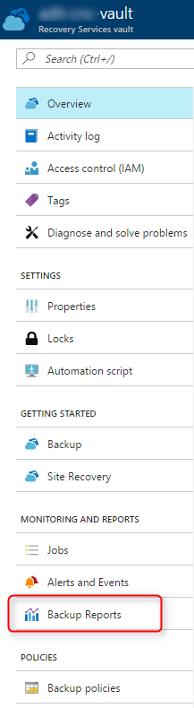
3. On the **Backup Reports** blade, select the **Diagnostics Settings** link. This link opens the **Diagnostics settings** UI, which is used to push data to a customer storage account.

      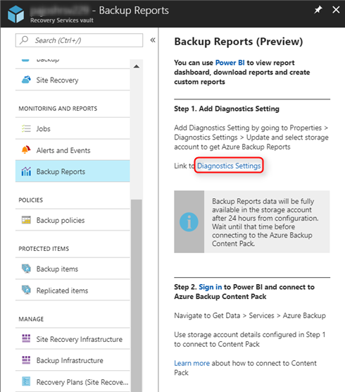
4. Select **Turn on diagnostics** to open a UI to use to configure a storage account.

      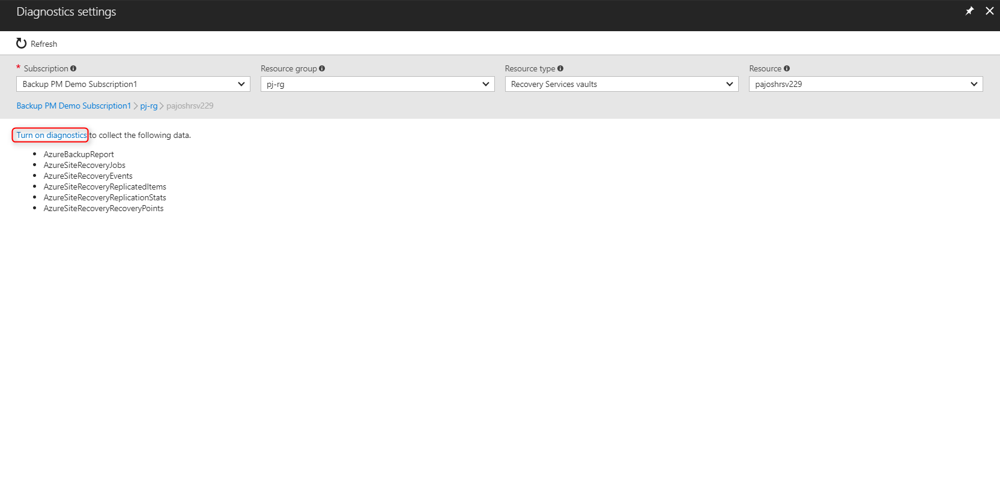
5. In the **Name** box, enter a setting name. Select the **Archive to a storage account** check box so that reporting data can start flowing into the storage account.

      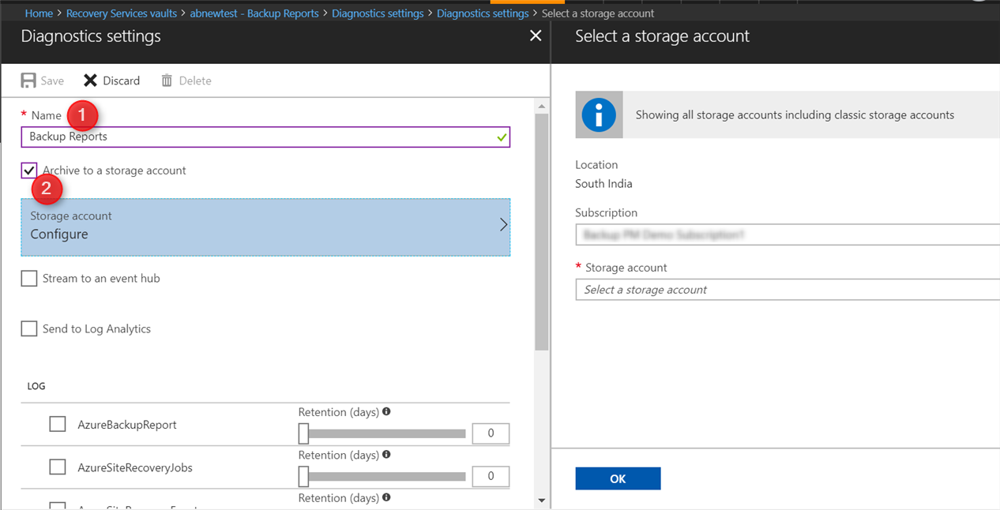
6. Select **Storage account**, select the relevant subscription and the storage account from the list for storing reporting data, and select **OK**.

      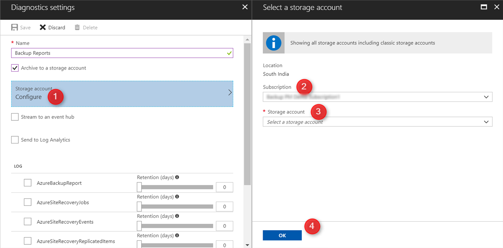
7. Under the **Log** section, select the **AzureBackupReport** check box. Move the slider to select a retention period for this reporting data. Reporting data in the storage account is kept for the period selected by using this slider.

      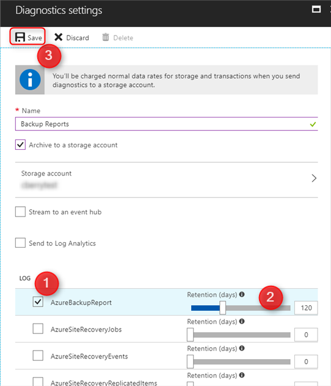
8. Review all the changes, and select **Save**. This action ensures that all your changes are saved, and the storage account is now configured to store reporting data.

9. The **Diagnostic settings** table now shows the new setting enabled for the vault. If it doesn't appear, refresh the table to see the updated setting.

      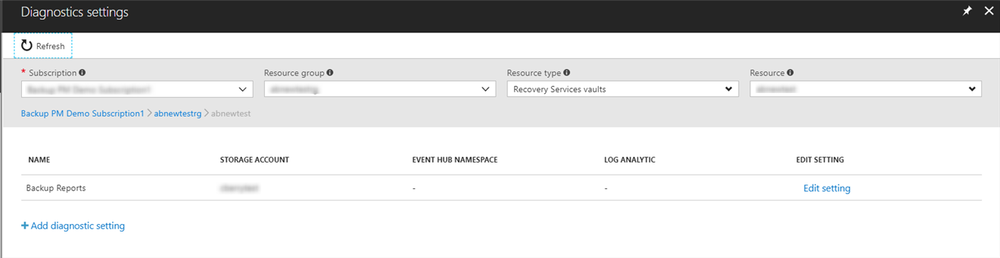

> [!NOTE]
> After you configure reports by saving the storage account, *wait for 24 hours* for the initial data push to finish. Import the Azure Backup App in Power BI only after that time. For more information, see the [FAQ section](backup-azure-monitor-alert-faq.md).
>
>

## View reports in Power BI
After you configure a storage account for reports by using a Recovery Services vault, it takes around 24 hours for reporting data to start flowing in. After 24 hours of setting up a storage account, follow these steps to view reports in Power BI.
If you wish to customize and share the report, create a workspace and do the following steps

1. [Sign in](https://powerbi.microsoft.com/landing/signin/) to Power BI.
2. Select **Get Data**. In the **More ways to create your own content**, select **Service content packs**. Follow the steps in the [Power BI documentation to connect to a service](https://powerbi.microsoft.com/documentation/powerbi-content-packs-services/).

3. In the **Search** bar, enter **Azure Backup** and select **Get it now**.

      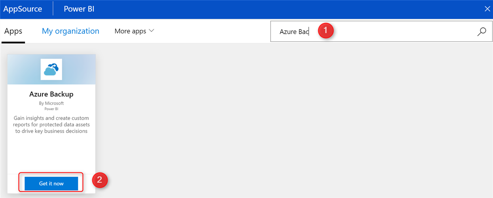
4. Enter the name of the storage account that was configured in the previous step 5, and select **Next**.

    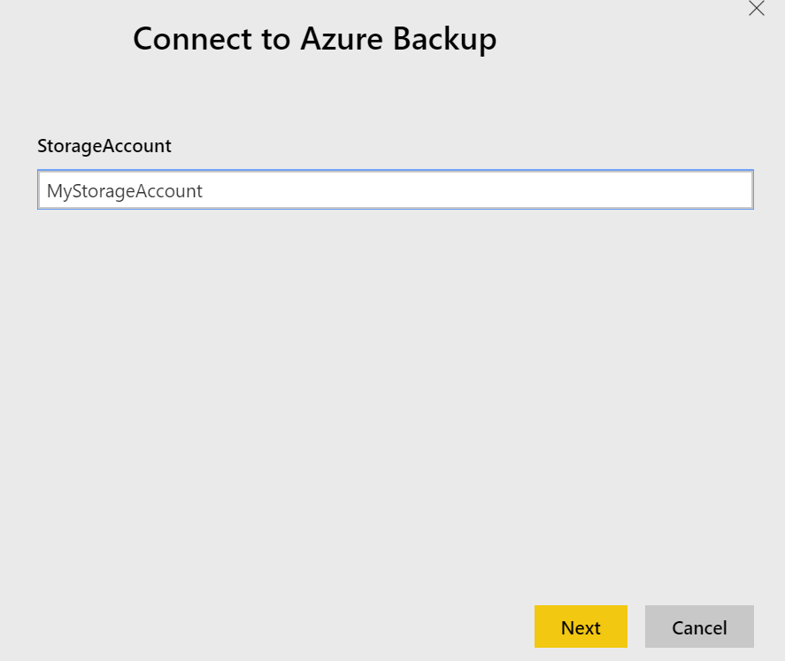    
5. Using Authentication method "Key", enter the storage account key for this storage account. To [view and copy storage access keys](../storage/common/storage-account-manage.md#access-keys), go to your storage account in the Azure portal.

     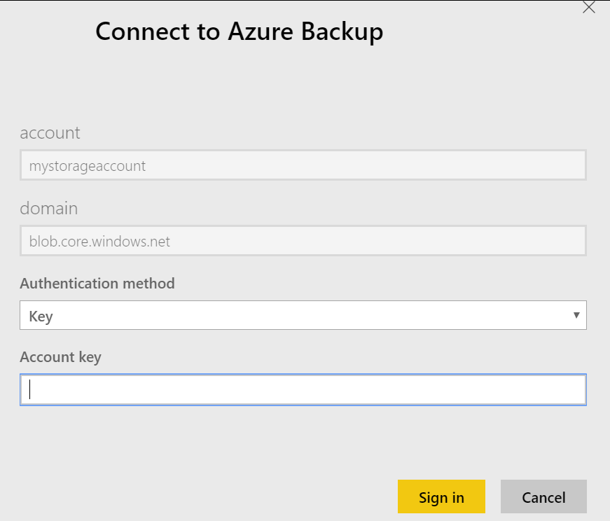  

6. Select **Sign in**. After sign-in is successful, you see an importing data notification.

    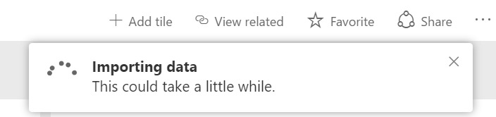  

    After the import finishes, you see a **Success** notification. If the amount of data in the storage account is large, it might take a little longer to import the content pack.

      

7. After data imports successfully, the **Azure Backup** content pack is visible in **Apps** in the navigation pane. Under **Dashboards**, **Reports**, and **Datasets**, the list now shows Azure Backup.

8. Under **Dashboards**, select **Azure Backup**, which shows a set of pinned key reports.

      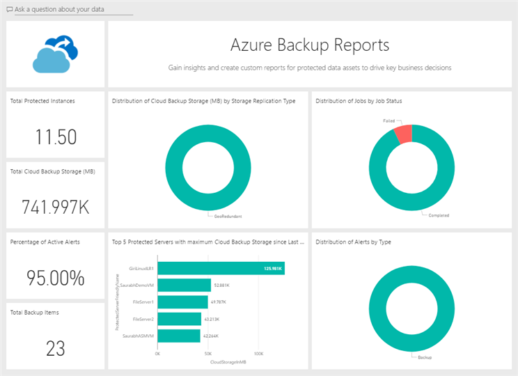  
9. To view the complete set of reports, select any report in the dashboard.

        
10. Select each tab in the reports to view reports in that area.

      

## Troubleshooting errors
| Error Details | Resolution |
| --- | --- |
| After you set up the storage account for Backup Reports, **Storage account** still shows **Not Configured**. | If you configured a storage account successfully, your reporting data flows in despite this issue. To resolve this issue, go to the Azure portal and select **All services** > **Diagnostics settings** > **Recovery Services vault** > **Edit setting**. Delete the previously configured setting, and create a new setting on the same blade. This time, in the **Name** box, select **service**. Now the configured storage account appears. |
|After you import the Azure Backup content pack in Power BI, a "404- container is not found" error message appears. | As previously mentioned, you must wait 24 hours after you configure reports in the Recovery Services vault to see them correctly in Power BI. If you try to access the reports before 24 hours, this error message appears because complete data isn't yet present to show valid reports. |

## Next steps
After you configure the storage account and import the Azure Backup content pack, the next steps are to customize reports and use a reporting data model to create reports. For more information, see the following articles.

* [Use an Azure Backup reporting data model](backup-azure-reports-data-model.md)
* [Filter reports in Power BI](https://powerbi.microsoft.com/documentation/powerbi-service-about-filters-and-highlighting-in-reports/)
* [Create reports in Power BI](https://powerbi.microsoft.com/documentation/powerbi-service-create-a-new-report/)
