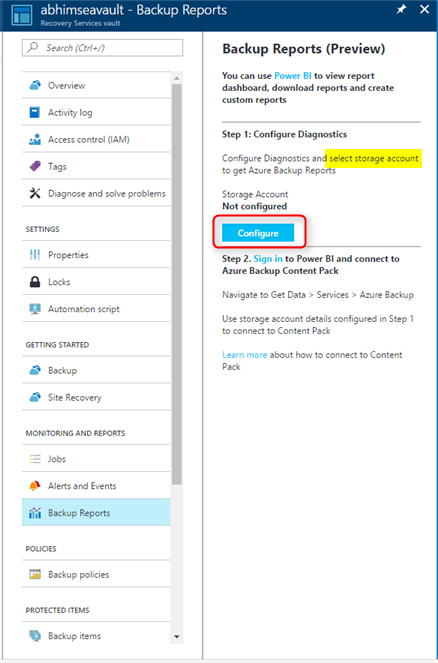
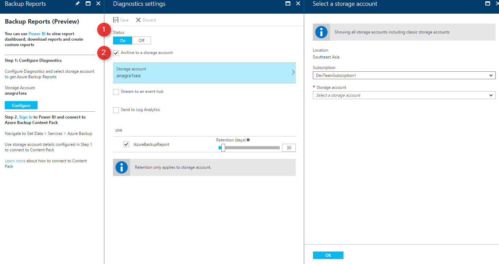
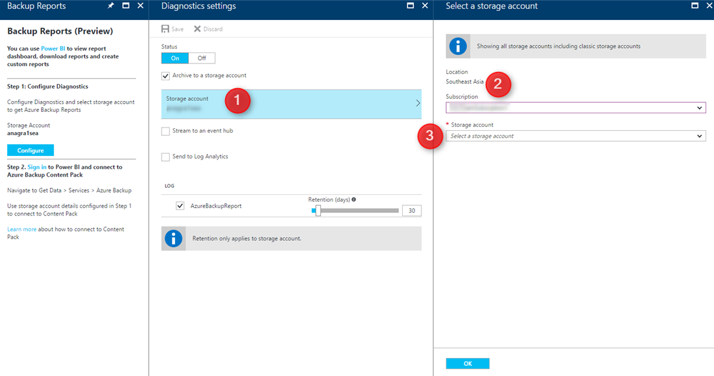
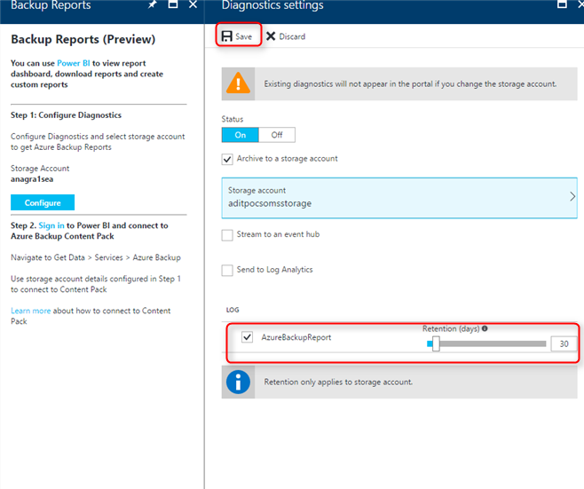
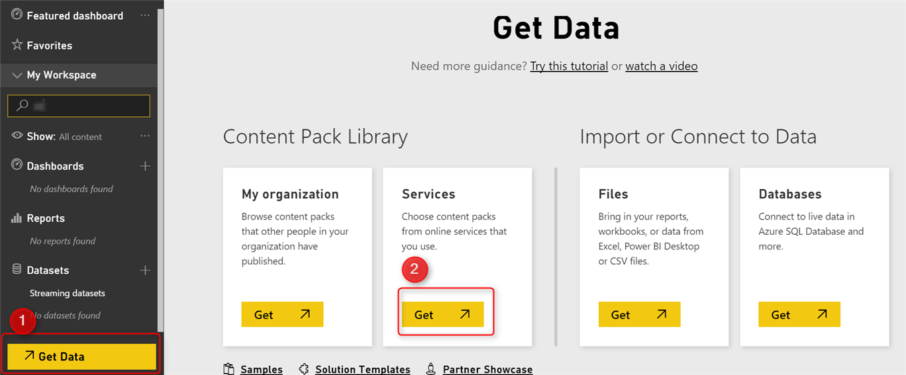
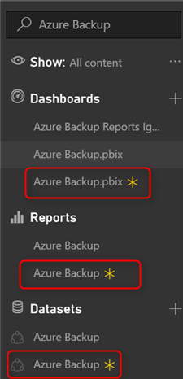

# Configure Azure Backup reports
This article talks about steps to configure reports for Azure Backup using Recovery Services vault, and  to access these reports using Power BI. After performing these steps, you can directly go to Power BI to view all the reports, customize and create reports. 

## Supported Scenarios
1. Azure Backup reports are supported for Azure virtual machine backup and file/folder backup to cloud using Azure Recovery Services Agent.
2. Reports for Azure SQL, DPM and Azure Backup Server are not supported at this time.
3. You can view reports across vaults and across subscriptions, if same storage account is configured for each of the vaults. Storage account selected should be in the same region as recovery services vault.
4. The frequency of scheduled refresh for the reports is 24 hours in Power BI. You can also perform an ad-hoc refresh of the reports in Power BI, in which case latest data in customer storage account is used for rendering reports.

## Pre-requisites
1. Create an [Azure storage account](../storage/storage-create-storage-account.md#create-a-storage-account) to configure it for reports. This storage account is used for storing reports related data.
2. [Create a Power BI account](https://powerbi.microsoft.com/landing/signin/) to view, customize, and create your own reports using Power BI portal.

## Configure storage account for reports
Use the following steps to configure storage account for recovery services vault using Azure portal. This is a one-time configuration and once storage account is configured, you can go to Power BI directly to view content pack and leverage reports.
1. If you already have a Recovery Services vault open, proceed to next step. If you do not have a Recovery Services vault open, but are in the Azure portal, on the Hub menu, click **Browse**.

   * In the list of resources, type **Recovery Services**.
   * As you begin typing, the list filters based on your input. When you see **Recovery Services vaults**, click it.

        

     The list of Recovery Services vaults appears. From the list of Recovery Services vaults, select a vault.

     The selected vault dashboard opens.
2. From the list of items that appears under vault, click **Backup Reports** under Monitoring and Reports section to configure storage account for reports.

      
3. On the Backup Reports blade, click **Configure** button. This opens the Azure Application Insights blade which is used for pushing data to customer storage account.

      
4. Set the Status toggle button to **On** and select **Archive to a Storage Account** check box so that reporting data can start flowing in to storage account.

      
5. Click Storage Account picker and select storage account from the list for storing reporting data and click **OK**.

      
6. Select **AzureBackupReport** check box and also move the slider to select retention period for this reporting data. Reporting data in storage account is kept for the period selected using this slider.

      
7. Review all the changes and click **Save** button on top, as shown in the figure above. This action ensures that all your changes are saved and storage account is now configured for storing reporting data.

## View reports in Power BI 
After configuring storage account for reports using recovery services vault, it takes around 24 hours for reporting data to start flowing in. After 24 hours of setting up storage account, use the following steps to view reports in Power BI:
1. [Sign in](https://powerbi.microsoft.com/landing/signin/) to Power BI.
2. Click **Get Data** and click Get under **Services** in Content Pack Library. Use steps mentioned in [Power BI documentation to access content pack](https://powerbi.microsoft.com/en-us/documentation/powerbi-content-packs-services/).

     
3. Type **Azure Backup** in Search bar and click **Get it now**.

      
4. Enter storage account name configured in step 5 above and click **Next** button.

        
5. Enter storage account key for this storage account. You can [view and copy storage access keys](../storage/storage-create-storage-account.md#manage-your-storage-account) by navigating to your storage account in Azure portal. 

       
     
6. Click **Sign in** button. After sign-in is successful, you get **Importing data** notification.

      
    
    After some time, you get **Success** notification after the import is complete. It might take little longer to import the content pack, if there is a lot data in storage account.
    
      
    
7. Once data is imported successfully, **Azure Backup** content pack is visible in **Apps** in the navigation pane. The list now shows Azure Backup dashboard, reports, and dataset with a yellow star indicating newly imported reports. 

       
     
8. Click **Azure Backup** under Dashboards, which shows a set of pinned key reports.

        
9. To view the complete set of reports, click any report in the dashboard.

        
10. Click each tab in the reports to view reports in that area.

      

## Frequently Asked Questions
1. **How do I check if reporting data has started flowing in to storage account?**
    
    You can go to the storage account configured and select containers. If the container has an entry for insights-logs-azurebackupreport, it indicates that reporting data has started flowing in.

2. **What is the frequency of data push to storage account and Azure Backup content pack in Power BI?**

   For Day 0 users, it would take around 24 hours to push data to storage account. Once this initial push is compelete, data is refreshed with the following frequency shown in the figure below. 
      * Data related to **Jobs, Alerts, Backup Items, Vaults, Protected Servers and Policies** is pushed to customer storage account as and when it is logged.
      * Data related to **Storage** is pushed to customer storage account every 24 hours.
   
    

  Power BI has a [scheduled refresh once a day](https://powerbi.microsoft.com/documentation/powerbi-refresh-data/#what-can-be-refreshed). You can perform a manual refresh of the data in Power BI for the content pack.

3. **How long can I retain the reports?** 

   While configuring storage account, you can select retention period of reporting data in the storage account (using step 6 in Configure storage account for reports section above). Besides that, you can [Analyze reports in excel](https://powerbi.microsoft.com/documentation/powerbi-service-analyze-in-excel/) and save them for a longer retention period, as per your needs. 

4. **Will I see all my data in reports after configuring storage account?**

   All the data generated after **"configuring storage account"** will be pushed to storage account and will be available in reports. However, **In Progress Jobs are not pushed** for Reporting. Once the job compeletes or failed, it is sent to reports.

5. **If I have already configured storage account to view reports, can I change the configuration to use another storage account?** 

   Yes, you can change the configuration to point to a different storage account. You should use the newly configured storage account while connecting to Azure Backup content pack. Also, once a different storage account is configured, new data would flow in this storage account. But older data (before changing the configuration) would still remain in the older storage account.

6. **Can I view reports across vaults and across subscriptions?** 

   Yes, you can configure same storage account across various vaults to view cross-vault reports. Also, you can configure the same storage account for vaults across subscriptions. You can then use this storage account while connecting to Azure Backup content pack in Power BI to view the reports. However, the storage account selected should be in the same region as recovery services vault.
   
## Next Steps
Now that you have configured storage account and imported Azure Backup content pack, the next step is to customize these reports and use reporting data model to create reports. Refer the following articles for more details.

* [Filtering reports in Power BI](https://powerbi.microsoft.com/documentation/powerbi-service-about-filters-and-highlighting-in-reports/)
* [Using Azure Backup reporting data model](backup-azure-reports-data-model.md)
* [Creating reports in Power BI](https://powerbi.microsoft.com/documentation/powerbi-service-create-a-new-report/)

