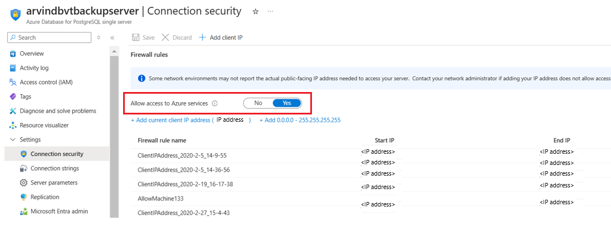

# Troubleshoot PostgreSQL database backup using Azure Backup

This article provides troubleshooting information for backing up Azure PostgreSQL databases with Azure Backup.

## UserErrorMSIMissingPermissions

Give Backup Vault MSI **Read** access on the PG server you want to back up or restore.

To establish secure connection to the PostgreSQL database, Azure Backup uses the [Managed Service Identity (MSI)](../active-directory/managed-identities-azure-resources/overview.md) authentication model. This means that the backup vault will have access to only those resources that have been explicitly granted permission by the user.

A system MSI is automatically assigned to the vault at the time of creation. You need to give this vault MSI the access to the PostgreSQL servers you intend to back up databases from.

Steps:

1. In the Postgres server, go to the **Access Control (IAM)** pane.

    

1. Select **Add role assignments**.

    

1. In the right context pane that opens, enter the following:<br>

   - **Role:** Choose the **Reader** role in the drop-down list.<br>
   - **Assign access to:** Choose the **User, group, or service principal** option in the drop-down list.<br>
   - **Select:** Enter the Backup vault name to which you want to back up this server and its databases.<br>

    

## UserErrorBackupUserAuthFailed

Create a database backup user that can authenticate with Azure Active Directory:

This error may come from an absence of an Azure Active Directory admin for the PostgreSQL server, or in absence of a backup user that can authenticate using Azure Active Directory.

Steps:

Add an Active Directory Admin to the OSS server:

This step is required to connect to the database through a user that can authenticate with Azure Active Directory instead of a password. The Azure AD Admin user in Azure Database for PostgreSQL will have the role **azure_ad_admin**. Only an **azure_ad_admin** role can create new database users that can authenticate with Azure AD.

1. Go to the Active Directory Admin tab in the left navigation pane of the server view, and add yourself (or someone else) as the Active Directory admin.

    

1. Make sure to **Save** the AD admin user setting.

    

Refer to [this document](https://download.microsoft.com/download/7/4/d/74d689aa-909d-4d3e-9b18-f8e465a7ebf5/OSSbkpprep_automated.docx) for the list of steps you need to perform to complete the permission granting steps.

### UserErrorMissingNetworkSecurityPermissions

Establish network line of sight by enabling the **Allow access to Azure services** flag in the server view. In the server view, under the **Connection security** pane, set the **Allow access to Azure services** flag to **Yes**.

>[!Note]
>Before you enable this flag, ensure that you set the **Deny public network access** flag to **No**.



## UserErrorContainerNotAccessible

### Permission to restore to a storage account container when restoring as files

1. Give the Backup vault MSI the permission to access the storage account containers using the Azure portal.
    1. Go to **Storage Account** -> **Access Control** -> **Add role assignment**.
    1. Assign **Storage Blob Data Contributor** role to the Backup vault MSI.

    

1. Alternatively, give granular permissions to the specific container you're restoring to by using the Azure CLI [az role assignment create](/cli/azure/role/assignment) command.

    ```azurecli
    az role assignment create --assignee $VaultMSI_AppId  --role "Storage Blob Data Contributor"   --scope $id
    ```

    1. Replace the assignee parameter with the **Application ID** of the vault's MSI and the scope parameter to refer to your specific container.
    1. To get the **Application ID** of the vault MSI, select **All applications** under **Application type**:

        

    1. Search for the vault name and copy the Application ID:

        

## UserErrorDBUserAuthFailed

The Azure Backup service uses the credentials mentioned in the key-vault to access the database as a database user. The relevant key vault and the secret are [provided during configuration of backup](backup-azure-database-postgresql.md#configure-backup-on-azure-postgresql-databases). Ensure that the credentials stored as part of the secret value in the key vault are valid. Ensure that the specified database user has login access.

## UserErrorInvalidSecret

The Azure Backup service uses the credentials mentioned in the key-vault to access the database as a database user. The relevant key vault and the secret are [provided during configuration of backup](backup-azure-database-postgresql.md#configure-backup-on-azure-postgresql-databases). Ensure that the specified secret name is present in the key vault.

## UserErrorMissingDBPermissions

The Azure Backup service uses the credentials mentioned in the key-vault to access the database as a database user. The relevant key vault and the secret are [provided during configuration of backup](backup-azure-database-postgresql.md#configure-backup-on-azure-postgresql-databases). Grant appropriate permissions to the relevant backup or the database user to perform this operation on the database.

## UserErrorSecretValueInUnsupportedFormat

The Azure Backup service uses the credentials mentioned in the key-vault to access the database as a database user. The relevant key vault and the secret are [provided during configuration of backup](backup-azure-database-postgresql.md#configure-backup-on-azure-postgresql-databases). However the secret value is not in a format supported by Azure Backup. Check the supported format as documented [here](backup-azure-database-postgresql.md#create-secrets-in-the-key-vault).

## UserErrorInvalidSecretStore

The Azure Backup service uses the credentials mentioned in the key-vault to access the database as a database user. The relevant key vault and the secret are [provided during configuration of backup](backup-azure-database-postgresql.md#configure-backup-on-azure-postgresql-databases). Ensure that the given key vault exists and the backup service is given access as documented [here](backup-azure-database-postgresql-overview.md#set-of-permissions-needed-for-azure-postgresql-database-backup).

## UserErrorMissingPermissionsOnSecretStore

The Azure Backup service uses the credentials mentioned in the key-vault to access the database as a database user. The relevant key vault and the secret are [provided during configuration of backup](backup-azure-database-postgresql.md#configure-backup-on-azure-postgresql-databases). Ensure that backup vault's MSI is given access to key vault as documented [here](backup-azure-database-postgresql-overview.md#set-of-permissions-needed-for-azure-postgresql-database-backup).

## UserErrorDBNotFound

Ensure that the database and the relevant server exist.

## UserErrorDatabaseNameAlreadyInUse

The name given for the restored database already exists and hence the restore operation failed. Retry the restore operation with a different name.

## UserErrorServerConnectionClosed

The operation failed because the server closed the connection unexpectedly. Retry the operation and if the error still persists, please contact Microsoft Support.


## Next steps

[About Azure Database for PostgreSQL backup](backup-azure-database-postgresql-overview.md)
