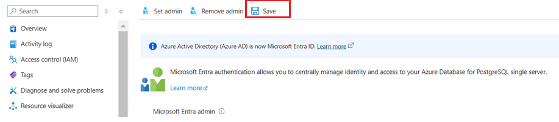
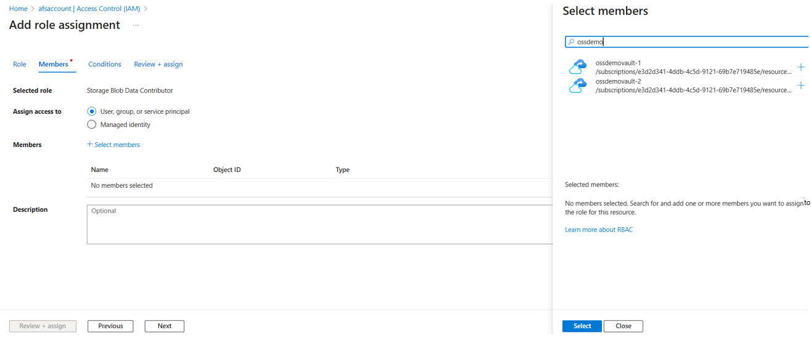

# Azure Database for PostgreSQL backup with long-term retention (preview)

Azure Backup and Azure Database Services have come together to build an enterprise-class backup solution for Azure Database for PostgreSQL servers that retains backups for up to 10 years.

Besides long-term retention, the solution also has many other capabilities as listed below:

- RBAC-based access to the database using Azure Active Directory and Managed Service Identity (MSI) authentication.
- Customer controlled scheduled and on-demand backup at the individual database level.
- Database-level restores to any Postgres server or directly to blob storage.
- Long-term retention.
- Central monitoring of all operations and jobs.
- Backups are stored in separate security and fault domains. So even if the source server were to be compromised or even killed, the backups would remain safe in the [Backup vault](backup-vault-overview.md).
- Use of **pg_dump** allows for greater flexibility in restores such that you can restore across database versions or even restore only a part of the backup.

You may use this solution independently or in addition to the native backup solution offered by Azure PostgreSQL that offers retention up to 35 days. The native solution is suited for operational recoveries, such as when you want to recover from the latest backups. The Azure Backup solution helps you with your compliance needs and more granular and flexible backup and restore.

## Support matrix

|Support  |Details  |
|---------|---------|
|Supported deployments   |  Azure Database for PostgreSQL standalone single server     |
|Supported Azure regions |  East US, East US 2, South Central US, West US |
|Supported Azure PostgreSQL versions    |   9.5, 9.6, 10, 11      |

## Feature considerations and limitations

- All operations are supported from the Azure portal only.
- Recommended limit for the maximum database size is 400 GB.
- Cross-region backup isn't supported. This means you can't back up an Azure PostgreSQL server to a vault in another region. Similarly, you can only restore a backup to a server within the same region as the vault.
- Only the data is recovered at the time of restore. "Roles" aren't restored.
- In preview, we recommend that you run the solution only on your test environment.

## Backup process

1. This solution uses **pg_dump** to take backups of your Azure PostgreSQL databases.

2. Once you specify the Azure PostgreSQL databases you want to back up, the service validates if it has the right set of permissions and access to perform the backup operation on the server and the database.

3. Azure Backup spins up a worker role with a backup extension installed in it. This extension communicates with the Postgres server.

4. This extension consists of a coordinator and an Azure Postgres plugin. While the coordinator is responsible for triggering workflows for various operations like configure backup, backup, and restore, the plugin is responsible for the actual data flow.
  
5. Once you trigger configure protection on the selected databases, the backup service sets up the coordinator with the backup schedules and other policy details.

6. At the scheduled time, the coordinator communicates with the plugin and it starts streaming the backup data from the Postgres server using **pg_dump**.

7. The plugin sends the data directly to the Backup vault, eliminating the need for a staging location. The data is encrypted using Microsoft-managed keys and stored by the Azure Backup service in storage accounts.

8. When the data transfer is complete, the coordinator confirms the commit with the backup service.

    

## Configure backup on Azure PostgreSQL databases

You can configure backup on multiple databases across multiple Azure PostgreSQL servers. Ensure that the [prerequisite permissions](#prerequisite-permissions-for-configure-backup-and-restore) required by the service to back up the Postgres servers are already configured.

The following instructions are a step-by-step guide to configuring backup on the Azure PostgreSQL databases using Azure Backup:

1. There are two ways to begin the process:

    1. Go to [Backup Center](backup-center-overview.md) -> **Overview** -> **Backup**.

        

        Under **Initiate: Configure Backup**, select the **Datasource type** as **Azure Database for PostgreSQL**.

        

    1. Alternatively, you can directly go to [Backup vaults](backup-vault-overview.md) -> **Backup**.

        

        

1. Under **Configure backup**, select the **Backup vault** to which you wish to back up your Postgres databases. This information is pre-filled if you're already in the vault context.

    

1. Select or create a **Backup policy**.

    

1. Select resources or Postgres databases to back up.

    

1. You can choose from the list of all Azure PostgreSQL servers across subscriptions if they're in the same region as the vault. Expand the arrow to see the list of databases within a server.

    

1. The service runs these checks on the selected databases to validate whether the vault has permissions to back up the selected Postgres servers and databases.
    1. **Backup readiness** for all databases should read **Success** in order to continue.
    1. If there's an error, either **fix** the error and **revalidate** or remove the database from the selections.

    

1. Confirm all the details under **Review and configure** and select **Configure backup** to submit the operation.

    

1. Once triggered, the **Configure backup** operation will create a backup instance. You can track the status of the operation under [Backup Instances](backup-center-monitor-operate.md#backup-instances) pane in the Backup Center or vault view.

    

1. The backups are triggered according to the backup schedule defined in the policy. The jobs can be tracked under [Backup Jobs](backup-center-monitor-operate.md#backup-jobs). Currently, you can view jobs for the last seven days.

    

## Create backup policy

1. Go to **Backup Center** -> **Backup policies** -> **Add**. Alternatively, you can go to **Backup vault** -> **Backup policy** -> **Add**.

    

1. Enter a **name** for the new policy.

    

1. Define the Backup schedule. We currently support **Weekly** backup. You can schedule the backups on one or more days of the week.

    

1. Define **Retention** settings. You can add one or more retention rules. Each retention rule assumes inputs for specific backups, and data store and retention duration for those backups.

1. You can choose to store your backups in one of the two data stores (or tiers): **Backup data store** (hot tier) or **Archive data store** (in preview). You can choose between **two tiering options** to define when the backups are tiered across the two datastores:

    - Choose to copy **Immediately** if you prefer to have a backup copy in both backup and archive data stores simultaneously.
    - Choose to move **On-expiry** if you prefer to move the backup to archive data store upon its expiry in the backup data store.

1. The **default retention rule** is applied in the absence of any other retention rule, and has a default value of three months.

    - Retention duration ranges from seven days to 10 years in the **Backup data store**.
    - Retention duration ranges from six months to 10 years in the **Archive data store**.

    

>[!NOTE]
>The retention rules are evaluated in a pre-determined order of priority. The priority is highest for the **yearly** rule, followed by the **monthly** and then the **weekly** rule. Default retention settings are applied when no other rules qualify. For example, the same recovery point may be the first successful backup taken every week as well as the first successful backup taken every month. However, since the monthly rule priority is higher than that of the weekly rule, the retention corresponding to the first successful backup taken every month applies.

## Restore

You can restore a database to any Azure PostgreSQL server within the same subscription, if the service has the appropriate set of permissions on the target server. Ensure the [prerequisite permissions](#prerequisite-permissions-for-configure-backup-and-restore) required by the service to back up the Postgres servers are already configured.

Follow this step-by-step guide to trigger a restore:

1. There are two ways to start the restore process:
    1. Go to [Backup Center](backup-center-overview.md) -> **Overview** -> **Restore**.

    

    Under **Initiate: Restore**, select the **Datasource type** as **Azure Database for PostgreSQL**. Select the **Backup instance**.

    

    1. Alternatively, you can directly go to **Backup vault** -> **Backup Instances**. Select **Backup instance** corresponding to the database you want to restore.

    

    

    

1. **Select recovery point** from the list of all full backups available for the selected backup instance. By default, the latest recovery point is selected.

    

    

1. Input **Restore parameters**. At this point, you can select from two kinds of restores: **Restore as Database** and **Restore as Files**.

1. **Restore as Database**:  Restore the backup data to create a new database in the target PostgreSQL server.

    - The target server can be same as the source server. However, overwriting the original database isn't supported.
    - You can choose from the server across all subscriptions, but in the same region as the vault.
    - Select **Review + Restore**. This will trigger validation to check if the service has appropriate restore permissions on the target server.

    

1. **Restore as Files**: Dump the backup files to the target storage account (blobs).

    - You can choose from the storage accounts across all subscriptions, but in the same region as the vault.
    - Select the target container from the container list filtered for the selected storage account.
    - Select **Review + Restore**. This will trigger validation to check if the service has appropriate restore permissions on the target server.

    

1. Review the information and select **Restore**. This will trigger a corresponding Restore job that can be tracked under **Backup jobs**.

## Prerequisite permissions for configure backup and restore

Azure Backup follows strict security guidelines. Even though it’s a native Azure service, permissions on the resource aren't assumed, and need to be explicitly given by the user.  Similarly, credentials to connect to the database aren't stored. This is important to safeguard your data. Instead, we use Azure Active Directory authentication.

[Download this document](https://download.microsoft.com/download/7/4/d/74d689aa-909d-4d3e-9b18-f8e465a7ebf5/OSSbkpprep_automated.docx) to get an automated script and related instructions. It will grant an appropriate set of permissions to an Azure PostgreSQL server, for backup and restore.

## Manage the backed-up Azure PostgreSQL databases

These are the management operations you can perform on the **Backup Instances**:

### On-demand backup

To trigger a backup not in the schedule specified in the policy, go to **Backup instances** -> **Backup Now**.
Choose from the list of retention rules that were defined in the associated Backup policy.


### Stop protection

You can stop protection on a backup item. This will also delete the associated recovery points for that backup item. We don't yet provide the option of stop protection while retaining the existing recovery points.


### Change policy

You can change the associated policy with a backup instance.

1. Select the **Backup Instance** -> **Change Policy**.

    

1. Select the new policy that you wish to apply to the database.

    

## Troubleshooting

This section provides troubleshooting information for backing up Azure PostgreSQL databases with Azure Backup.

### UserErrorMSIMissingPermissions

Give Backup Vault MSI **Read** access on the PG server you want to back up or restore:

To establish secure connection to the PostgreSQL database, Azure Backup uses the [Managed Service Identity (MSI)](https://docs.microsoft.com/azure/active-directory/managed-identities-azure-resources/overview) authentication model. This means that the backup vault will have access to only those resources that have been explicitly granted permission by the user.

A system MSI is automatically assigned to the vault at the time of creation. You need to give this vault MSI the access to the PostgreSQL servers you intend to back up databases from.

Steps:

1. In the Postgres server, go to the **Access Control (IAM)** pane.

    

1. Select **Add a role assignment**.

    

1. In the right context pane that opens, enter the following:<br>

    **Role:** Reader<br>
    **Assign access to:** Choose **Backup vault**<br>
    If you can’t find the **Backup vault** option in the drop-down list, choose the **Azure AD user, group, or service principal option**<br>

    

    **Select:** Enter the Backup vault name to which you want to back up this server and its databases.<br>

    

### UserErrorBackupUserAuthFailed

Create a database backup user that can authenticate with Azure Active Directory:

This error may come from an absence of an Azure Active Directory admin for the PostgreSQL server, or in absence of a backup user that can authenticate using Azure Active Directory.

Steps:

Add an Active Directory Admin to the OSS server:

This step is required to connect to the database through a user that can authenticate with Azure Active Directory instead of a password. The Azure AD Admin user in Azure Database for PostgreSQL will have the role **azure_ad_admin**. Only an **azure_ad_admin** role can create new database users that can authenticate with Azure AD.

1. Go to the Active Directory Admin tab in the left navigation pane of the server view, and add yourself (or someone else) as the Active Directory admin.

    

1. Make sure to **Save** the AD admin user setting.

    

Refer to [this document](https://download.microsoft.com/download/7/4/d/74d689aa-909d-4d3e-9b18-f8e465a7ebf5/OSSbkpprep_automated.docx) for the list of steps you need to perform to complete the permission granting steps.

### UserErrorMissingNetworkSecurityPermissions

Establish network line of sight by enabling the **Allow access to Azure services** flag in the server view. In the server view, under the **Connection security** pane, set the **Allow access to Azure services** flag to **Yes**.


### UserErrorContainerNotAccessible

#### Permission to restore to a storage account container when restoring as files

1. Give the Backup vault MSI the permission to access the storage account containers using the Azure portal.
    1. Go to **Storage Account** -> **Access Control** -> **Add role assignment**.
    1. Assign **Storage Blob Data Contributor** role to the Backup vault MSI.

    

1. Alternatively, give granular permissions to the specific container you're restoring to by using the Azure CLI [az role assignment create](https://docs.microsoft.com/cli/azure/role/assignment) command.

    ```azurecli
    az role assignment create --assignee $VaultMSI_AppId  --role "Storage Blob Data Contributor"   --scope $id
    ```

    1. Replace the assignee parameter with the **Application ID** of the vault's MSI and the scope parameter to refer to your specific container.
    1. To get the **Application ID** of the vault MSI, select **All applications** under **Application type**:

        

    1. Search for the vault name and copy the Application ID:

        

## Next steps

- [Backup vaults overview](backup-vault-overview.md)
