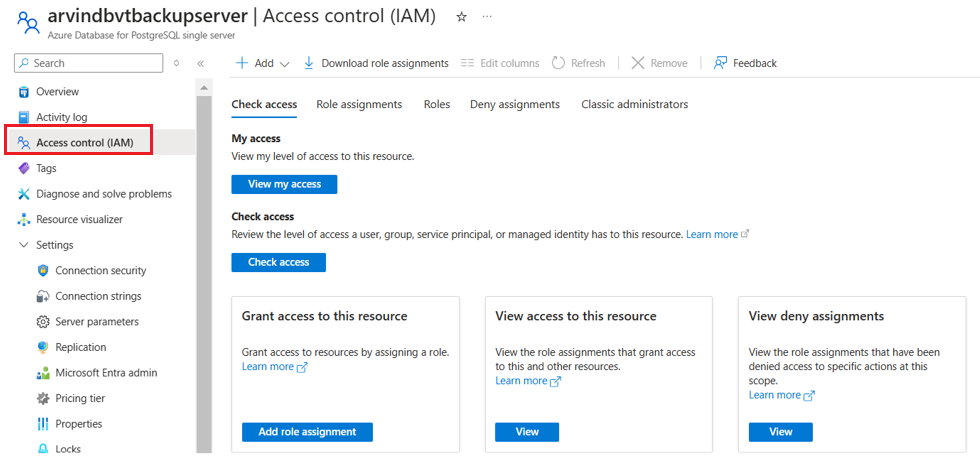
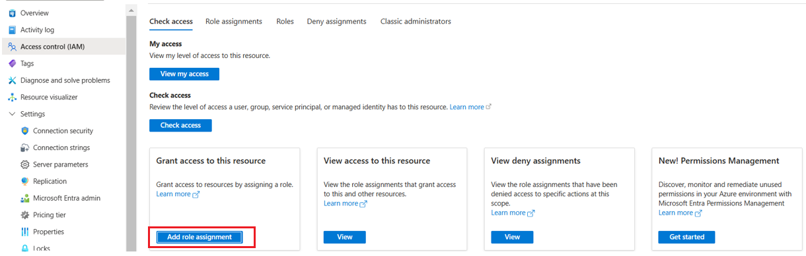
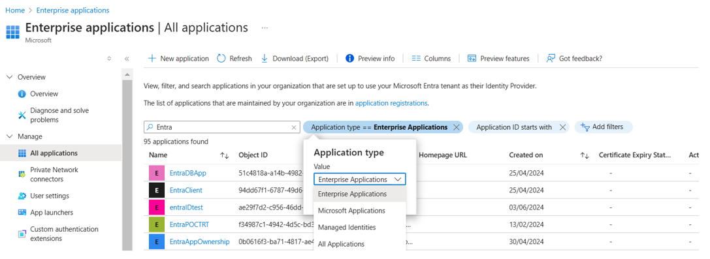

<<<<<<< HEAD
---
title: Backup Azure Database for PostgreSQL 
description: Learn about Azure Database for PostgreSQL backup with long-term retention (preview)
ms.topic: conceptual
ms.date: 09/06/2021
ms.custom: references_regions , devx-track-azurecli
---

# Azure Database for PostgreSQL backup with long-term retention (preview)

Azure Backup and Azure Database Services have come together to build an enterprise-class backup solution for Azure Database for PostgreSQL servers that retains backups for up to 10 years.

Besides long-term retention, the solution also has many other capabilities as listed below:

- Azure role-based access control (Azure RBAC) to the database using Azure Active Directory and Managed Service Identity (MSI) authentication.
- Customer controlled scheduled and on-demand backup at the individual database level.
- Database-level restores to any Postgres server or directly to blob storage.
- Long-term retention.
- Central monitoring of all operations and jobs.
- Backups are stored in separate security and fault domains. So even if the source server were to be compromised or even killed, the backups would remain safe in the [Backup vault](backup-vault-overview.md).
- Use of **pg_dump** allows for greater flexibility in restores such that you can restore across database versions or even restore only a part of the backup.

You may use this solution independently or in addition to the native backup solution offered by Azure PostgreSQL that offers retention up to 35 days. The native solution is suited for operational recoveries, such as when you want to recover from the latest backups. The Azure Backup solution helps you with your compliance needs and more granular and flexible backup and restore.

## Support matrix

|Support  |Details  |
|---------|---------|
|Supported deployments   |  [Azure Database for PostgreSQL - Single Server](../postgresql/overview.md#azure-database-for-postgresql---single-server)     |
|Supported Azure regions |  East US, East US 2, Central US, South Central US, West US, West US 2, West Central US, Brazil South, Canada Central, North Europe, West Europe, UK South, UK West, Germany West Central, Switzerland North, Switzerland West, East Asia, South East Asia, Japan East, Japan West, Korea Central, Korea South, India Central, Australia East, Australia Central, Australia Central 2, UAE North  |
|Supported Azure PostgreSQL versions    |   9.5, 9.6, 10, 11      |

## Feature considerations and limitations

- All operations are supported from the Azure portal only.
- Recommended limit for the maximum database size is 400 GB.
- Cross-region backup isn't supported. This means you can't back up an Azure PostgreSQL server to a vault in another region. Similarly, you can only restore a backup to a server within the same region as the vault.
- Only the data is recovered at the time of restore. "Roles" aren't restored.
- In preview, we recommend that you run the solution only on your test environment.

## Prerequisite permissions for configure backup and restore

Azure Backup follows strict security guidelines. Even though it's a native Azure service, permissions on the resource aren't assumed, and need to be explicitly given by the user.  Similarly, credentials to connect to the database aren't stored. This is important to safeguard your data. Instead, we use Azure Active Directory authentication.

[Download this document](https://download.microsoft.com/download/7/4/d/74d689aa-909d-4d3e-9b18-f8e465a7ebf5/OSSbkpprep_automated.docx) to get an automated script and related instructions. It will grant an appropriate set of permissions to an Azure PostgreSQL server, for backup and restore.

## Backup process

1. This solution uses **pg_dump** to take backups of your Azure PostgreSQL databases.

2. Once you specify the Azure PostgreSQL databases you want to back up, the service validates if it has the right set of permissions and access to perform the backup operation on the server and the database.

3. Azure Backup spins up a worker role with a backup extension installed in it. This extension communicates with the Postgres server.

4. This extension consists of a coordinator and an Azure Postgres plugin. While the coordinator is responsible for triggering workflows for various operations like configure backup, backup, and restore, the plugin is responsible for the actual data flow.
  
5. Once you trigger configure protection on the selected databases, the backup service sets up the coordinator with the backup schedules and other policy details.

6. At the scheduled time, the coordinator communicates with the plugin and it starts streaming the backup data from the Postgres server using **pg_dump**.

7. The plugin sends the data directly to the Backup vault, eliminating the need for a staging location. The data is encrypted using Microsoft-managed keys and stored by the Azure Backup service in storage accounts.

8. When the data transfer is complete, the coordinator confirms the commit with the backup service.

    

## Configure backup on Azure PostgreSQL databases

You can configure backup on multiple databases across multiple Azure PostgreSQL servers. Ensure that the [prerequisite permissions](#prerequisite-permissions-for-configure-backup-and-restore) required by the service to back up the Postgres servers are already configured.

The following instructions are a step-by-step guide to configuring backup on the Azure PostgreSQL databases using Azure Backup:

1. There are two ways to begin the process:

    1. Go to [Backup Center](backup-center-overview.md) -> **Overview** -> **Backup**.

        

        Under **Initiate: Configure Backup**, select the **Datasource type** as **Azure Database for PostgreSQL**.

        

    1. Alternatively, you can directly go to [Backup vaults](backup-vault-overview.md) -> **Backup**.

        

        

1. Under **Configure backup**, select the **Backup vault** to which you wish to back up your Postgres databases. This information is pre-filled if you're already in the vault context.

    

1. Select or create a **Backup policy**.

    

1. Select resources or Postgres databases to back up.

    

1. You can choose from the list of all Azure PostgreSQL servers across subscriptions if they're in the same region as the vault. Expand the arrow to see the list of databases within a server.

    

1. The service runs these checks on the selected databases to validate whether the vault has permissions to back up the selected Postgres servers and databases.
    1. **Backup readiness** for all databases should read **Success** in order to continue.
    1. If there's an error, either **fix** the error and **revalidate** or remove the database from the selections.

    

1. Confirm all the details under **Review and configure** and select **Configure backup** to submit the operation.

    

1. Once triggered, the **Configure backup** operation will create a backup instance. You can track the status of the operation under [Backup Instances](backup-center-monitor-operate.md#backup-instances) pane in the Backup Center or vault view.

    

1. The backups are triggered according to the backup schedule defined in the policy. The jobs can be tracked under [Backup Jobs](backup-center-monitor-operate.md#backup-jobs). Currently, you can view jobs for the last seven days.

    

## Create backup policy

1. Go to **Backup Center** -> **Backup policies** -> **Add**. Alternatively, you can go to **Backup vault** -> **Backup policy** -> **Add**.

    

1. Enter a **name** for the new policy.

    

1. Define the Backup schedule. We currently support **Weekly** backup. You can schedule the backups on one or more days of the week.

    

1. Define **Retention** settings. You can add one or more retention rules. Each retention rule assumes inputs for specific backups, and data store and retention duration for those backups.

1. You can choose to store your backups in one of the two data stores (or tiers): **Backup data store** (standard tier) or **Archive data store** (in preview).

   You can choose **On-expiry** to move the backup to archive data store upon its expiry in the backup data store.

1. The **default retention rule** is applied in the absence of any other retention rule, and has a default value of three months.

    - Retention duration ranges from seven days to 10 years in the **Backup data store**.
    - Retention duration ranges from six months to 10 years in the **Archive data store**.

    

>[!NOTE]
>The retention rules are evaluated in a pre-determined order of priority. The priority is highest for the **yearly** rule, followed by the **monthly** and then the **weekly** rule. Default retention settings are applied when no other rules qualify. For example, the same recovery point may be the first successful backup taken every week as well as the first successful backup taken every month. However, since the monthly rule priority is higher than that of the weekly rule, the retention corresponding to the first successful backup taken every month applies.

## Restore

You can restore a database to any Azure PostgreSQL server within the same subscription, if the service has the appropriate set of permissions on the target server. Ensure the [prerequisite permissions](#prerequisite-permissions-for-configure-backup-and-restore) required by the service to back up the Postgres servers are already configured.

Follow this step-by-step guide to trigger a restore:

1. There are two ways to start the restore process:

   1. Go to [Backup Center](backup-center-overview.md) -> **Overview** -> **Restore**.

      

      Under **Initiate: Restore**, select the **Datasource type** as **Azure Database for PostgreSQL**. Select the **Backup instance**.

      

   1. Alternatively, you can directly go to **Backup vault** -> **Backup Instances**. Select **Backup instance** corresponding to the database you want to restore.

      

      

      

1. **Select recovery point** from the list of all full backups available for the selected backup instance. By default, the latest recovery point is selected.

    

    

1. Input **Restore parameters**. At this point, you can select from two kinds of restores: **Restore as Database** and **Restore as Files**.

1. **Restore as Database**:  Restore the backup data to create a new database in the target PostgreSQL server.

    - The target server can be same as the source server. However, overwriting the original database isn't supported.
    - You can choose from the server across all subscriptions, but in the same region as the vault.
    - Select **Review + Restore**. This will trigger validation to check if the service has appropriate restore permissions on the target server.

    

1. **Restore as Files**: Dump the backup files to the target storage account (blobs).

    - You can choose from the storage accounts across all subscriptions, but in the same region as the vault.
    - Select the target container from the container list filtered for the selected storage account.
    - Select **Review + Restore**. This will trigger validation to check if the service has appropriate restore permissions on the target server.

    

1. If the recovery point is in the archive tier, you must rehydrate the recovery point before restoring.
   
   
   
   Provide the following additional parameters required for rehydration:
   - **Rehydration priority:** Default is **Standard**.
   - **Rehydration duration:** The maximum rehydration duration is 30 days, and the minimum rehydration duration is 10 days. Default value is **15**.
   
   The recovery point is stored in the **Backup data store** for the specified rehydration duration.


1. Review the information and select **Restore**. This will trigger a corresponding Restore job that can be tracked under **Backup jobs**.

>[!NOTE]
>Archive support for Azure Database for PostgreSQL is in limited public preview.


## Manage the backed-up Azure PostgreSQL databases

These are the management operations you can perform on the **Backup Instances**:

### On-demand backup

To trigger a backup not in the schedule specified in the policy, go to **Backup instances** -> **Backup Now**.
Choose from the list of retention rules that were defined in the associated Backup policy.


### Change policy

You can change the associated policy with a backup instance.

1. Select the **Backup Instance** -> **Change Policy**.

    

1. Select the new policy that you wish to apply to the database.

    

## Troubleshooting

This section provides troubleshooting information for backing up Azure PostgreSQL databases with Azure Backup.

### UserErrorMSIMissingPermissions

Give Backup Vault MSI **Read** access on the PG server you want to back up or restore.

To establish secure connection to the PostgreSQL database, Azure Backup uses the [Managed Service Identity (MSI)](../active-directory/managed-identities-azure-resources/overview.md) authentication model. This means that the backup vault will have access to only those resources that have been explicitly granted permission by the user.

A system MSI is automatically assigned to the vault at the time of creation. You need to give this vault MSI the access to the PostgreSQL servers you intend to back up databases from.

Steps:

1. In the Postgres server, go to the **Access Control (IAM)** pane.

    

1. Select **Add role assignments**.

    

1. In the right context pane that opens, enter the following:<br>

   - **Role:** Choose the **Reader** role in the drop-down list.<br>
   - **Assign access to:** Choose the **User, group, or service principal** option in the drop-down list.<br>
   - **Select:** Enter the Backup vault name to which you want to back up this server and its databases.<br>

    

### UserErrorBackupUserAuthFailed

Create a database backup user that can authenticate with Azure Active Directory:

This error may come from an absence of an Azure Active Directory admin for the PostgreSQL server, or in absence of a backup user that can authenticate using Azure Active Directory.

Steps:

Add an Active Directory Admin to the OSS server:

This step is required to connect to the database through a user that can authenticate with Azure Active Directory instead of a password. The Azure AD Admin user in Azure Database for PostgreSQL will have the role **azure_ad_admin**. Only an **azure_ad_admin** role can create new database users that can authenticate with Azure AD.

1. Go to the Active Directory Admin tab in the left navigation pane of the server view, and add yourself (or someone else) as the Active Directory admin.

    

1. Make sure to **Save** the AD admin user setting.

    

Refer to [this document](https://download.microsoft.com/download/7/4/d/74d689aa-909d-4d3e-9b18-f8e465a7ebf5/OSSbkpprep_automated.docx) for the list of steps you need to perform to complete the permission granting steps.

### UserErrorMissingNetworkSecurityPermissions

Establish network line of sight by enabling the **Allow access to Azure services** flag in the server view. In the server view, under the **Connection security** pane, set the **Allow access to Azure services** flag to **Yes**.

>[!Note]
>Before you enable this flag, ensure that you set the **Deny public network access** flag to **No**.


### UserErrorContainerNotAccessible

#### Permission to restore to a storage account container when restoring as files

1. Give the Backup vault MSI the permission to access the storage account containers using the Azure portal.
    1. Go to **Storage Account** -> **Access Control** -> **Add role assignment**.
    1. Assign **Storage Blob Data Contributor** role to the Backup vault MSI.

    

1. Alternatively, give granular permissions to the specific container you're restoring to by using the Azure CLI [az role assignment create](/cli/azure/role/assignment) command.

    ```azurecli
    az role assignment create --assignee $VaultMSI_AppId  --role "Storage Blob Data Contributor"   --scope $id
    ```

    1. Replace the assignee parameter with the **Application ID** of the vault's MSI and the scope parameter to refer to your specific container.
    1. To get the **Application ID** of the vault MSI, select **All applications** under **Application type**:

        

    1. Search for the vault name and copy the Application ID:

        

## Next steps

[Backup vaults overview](backup-vault-overview.md)
=======
---
title: Back up Azure Database for PostgreSQL 
description: Learn about Azure Database for PostgreSQL backup with long-term retention (preview)
ms.topic: conceptual
ms.date: 09/22/2021

---

# Azure Database for PostgreSQL backup with long-term retention (preview)

This article describes how to back up Azure Database for PostgreSQL server.

## Configure backup on Azure PostgreSQL databases

You can configure backup on multiple databases across multiple Azure PostgreSQL servers. To configure backup on the Azure PostgreSQL databases using Azure Backup, follow these steps:

1. Go to **Backup vault** -> **+Backup**.

   :::image type="content" source="./media/backup-azure-database-postgresql/adding-backup-inline.png" alt-text="Screenshot showing the option to add a backup." lightbox="./media/backup-azure-database-postgresql/adding-backup-expanded.png":::
 
   :::image type="content" source="./media/backup-azure-database-postgresql/adding-backup-details-inline.png" alt-text="Screenshot showing the option to add backup information." lightbox="./media/backup-azure-database-postgresql/adding-backup-details-expanded.png":::

   Alternatively, you can navigate to this page from the [Backup center](/azure/backup/backup-center-overview). 

1. Select/[create a Backup Policy](#create-backup-policy) that defines the backup schedule and the retention duration.
 
   :::image type="content" source="./media/backup-azure-database-postgresql/create-or-add-backup-policy-inline.png" alt-text="Screenshot showing the option to add a backup policy." lightbox="./media/backup-azure-database-postgresql/create-or-add-backup-policy-expanded.png":::

1. **Select Azure Postgres databases to back up**: Choose one of the Azure PostgreSQL servers across subscriptions if they're in the same region as that of the vault. Expand the arrow to see the list of databases within a server.
 
   :::image type="content" source="./media/backup-azure-database-postgresql/select-azure-postgresql-databases-to-back-up-inline.png" alt-text="Screenshot showing the option to select an Azure PostgreSQL database." lightbox="./media/backup-azure-database-postgresql/select-azure-postgresql-databases-to-back-up-expanded.png":::

   :::image type="content" source="./media/backup-azure-database-postgresql/choose-an-azure-postgresql-server-inline.png" alt-text="Screenshot showing how to choose an Azure PostgreSQL server." lightbox="./media/backup-azure-database-postgresql/choose-an-azure-postgresql-server-expanded.png":::
 

1. **Assign Azure key vault** that stores the credentials to connect to the selected database. To assign the key vault at the individual row level, click **Select a key vault and secret**. You can also assign the key vault by multi-selecting the rows and click Assign key vault in the top menu of the grid. 

   :::image type="content" source="./media/backup-azure-database-postgresql/assign-azure-key-vault-inline.png" alt-text="Screenshot showing how to assign Azure key vault." lightbox="./media/backup-azure-database-postgresql/assign-azure-key-vault-expanded.png"::: 

1. To specify the secret information, use one of the following options: 

   1. **Enter secret URI**: Use this option if the secret URI is shared/known to you. You can copy the **secret URI from the Key vault** -> **Secrets (select a secret)** -> **Secret Identifier**.

      :::image type="content" source="./media/backup-azure-database-postgresql/enter-secret-uri-inline.png" alt-text="Screenshot showing how to enter secret URI." lightbox="./media/backup-azure-database-postgresql/enter-secret-uri-expanded.png":::  

      However, with this option, Azure Backup gets no visibility about the key vault you’ve referenced. Therefore, access permissions on the key vault can’t be granted inline. The backup admin along with the Postgres and/or key vault admin need to ensure that the backup vault’s [access on the key vault is granted manually](backup-azure-database-postgresql-overview.md#access-permissions-on-the-azure-key-vault-associated-with-the-postgresql-server) outside the configure backup flow for the backup operation to succeed.

   1. **Select the key vault**: Use this option if you know the key vault and secret name. With this option, you (backup admin with write access on the key vault) can grant the access permissions on the key vault inline. The key vault and the secret could pre-exist or be created on the go. Ensure that the secret is the PG server connection string in ADO.net format updated with the credentials of the database user that has been granted with the ‘backup’ privileges on the server. Learn more about [how to create the [secrets in the key vault](#create-secrets-in-the-key-vault).

      :::image type="content" source="./media/backup-azure-database-postgresql/assign-secret-store-inline.png" alt-text="Screenshot showing how to assign secret store." lightbox="./media/backup-azure-database-postgresql/assign-secret-store-expanded.png":::

      :::image type="content" source="./media/backup-azure-database-postgresql/select-secret-from-azure-key-vault-inline.png" alt-text="Screenshot showing the selection of secret from Azure Key Vault." lightbox="./media/backup-azure-database-postgresql/select-secret-from-azure-key-vault-expanded.png":::   

1. When the secret information update is complete, the validation starts after the key vault information has been updated. Here, the backup service validates if it has all the necessary [access permissions](backup-azure-database-postgresql-overview.md#key-vault-based-authentication-model)() to read secret details from the key vault and connect to the database. If one or more access permissions are found missing, it will display one of the error messages – _Role assignment not done or User cannot assign roles_.

   :::image type="content" source="./media/backup-azure-database-postgresql/validation-of-secret-inline.png" alt-text="Screenshot showing the validation of secret." lightbox="./media/backup-azure-database-postgresql/validation-of-secret-expanded.png":::   

   1. **User cannot assign roles**: This message displays when you (the backup admin) don’t have the write access on the PostgreSQL server and/or key vault to assign missing permissions as listed under **View details**. Download the assignment template from the action button and have it run by the PostgreSQL and/or key vault admin. It’s an ARM template that helps you assign the necessary permissions on the required resources. Once the template is run successfully, click **Re-validate** on the Configure Backup page.

      :::image type="content" source="./media/backup-azure-database-postgresql/download-role-assignment-template-inline.png" alt-text="Screenshot showing the option to download role assignment template." lightbox="./media/backup-azure-database-postgresql/download-role-assignment-template-expanded.png":::    

   1. **Role assignment not done**: This message displays when you (the backup admin) have the write access on the PostgreSQL server and/or key vault to assign missing permissions as listed under **View details**. Use **Assign missing roles** action button in the top action menu to grant permissions on the PostgreSQL server and/or the key vault inline.

      :::image type="content" source="./media/backup-azure-database-postgresql/role-assignment-not-done-inline.png" alt-text="Screenshot showing the error about the role assignment not done." lightbox="./media/backup-azure-database-postgresql/role-assignment-not-done-expanded.png":::     

1. Select **Assign missing roles** in the top menu and assign roles. Once the process starts, the [missing access permissions](backup-azure-database-postgresql-overview.md#azure-backup-authentication-with-the-postgresql-server) on the KV and/or PG server are granted to the backup vault. You can define the scope at which the access permissions should be granted. When the action is complete, re-validation starts.

   :::image type="content" source="./media/backup-azure-database-postgresql/assign-missing-roles-inline.png" alt-text="Screenshot showing the option to assign missing roles." lightbox="./media/backup-azure-database-postgresql/assign-missing-roles-expanded.png":::

   :::image type="content" source="./media/backup-azure-database-postgresql/define-scope-of-access-permission-inline.png" alt-text="Screenshot showing to define the scope of access permission." lightbox="./media/backup-azure-database-postgresql/define-scope-of-access-permission-expanded.png":::     

   - Backup vault accesses secrets from the key vault and runs a test connection to the database to validate if the credentials have been entered correctly. The privileges of the database user are also checked to see [if the Database user has backup-related permissions on the database](backup-azure-database-postgresql-overview.md#database-users-backup-privileges-on-the-database).

   - PostgreSQL admin will have all the backup and restore permissions on the database by default. Therefore,  validations would succeed.
   - A low privileged user may not have backup/restore permissions on the database. Therefore, the validations would fail. A PowerShell script is dynamically generated (one per record/selected database). [Run the PowerShell script to grant these privileges to the database user on the database](#create-secrets-in-the-key-vault). Alternatively, you can assign these privileges using PG admin or PSQL tool.

   :::image type="content" source="./media/backup-azure-database-postgresql/backup-vault-accesses-secrets-inline.png" alt-text="Screenshot showing the backup vault access secrets from the key vault." lightbox="./media/backup-azure-database-postgresql/backup-vault-accesses-secrets-expanded.png":::      

   :::image type="content" source="./media/backup-azure-database-postgresql/run-test-connection.png" alt-text="Screenshot showing the process to start test connection.":::      
 
   :::image type="content" source="./media/backup-azure-database-postgresql/user-credentials-to-run-test-connection-inline.png" alt-text="Screenshot showing how to provide user credentials to run the test." lightbox="./media/backup-azure-database-postgresql/user-credentials-to-run-test-connection-expanded.png":::      

1. Keep the records with backup readiness as Success to proceed to last step of submitting the operation.
 
   :::image type="content" source="./media/backup-azure-database-postgresql/backup-readiness-as-success-inline.png" alt-text="Screenshot showing the backup readiness is successful." lightbox="./media/backup-azure-database-postgresql/backup-readiness-as-success-expanded.png":::      
 
   :::image type="content" source="./media/backup-azure-database-postgresql/review-backup-configuration-details-inline.png" alt-text="Screenshot showing the backup configuration review page." lightbox="./media/backup-azure-database-postgresql/review-backup-configuration-details-expanded.png":::      

1. Submit the configure backup operation and track the progress under **Backup instances**.
 
   :::image type="content" source="./media/backup-azure-database-postgresql/submit-configure-backup-operation-inline.png" alt-text="Screenshot showing the backup configuration submission and tracking progress." lightbox="./media/backup-azure-database-postgresql/submit-configure-backup-operation-expanded.png":::      

## Create Backup Policy

You can create a Backup policy on the go during the configure backup flow. Alternatively, go to **Backup center** -> **Backup policies** -> **Add**.

1. Enter a name for the new policy.

   :::image type="content" source="./media/backup-azure-database-postgresql/enter-name-for-new-policy-inline.png" alt-text="Screenshot showing the process to enter a name for the new policy." lightbox="./media/backup-azure-database-postgresql/enter-name-for-new-policy-expanded.png":::

1. Define the Backup schedule. Currently, only Weekly backup option is available. However, you can schedule the backups on multiple days of the week.

1. Define **Retention** settings. You can add one or more retention rules. Each retention rule assumes inputs for specific backups, and data store and retention duration for those backups.

1. To store your backups in one of the two data stores (or tiers), choose **Backup data store** (standard tier) or **Archive data store** (in preview).

1. Choose **On-expiry** to move the backup to archive data store upon its expiry in the backup data store.

   The **default retention rule** is applied in the absence of any other retention rule and has a default value of three months.

   - Retention duration ranges from seven days to 10 years in the **Backup data store**.
   - Retention duration ranges from six months to 10 years in the **Archive data store**.

   :::image type="content" source="./media/backup-azure-database-postgresql/choose-option-to-move-backup-to-archive-data-store-inline.png" alt-text="Screenshot showing to 5.	choose On-expiry to move the backup to archive data store upon its expiry." lightbox="./media/backup-azure-database-postgresql/choose-option-to-move-backup-to-archive-data-store-expanded.png":::
 
>[!Note]
>The retention rules are evaluated in a pre-determined order of priority. The priority is the highest for the yearly rule, followed by the monthly, and then the weekly rule. Default retention settings are applied when no other rules qualify. For example, the same recovery point may be the first successful backup taken every week as well as the first successful backup taken every month. However, as the monthly rule priority is higher than that of the weekly rule, the retention corresponding to the first successful backup taken every month applies.

## Create secrets in the key vault

The secret is the PG server connection string in _ADO.net_ format updated with the credentials of the database user that is granted the **backup** privileges on the server. Copy the connection string from the PG server and edit in a text editor to update the _user ID and password_. 

:::image type="content" source="./media/backup-azure-database-postgresql/pg-server-connection-string-inline.png" alt-text="Screenshot showing the PG server connection string as secret." lightbox="./media/backup-azure-database-postgresql/pg-server-connection-string-expanded.png":::

:::image type="content" source="./media/backup-azure-database-postgresql/create-secret-inline.png" alt-text="Screenshot showing the option to create a secret PG server connection string." lightbox="./media/backup-azure-database-postgresql/create-secret-expanded.png":::

## Run PowerShell script to grant privileges to database users

The dynamically generate PowerShell script during configure backup accepts the database user as the input, along with the PG admin credentials, to grant the backup related privileges to the database user on the database.

[PSQL tool](https://www.enterprisedb.com/download-postgresql-binaries) must be present on the machine, and PATH environment variable set appropriately to PSQL tools path.

:::image type="content" source="./media/backup-azure-database-postgresql/psql-set-environment-inline.png" alt-text="Screenshot showing the option to search the environment settings application." lightbox="./media/backup-azure-database-postgresql/psql-set-environment-expanded.png":::

:::image type="content" source="./media/backup-azure-database-postgresql/system-properties-to-set-environment-inline.png" alt-text="Screenshot showing the option to set environment under System Properties." lightbox="./media/backup-azure-database-postgresql/system-properties-to-set-environment-expanded.png":::

:::image type="content" source="./media/backup-azure-database-postgresql/adding-environment-variables-inline.png" alt-text="Screenshot showing the default environment variables." lightbox="./media/backup-azure-database-postgresql/adding-environment-variables-expanded.png":::

:::image type="content" source="./media/backup-azure-database-postgresql/editing-environment-variables-inline.png" alt-text="Screenshot showing the environment variables that you need to set." lightbox="./media/backup-azure-database-postgresql/editing-environment-variables-expanded.png":::

Ensure that **Connection Security settings** in the Azure PostgreSQL instance allowlist the IP address of the machine to allow network connectivity.

## Generate an on-demand backup

To trigger a backup not in the schedule specified in the policy, go to **Backup instances** -> **Backup Now**.
Choose from the list of retention rules that were defined in the associated Backup policy.

:::image type="content" source="./media/backup-azure-database-postgresql/navigate-to-retention-rules-inline.png" alt-text="Screenshot showing the option to navigate to the list of retention rules that were defined in the associated Backup policy." lightbox="./media/backup-azure-database-postgresql/navigate-to-retention-rules-expanded.png":::

:::image type="content" source="./media/backup-azure-database-postgresql/choose-retention-rules-inline.png" alt-text="Screenshot showing the option to choose retention rules that were defined in the associated Backup policy." lightbox="./media/backup-azure-database-postgresql/choose-retention-rules-expanded.png":::

## Next steps

[Troubleshoot PostgreSQL database backup by using Azure Backup](backup-azure-database-postgresql-troubleshoot.md)
>>>>>>> 8e70763c23a697b3ab7d279bc568af65846d1900
