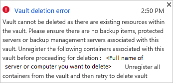
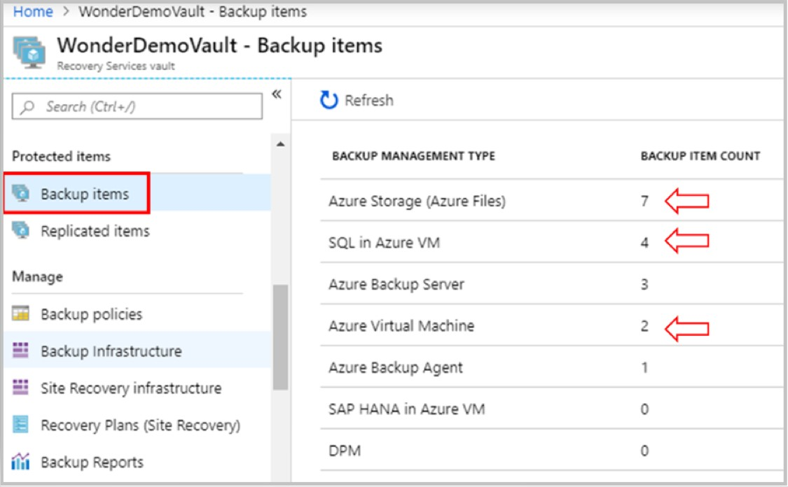
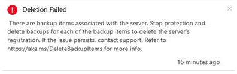

# Delete a Recovery Services vault

This article describes how to delete an [Azure Backup](backup-overview.md) Recovery Services vault. It contains instructions for removing dependencies and then deleting a vault.


## Before you start

You cannot delete a Recovery Services vault that has dependencies such as protected servers or backup management servers associated with the vault.<br/>
Vault containing backup data cannot be deleted (that is, even if you have stopped protection but retained the backup data).

If you delete a vault that contains dependencies, then it will display the following error:



To gracefully delete a vault follow the steps mentioned in the sequence below:
- Stop protection and delete backup data
- Delete the protected servers or backup management servers
- Delete the vault


## Delete backup data and backup items

Before you proceed further read **[this](#before-you-start)** section to understand the dependencies and vault deletion process.

### For Protected items in Cloud

To stop protection and delete the backup data, perform the below:

1. From portal > Recovery Services vault > Backup Items choose the protected items in cloud.

    

2. For each item, you need to right-click and choose **Stop backup**.

    

3. In **Stop Backup** > **Choose an option**, select **Delete Backup Data**.
4. Type the name of the item, and click **Stop backup**.
   - This verifies that you want to delete the item.
   - The **Stop Backup** button activates after you verify.
   - If you retain and don't delete the data, you won't be able to delete the vault.

     

5. Check the **Notification** . After the completion, the service displays the message: **Stopping backup and deleting backup data for "*Backup Item*"**. **Successfully completed the operation**.
6. Click **Refresh** on the **Backup Items** menu, to check if the Backup item is removed.

      

### For MARS agent

To stop protection and delete backup data, perform steps in the order listed below:

- [Step 1: Delete backup items from MARS Management console](#step-1-delete-backup-items-from-mars-management-console)
- [Step 2: From portal remove Azure Backup agent](#step-1-delete-backup-items-from-mars-management-console)


#### Step 1: Delete backup items from MARS Management console

If you are unable to perform this step due to unavailability of the server then contact Microsoft support.

- Launch the MARS Management console, go to the **Actions** pane and choose **Schedule Backup**.
- From **Modify or Stop a Scheduled Backup** wizard, choose the option **Stop using this backup schedule and delete all the stored backups** and click **Next**.

    

- From **Stop a Scheduled Backup** wizard, click **Finish**.

    
- You are prompted to enter a Security Pin. To generate the PIN, perform the below steps:
  - Sign in to the Azure portal.
  - Browse to **Recovery Services vault** > **Settings** > **Properties**.
  - Under **Security PIN**, click **Generate**. Copy this PIN.(This PIN, is valid for only five minutes)
- In the Management Console (client app) paste the PIN and click **Ok**.

  

- In the **Modify Backup Progress** wizard you will see *Deleted backup data will be retained for 14 day. After that time, backup data will be permanently deleted.*  

    

Now that you have deleted the backup items from on-premises, complete the next steps from the portal.

#### Step 2: From portal remove Azure Backup Agent

Ensure [Step 1](#step-1-delete-backup-items-from-mars-management-console) is completed before proceeding further:

1. In the vault dashboard menu, click **Backup Infrastructure**.
2. Click **Protected Servers** to view the infrastructure servers.

    

3. In the **Protected Servers** list, click Azure Backup Agent.

    

4. Click the server in the list of servers protected using Azure Backup agent.

    

5. On the selected server dashboard, click **Delete**.

    

6. On the **Delete** menu, type the name of the server, and click **Delete**.

     

> [!NOTE]
> If you are seeing the below error, then first perform the steps listed in [Deleting backup items from management console](#step-1-delete-backup-items-from-mars-management-console).
>
>
>
>If you are unable to perform the steps to delete backups from the management console, for example, due to unavailability of the server with the management console, contact Microsoft support.

7. Check the **Notification** . After the completion, the service displays the message: **Stopping backup and deleting backup data for "*Backup Item*"**. **Successfully completed the operation**.
8. Click **Refresh** on the **Backup Items** menu, to check if the Backup item is removed.


### For MABS agent

To stop protection and delete backup data, perform steps in the order listed below:

- [Step 1: Delete backup items from MABS Management console](#step-1-delete-backup-items-from-mabs-management-console)
- [Step 2: From portal remove Azure Backup management servers](#step-2-from-portal-remove-azure-backup-agent)

#### Step 1: Delete backup items from MABS Management console

If you are unable to perform this step due to unavailability of the server then contact Microsoft support.

**Method 1**
To stop protection and delete backup data, perform the below steps:

1.	In DPM Administrator Console, click **Protection** on the navigation bar.
2.	In the display pane, select the protection group member that you want to remove. Right-click to choose **Stop Protection of Group Members** option.
3.	From the **Stop Protection** dialog box, select **Delete protected data** > **Delete storage online** checkbox and then click **Stop Protection**.

    

The protected member status is now changed to **Inactive replica available**.

5. Right-click the inactive protection group and select **Remove inactive protection**.

    

6. From the **Delete Inactive Protection** window, select **Delete online storage** and click **Ok**.

    

**Method 2**
Launch the **MABS Management** console. In the **Select data protection method** section, un-select **I want online protection**.

  

Now that you have deleted the backup items from on-premises, complete the next steps from the portal.

#### Step 2: From portal remove Azure Backup management servers

Ensure [Step 1](#step-1-delete-backup-items-from-mabs-management-console) is completed before proceeding further:

1. In the vault dashboard menu, click **Backup Infrastructure**.
2. Click **Backup Management Servers** to view servers.

    

3. Right-click the item > **Delete**.
4. On the **Delete** menu, type the name of the server and click **Delete**.

     

> [!NOTE]
> If you are seeing the below error, then first perform the steps listed in [Deleting backup items from management console](#step-2-from-portal-remove-azure-backup-management-servers).
>
>
>
> If you are unable to perform the steps to delete backups from the management console, for example, due to unavailability of the server with the management console, contact Microsoft support.

5. Check the **Notification** . After the completion, the service displays the message: **Stopping backup and deleting backup data for "*Backup Item*"**. **Successfully completed the operation**.
6. Click **Refresh** on the **Backup Items** menu, to check if the Backup item is removed.


## Delete the Recovery Services vault

1. When all dependencies have been removed, scroll to the **Essentials** pane in the vault menu.
2. Verify that there aren't any **Backup items**, **Backup management servers**, or **Replicated items** listed. If items still appear in the vault, [remove them](#delete-backup-data-and-backup-items).

3. When there are no more items in the vault, on the vault dashboard click **Delete**.

    

4. To verify that you want to delete the vault, click **Yes**. The vault is deleted and the portal returns to the **New** service menu.

## Delete the Recovery Services vault using Azure Resource Manager client

This option to delete the Recovery Services vault is only recommended when all the dependencies are removed and you are still getting the *Vault deletion error*.


- From the **Essentials** pane in the vault menu, verify that there aren't any **Backup items**, **Backup management servers**, or **Replicated items** listed. If there are backup items, then perform the steps in [delete backup data and backup items](#delete-backup-data-and-backup-items).
- Retry [deleting the vault from portal](#delete-the-recovery-services-vault).
- If all the dependencies are removed and you are still getting the *Vault deletion error* then use ARMClient tool to perform the steps given below;

[!INCLUDE [updated-for-az](../../includes/updated-for-az.md)]

1. Install chocolatey from [here](https://chocolatey.org/) and to install ARMClient run the below command:

   `choco install armclient --source=https://chocolatey.org/api/v2/`
2. Sign in to your Azure account, and run this command:

    `ARMClient.exe login [environment name]`

3. In the Azure portal, gather the subscription ID and resource group name for the vault you want to delete.

For more information on ARMClient command, refer this [document](https://github.com/projectkudu/ARMClient/blob/master/README.md).

### Use Azure Resource Manager client to delete Recovery Services vault

1. Run the following command using your subscription ID, resource group name, and vault name. When you run the command, it deletes the vault if you don’t have any dependencies.

   ```
   ARMClient.exe delete /subscriptions/<subscriptionID>/resourceGroups/<resourcegroupname>/providers/Microsoft.RecoveryServices/vaults/<recovery services vault name>?api-version=2015-03-15
   ```
2. If the vault is not empty, you will receive the error "Vault cannot be deleted as there are existing resources within this vault". To remove a protected items / container within a vault, do the following:

   ```
   ARMClient.exe delete /subscriptions/<subscriptionID>/resourceGroups/<resourcegroupname>/providers/Microsoft.RecoveryServices/vaults/<recovery services vault name>/registeredIdentities/<container name>?api-version=2016-06-01
   ```

3. In the Azure portal, verify that the vault is deleted.


## Next steps

[Learn about](backup-azure-recovery-services-vault-overview.md) Recovery Services vaults.<br/>
[Learn about](backup-azure-manage-windows-server.md) monitor and manage Recovery Services vaults.
