# Delete an Azure Backup vault
The Azure Backup service has two types of vaults - the Backup vault and the Recovery Services vault. The Backup vault came first. Then the Recovery Services vault came along to support the expanded Resource Manager deployments. Because of the expanded capabilities and the information dependencies that must be stored in the vault, deleting a Backup or Recovery Services vault can be confusing. This article explains how to delete the vaults in the classic portal and the Azure portal.  

| **Deployment Type** | **Portal** | **Vault name** |
| --- | --- | --- |
| Classic |Classic |Backup vault |
| Resource Manager |Azure |Recovery Services vault |

> [!NOTE]
> Backup vaults cannot protect Resource Manager-deployed solutions. However, you can use a Recovery Services vault to protect classically deployed servers and VMs.  
>

> [!IMPORTANT]
> You can now upgrade your Backup vaults to Recovery Services vaults. For details, see the article [Upgrade a Backup vault to a Recovery Services vault](backup-azure-upgrade-backup-to-recovery-services.md). Microsoft encourages you to upgrade your Backup vaults to Recovery Services vaults.  **Starting November 1, 2017**:
>- Any remaining Backup vaults will be automatically upgraded to Recovery Services vaults.
>- You won't be able to access your backup data in the classic portal. Instead, use the Azure portal to access your backup data in Recovery Services vaults.
>

In this article, we use the term, vault, to refer to the generic form of the Backup vault or Recovery Services vault. We use the formal name, Backup vault, or Recovery Services vault, when it is necessary to distinguish between the vaults.

## Deleting a Recovery Services vault
Deleting a Recovery Services vault is a one-step process - *provided the vault doesn't contain any resources*. Before you can delete a Recovery Services vault, you must remove or delete all resources in the vault. If you attempt to delete a vault that contains resources, you get an error like the following image:

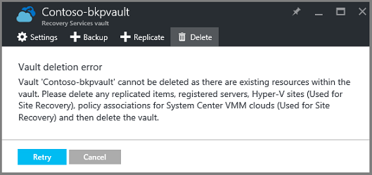  

Until you have cleared the resources from the vault, clicking **Retry** produces the same error. If you're stuck on this error message, click **Cancel** and use the following steps to delete the resources in the vault.

### Removing the items from a vault protecting a VM
If you already have the Recovery Services vault open, skip to the second step.

1. Open the Azure portal, and from the Dashboard open the vault you want to delete.

   If you don't have the Recovery Services vault pinned to the Dashboard, on the Hub menu, click **More Services** and in the list of resources, type **Recovery Services**. As you begin typing, the list filters based on your input. Click **Recovery Services vaults**.

     

   The list of Recovery Services vaults is displayed. From the list, select the vault you want to delete.

   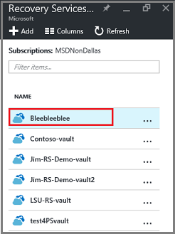
2. In the vault view, look at the **Essentials** pane. To delete a vault, there cannot be any protected items. If you see a number other than zero, under either **Backup Items** or **Backup management servers**, you must remove those items before you can delete the vault.

    

    VMs and Files/Folders are considered Backup Items, and are listed in the **Backup Items** area of the Essentials pane. A DPM server is listed in the **Backup Management Server** area of the Essentials pane. **Replicated Items** pertain to the Azure Site Recovery service.
3. To begin removing the protected items from the vault, find the items in the vault. In the vault dashboard click **Settings**, and then click **Backup items** to open that blade.

    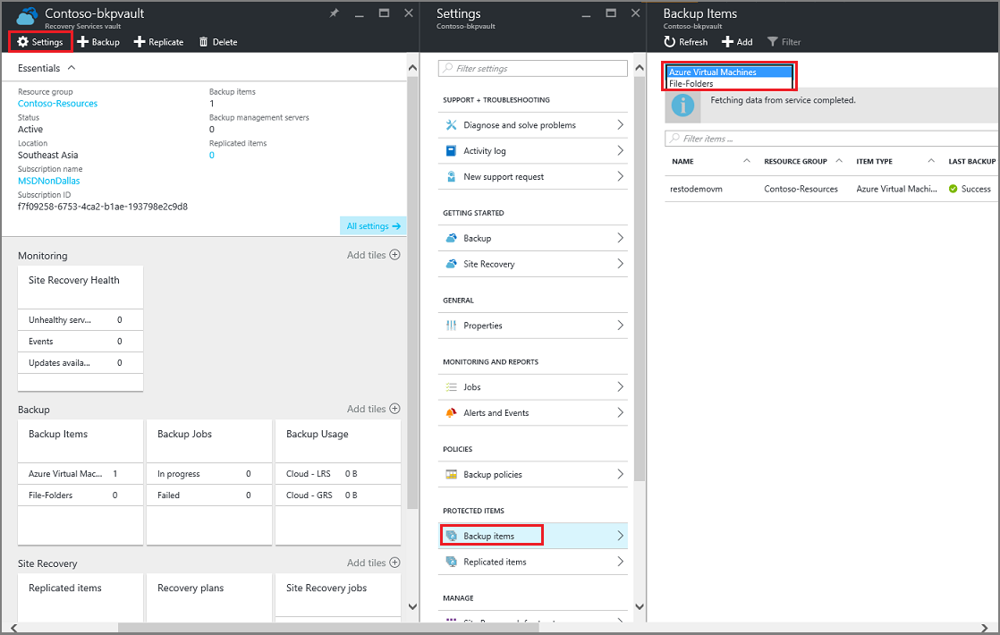

    The **Backup Items** blade has separate lists, based on the Item Type: Azure Virtual Machines or File-Folders (see image). The default Item Type list shown is Azure Virtual Machines. To view the list of File-Folders items in the vault, select **File-Folders** from the drop-down menu.
4. Before you can delete an item from the vault protecting a VM, you must stop the item's backup job and delete the recovery point data. For each item in the vault, follow these steps:

    a. On the **Backup Items** blade, right-click the item, and from the context menu, select **Stop backup**.

    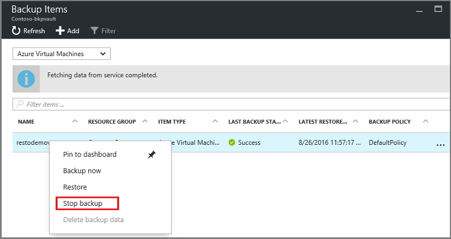

    The Stop Backup blade opens.

    b. On the **Stop Backup** blade, from the **Choose an option** menu, select **Delete Backup Data** > type the name of the item > and click **Stop backup**.

    Type the name of the item, to verify you want to delete it. The **Stop Backup** button activates once you verify the item. If you do not see the dialog box to type the name of the backup item, you chose the **Retain Backup Data** option.

    

    Optionally, you can provide a reason why you are deleting the data, and add comments. After you click **Stop Backup**, allow the delete job to complete before attempting to delete the vault. To verify that the job has completed, check the Azure Messages .  
    Once the job is complete, you receive a message stating the backup process was stopped and the backup data, for that item, was deleted.

    c. After deleting an item in the list, on the **Backup Items** menu, click **Refresh** to see the remaining items in the vault.

      

      When there are no items in the list, scroll to the **Essentials** pane in the Backup vault blade. There shouldn't be any **Backup items**, **Backup management servers**, or **Replicated items** listed. If items still appear in the vault, return to step three and choose a different item type list.  
5. When there are no more items in the vault toolbar, click **Delete**.

    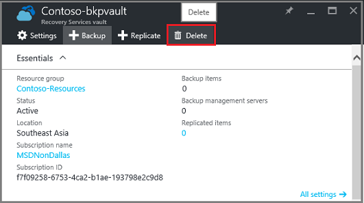
6. To verify that you want to delete the vault, click **Yes**.

    The vault is deleted and the portal returns to the **New** service menu.

## What if I stopped the backup process but retained the data?
If you stopped the backup process but accidentally *retained* the data, you must delete the backup data before you can delete the vault. To delete the backup data:

1. On the **Backup Items** blade, right-click the item, and on the context menu click **Delete backup data**.

    

    The **Delete Backup Data** blade opens.
2. On the **Delete Backup Data** blade, type the name of the item, and click **Delete**.

    

    Once you have deleted the data, return to step 4c and continue with the process.

## Delete a vault used to protect a DPM server
Before you can delete a vault used to protect a DPM server, you must clear any recovery points that have been created, and then unregister the server from the vault.

To delete the data associated with a protection group:

1. In the DPM Administrator Console, click **Protection** > select a protection group > select the Protection Group Member > and in the tool ribbon, click **Remove**.

  Select the Protection Group Member to activate the **Remove** button in the tool ribbon. In the example, the member is **dummyvm9**. To select multiple members in the protection group, hold down the Ctrl key while clicking on the members.

    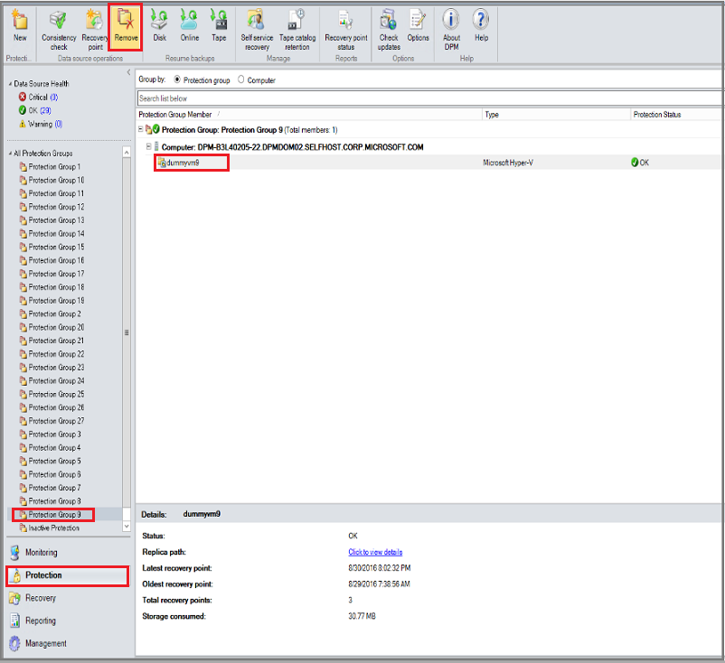

    The **Stop Protection** dialog opens.
2. In the **Stop Protection** dialog, select **Delete protected data**, and click **Stop Protection**.

    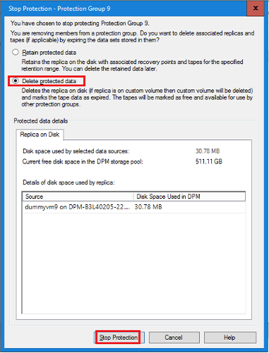

    To delete a vault, you must clear, or delete, the vault of protected data. Depending on the number of recovery points and data in the protection group, it may take anywhere from a few seconds to several minutes to delete the data. The **Stop Protection** dialog shows the status when the job has completed.

    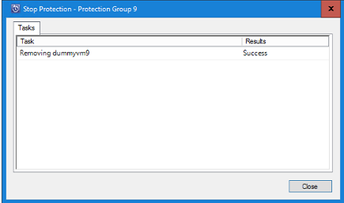
3. Continue this process for all members in all protection groups.

    Remove all protected data and protection groups.
4. After deleting all members from the protection group, switch to the Azure portal. Open the vault dashboard, and make sure there are no **Backup Items**, **Backup management servers**, or **Replicated items**. On the vault toolbar, click **Delete**.

    

    If there are Backup management servers registered to the vault, you can't delete the vault even if there is no data in the vault. If you deleted the Backup management servers associated with the vault, but there are servers listed in the **Essentials** pane, see [Find the Backup management servers registered to the vault](backup-azure-delete-vault.md#find-the-backup-management-servers-registered-to-the-vault).
5. To verify that you want to delete the vault, click **Yes**.

    The vault is deleted and the portal returns to the **New** service menu.

## Delete a vault used to protect a Production server
Before you can delete a vault used to protect a Production server, you must delete or unregister the server from the vault.

To delete the Production server associated with the vault:

1. In the Azure portal, open the vault dashboard and click **Settings** > **Backup Infrastructure** > **Production Servers**.

    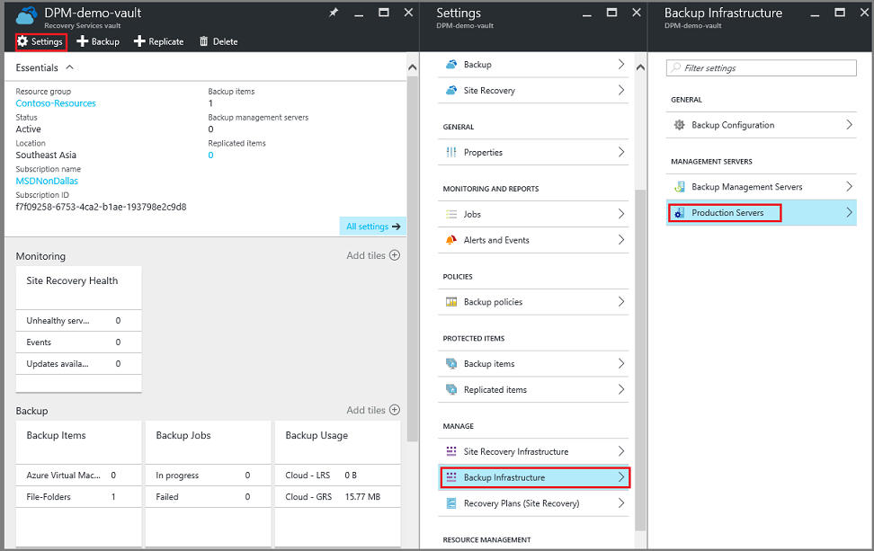

    The **Production Servers** blade opens and lists all Production servers in the vault.

    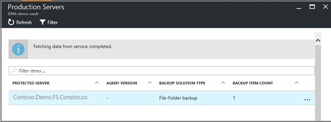
2. On the **Production Servers** blade, right-click on the server, and click **Delete**.

    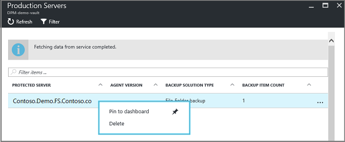

    The **Delete** blade opens.

    
3. On the **Delete** blade, confirm the server name, and click **Delete**. You must correctly name the server, to activate the **Delete** button.

    Once the vault is deleted, you receive a message stating the vault has been deleted. After deleting all servers in the vault, scroll back to the Essentials pane in the vault dashboard.
4. In the vault dashboard, make sure there are no **Backup Items**, **Backup management servers**, or **Replicated items**. On the vault toolbar, click **Delete**.
5. To verify that you want to delete the vault, click **Yes**.

    The vault is deleted and the portal returns to the **New** service menu.

## Delete a backup vault in classic portal
The following instructions are for deleting a Backup vault in the classic portal. Before you can delete the Backup vault, you must delete the recovery points, or backed up items, and remove the registered servers. The registered servers are the Windows Server, workstation, or virtual machines that were registered to the vault.

1. Open the [Classic portal](https://manage.windowsazure.com).

2. From the list of backup vaults, select the vault you want to delete.

    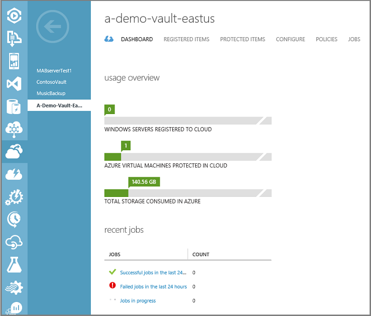

    The vault dashboard opens. Look at the number of Windows Servers and/or Azure virtual machines associated with the vault. Also, look at the total storage consumed in Azure. Stop all backup jobs and delete all data before deleting the vault.

3. Click the **Protected Items** tab, and then click **Stop Protection**

    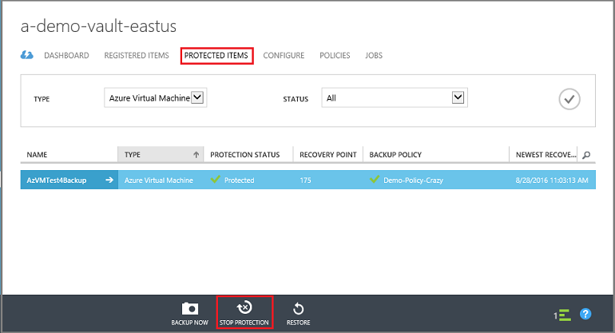

    The **Stop protection of 'your vault'** dialog appears.
4. In the **Stop protection of 'your vault'** dialog, check **Delete associated backup data** and click .  
    Optionally, you can choose a reason for stopping protection, and provide a comment.

    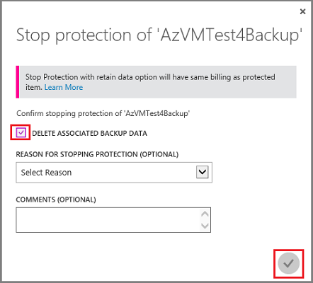

    After deleting the items in the vault, the vault will be empty.

    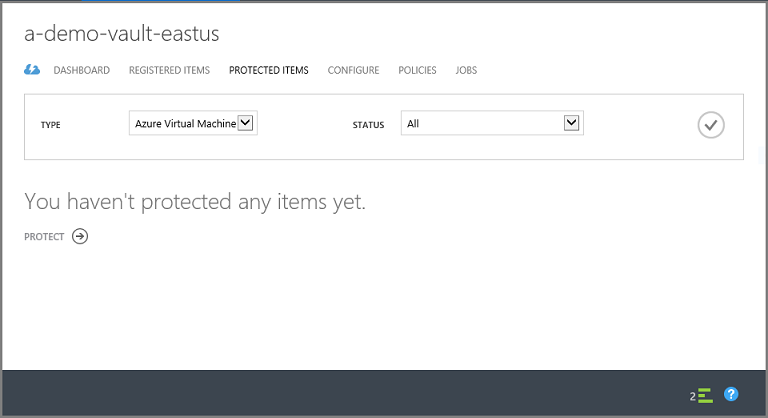
5. In the list of tabs, click **Registered Items**. The **Type** drop-down menu, enables you to choose the type of server registered to the vault. The type can be Windows Server or Azure Virtual Machine. In the following example, select the virtual machine registered to the vault, and click **Unregister**.

    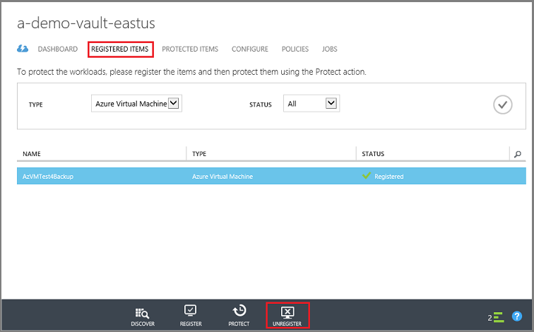

  If you want to delete the registration for a Windows Server, from the **Type** drop-down menu, select **Windows Server**, click  to refresh the screen, and then click **Delete**.  

  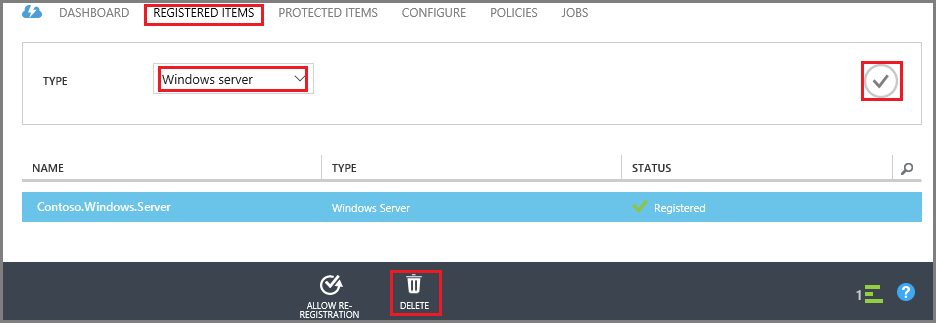

6. In the list of tabs, click **Dashboard** to open that tab. Verify there are no registered servers or Azure virtual machines protected in the cloud. Also, verify there is no data in storage. Click **Delete** to delete the vault.

    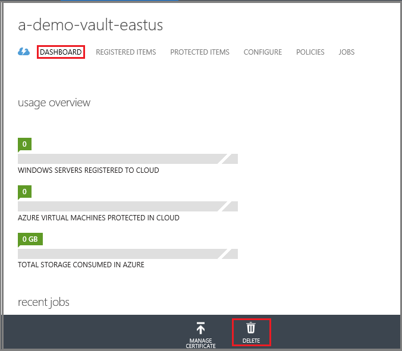

    The Delete Backup vault confirmation screen opens. Select an option why you're deleting the vault, and click .  

    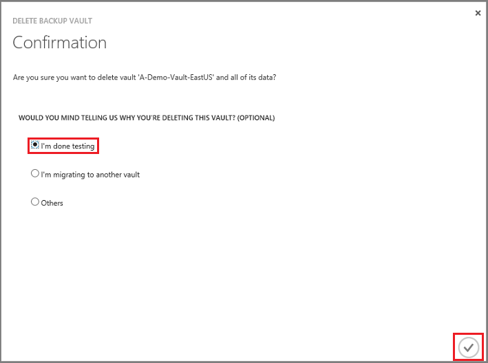

    The vault is deleted, and you return to the classic portal dashboard.

### Find the Backup Management servers registered to the vault
If you have multiple servers registered to a vault, it can be difficult to remember them. To see the servers registered to the vault, and delete them:

1. Open the vault dashboard.
2. In the **Essentials** pane, click **Settings** to open that blade.

    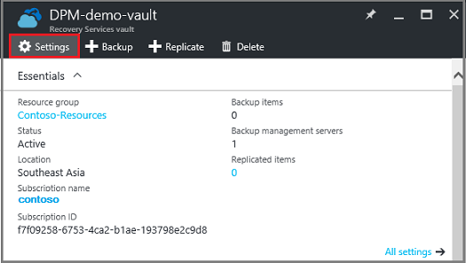
3. On the **Settings blade**, click **Backup Infrastructure**.
4. On the **Backup Infrastructure** blade, click **Backup Management Servers**. The Backup Management Servers blade opens.

    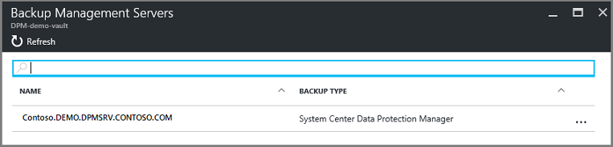
5. To delete a server from the list, right-click the name of the server and then click **Delete**.
    The **Delete** blade opens.
6. On the **Delete** blade, provide the name of the server. If it is a long name, you can copy and paste it from the list of Backup Management Servers. Then click **Delete**.  
