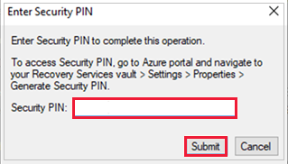

# Delete an Azure Backup Recovery Services vault

This article describes how to delete an [Azure Backup](backup-overview.md) Recovery Services vault. It contains instructions for removing dependencies and then deleting a vault.

## Before you start

You can't delete a Recovery Services vault with any of the following dependencies:

- You can't delete a vault that contains protected data sources (for example, IaaS VMs, SQL databases, Azure file shares).
- You can't delete a vault that contains backup data. Once backup data is deleted, it will go into the soft deleted state.
- You can't delete a vault that contains backup data in the soft deleted state.
- You can't delete a vault that has registered storage accounts.

If you try to delete the vault without removing the dependencies, you'll encounter one of the following error messages:

- Vault cannot be deleted as there are existing resources within the vault. Please ensure there are no backup items, protected servers, or backup management servers associated with this vault. Unregister the following containers associated with this vault before proceeding for deletion.

- Recovery Services vault cannot be deleted as there are backup items in soft deleted state in the vault. The soft deleted items are permanently deleted after 14 days of delete operation. Please try vault deletion after the backup items are permanently deleted and there is no item in soft deleted state left in the vault. For more information, see [Soft delete for Azure Backup](./backup-azure-security-feature-cloud.md).

## Delete a Recovery Services vault

> [!VIDEO https://www.youtube.com/embed/xg_TnyhK34o]

Choose a client:

# [Azure portal](#tab/portal)

>[!WARNING]
>The following operation is destructive and can't be undone. All backup data and backup items associated with the protected server will be permanently deleted. Proceed with caution.

>[!Note]
>If you're sure that all backed-up items in the vault are no longer required and want to delete them at once without reviewing, [run this PowerShell script](./scripts/delete-recovery-services-vault.md). The script will delete all backup items recursively and eventually the entire vault.

To delete a vault, follow these steps:

- **Step 1:** Go to **vault Overview**, click **Delete**, and then follow the instructions to complete the removal of Azure Backup and Azure Site Recovery items for vault deletion as shown below. Each link calls the respective _blade_ to perform the corresponding vault deletion steps.

  See the instructions in the following steps to understand the process. Also, you can go to each blade to delete vaults.

  :::image type="content" source="./media/backup-azure-delete-vault/delete-vault-manually-inline.png" alt-text="Screenshot showing to delete vault manually." lightbox="./media/backup-azure-delete-vault/delete-vault-manually-expanded.png":::

  Alternately, go to the blades manually by following the steps below.

- <a id="portal-mua">**Step 2:**</a> If Multi-User Authorization (MUA) is enabled, seek necessary permissions from the security administrator before vault deletion. [Learn more](./multi-user-authorization.md#authorize-critical-protected-operations-using-azure-active-directory-privileged-identity-management)

- <a id="portal-disable-soft-delete">**Step 3:**</a> Disable the soft delete and Security features

  1. Go to **Properties** -> **Security Settings** and disable the **Soft Delete** feature if enabled. See [how to disable soft delete](./backup-azure-security-feature-cloud.md#enabling-and-disabling-soft-delete).
  1. Go to **Properties** -> **Security Settings** and disable **Security Features**, if enabled. [Learn more](./backup-azure-security-feature.md)

- <a id="portal-delete-cloud-protected-items">**Step 4:**</a> Delete Cloud protected items

  1. **Delete Items in soft-deleted state**: After disabling soft delete, check if there are any items previously remaining in the soft deleted state. If there are items in soft deleted state, then you need to *undelete* and *delete* them again. [Follow these steps](./backup-azure-security-feature-cloud.md#using-azure-portal) to find soft delete items and permanently delete them.

     :::image type="content" source="./media/backup-azure-delete-vault/delete-items-in-soft-delete-state-inline.png" alt-text="Screenshot showing the process to delete items in soft-delete state." lightbox="./media/backup-azure-delete-vault/delete-items-in-soft-delete-state-expanded.png":::

  1. Go to the vault dashboard menu -> **Backup Items**. Click **Stop Backup** to stop the backups of all listed items, and then click **Delete Backup Data** to delete. [Follow these steps](#delete-protected-items-in-the-cloud) to remove those items.
      
- <a id="portal-delete-backup-servers">**Step 5:**</a> Delete Backup Servers

  1. Go to the vault dashboard menu > **Backup Infrastructure** > **Protected Servers**. In Protected Servers, select the server to unregister. To delete the vault, you must unregister all the servers. Right-click each protected server and select **Unregister**.
  
  1. **MARS protected servers**: Go to the vault dashboard menu -> **Backup Infrastructure** -> **Protected Servers**. If you've MARS protected servers, then all servers listed here must be deleted along with their backup data. [Follow these steps](#delete-protected-items-on-premises) to delete MARS protected servers.
  
  1. **MABS or DPM management servers**: Go to the vault dashboard menu > **Backup Infrastructure** > **Backup Management Servers**. If you've DPM or Azure Backup Server (MABS), then all items listed here must be deleted or unregistered along with their backup data. [Follow these steps](#delete-protected-items-on-premises) to delete the management servers.

  >[!Note]
  >Deleting MARS/MABS/DPM servers also removes the corresponding backup items protected in the vault.

- <a id="portal-unregister-storage-accounts">**Step 6:**</a> Unregister Storage Accounts

  Ensure all registered storage accounts are unregistered for successful vault deletion. Go to the vault dashboard menu > **Backup Infrastructure** > **Storage Accounts**. If you've storage accounts listed here, then you must unregister all of them. Learn more how to [Unregister a storage account](manage-afs-backup.md#unregister-a-storage-account).

- <a id="portal-remove-private-endpoints">**Step 7:**</a> Remove Private Endpoints

  Ensure there are no Private endpoints created for the vault. Go to Vault dashboard menu > **Private endpoint Connections** under 'Settings' > if the vault has any Private endpoint connections created or attempted to be created, ensure they are removed before proceeding with vault delete.

- **Step 8:** Delete vault

  After you've completed these steps, you can continue to [delete the vault](?tabs=portal#delete-the-recovery-services-vault).

  If you're **still unable to delete the vault** that contain no dependencies then follow the steps listed in [**deleting vault using Azure Resource Manager client**](?tabs=arm#tabpanel_1_arm).

### Delete protected items in the cloud

First, read the **[Before you start](#before-you-start)** section to understand the dependencies and vault deletion process.

To stop protection and delete the backup data, perform the following steps:

1. From the portal, go to **Recovery Services vault**, and then go to **Backup items**. Then, in the **Backup Management Type** list, select the protected items in the cloud (for example, Azure Virtual Machines, Azure Storage (the Azure Files), or SQL Server on Azure Virtual Machines).

   :::image type="content" source="./media/backup-azure-delete-vault/azure-storage-selected-inline.png" alt-text="Screenshot showing to select the backup type." lightbox="./media/backup-azure-delete-vault/azure-storage-selected-expanded.png":::

2. You'll see a list of all the items for the category. Right-click to select the backup item. Depending on whether the backup item is protected or not, the menu displays either the **Stop Backup** pane or the **Delete Backup Data** pane.

    - If the **Stop Backup** pane appears, select **Delete Backup Data** from the drop-down menu. Enter the name of the backup item (this field is case-sensitive), and then select a reason from the drop-down menu. Enter your comments, if you've any. Then, select **Stop backup**.

      :::image type="content" source="./media/backup-azure-delete-vault/stop-backup-item-inline.png" alt-text="Screenshot showing the Stop Backup pane." lightbox="./media/backup-azure-delete-vault/stop-backup-item-expanded.png":::

    - If the **Delete Backup Data** pane appears, enter the name of the backup item (this field is case-sensitive), and then select  a reason from the drop-down menu. Enter your comments, if you've any. Then, select **Delete**.

      :::image type="content" source="./media/backup-azure-delete-vault/stop-backup-blade-delete-backup-data-inline.png" alt-text="Screenshot showing the Delete Backup Data pane." lightbox="./media/backup-azure-delete-vault/stop-backup-blade-delete-backup-data-expanded.png":::

   This option deletes scheduled backups, also deletes on-demand backups.
3. Check the **Notification** icon:  After the process finishes, the service displays the following message: *Stopping backup and deleting backup data for "*Backup Item*"*. *Successfully completed the operation*.
4. Select **Refresh** on the **Backup Items** menu, to make sure the backup item was deleted.

   :::image type="content" source="./media/backup-azure-delete-vault/empty-items-list-inline.png" alt-text="Screenshot of the Delete Backup Items page." lightbox="./media/backup-azure-delete-vault/empty-items-list-expanded.png":::

### Delete protected items on premises

First, read the **[Before you start](#before-you-start)** section to understand the dependencies and vault deletion process.

1. From the vault dashboard menu, select **Backup Infrastructure**.
2. Depending on your on-premises scenario, choose the one of the following options:

      - For MARS, select **Protected Servers** and then  **Azure Backup Agent**. Then, select the server that you want to delete.

        

      - For MABS or DPM, select **Backup Management Servers**. Then, select the server that you want to delete.

          

3. The **Delete** pane appears with a warning message.

     

     Review the warning message and the instructions in the consent check box.

    >[!NOTE]
    >- If the protected server is synced with Azure services and backup items exist, the consent check box will display the number of dependent backup items and the link to view the backup items.
    >- If the protected server isn't synced with Azure services and backup items exist, the consent check box will display only the number of backup items.
    >- If there're no backup items, the consent check box will ask for deletion.

4. Select the consent check box, and then select **Delete**.

5. Check the **Notification** icon . After the operation finishes, the service displays the message: *Stopping backup and deleting backup data for "Backup Item."* *Successfully completed the operation*.
6. Select **Refresh** on the **Backup Items** menu, to make sure the backup item is deleted.

>[!NOTE]
>If you delete an on-premises protected item from a portal that contains dependencies, you'll receive a warning saying "Deleting server's registration is a destructive operation and cannot be undone. All backup data (recovery points required to restore the data) and Backup items associated with protected server will be permanently deleted."

After this process finishes, you can delete the backup items from management console:

- [Delete backup items from the MARS management console](#delete-backup-items-from-the-mars-management-console)
- [Delete backup items from the MABS or DPM management console](#delete-backup-items-from-the-mabs-or-dpm-management-console)

### Delete backup items from the MARS management console

>[!NOTE]
>If you deleted or lost the source machine without stopping the backup, the next scheduled backup will fail. The old recovery point expires according to the policy, but the last single recovery point is always retained until you stop the backup and delete the data. You can do this by following the steps in [this section](#delete-protected-items-on-premises).

1. Open the MARS management console, go to the **Actions** pane, and select **Schedule Backup**.
2. From the **Modify or Stop a Scheduled Backup** page, select **Stop using this backup schedule and delete all the stored backups**. Then, select **Next**.

    

3. From the **Stop a Scheduled Backup** page, select **Finish**.

    
4. You're prompted to enter a security PIN (personal identification number), which you must generate manually. To do this, first sign in to the Azure portal.
5. Go to **Recovery Services vault** > **Settings** > **Properties**.
6. Under **Security PIN**, select **Generate**. Copy this PIN. The PIN is valid for only five minutes.
7. In the management console, paste the PIN, and then select **OK**.

    

8. In the **Modify Backup Progress** page, the following message appears: *Deleted backup data will be retained for 14 days. After that time, backup data will be permanently deleted.*  

    

After you delete the on-premises backup items, follow the next steps from the portal.

### Delete backup items from the MABS or DPM management console

>[!NOTE]
>If you deleted or lost the source machine without stopping the backup, the next scheduled backup will fail. The old recovery point expires according to the policy, but the last single recovery point is always retained until you stop the backup and delete the data. You can do this by following the steps in [this section](#delete-protected-items-on-premises).

There are two methods you can use to delete backup items from the MABS or DPM management console.

#### Method 1

To stop protection and delete backup data, do the following steps:

1. Open the DPM Administrator Console, and then select **Protection** on the navigation bar.
2. In the display pane, select the protection group member that you want to remove. Right-click to select the **Stop Protection of Group Members** option.
3. From the **Stop Protection** dialog box, select **Delete protected data**, and then select the **Delete storage online** check box. Then, select **Stop Protection**.

    

    For the following versions, you're prompted to enter a security PIN (personal identification number), which you must generate manually.
    

    - DPM 2019 UR1 and later
    - DPM 2016 UR9 and later
    - MABS V3 UR1 and later
    
    To generate the PIN, do the following steps:
    
    1. Sign in to the Azure portal.
    1. Go to **Recovery Services vault** > **Settings** > **Properties**.
    1. Under **Security PIN**, select **Generate**.
    1. Copy this PIN. 
       >[!NOTE]
       >The PIN is valid for only five minutes.
    1. In the management console, paste the PIN, and then select **Submit**.
       

4. If you had selected **Delete storage online** in the **Stop Protection** dialog box earlier, ignore this step. Right-click the inactive protection group and select **Remove inactive protection**.

    

5. From the **Delete Inactive Protection** window, select the **Delete online storage** check box, and then select **OK**.

    

    For the following versions, you're prompted to enter a security PIN (personal identification number), which you must generate manually.
    

    - DPM 2019 UR1 and later
    - DPM 2016 UR9 and later
    - MABS V3 UR1 and later
    
    To generate the PIN, do the following steps:
    
    1. Sign in to the Azure portal.
    1. Go to **Recovery Services vault** > **Settings** > **Properties**.
    1. Under **Security PIN**, select **Generate**.
    1. Copy this PIN. 
       >[!NOTE]
       >The PIN is valid for only five minutes.
    1. In the management console, paste the PIN, and then select **Submit**.
       
 
     The protected member status changes to *Inactive replica available*.

#### Method 2

Open the **MABS management** or **DPM management** console. Under **Select data protection method**, clear the  **I want online protection** check box.

  

After you delete the on-premises backup items, follow the next steps from the portal.

### Delete the Recovery Services vault


1. When all dependencies have been removed, scroll to the **Essentials** pane in the vault menu.
2. Verify that there aren't any backup items, backup management servers, or replicated items listed. If items still appear in the vault, refer to the [Before you start](#before-you-start) section.

3. When there are no more items in the vault, select **Delete** on the vault dashboard.

    

4. Select **Yes** to verify that you want to delete the vault. The vault is deleted. The portal returns to the **New** service menu.

# [PowerShell](#tab/powershell)

First, read the **[Before you start](#before-you-start)** section to understand the dependencies and vault deletion process.

>[!Note]
>- To download the PowerShell file to delete your vault, go to vault **Overview** -> **Delete** -> **Delete using PowerShell Script**, and then click **Generate and Download Script** as shown in the screenshot below. This generates a customized script specific to the vault, which requires no additional changes. You can run the script in the PowerShell console by switching to the downloaded script’s directory and running the file using: _.\NameofFile.ps1_
>- Ensure PowerShell version 7 or higher is installed. To install the same, see the [instructions here](?tabs=powershell#powershell-install-az-module).

If you're sure that all the items backed up in the vault are no longer required and wish to delete them at once without reviewing, you can directly run the PowerShell script in this section. The script will delete all the backup items recursively and eventually the entire vault.

:::image type="content" source="./media/backup-azure-delete-vault/generate-delete-vault-powershell-script-inline.png" alt-text="Screenshot showing the process to generate the delete vault PowerShell script." lightbox="./media/backup-azure-delete-vault/generate-delete-vault-powershell-script-expanded.png":::

Follow these steps:

- **Step 1:** Seek the necessary permissions from the security administrator to delete the vault if Multi-User Authorization has been enabled against the vault. [Learn more](./multi-user-authorization.md#authorize-critical-protected-operations-using-azure-active-directory-privileged-identity-management)

- <a id="powershell-install-az-module">**Step 2:**</a> Upgrade to PowerShell 7 version by performing these steps:

  1. Upgrade to PowerShell 7: Run the following command in your console:
  
     ```azurepowershell-interactive
     iex "& { $(irm https://aka.ms/install-powershell.ps1) } -UseMSI"
     ```

  1. Open PowerShell 7 as administrator.
    

- **Step 3:** Save the PowerShell script in .ps1 format. Then, to run the script in your PowerShell console, type `./NameOfFile.ps1`. This recursively deletes all backup items and eventually the entire Recovery Services vault.

  >[!Note]
  >To access the PowerShell script for vault deletion, see the [PowerShell script for vault deletion](./scripts/delete-recovery-services-vault.md) article.

  **Run the script in the PowerShell console**

  This script performs the following actions:

  1. Disable soft delete and security features
  1. Delete backup items
  1. Unregister servers and storage accounts
  1. Delete Disaster Recovery items
  1. Remove private endpoints

To delete an individual backup items or write your own script, use the following PowerShell commands:

- Stop protection and delete the backup data:

  If you're using SQL in Azure VMs backup and enabled autoprotection for SQL instances, first disable the autoprotection.

    ```PowerShell
        Disable-AzRecoveryServicesBackupAutoProtection
           [-InputItem] <ProtectableItemBase>
           [-BackupManagementType] <BackupManagementType>
           [-WorkloadType] <WorkloadType>
           [-PassThru]
           [-VaultId <String>]
           [-DefaultProfile <IAzureContextContainer>]
           [-WhatIf]
           [-Confirm]
           [<CommonParameters>]
    ```

  [Learn more](/powershell/module/az.recoveryservices/disable-azrecoveryservicesbackupautoprotection) on how to disable protection for an Azure Backup-protected item.

- Stop protection and delete data for all backup-protected items in cloud (for example, IaaS VM, Azure file share, and so on):

    ```PowerShell
       Disable-AzRecoveryServicesBackupProtection
       [-Item] <ItemBase>
       [-RemoveRecoveryPoints]
       [-Force]
       [-VaultId <String>]
       [-DefaultProfile <IAzureContextContainer>]
       [-WhatIf]
       [-Confirm]
       [<CommonParameters>]
    ```

    [Learn more](/powershell/module/az.recoveryservices/disable-azrecoveryservicesbackupprotection) about disabling protection for a Backup-protected item.

After deleting the backed-up data, unregister any on-premises containers and management servers.

- For on-premises Files and Folders protected using Azure Backup Agent (MARS) backing up to Azure:

    ```PowerShell
    Unregister-AzRecoveryServicesBackupContainer
              [-Container] <ContainerBase>
              [-PassThru]
              [-VaultId <String>]
              [-DefaultProfile <IAzureContextContainer>]
              [-WhatIf]
              [-Confirm]
              [<CommonParameters>]
    ```

    [Learn more](/powershell/module/az.recoveryservices/unregister-azrecoveryservicesbackupcontainer) about unregistering a Windows Server or other container from the vault.

- For on-premises machines protected using MABS (Microsoft Azure Backup Server) or DPM to Azure (System Center Data Protection Manage:

    ```PowerShell
        Unregister-AzRecoveryServicesBackupManagementServer
          [-AzureRmBackupManagementServer] <BackupEngineBase>
          [-PassThru]
          [-VaultId <String>]
          [-DefaultProfile <IAzureContextContainer>]
          [-WhatIf]
          [-Confirm]
          [<CommonParameters>]
    ```

    [Learn more](/powershell/module/az.recoveryservices/unregister-azrecoveryservicesbackupcontainer) about unregistering a Backup management container from the vault.

After permanently deleting backed up data and unregistering all containers, proceed to delete the vault.

To delete a Recovery Services vault:

   ```PowerShell
       Remove-AzRecoveryServicesVault
      -Vault <ARSVault>
      [-DefaultProfile <IAzureContextContainer>]
      [-WhatIf]
      [-Confirm]
      [<CommonParameters>]
   ```

[Learn more](/powershell/module/az.recoveryservices/remove-azrecoveryservicesvault) about deleting a Recovery Services vault.

# [CLI](#tab/cli)

First, read the **[Before you start](#before-you-start)** section to understand the dependencies and vault deletion process.

> [!NOTE]
> Currently, Azure Backup CLI supports managing only Azure VM backups, so the following command to delete the vault works only if the vault contains Azure VM backups. You can't delete a vault using Azure Backup CLI, if the vault contains any backup item of type other than Azure VMs.

To delete existing Recovery Services vault, perform the following steps:

- To stop protection and delete the backup data

    ```azurecli
    az backup protection disable --container-name
                             --item-name
                             [--delete-backup-data {false, true}]
                             [--ids]
                             [--resource-group]
                             [--subscription]
                             [--vault-name]
                             [--yes]
    ```

    For more information, see this [article](/cli/azure/backup/protection#az-backup-protection-disable).

- Delete an existing Recovery Services vault:

    ```azurecli
    az backup vault delete [--force]
                       [--ids]
                       [--name]
                       [--resource-group]
                       [--subscription]
                       [--yes]
    ```

    For more information, see this [article](/cli/azure/backup/vault)

# [Azure Resource Manager](#tab/arm)

Delete the Recovery Services vault using Azure Resource Manager is recommended only if all of the dependencies are removed and you're still getting the *Vault deletion error*. Try any or all of the following tips:

- From the **Essentials** pane in the vault menu, verify that there aren't any backup items, backup management servers, or replicated items listed. If there are backup items, refer to the [Before you start](#before-you-start) section.
- Try [deleting the vault from the portal](#delete-the-recovery-services-vault) again.
- If all of the dependencies are removed and you're still getting the *Vault deletion error*, use the ARMClient tool to perform the following steps (after the note).

1. Go to [chocolatey.org](https://chocolatey.org/) to download and install Chocolatey. Then, install ARMClient by running the following command:

   `choco install armclient --source=https://chocolatey.org/api/v2/`
2. Sign in to your Azure account, and then run the following command:

    `ARMClient.exe login [environment name]`

3. In the Azure portal, gather the subscription ID and resource group name for the vault you want to delete.

For more information on the ARMClient command, see [ARMClient README](https://github.com/projectkudu/ARMClient/blob/master/README.md).

### Use the Azure Resource Manager client to delete a Recovery Services vault

1. Run the following command by using your subscription ID, resource group name, and vault name. If you don't have any dependencies, the vault is deleted when you run the following command:

   ```azurepowershell
   ARMClient.exe delete /subscriptions/<subscriptionID>/resourceGroups/<resourcegroupname>/providers/Microsoft.RecoveryServices/vaults/<Recovery Services vault name>?api-version=2015-03-15
   ```

2. If the vault isn't empty, you'll receive the following error message: *Vault cannot be deleted as there are existing resources within this vault.* To remove a protected item or container within a vault, run the following command:

   ```azurepowershell
   ARMClient.exe delete /subscriptions/<subscriptionID>/resourceGroups/<resourcegroupname>/providers/Microsoft.RecoveryServices/vaults/<Recovery Services vault name>/registeredIdentities/<container name>?api-version=2016-06-01
   ```

3. In the Azure portal, make sure that the vault is deleted.

---

## Next steps

- [Learn about Recovery Services vaults](backup-azure-recovery-services-vault-overview.md).
- [Learn about monitoring and managing Recovery Services vaults](backup-azure-manage-windows-server.md).
