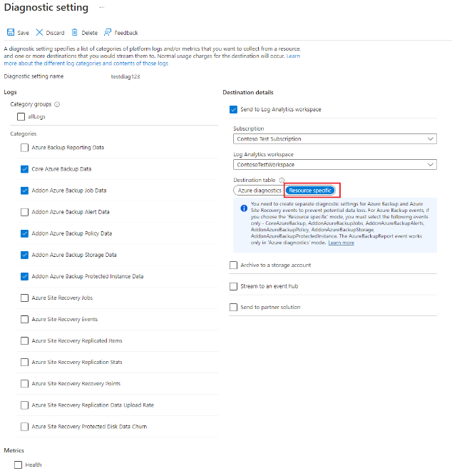
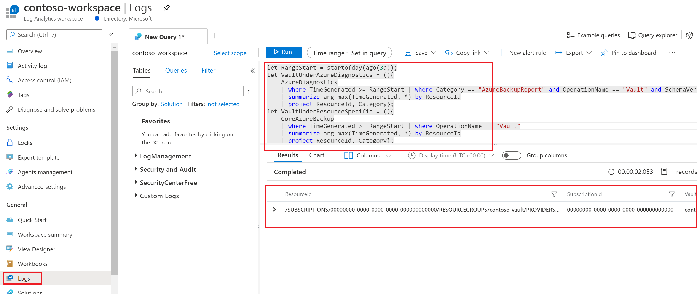
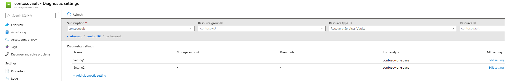
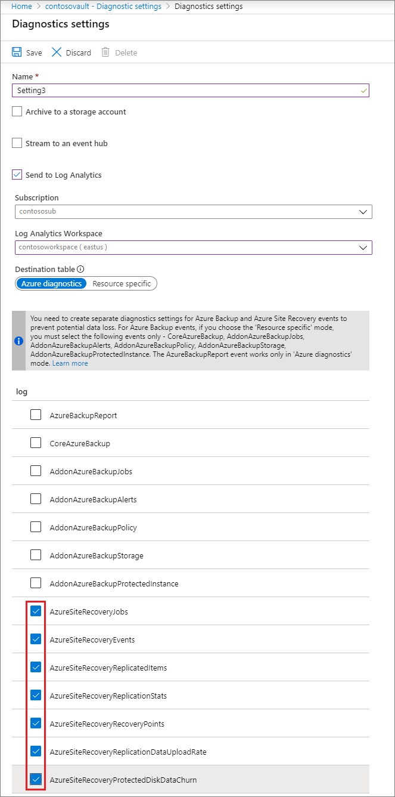

# Use diagnostics settings for Recovery Services vaults

Azure Backup sends diagnostics events that can be collected and used for the purposes of analysis, alerting, and reporting.

You can configure diagnostics settings for a Recovery Services vault via the Azure portal by going to the vault and selecting **Diagnostics settings**. Selecting **+ Add Diagnostic Setting** lets you send one or more diagnostic events to a storage account, an event hub, or a Log Analytics workspace.



## Diagnostics events available for Azure Backup users

Azure Backup provides the following diagnostics events. Each event provides detailed data on a specific set of backup-related artifacts:

* CoreAzureBackup
* AddonAzureBackupProtectedInstance
* AddonAzureBackupJobs
* AddonAzureBackupPolicy
* AddonAzureBackupStorage

If you are still using the [legacy event](#legacy-event) AzureBackupReport, we recommend switching to using the events above.

For more information, see [Data model for Azure Backup diagnostics events](./backup-azure-reports-data-model.md).

Data for these events can be sent to either a storage account, a Log Analytics workspace, or an event hub. If you're sending this data to a Log Analytics workspace, select the **Resource specific** toggle on the **Diagnostics settings** screen. For more information, see the following sections.

## Use diagnostics settings with Log Analytics

You can now use Azure Backup to send vault diagnostics data to dedicated Log Analytics tables for backup. These tables are called [resource-specific tables](../azure-monitor/essentials/resource-logs.md#send-to-log-analytics-workspace).

To send your vault diagnostics data to Log Analytics:

**Choose a vault type**:

# [Recovery Services vaults](#tab/recovery-services-vaults)

1. Go to your *vault*, and then select **Diagnostic Settings** > **+ Add Diagnostic Setting**.
1. Provide a name to the *diagnostics setting*.
1. Select the **Send to Log Analytics** checkbox, and then select a *Log Analytics workspace*.
1. Select **Resource specific** in the toggle, and select the following five events: **CoreAzureBackup**, **AddonAzureBackupJobs**, **AddonAzureBackupPolicy**, **AddonAzureBackupStorage**, and **AddonAzureBackupProtectedInstance**.
1. Select **Save**.

   :::image type="content" source="./media/backup-azure-configure-backup-reports/recovery-services-vault-diagnostics-settings-inline.png" alt-text="Screenshot shows the recovery services vault diagnostics settings." lightbox="./media/backup-azure-configure-backup-reports/recovery-services-vault-diagnostics-settings-expanded.png":::

# [Backup vaults](#tab/backup-vaults)

1. Go to your *vault*, and then select **Diagnostic Settings** > **+ Add Diagnostic Setting**.
2. Provide a name to the *diagnostics setting*.
3. Select the **Send to Log Analytics** checkbox, and then select a *Log Analytics workspace*.
4. Select the following events: **CoreAzureBackup**, **AddonAzureBackupJobs**, **AddonAzureBackupPolicy**, and **AddonAzureBackupProtectedInstance**.
5. Select **Save**.

   :::image type="content" source="./media/backup-azure-configure-backup-reports/backup-vault-diagnostics-settings.png" alt-text="Screenshot shows the backup vault diagnostics settings.":::   
---

After data flows into the Log Analytics workspace, dedicated tables for each of these events are created in your workspace. You can query any of these tables directly. You can also perform joins or unions between these tables if necessary.

> [!IMPORTANT]
> The six events, namely, *CoreAzureBackup*, *AddonAzureBackupJobs*, *AddonAzureBackupAlerts*, *AddonAzureBackupPolicy*, *AddonAzureBackupStorage*, and *AddonAzureBackupProtectedInstance*, are supported *only* in the resource-specific mode for Recovery Services vaults in [Backup reports](configure-reports.md). *If you try to send data for these six events in Azure diagnostics mode, no data will appear in Backup reports.*
>
> *AddonAzureBackupAlerts* refers to the alerts being generated by the classic alerts solution. As classic alerts solution is on deprecation path in favour of Azure Monitor-based alers, we recommend you not to select the event *AddonAzureBackupAlerts* when configuring diagnostics settings. To send the fired Azure Monitor-based alerts to a destination of your choice, you can create an alert processing rule and action group that routes these alerts to a logic app, webhook, or runbook that in turn sends these alerts to the required destination.
>
> For Backup vaults, since information on the frontend size and backup storage consumed are already included in the *CoreAzureBackup* and *AddonAzureBackupProtectedInstances* events (to aid query performance), the *AddonAzureBackupStorage event* isn't applicable for Backup vault, to avoid creation of redundant tables.

## Legacy event

Traditionally, for Recovery Services vaults, all backup-related diagnostics data for a vault was contained in a single event called AzureBackupReport. The six events described here are, in essence, a decomposition of all the data contained in AzureBackupReport.

Currently, we continue to support the *AzureBackupReport* event for Recovery Services vaults, backward compatibility in cases where you've existing custom queries on this event. For example, custom log alerts and custom visualizations. *We recommend that you move to the [new events](#diagnostics-events-available-for-azure-backup-users) as early as possible*. The new events:

* Make the data much easier to work with in log queries.
* Provide better discoverability of schemas and their structure.
* Improve performance across both ingestion latency and query times.

*The legacy event in Azure diagnostics mode will eventually be deprecated. Choosing the new events might help you to avoid complex migrations at a later date*. Our [reporting solution](./configure-reports.md) that uses Log Analytics will also stop supporting data from the legacy event.

> [!NOTE]
> For Backup vaults, all diagnostics events are sent to the resource-specific tables only; so, you don't need to do any migration for Backup vaults. The following section is specific to Recovery services vaults.

### Steps to move to new diagnostics settings for a Log Analytics workspace

1. Identify which vaults are sending data to the Log Analytics workspaces by using the legacy event and the subscriptions they belong to. Run the following query in each of your workspaces to identify these vaults and subscriptions.

    ````Kusto
    let RangeStart = startofday(ago(3d));
    let VaultUnderAzureDiagnostics = (){
        AzureDiagnostics
        | where TimeGenerated >= RangeStart | where Category == "AzureBackupReport" and OperationName == "Vault" and SchemaVersion_s == "V2"
        | summarize arg_max(TimeGenerated, *) by ResourceId
        | project ResourceId, Category};
    let VaultUnderResourceSpecific = (){
        CoreAzureBackup
        | where TimeGenerated >= RangeStart | where OperationName == "Vault"
        | summarize arg_max(TimeGenerated, *) by ResourceId
        | project ResourceId, Category};
        // Some Workspaces will not have AzureDiagnostics Table, so you need to use isFuzzy
    let CombinedVaultTable = (){
        union isfuzzy = true
        (VaultUnderAzureDiagnostics() ),
        (VaultUnderResourceSpecific() )
        | distinct ResourceId, Category};
    CombinedVaultTable | where Category == "AzureBackupReport"
    | join kind = leftanti (
    CombinedVaultTable | where Category == "CoreAzureBackup"
    ) on ResourceId
    | parse ResourceId with * "SUBSCRIPTIONS/" SubscriptionId:string "/RESOURCEGROUPS" * "MICROSOFT.RECOVERYSERVICES/VAULTS/" VaultName:string
    | project ResourceId, SubscriptionId, VaultName
    ````

    Below is a screenshot of the query being run in one of the workspaces:

    

2. Use the [built-in Azure Policy definitions](./azure-policy-configure-diagnostics.md) in Azure Backup to add a new diagnostics setting for all vaults in a specified scope. This policy adds a new diagnostics setting to vaults that either don't have a diagnostics setting or have only a legacy diagnostics setting. This policy can be assigned to an entire subscription or resource group at a time. You must have Owner access to each subscription for which the policy is assigned.

You might choose to have separate diagnostics settings for AzureBackupReport and the six new events until you've migrated all of your custom queries to use data from the new tables. The following image shows an example of a vault that has two diagnostic settings. The first setting, named **Setting1**, sends data of an AzureBackupReport event to a Log Analytics workspace in Azure diagnostics mode. The second setting, named **Setting2**, sends data of the six new Azure Backup events to a Log Analytics workspace in the resource-specific mode.



> [!IMPORTANT]
> The AzureBackupReport event is supported *only* in Azure diagnostics mode. *If you try to send data for this event in the resource-specific mode, no data will flow to the Log Analytics workspace.*

> [!NOTE]
> The toggle for **Azure diagnostics** or **Resource specific** appears only if the user selects **Send to Log Analytics**. To send data to a storage account or an event hub, a user selects the required destination and selects the check boxes for any of the desired events, without any additional inputs. Again, we recommend that you don't choose the legacy event AzureBackupReport going forward.

## Send Azure Site Recovery events to Log Analytics

Azure Backup and Azure Site Recovery events are sent from the same Recovery Services vault. Azure Site Recovery is currently not available for resource-specific tables. Users who want to send Azure Site Recovery events to Log Analytics are directed to use Azure diagnostics mode *only*, as shown in the image. *Choosing the resource-specific mode for Azure Site Recovery events will prevent the required data from being sent to the Log Analytics workspace*.



To summarize:

* If you already have Log Analytics diagnostics set up with Azure Diagnostics and have written custom queries on top of it, keep that setting *intact* until you migrate your queries to use data from the new events.
* If you also want to onboard onto new tables, as we recommend, create a **new** diagnostics setting, select **Resource specific**, and select the six new events.
* If you're currently sending Azure Site Recovery events to Log Analytics, *do not* choose the resource-specific mode for these events. Otherwise, data for these events won't flow into your Log Analytics workspace. Instead, create an additional diagnostic setting, select **Azure diagnostics**, and select the relevant Azure Site Recovery events.

The following image shows an example of a user who has three diagnostics settings for a vault. The first setting, named **Setting1**, sends data from an AzureBackupReport event to a Log Analytics workspace in Azure diagnostics mode. The second setting, named **Setting2**, sends data from the six new Azure Backup events to a Log Analytics workspace in the resource-specific mode. The third setting, named **Setting3**, sends data from the Azure Site Recovery events to a Log Analytics workspace in Azure diagnostics mode.


## Next steps

[Learn the Log Analytics data model for the diagnostics events](./backup-azure-reports-data-model.md)
