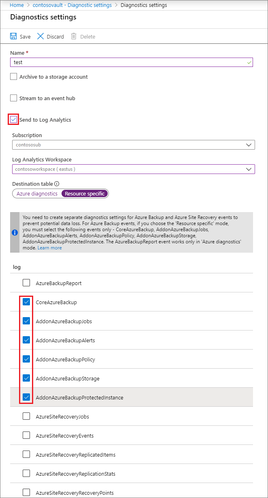

# Using Diagnostics Settings for Recovery Services Vaults

Azure Backup sends diagnostics events that can be collected and used for the purposes of analysis, alerting and reporting. 

You can configure diagnostics settings for a Recovery Services Vault via the Azure portal, by navigating to the vault and clicking the **Diagnostic Settings** menu item. Clicking on **+ Add Diagnostic Setting** lets you send one or more diagnostics events to a Storage Account, Event Hub, or a Log Analytics (LA) Workspace.


## Diagnostics Events Available for Azure Backup Users

Azure Backup provides the following diagnostic events, each of which provides detailed data on a specific set of backup-related artifacts:

* CoreAzureBackup
* AddonAzureBackupAlerts
* AddonAzureBackupProtectedInstance
* AddonAzureBackupJobs
* AddonAzureBackupPolicy
* AddonAzureBackupStorage

[Data Model for Azure Backup Diagnostics Events](https://docs.microsoft.com/azure/backup/backup-azure-reports-data-model)

Data for these events can be sent to either a storage account, LA workspace, or an Event Hub. If you are sending this data to an LA Workspace, you need to select the **Resource Specific** toggle in the **Diagnostics Setting** screen (see more information in the sections below).

## Using Diagnostics Settings with Log Analytics (LA)

Aligning with the Azure Log Analytics roadmap, Azure Backup now allows you to send vault diagnostics data to dedicated LA tables for Backup. These are referred to as [Resource Specific tables](https://docs.microsoft.com/azure/azure-monitor/platform/resource-logs-collect-workspace#resource-specific).

To send your vault diagnostics data to LA:

1.    Navigate to your vault and click on **Diagnostic Settings**. Click **+ Add Diagnostic Setting**.
2.    Give a name to the Diagnostics setting.
3.    Check the box **Send to Log Analytics** and select a Log Analytics Workspace.
4.    Select **Resource Specific** in the toggle and check the following six events - **CoreAzureBackup**, **AddonAzureBackupAlerts**, **AddonAzureBackupProtectedInstance**, **AddonAzureBackupJobs**, **AddonAzureBackupPolicy**, and **AddonAzureBackupStorage**.
5.    Click on **Save**.



Once data flows into the LA Workspace, dedicated tables for each of these events are created in your workspace. You can query any of these tables directly and also perform joins or unions between these tables if necessary.

> [!IMPORTANT]
> The above six events, namely, CoreAzureBackup, AddonAzureBackupAlerts, AddonAzureBackupProtectedInstance, AddonAzureBackupJobs, AddonAzureBackupPolicy, and AddonAzureBackupStorage, are supported **only** in Resource Specific Mode in [Backup Reports](https://docs.microsoft.com/azure/backup/configure-reports). **Please note that if you try to send data for these six events in Azure Diagnostics Mode, no data will be visible in Backup Reports.**

## Legacy Event

Traditionally, all backup-related diagnostics data for a vault has been contained in a single event called 'AzureBackupReport'. The six events described above are, in essence, a decomposition of all the data contained in AzureBackupReport. 

Currently, we continue to support the AzureBackupReport event for backward-compatibility, in cases where users have existing custom queries on this event, for example, custom log alerts, custom visualizations etc. However, **we recommend moving to the [new events](https://docs.microsoft.com/azure/backup/backup-azure-diagnostic-events#diagnostics-events-available-for-azure-backup-users) as early as possible**, since this makes the data much easier to work with in log queries, provides better discoverability of schemas and their structure, improves performance across both ingestion latency and query times. 

**The legacy event in Azure Diagnostics mode will eventually be deprecated and hence choosing the new events may help you to avoid complex migrations at a later date**. Our [reporting solution](https://docs.microsoft.com/azure/backup/configure-reports) that leverages Log Analytics will also stop supporting data from the legacy event.

### Steps to move to new diagnostics settings (to Log Analytics workspace)

1. Identify which vaults are sending data to the Log Analytics Workspace(s) using the legacy event, and the subscriptions they belong to. Run the below workspaces to identify these vaults and subscriptions:

    ````Kusto
    let RangeStart = startofday(ago(3d));
    let VaultUnderAzureDiagnostics = (){
        AzureDiagnostics
        | where TimeGenerated >= RangeStart | where Category == "AzureBackupReport" and OperationName == "Vault" and SchemaVersion_s == "V2"
        | summarize arg_max(TimeGenerated, *) by ResourceId    
        | project ResourceId, Category};
    let VaultUnderResourceSpecific = (){
        CoreAzureBackup
        | where TimeGenerated >= RangeStart | where OperationName == "Vault" 
        | summarize arg_max(TimeGenerated, *) by ResourceId
        | project ResourceId, Category};
        // Some Workspaces will not have AzureDiagnostics Table, hence you need to use isFuzzy
    let CombinedVaultTable = (){
        CombinedTable | union isfuzzy = true 
        (VaultUnderAzureDiagnostics() ),
        (VaultUnderResourceSpecific() )
        | distinct ResourceId, Category};
    CombinedVaultTable | where Category == "AzureBackupReport"
    | join kind = leftanti ( 
    CombinedVaultTable | where Category == "CoreAzureBackup"
    ) on ResourceId
    | parse ResourceId with * "SUBSCRIPTIONS/" SubscriptionId:string "/RESOURCEGROUPS" * "MICROSOFT.RECOVERYSERVICES/VAULTS/" VaultName:string
    | project ResourceId, SubscriptionId, VaultName
    ````

2. Use Azure Backup's [built-in Azure Policy](https://docs.microsoft.com/azure/backup/azure-policy-configure-diagnostics) to add a new diagnostics setting for all vaults in a specified scope. This policy adds a new diagnostics setting to those vaults that either do not have a diagnostics setting (or) have only a legacy diagnostics setting. This policy can be assigned to an entire subscription or resource group at a time. Note that you will need 'Owner' access to each subscription for which the policy is assigned.

You may choose to have separate diagnostics settings for AzureBackupReport and the six new events, until you have migrated all of your custom queries to use data from the new tables. The below image shows an example of a vault having two diagnostic settings. The first setting, named **Setting1** sends data of AzureBackupReport event to an LA Workspace in AzureDiagnostics mode. The second setting, named **Setting2** sends data of the six new Azure Backup events to an LA Workspace in Resource Specific mode.


> [!IMPORTANT]
> The AzureBackupReport event is supported **only** in Azure Diagnostics Mode. **Please note that if you try to send data for this event in Resource Specific Mode, no data will flow to the LA Workspace.**

> [!NOTE]
> The toggle for Azure Diagnostics / Resource Specific appears only if the user checks **Send to Log Analytics**. To send data to a Storage Account or an Event Hub, a user can simply select the required destination and check any of the desired events, without any additional inputs. Again, it is recommended not to choose the legacy event AzureBackupReport, going forward.

## Users sending Azure Site Recovery Events to Log Analytics (LA)

Azure Backup and Azure Site Recovery Events are sent from the same Recovery Services Vault. As Azure Site Recovery is currently not onboarded onto Resource Specific tables, users wanting to send Azure Site Recovery Events to LA are directed to use Azure Diagnostics Mode **only** (see image below). **Choosing Resource Specific Mode for the Azure Site Recovery Events will prevent the required data from being sent to the LA Workspace**.


To summarize the above nuances:

* If you already have LA diagnostics set up with Azure Diagnostics and have written custom queries on top of it, keep that setting **intact**, until you migrate your queries to use data from the new events.
* If you also want to onboard onto new tables (as recommended), create a **new** diagnostics setting, choose **Resource Specific** and select the six new events as specified above.
* If you are currently sending Azure Site Recovery Events to LA, **do not** choose Resource Specific mode for these events, otherwise data for these events will not flow into your LA Workspace. Instead, create an **additional diagnostic setting**, select **Azure Diagnostics**, and choose the relevant Azure Site Recovery events.

The below image shows an example of a user having three diagnostic settings for a vault. The first setting, named **Setting1** sends data from AzureBackupReport event to an LA Workspace in AzureDiagnostics mode. The second setting, named **Setting2** sends data from the six new Azure Backup events to an LA Workspace in Resource Specific mode. The third setting, named **Setting3**, sends data from the Azure Site Recovery events to an LA Workspace in Azure Diagnostics Mode.


## Next steps

[Learn the Log Analytics Data Model for the Diagnostics Events](https://docs.microsoft.com/azure/backup/backup-azure-reports-data-model)
