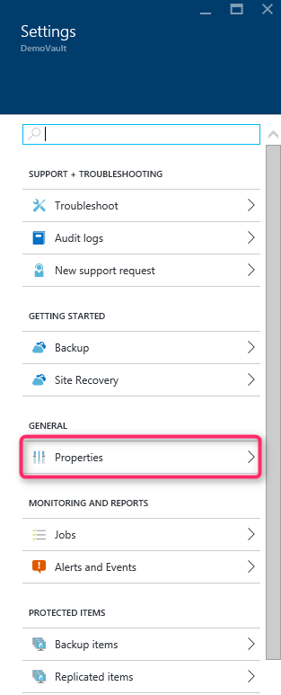
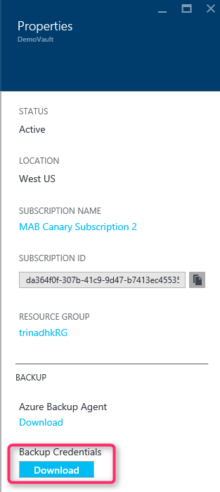
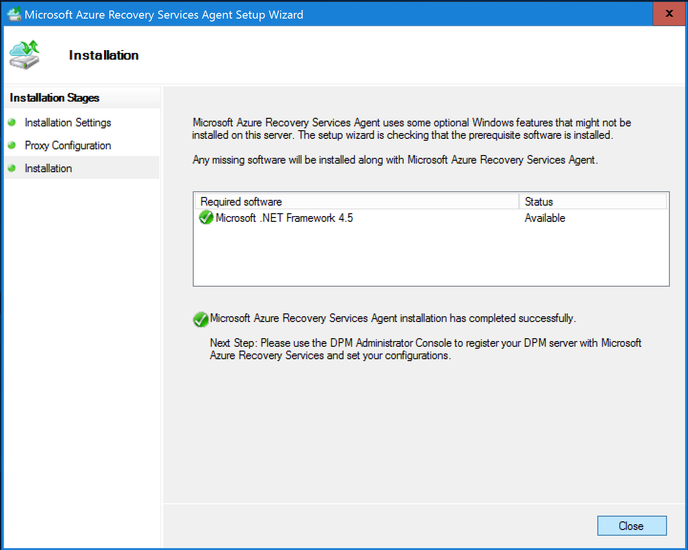
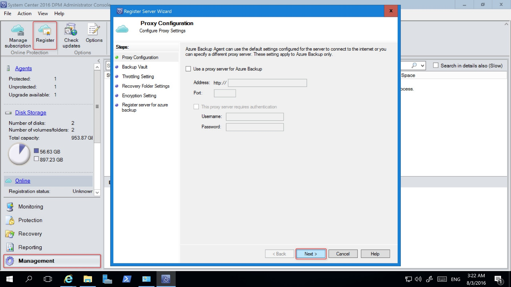
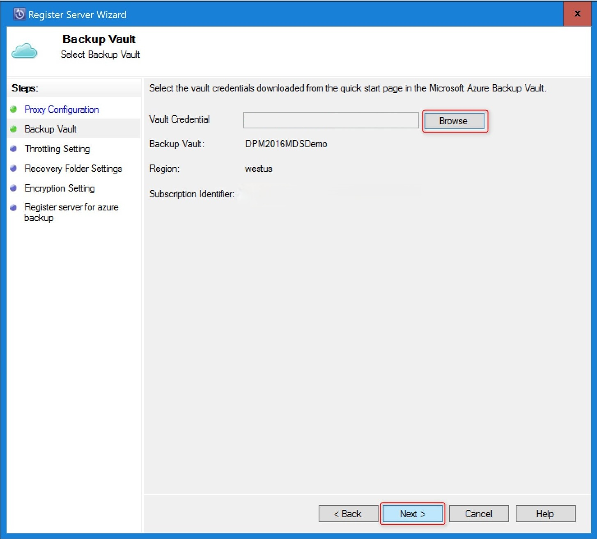
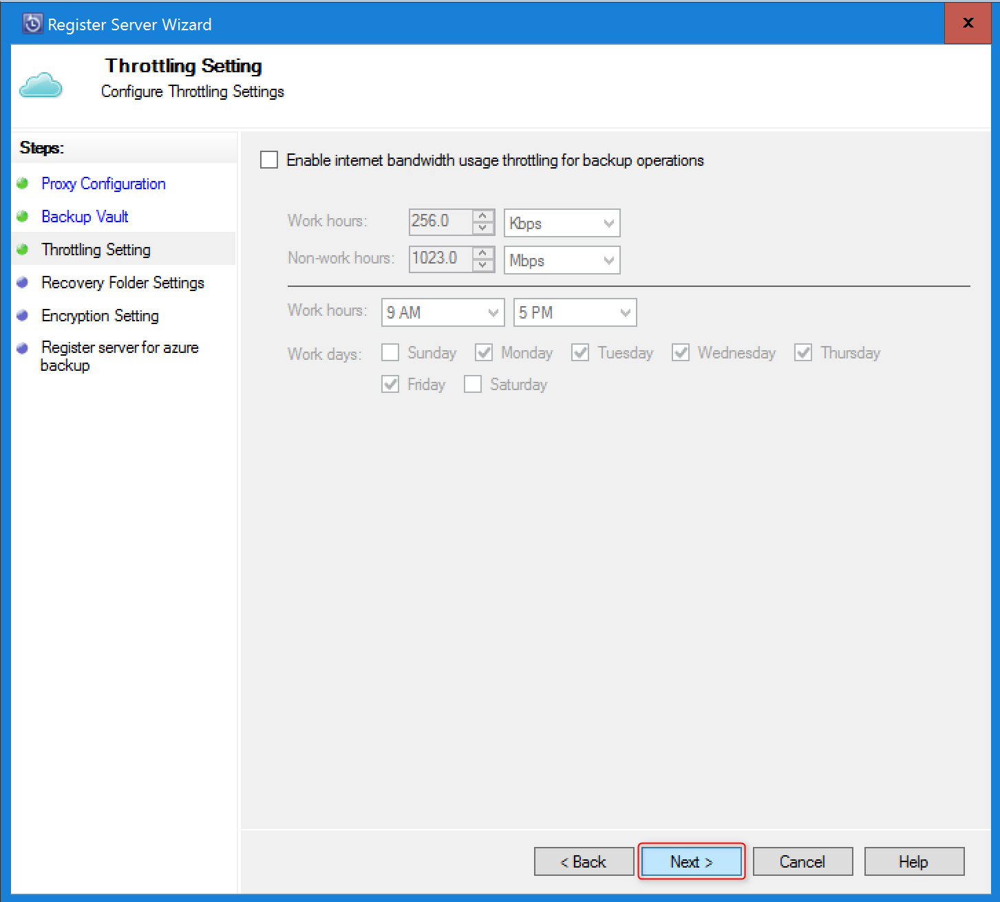
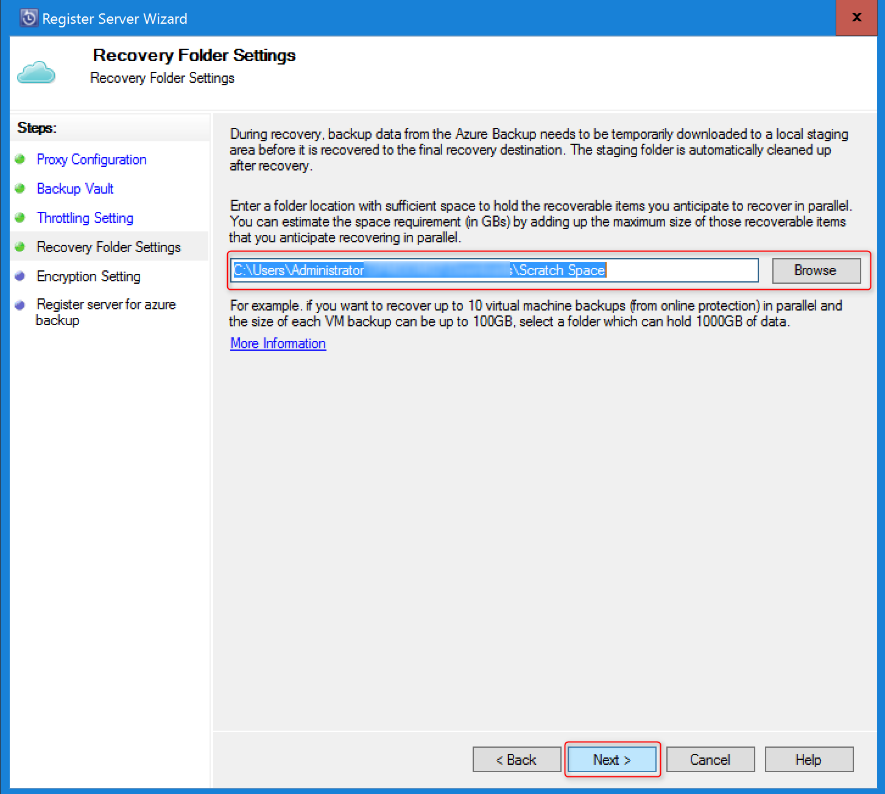
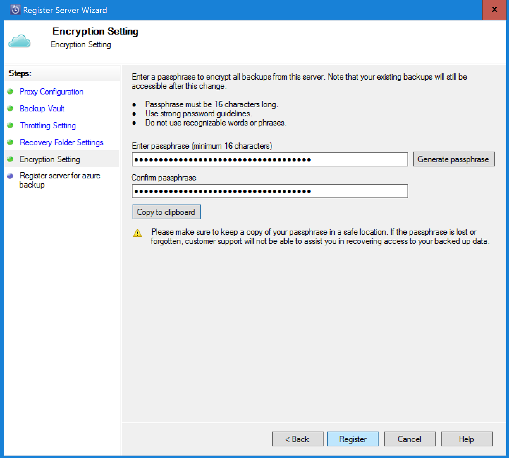

# Preparing to back up workloads to Azure with DPM
> [!div class="op_single_selector"]
> * [Azure Backup Server](backup-azure-microsoft-azure-backup.md)
> * [SCDPM](backup-azure-dpm-introduction.md)
>
>

This article explains how to back up System Center Data Protection Manager (DPM) data to Azure; including:

* How to back up DPM server data to Azure
* The prerequisites to achieve a smooth backup experience
* The typical errors encountered and how to deal with them
* Supported scenarios

> [!NOTE]
> Azure has two deployment models for creating and working with resources: [Resource Manager and classic](../azure-resource-manager/resource-manager-deployment-model.md). This article provides the information and procedures for restoring VMs deployed using the Resource Manager model.
>
>

[System Center DPM](https://docs.microsoft.com/system-center/dpm/dpm-overview) backs up file and application data. More information about supported workloads can be found [here](https://docs.microsoft.com/system-center/dpm/dpm-protection-matrix). Data backed up to DPM can be stored on tape, on disk, or backed up to Azure with Microsoft Azure Backup. DPM interacts with Azure Backup as follows:

* **DPM deployed as a physical server or on-premises virtual machine** — DPM deployed as a physical server or an on-premises Hyper-V virtual machine backs up data to a Recovery Services vault in addition to disk and tape backup.
* **DPM deployed as an Azure virtual machine** — From System Center 2012 R2 with Update 3 on, you can deploy DPM on an Azure virtual machine. If DPM is deployed as an Azure virtual machine, you can back up data to Azure disks attached to the VM, or offload the data storage by backing up to a Recovery Services vault.

## Why back up DPM to Azure?
The business benefits of backing up DPM servers to Azure include:

* For on-premises DPM deployment, use Azure as an alternative to long-term deployment to tape.
* For deploying DPM on a VM in Azure, offload storage from the Azure disk. Storing older data in your Recovery Services vault allows you to scale up your business by storing new data to disk.

## Prerequisites
Prepare Azure Backup to back up DPM data as follows:

1. **Create a Recovery Services vault** — Create a vault in Azure portal.
2. **Download vault credentials** — Download the credentials you use to register the DPM server with the Recovery Services vault.
3. **Install the Azure Backup Agent** — Install the agent on each DPM server.
4. **Register the server** — Register the DPM server with the Recovery Services vault.

[!INCLUDE [backup-upgrade-mars-agent.md](../../includes/backup-upgrade-mars-agent.md)]

## Key Definitions
Here are some key definitions for backup to Azure for DPM:

1. **Vault Credential** — Vault Credentials are needed to authenticate the machine to send backup data to an identified vault in the Azure Backup service. It can be downloaded from the vault and is valid for 48 hours.
2. **Passphrase** — Passphrase is used to encrypt the backups to cloud. Save the file in a secure location as it is required during a recovery operation.
3. **Security PIN** — If you have enabled the [Security Settings](https://docs.microsoft.com/azure/backup/backup-azure-security-feature) of the vault, Security PIN is needed for performing critical backup operations. This multi-factor authentication adds another layer of security. 
4. **Recovery Folder** — It is the phrase that the backups from cloud are temporarily downloaded to during cloud recoveries. Its size should roughly be equal to the size of the backup items you wish to recover in parallel.

[!INCLUDE [backup-create-rs-vault.md](../../includes/backup-create-rs-vault.md)]

## Edit Storage Replication

Storage replication allows you to choose between geo-redundant storage and locally redundant storage. By default, your vault has geo-redundant storage. If the vault is your primary backup, leave the option set to geo-redundant storage. If you want a cheaper option that isn't quite as durable, use the following procedure to configure locally redundant storage. Read more about [geo-redundant](../storage/common/storage-redundancy-grs.md) and [locally redundant](../storage/common/storage-redundancy-lrs.md) storage options in the [Azure Storage replication overview](../storage/common/storage-redundancy.md).

To edit the storage replication setting:

> [!NOTE] 
> Configure the storage replication before triggering the initial backup. If you decide to change the storage replication configuration after backing up the protected item, you must stop protection on the vault before switching the storage configuration.
>  

1. Select your vault and open its vault dashboard.

2. In the **Manage** section, click **Backup Infrastructure**.

3. On the **Backup Configuration** menu, choose the storage replication option for your vault.

    

    After choosing the storage option for your vault, you are ready to associate the VM with the vault. To begin the association, you should discover and register the Azure virtual machines.

## Download vault credentials
The vault credentials file is a certificate generated by the portal for each backup vault. The portal then uploads the public key to the Access Control Service (ACS). During the machine registration workflow, the certificate's private key is made available to the user, which authenticates the machine. Based on the authentication, the Azure Backup service sends data to the identified vault.

The vault credential is used only during the registration workflow. It's the user’s responsibility to ensure that the vault credentials file is not compromised. If control of the credentials is lost, the vault credentials can be used to register other machines to vault. However, backup data is encrypted using a passphrase that belongs to the customer, so existing backup data can't be compromised. To mitigate this concern, vault credentials expire after 48 hrs. Download new vault credentials as many times as needed. However, only the latest vault credential file can be used during the registration workflow.

The vault credential file is downloaded through a secure channel from the Azure portal. The Azure Backup service isn't aware of the certificate's private key, and the private key isn't available in the portal or the service. Use the following steps to download the vault credential file to a local machine.

1. Sign in to the [Azure portal](https://portal.azure.com/).

2. Open the Recovery Services vault that you want to register to a DPM server.

3. Settings menu opens up by default. If it is closed, click **Settings** on the vault dashboard to open the menu. In the **Settings** menu, click **Properties**.

    

4. On the Properties page, under **Backup Credentials** click **Download**. The portal generates the vault credential file, which is made available for download.

    

The portal generates a vault credential using a combination of the vault name and the current date. Click **Save** to download the vault credentials to the local account's downloads folder, or select Save As from the Save menu to specify a location for the vault credentials. It will take up to a minute for the file to be generated.

### Note
* Ensure that the vault credentials file is saved in a location which can be accessed from your machine. If it is stored in a file share/SMB, check for the access permissions.
* The vault credentials file is used only during the registration workflow.
* The vault credentials file expires after 48hrs and can be downloaded from the portal.

## Install Backup Agent
After creating the Azure Backup vault, an agent should be installed on each of your Windows machines (Windows Server, Windows client, System Center Data Protection Manager server, or Azure Backup Server machine) that enables back up of data and applications to Azure.

1. Open the Recovery Services vault that you want to register DPM machine.
2. Settings menu opens up by default. If it is closed, click on **Settings** to open the settings menu. In Settings menu, click on **Properties**.

    
3. On the Settings page, click **Download** under **Azure Backup Agent**.

    

   Once the agent is downloaded, run the MARSAgentInstaller.exe to launch the installation of the Azure Backup agent. Choose the installation folder and scratch folder required for the agent. The cache location specified must have free space which is at least 5% of the backup data.

4. If you use a proxy server to connect to the internet, in the **Proxy configuration** screen, enter the proxy server details. If you use an authenticated proxy, enter the user name and password details in this screen.

5. The Azure Backup agent installs .NET Framework 4.5 and Windows PowerShell (if it’s not available already) to complete the installation.

6. Once the agent is installed, **Close** the window.

   

7. To **Register the DPM Server** to the vault, in the **Management** tab, Click on **Online**. Then, select **Register**. It will open the Register Setup Wizard.

8. If you use a proxy server to connect to the internet, in the **Proxy configuration** screen, enter the proxy server details. If you use an authenticated proxy, enter the user name and password details in this screen.

    
9. In the vault credentials screen, browse to and select the vault credentials file which was previously downloaded.

    

    The vault credentials file is valid only for 48 hrs (after it’s downloaded from the portal). If you encounter any error in this screen (for example, “Vault credentials file provided has expired”), login to the Azure portal and download the vault credentials file again.

    Ensure that the vault credentials file is available in a location which can be accessed by the setup application. If you encounter access related errors, copy the vault credentials file to a temporary location in this machine and retry the operation.

    If you encounter an invalid vault credential error (for example, “Invalid vault credentials provided") the file is either corrupted or does not have the latest credentials associated with the recovery service. Retry the operation after downloading a new vault credential file from the portal. This error is typically seen if the user clicks on the **Download vault credential** option in the Azure portal, in quick succession. In this case, only the second vault credential file is valid.

10. To control the usage of network bandwidth during work, and non-work hours, in the **Throttling Setting** screen, you can set the bandwidth usage limits and define the work and non-work hours.

    

11. In the **Recovery Folder Setting** screen, browse for the folder where the files downloaded from Azure will be temporarily staged.

    

12. In the **Encryption setting** screen, you can either generate a passphrase or provide a passphrase (minimum of 16 characters). Remember to save the passphrase in a secure location.

    

    > [!WARNING]
    > If the passphrase is lost or forgotten; Microsoft cannot help in recovering the backup data. The end user owns the encryption passphrase and Microsoft does not have visibility into the passphrase used by the end user. Please save the file in a secure location as it is required during a recovery operation.
    >
    >

13. Once you click the **Register** button, the machine is registered successfully to the vault and you are now ready to start backing up to Microsoft Azure.

14. When using Data Protection Manager, you can modify the settings specified during the registration workflow by clicking the **Configure** option by selecting **Online** under the **Management** Tab.

## Requirements (and limitations)
* DPM can be running as a physical server or a Hyper-V virtual machine installed on System Center 2012 SP1 or System Center 2012 R2. It can also be running as an Azure virtual machine running on System Center 2012 R2 with at least DPM 2012 R2 Update Rollup 3 or a Windows virtual machine in VMware running on System Center 2012 R2 with at least Update Rollup 5.
* If you’re running DPM with System Center 2012 SP1 you should install Update Roll up 2 for System Center Data Protection Manager SP1. This is required before you can install the Azure Backup Agent.
* The DPM server should have Windows PowerShell and .Net Framework 4.5 installed.
* DPM can back up most workloads to Azure Backup. For a full list of what’s supported see the Azure Backup support items below.
* Data stored in Azure Backup can’t be recovered with the “copy to tape” option.
* You’ll need an Azure account with the Azure Backup feature enabled. If you don't have an account, you can create a free trial account in just a couple of minutes. Read about [Azure Backup pricing](https://azure.microsoft.com/pricing/details/backup/).
* Using Azure Backup requires the Azure Backup Agent to be installed on the servers you want to back up. Each server must have at least 5 % of the size of the data that is being backed up, available as local free storage. For example, backing up 100 GB of data requires a minimum of 5 GB of free space in the scratch location.
* Data will be stored in the Azure vault storage. There’s no limit to the amount of data you can back up to an Azure Backup vault but the size of a data source (for example a virtual machine or database) shouldn’t exceed 54400 GB.

These file types are supported for back up to Azure:

* Encrypted (Full backups only)
* Compressed (Incremental backups supported)
* Sparse (Incremental backups supported)
* Compressed and sparse (Treated as Sparse)

And these are unsupported:

* Servers on case-sensitive file systems aren’t supported.
* Hard links (Skipped)
* Reparse points (Skipped)
* Encrypted and compressed (Skipped)
* Encrypted and sparse (Skipped)
* Compressed stream
* Sparse stream

> [!NOTE]
> From System Center 2012 DPM with SP1 onwards, you can back up protected workloads to Azure.
>
>
