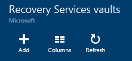
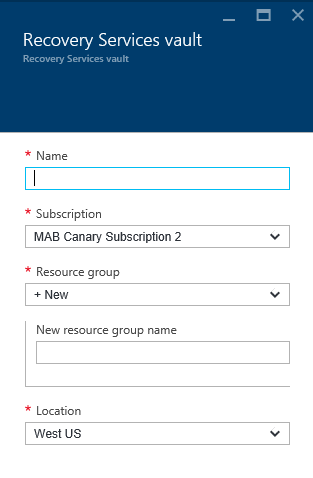

<properties
	pageTitle="Introduction to Azure DPM backup | Microsoft Azure"
	description="An introduction to backing up DPM servers using the Azure Backup service"
	services="backup"
	documentationCenter=""
	authors="Nkolli1"
	manager="shreeshd"
	editor=""
	keywords="System Center Data Protection Manager, data protection manager, dpm backup"/>

<tags
	ms.service="backup"
	ms.workload="storage-backup-recovery"
	ms.tgt_pltfrm="na"
	ms.devlang="na"
	ms.topic="article"
	ms.date="08/08/2016"
	ms.author="trinadhk;giridham;jimpark;markgal;adigan"/>

# Preparing to back up workloads to Azure with DPM

> [AZURE.SELECTOR]
- [Azure Backup Server](backup-azure-microsoft-azure-backup.md)
- [SCDPM](backup-azure-dpm-introduction.md)
- [Azure Backup Server (Classic)](backup-azure-microsoft-azure-backup-classic.md)
- [SCDPM (Classic)](backup-azure-dpm-introduction-classic.md)

This article provides an introduction to using Microsoft Azure Backup to protect your System Center Data Protection Manager (DPM) servers and workloads. By reading it, you’ll understand:

- How Azure DPM server backup works
- The prerequisites to achieve a smooth backup experience
- The typical errors encountered and how to deal with them
- Supported scenarios

> [AZURE.NOTE] Azure has two deployment models for creating and working with resources: [Resource Manager and classic](../resource-manager-deployment-model.md). This article provides the information and procedures for restoring VMs deployed using the Resource Manager model.

System Center DPM backs up file and application data. Data backed up to DPM can be stored on tape, on disk, or backed up to Azure with Microsoft Azure Backup. DPM interacts with Azure Backup as follows:

- **DPM deployed as a physical server or on-premises virtual machine** — If DPM is deployed as a physical server or as an on-premises Hyper-V virtual machine you can back up data to a Recovery Services vault in addition to disk and tape backup.
- **DPM deployed as an Azure virtual machine** — From System Center 2012 R2 with Update 3, DPM can be deployed as an Azure virtual machine. If DPM is deployed as an Azure virtual machine you can back up data to Azure disks attached to the DPM Azure virtual machine, or you can offload the data storage by backing it up to a Recovery Services vault.

## Why backup from DPM to Azure?

The business benefits of using Azure Backup for backing up DPM servers include:

- For on-premises DPM deployment, you can use Azure as an alternative to long-term deployment to tape.
- For DPM deployments in Azure, Azure Backup allows you to offload storage from the Azure disk, allowing you to scale up by storing older data in Recovery Services vault and new data on disk.

## Prerequisites
Prepare Azure Backup to back up DPM data as follows:

1. **Create a Recovery Services vault** — Create a vault in Azure portal.
2. **Download vault credentials** — Download the credentials which you use to register the DPM server to Recovery Services vault.
3. **Install the Azure Backup Agent** — From Azure Backup, install the agent on each DPM server.
4. **Register the server** — Register the DPM server to Recovery Services vault.

### 1. Create a recovery services vault
To create a recovery services vault:

1. Sign in to the [Azure portal](https://portal.azure.com/).

2. On the Hub menu, click **Browse** and in the list of resources, type **Recovery Services**. As you begin typing, the list will filter based on your input. Click **Recovery Services vault**.

    

    The list of Recovery Services vaults is displayed.

3. On the **Recovery Services vaults** menu, click **Add**.

    

    The Recovery Services vault blade opens, prompting you to provide a **Name**, **Subscription**, **Resource group**, and **Location**.

    

4. For **Name**, enter a friendly name to identify the vault. The name needs to be unique for the Azure subscription. Type a name that contains between 2 and 50 characters. It must start with a letter, and can contain only letters, numbers, and hyphens.

5. Click **Subscription** to see the available list of subscriptions. If you are not sure which subscription to use, use the default (or suggested) subscription. There will be multiple choices only if your organizational account is associated with multiple Azure subscriptions.

6. Click **Resource group** to see the available list of Resource groups, or click **New** to create a new Resource group. For complete information on Resource groups, see [Azure Resource Manager overview](../resource-group-overview.md)

7. Click **Location** to select the geographic region for the vault.

8. Click **Create**. It can take a while for the Recovery Services vault to be created. Monitor the status notifications in the upper right-hand area in the portal.
Once your vault is created, it opens in the portal.

### Set Storage Replication

The storage replication option allows you to choose between geo-redundant storage and locally redundant storage. By default, your vault has geo-redundant storage. Leave the option set to geo-redundant storage if this is your primary backup. Choose locally redundant storage if you want a cheaper option that isn't quite as durable. Read more about [geo-redundant](../storage/storage-redundancy.md#geo-redundant-storage) and [locally redundant](../storage/storage-redundancy.md#locally-redundant-storage) storage options in the [Azure Storage replication overview](../storage/storage-redundancy.md).

To edit the storage replication setting:

1. Select your vault to open the vault dashboard and the Settings blade. If the **Settings** blade doesn't open, click **All settings** in the vault dashboard.

2. On the **Settings** blade, click **Backup Infrastructure** > **Backup Configuration** to open the **Backup Configuration** blade. On the **Backup Configuration** blade, choose the storage replication option for your vault.

    

    After choosing the storage option for your vault, you are ready to associate the VM with the vault. To begin the association, you should discover and register the Azure virtual machines.

### 2. Download vault credentials

The vault credentials file is a certificate generated by the portal for each backup vault. The portal then uploads the public key to the Access Control Service (ACS). The private key of the certificate is made available to the user as part of the workflow which is given as an input in the machine registration workflow. This authenticates the machine to send backup data to an identified vault in the Azure Backup service.

The vault credential is used only during the registration workflow. It is the user’s responsibility to ensure that the vault credentials file is not compromised. If it falls in the hands of any rogue-user, the vault credentials file can be used to register other machines against the same vault. However, as the backup data is encrypted using a passphrase which belongs to the customer, existing backup data cannot be compromised. To mitigate this concern, vault credentials are set to expire in 48hrs. You can download the vault credentials of a recovery services any number of times – but only the latest vault credential file is applicable during the registration workflow.

The vault credential file is downloaded through a secure channel from the Azure portal. The Azure Backup service is unaware of the private key of the certificate and the private key is not persisted in the portal or the service. Use the following steps to download the vault credential file to a local machine.

1. Sign in to the [Azure portal](https://portal.azure.com/).

2. Open Recovery Services vault to which to which you want to register DPM machine.

3. Settings blade opens up by default. If it is closed, click on **Settings** on vault dashboard to open the settings blade. In Settings blade, click on **Properties**.

	

4. On the Properties page, click **Download** under **Backup Credentials**. The  portal generates the vault credential file, which is made available for download.

    

The portal will generate a vault credential using a combination of the vault name and the current date. Click **Save** to download the vault credentials to the local account's downloads folder, or select Save As from the Save menu to specify a location for the vault credentials. It will take up to a minute for the file to be generated.

### Note
- Ensure that the vault credentials file is saved in a location which can be accessed from your machine. If it is stored in a file share/SMB, check for the access permissions.
- The vault credentials file is used only during the registration workflow.
- The vault credentials file expires after 48hrs and can be downloaded from the portal.

### 3. Install Backup Agent

After creating the Azure Backup vault, an agent should be installed on each of your Windows machines (Windows Server, Windows client, System Center Data Protection Manager server, or Azure Backup Server machine) that enables back up of data and applications to Azure.

1. Open Recovery Services vault to which to which you want to register DPM machine.

2. Settings blade opens up by default. If it is closed, click on **Settings** to open the settings blade. In Settings blade, click on **Properties**.

	

3. On the Settings page, click **Download** under **Azure Backup Agent**.

    

   Once the agent is downloaded, double click MARSAgentInstaller.exe to launch the installation of the Azure Backup agent. Choose the installation folder and scratch folder required for the agent. The cache location specified must have free space which is at least 5% of the backup data.

4.	If you use a proxy server to connect to the internet, in the **Proxy configuration** screen, enter the proxy server details. If you use an authenticated proxy, enter the user name and password details in this screen.

5.	The Azure Backup agent installs .NET Framework 4.5 and Windows PowerShell (if it’s not available already) to complete the installation.

6.	Once the agent is installed, **Close** the window.

    

7. To **Register the DPM Server** to the vault, in the **Management** tab, Click on **Online**. Then, select **Register**. It will open the Register Setup Wizard.

8. If you use a proxy server to connect to the internet, in the **Proxy configuration** screen, enter the proxy server details. If you use an authenticated proxy, enter the user name and password details in this screen.

	

9. In the vault credentials screen, browse to and select the vault credentials file which was previously downloaded.

    

    The vault credentials file is valid only for 48 hrs (after it’s downloaded from the portal). If you encounter any error in this screen (for example, “Vault credentials file provided has expired”), login to the Azure portal and download the vault credentials file again.

    Ensure that the vault credentials file is available in a location which can be accessed by the setup application. If you encounter access related errors, copy the vault credentials file to a temporary location in this machine and retry the operation.

    If you encounter an invalid vault credential error (for example, “Invalid vault credentials provided") the file is either corrupted or does not have the latest credentials associated with the recovery service. Retry the operation after downloading a new vault credential file from the portal. This error is typically seen if the user clicks on the **Download vault credential** option in the Azure portal, in quick succession. In this case, only the second vault credential file is valid.

10. To control the usage of network bandwidth during work, and non-work hours, in the **Throttling Setting** screen, you can set the bandwidth usage limits and define the work and non-work hours.

    

11. In the **Recovery Folder Setting** screen, browse for the folder where the files downloaded from Azure will be temporarily staged.

    

12. In the **Encryption setting** screen, you can either generate a passphrase or provide a passphrase (minimum of 16 characters). Remember to save the passphrase in a secure location.

    

    > [AZURE.WARNING] If the passphrase is lost or forgotten; Microsoft cannot help in recovering the backup data. The end user owns the encryption passphrase and Microsoft does not have visibility into the passphrase used by the end user. Please save the file in a secure location as it is required during a recovery operation.

13. Once you click the **Register** button, the machine is registered successfully to the vault and you are now ready to start backing up to Microsoft Azure.

14. When using Data Protection Manager, you can modify the settings specified during the registration workflow by clicking the **Configure** option by selecting **Online** under the **Management** Tab.

## Requirements (and limitations)

- DPM can be running as a physical server or a Hyper-V virtual machine installed on System Center 2012 SP1 or System Center 2012 R2. It can also be running as an Azure virtual machine running on System Center 2012 R2 with at least DPM 2012 R2 Update Rollup 3 or a Windows virtual machine in VMWare running on System Center 2012 R2 with at least Update Rollup 5.
- If you’re running DPM with System Center 2012 SP1 you should install Update Roll up 2 for System Center Data Protection Manager SP1. This is required before you can install the Azure Backup Agent.
- The DPM server should have Windows PowerShell and .Net Framework 4.5 installed.
- DPM can back up most workloads to Azure Backup. For a full list of what’s supported see the Azure Backup support items below.
- Data stored in Azure Backup can’t be recovered with the “copy to tape” option.
- You’ll need an Azure account with the Azure Backup feature enabled. If you don't have an account, you can create a free trial account in just a couple of minutes. Read about [Azure Backup pricing](https://azure.microsoft.com/pricing/details/backup/).
- Using Azure Backup requires the Azure Backup Agent to be installed on the servers you want to back up. Each server must have at least 5 % of the size of the data that is being backed up, available as local free storage. For example, backing up 100 GB of data requires a minimum of 5 GB of free space in the scratch location.
- Data will be stored in the Azure vault storage. There’s no limit to the amount of data you can back up to an Azure Backup vault but the size of a data source (for example a virtual machine or database) shouldn’t exceed 54400 GB.

These file types are supported for back up to Azure:

- Encrypted (Full backups only)
- Compressed (Incremental backups supported)
- Sparse (Incremental backups supported)
- Compressed and sparse (Treated as Sparse)

And these are unsupported:

- Servers on case-sensitive file systems aren’t supported.
- Hard links (Skipped)
- Reparse points (Skipped)
- Encrypted and compressed (Skipped)
- Encrypted and sparse (Skipped)
- Compressed stream
- Sparse stream

>[AZURE.NOTE] From in System Center 2012 DPM with SP1 onwards you can backup up workloads protected by DPM to Azure using Microsoft Azure Backup.
