# Back up Azure File shares

This article details how to back up [Azure File shares](../storage/files/storage-files-introduction.md).

In this guide, you learn how to:
> [!div class="checklist"]
> * Configure a Recovery Services vault to back up Azure Files
> * Run an on-demand backup job to create a restore point
> * Restore a file or files from a restore point
> * Manage Backup jobs
> * Stop protection on Azure Files
> * Delete your backup data

## Prerequisites
Before you can back up an Azure File share, ensure that it is present in one of the [supported Storage Account types](troubleshoot-azure-files.md#preview-boundaries). Once you have verified this, you can protect your file shares.

## Configuring Azure File shares backup

All backup data is stored in Recovery Services vaults. This tutorial assumes you already have established an Azure File share. To back up your Azure File share:

1. Create a Recovery Services vault in the same region as your file share. If you already have a vault, open your vault's Overview page and click **Backup**.

    

2. In the Backup Goal menu, from **What do you want to backup?**, choose Azure File Share.

    

3. Click **Backup** to configure the Azure File share to your Recovery Services vault. 

   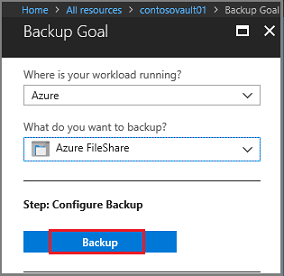

    Once the vault is associated with the Azure File share, the Backup menu opens and prompts you select a Storage account. The menu displays all supported Storage Accounts in the region where your vault exists, that are not already associated with a Recovery Services vault.

   

4. In the list of Storage accounts, select an account, and click **OK**. Azure searches the storage account for files shares that can be backed up. If you recently added your file shares and do not see them in the list, allow a little time for the file shares to appear.

   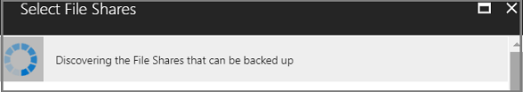

5. From the **File Shares** list, select one or more of the file shares you want to backup, and click **OK**.

6. After choosing your File Shares, the Backup menu switches to the **Backup policy**. From this menu either select an existing backup policy, or create a new one, and then click **Enable Backup**. 

   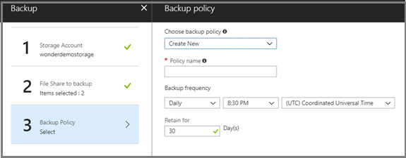

    After establishing a backup policy, a snapshot of the File Shares will be taken at the scheduled time, and the recovery point is retained for the chosen period.

## Create an on-demand backup
Occasionally you may want to generate a backup snapshot, or recovery point, outside of the times scheduled in the backup policy. A common time to generate an on-demand backup is right after you've configured the backup policy. Based on the schedule in the backup policy, it may be hours or days until a snapshot is taken. To protect your data until the backup policy engages, initiate an on-demand backup. Creating an Oo-demand backup is often required before you make planned changes to your file shares. 

### To create an on-demand backup

1. Open the Recovery Services vault that contains the file share recovery points, and click **Backup Items**. The list of Backup Item types appears.

   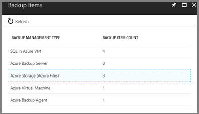

2. From the list, select **Azure Storage (Azure Files)**. The list of Azure File shares appears.

   

3. From the list of Azure File shares, select the desired file share. The Backup Item menu for the selected file share opens.

   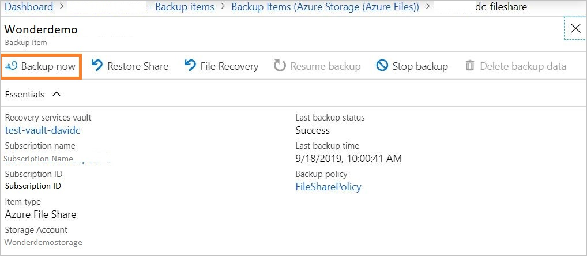

4. From the Backup Item menu, click **Backup Now**. Because this is an on-demand backup job, there is no retention policy associated with the recovery point. The **Backup Now** dialog opens. Specify the last day you want to retain the recovery point. 
  
   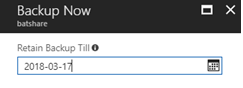

## Restore from backup of Azure File share
If you need to restore an entire file share or individual files or folders from a Restore Point, head to the Backup Item as detailed in the previous section. Choose **Restore Share** to restore an entire file share from a desired Point-in-time. From the list of Restore Points that show up, select one to be able to Overwrite your current file share or Restore this to an alternate file share in the same region.

   

## Restore individual files or folders from backup of Azure File shares
Azure Backup provides the ability to browse a Restore Point within the Azure portal. To restore a file or folder of your choice, click on File Recovery from the Backup Item page and choose from the list of Restore Points. Select the Recovery Destination and then click **Select File** to browse the restore point. Select the file or folder of your choice and **Restore**.

   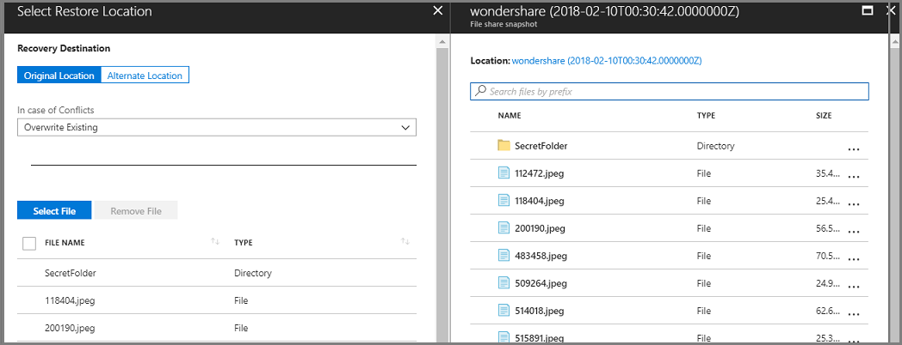

## Manage Azure File share backups

You can execute several management tasks for File share backups on the **Backup Jobs** page, including:
- [Monitor jobs](backup-azure-files.md#monitor-jobs)
- [Create a new policy](backup-azure-files.md#create-a-new-policy)
- [Stop protection on a file share](backup-azure-files.md#stop-protecting-an-azure-file-share)
- [Resume protection on a file share](backup-azure-files.md#resume-protection-for-azure-file-share)
- [Delete backup data](backup-azure-files.md#delete-backup-data)

### Monitor jobs

You can monitor the progress of all jobs on the **Backup Jobs** page.

To open the **Backup Jobs** page:

- Open the Recovery Services vault you want to monitor, and in the Recovery Services vault menu, click **Jobs** and then click **Backup Jobs**.
   

    The list of Backup jobs and the status of those jobs appears.
   

### Create a new policy

You can create a new policy to back up Azure File shares from the **Backup Policies** of the Recovery Services vault. All policies created when you configure Backup for file shares show up with the Policy Type as Azure File Share.

To view the existing Backup policies:

- Open the Recovery Services vault you want, and in the Recovery Services vault menu, click **Backup policies**. All Backup policies are listed.

   

To create a new Backup policy:

1. In the Recovery Services vault menu, click **Backup policies**.
2. In the list of Backup policies, click **Add**.

   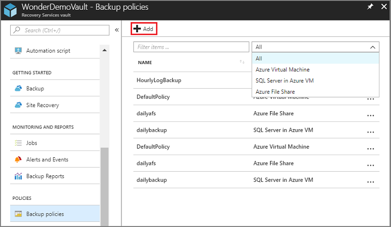

3. In the **Add** menu, select **Azure File SHare**. The Backup policy menu for Azure File share opens. Provide the name for the policy, backup frequency, and retention range for the recovery points. Click OK when you have defined the policy.

   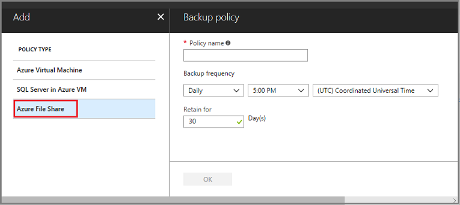

### Stop protecting an Azure File share

If you choose to stop protecting an Azure File share, you are asked if you want to retain the recovery points. There are two ways to stop protecting Azure File shares:

- Stop all future backup jobs and delete all recovery points, or
- Stop all future backup jobs but leave the recovery points

There may be a cost associated with leaving the recovery points in storage as the underlying snapshots created by Azure Backup will be retained. However, the benefit of leaving the recovery points is you can restore the File share later, if desired. For information about the cost of leaving the recovery points, see the pricing details. If you choose to delete all recovery points, you cannot restore the File share.

To stop protection for an Azure File share:

1. Open the Recovery Services vault that contains the file share recovery points, and click **Backup Items**. The list of Backup Item types appears.

    

2. In the **Backup Management Type** list, select **Azure Storage (Azure Files)**. The list of Backup Items for (Azure Storage (Azure Files)) appears.

    

3. In the list of Backup Items (Azure Storage (Azure Files)), select the backup item you want to stop.

4. In the Azure File share items, click the **More** menu, and select **Stop Backup**. 

   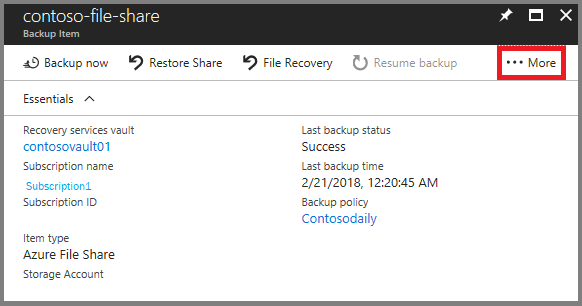

5. From the Stop Backup menu, choose to **Retain** or **Delete Backup Data** and click **Stop Backup**.

   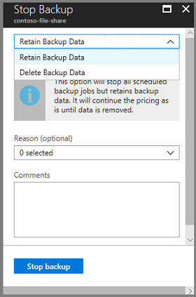

### Resume protection for Azure File share

If the Retain Backup Data option was chosen when protection for the file share was stopped, then it is possible to resume protection. If the **Delete Backup Data** option was chosen, then protection for the file share cannot resume.

To resume protection for the file share, go to the Backup Item and click Resume Backup. The Backup Policy opens and you can choose a policy of your choice to resume backup.

   

### Delete Backup data 

You can delete the backup of a file share during the Stop backup job, or any time after you have stopped protection. It may even be beneficial to wait days or weeks before deleting the recovery points. Unlike restoring recovery points, when deleting backup data, you cannot choose specific recovery points to delete. If you choose to delete your backup data, you delete all recovery points associated with the item.

The following procedure assumes the Backup job for the virtual machine has been stopped. Once the Backup job is stopped, the Resume backup and Delete Backup Data options are available in the Backup item dashboard. Click Delete Backup Data and type the name of the File share to confirm deletion. Optionally, provide a Reason to delete or Comment.

## See Also
For additional information on Azure File shares, see
- [FAQ for Azure File share backup](backup-azure-files-faq.md)
- [Troubleshoot Azure File share backup](troubleshoot-azure-files.md)
