# Manage Microsoft Azure Recovery Services (MARS) Agent backups by using the Azure Backup service

This article describes how to manage files and folders that are backed up with the Microsoft Azure Recovery Services Agent.

## Modify a backup policy

When you modify backup policy, you can add new items, remove existing items from backup, or exclude files from being backed up using  Exclusion Settings.

- **Add Items** use this option only for adding new items to back up. To remove existing items, use **Remove Items** or **Exclusion Settings** option.  
- **Remove Items** use this option to remove items from being backed up.
  - Use **Exclusion Settings** for removing all items within a volume instead of **Remove Items**.
  - Clearing all selections in a volume causes old backups of the items, to be retained according to retention settings at the time of the last backup, without scope for modification.
  - Reselecting these items, leads to a first full-backup and new policy changes aren't applied to old backups.
  - Unselecting entire volume retains past backup without any scope for modifying retention policy.
- **Exclusion Settings** use this option to exclude specific items from being backed up.

### Add new items to existing policy

1. In **Actions**, select **Schedule Backup**.

    

2. In **Select policy item** tab, and select **Modify backup schedule for your files and folders** and select **Next**.

    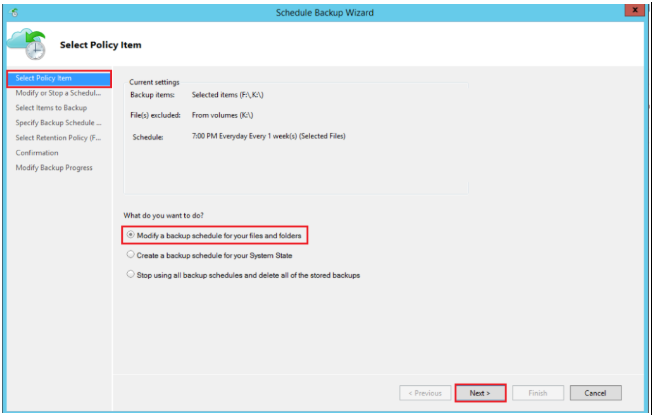

3. In **Modify or stop schedule backup** tab, select **Make changes to backup items or times** and select **Next**.

    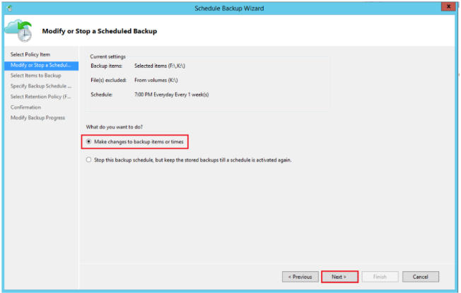

4. In **Select items to Backup** tab, select **Add items** to add the items that you want to back up.

    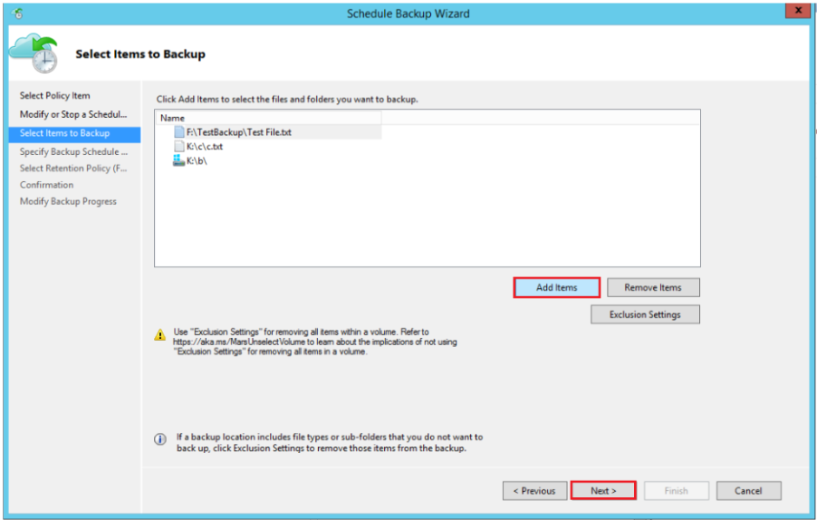

5. In **Select Items** window, select files or folders that you  want to add and select **OK**.

    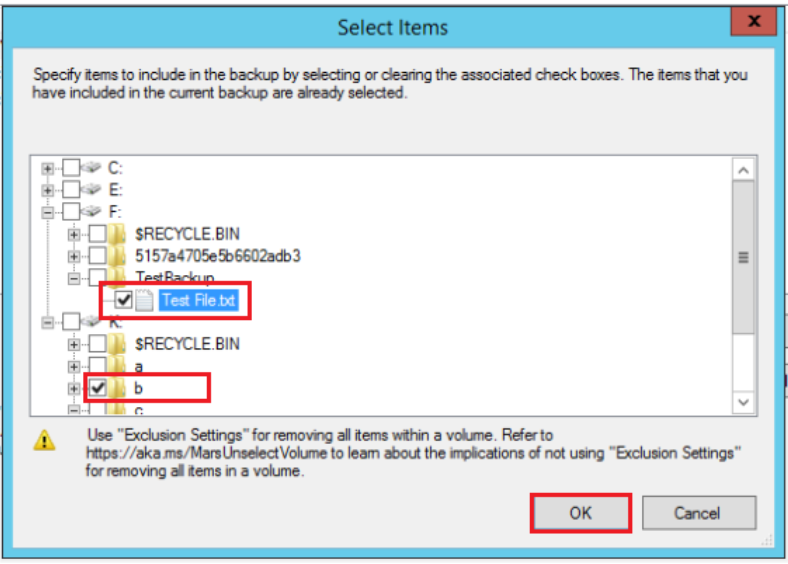

6. Complete the next steps and select **Finish** to complete the operation.

### Add Exclusion rules to existing policy

You can add exclusion rules to skip files and folders that you don't want to be backed up. You can do this during when defining a new policy or modifying an existing policy.

1. From the Actions pane, select **Schedule Backup**. Go to **Select items to Backup** and select **Exclusion Settings**.

    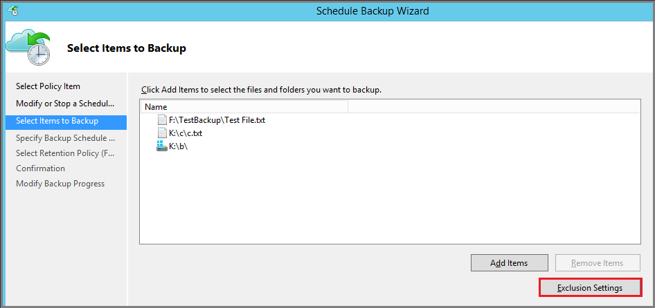

2. In **Exclusion Settings**, select **Add Exclusion**.

    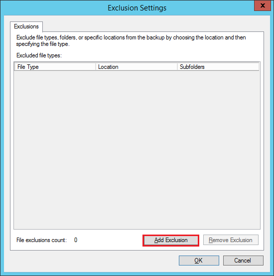

3. From **Select Items to Exclude**, browse the files and folders and select items that you want to exclude and select **OK**.

    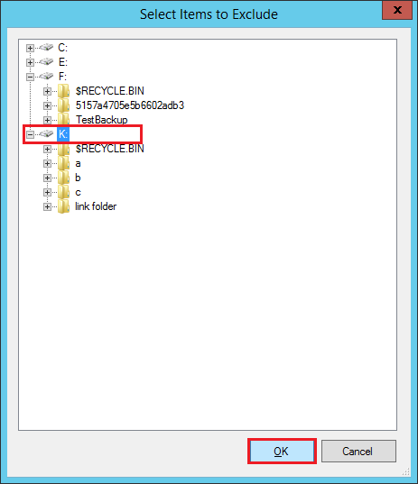

4. By default all **Subfolders** within the selected folders are excluded. You can change this by selecting **Yes** or **No**. You can edit and specify the file types to exclude as shown below:

    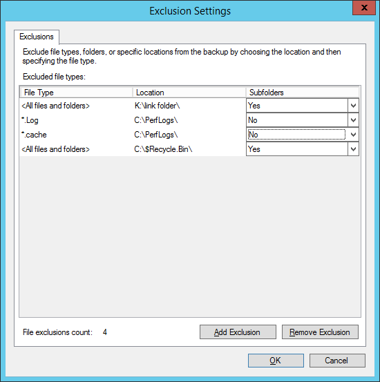

5. Complete the next steps and select **Finish** to complete the operation.

### Remove items from existing policy

1. From the Actions pane, select **Schedule Backup**. Go to **Select items to Backup**. From the list, select the files and folders that you want to remove from backup schedule and select **Remove items**.

    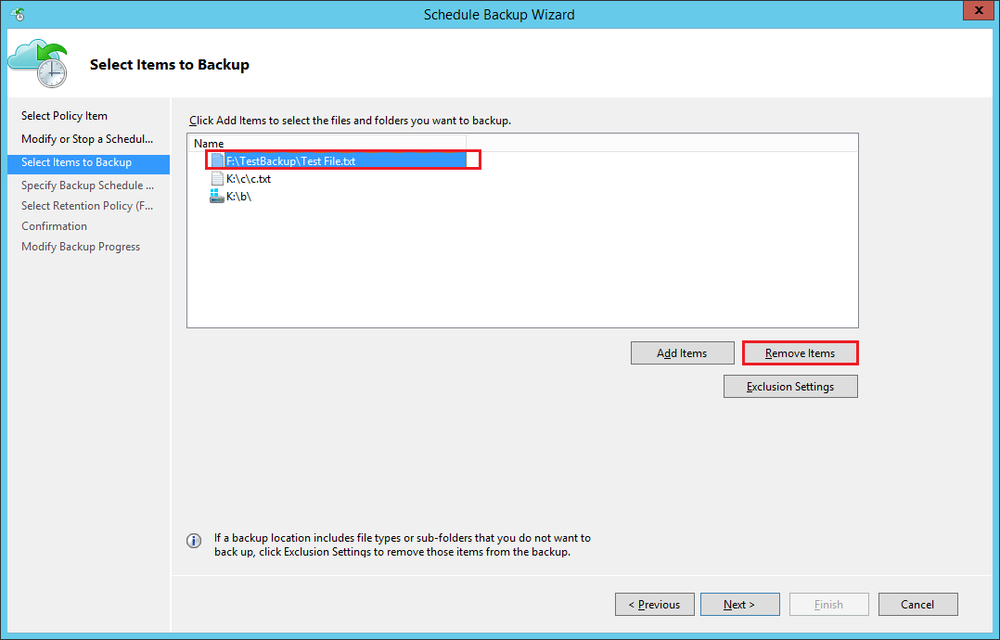

    > [!NOTE]
    > Proceed with caution when you completely remove a volume from the policy.  If you need to add it again, then it will be treated as a new volume. The next scheduled backup will perform an Initial Backup (full backup) instead of Incremental Backup. If you need to temporarily remove and add items later, then it's recommended to use **Exclusions Settings** instead of **Remove Items** to ensure incremental backup instead of full backup.

2. Complete the next steps and select **Finish** to complete the operation.

## Stop protecting Files and Folder backup

There are two ways to stop protecting Files and Folders backup:

- **Stop protection and retain backup data**.
  - This option will stop all future backup jobs from protection.
  - Azure Backup service will continue to retain all the existing recovery points.  
  - You'll be able to restore the backed-up data for unexpired recovery points.
  - If you decide to resume protection, then you can use the *Re-enable backup schedule* option. After that, data will be retained based on the new retention policy.
- **Stop protection and delete backup data**.
  - This option will stop all future backup jobs from protecting your data. If the vault security features are not enabled, all recovery points are immediately deleted. If the security features are enabled, the deletion is delayed by 14 days, and you'll receive an alert email with a message: *Your data for this Backup item has been deleted. This data will be temporarily available for 14 days, after which it will be permanently deleted* and a recommended action *Reprotect the Backup item within 14 days to recover your data.* In this state, the retention policy continues to apply, and the backup data remains billable. [Learn more](backup-azure-security-feature.md#enable-security-features) on how to enable vault security features.
  - To resume protection, reprotect the server within 14 days from the delete operation. In this duration, you can also restore the data to an alternate server.

### Stop protection and retain backup data

1. Open the MARS management console, go to the **Actions pane**, and **select Schedule Backup**.

    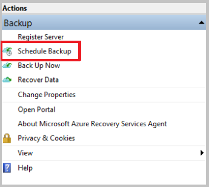
1. In the **Select Policy Item** page, select **Modify a backup schedule for your files and folders** and select **Next**.

    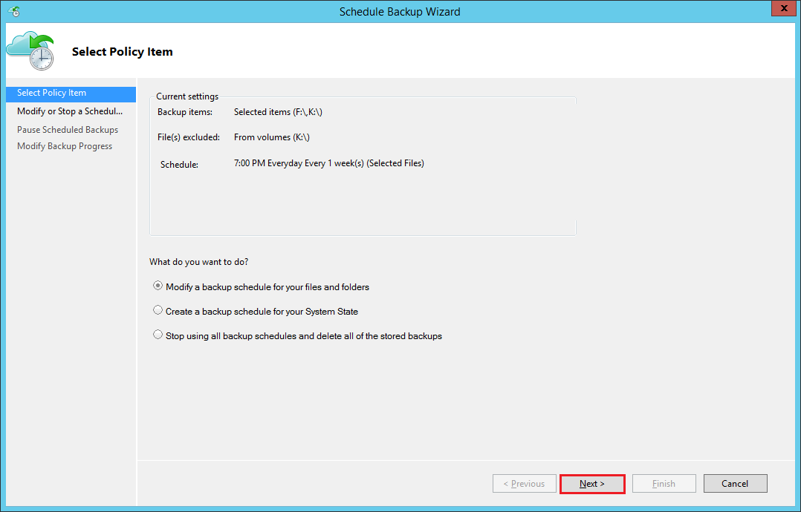
1. From the **Modify or Stop a Scheduled Backup** page, select **Stop using this backup schedule, but keep the stored backups until a schedule is activated again**. Then, select **Next**.

    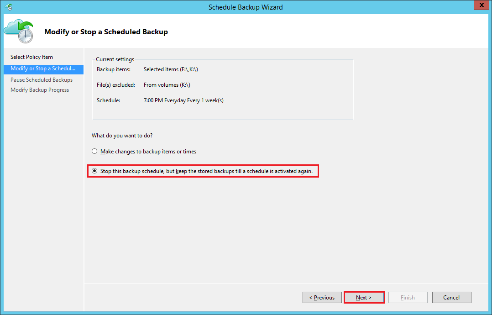
1. In **Pause Scheduled Backup**, review the information and select **Finish**.

    
1. In **Modify backup progress**, check your schedule backup pause is in success status and select **close** to finish.

### Stop protection and delete backup data

1. Open the MARS management console, go to the **Actions** pane, and select **Schedule Backup**.
2. From the **Modify or Stop a Scheduled Backup** page, select **Stop using this backup schedule and delete all the stored backups**. Then, select **Next**.

    

3. From the **Stop a Scheduled Backup** page, select **Finish**.

    
4. You're prompted to enter a security PIN (personal identification number), which you must generate manually. To do this, first sign in to the Azure portal.
5. Go to **Recovery Services vault** > **Settings** > **Properties**.
6. Under **Security PIN**, select **Generate**. Copy this PIN. The PIN is valid for only five minutes.
7. In the management console, paste the PIN, and then select **OK**.

    

8. In the **Modify Backup Progress** page, the following message appears: *Deleted backup data will be retained for 14 days. After that time, backup data will be permanently deleted.*  

    

After you delete the on-premises backup items, follow the next steps from the portal.

## Re-enable protection

If you stopped protection while retaining data and decided to resume protection, then you can re-enable the backup schedule using modify backup policy.

1. On **Actions** select **Schedule backup**.
1. Select **Re-enable backup schedule. You can also modify backup items or times** and select **Next**. 

    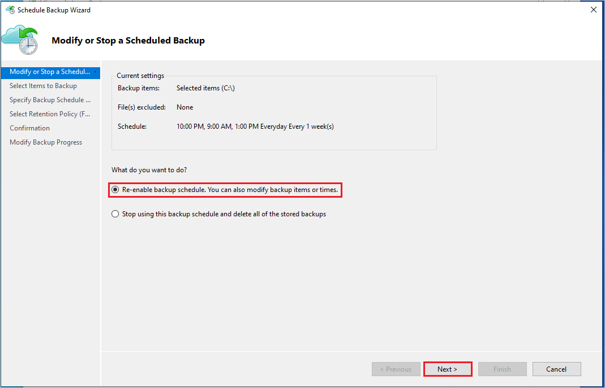
1. In **Select Items to Backup**, select **Next**.

    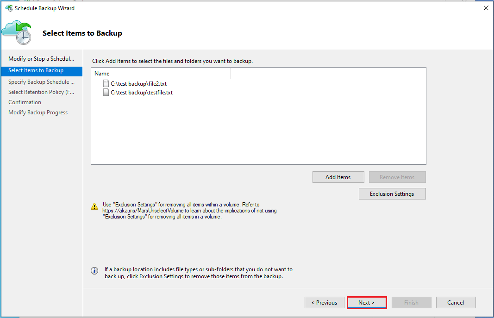
1. In **Specify Backup Schedule**, specify the backup schedule and select **Next**.
1. In **Select Retention Policy**, specify retention duration and select **Next**.
1. Finally in the **Confirmation** screen, review the policy details and select **Finish**.

## Re-generate passphrase

A passphrase is used to encrypt and decrypt data while backing up or restoring your on-premises or local machine using the MARS agent to or from Azure. If you lost or forgot the passphrase, then you can regenerate the passphrase (provided your machine is still registered with the Recovery Services vault and the backup is configured) by following these steps:

1. From the MARS agent console, go to **Actions Pane** > **Change properties** >. Then go to **Encryption tab**. 
1. Select **Change Passphrase** checkbox. 
1. Enter a new passphrase or select **Generate Passphrase**.
1. Select **Browse** to save the new passphrase.

    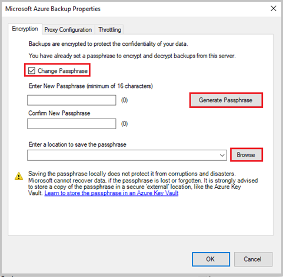

1. Select **OK** to apply changes.  If the [Security Feature](./backup-azure-security-feature.md#enable-security-features) is enabled on the Azure portal for the Recovery Services vault, then you'll be prompted to enter the Security PIN. To receive the PIN, follow the steps listed in this [article](./backup-azure-security-feature.md#authentication-to-perform-critical-operations). 
1. Paste the security PIN from the portal and select **OK** to apply the changes. 

    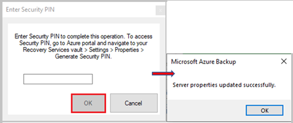
1. Ensure that the passphrase is securely saved in an alternate location (other than the source machine), preferably in the Azure Key Vault. Keep track of all the passphrases if you have multiple machines being backed up with the MARS agents.

## Validate passphrase

From MARS agent version 2.0.9190.0 and later, you must validate your passphrase to ensure it meets the [updated requirements](./backup-azure-file-folder-backup-faq.yml#what-characters-are-allowed-for-the-passphrase-).

To validate your passphrase, follow these steps:

1. Open the MARS console.

   A message displays at the top asking  you to validate the passphrase. 

1. Click **Validate**.

   :::image type="content" source="./media/backup-azure-manage-mars/validate-passphrase-prompt-inline.png" alt-text="Screenshot shows the prompt for passphrase validation." lightbox="./media/backup-azure-manage-mars/validate-passphrase-prompt-expanded.png":::

   The passphrase validator opens and prompts for the current passphrase. If the passphrase doesn’t meet the updated requirements, an option to regenerate the passphrase appears.

1. Generate the passphrase with the following details:

   - A new passphrase that meets the requirements.
   - A Security PIN (see [the steps to generate the Security PIN](#generate-security-pin)).
   - A secure location on the server to save the newly generated passphrase.

   :::image type="content" source="./media/backup-azure-manage-mars/generate-passphrase.png" alt-text="Screenshot shows the process to generate passphrase with the required details.":::

### Validate passphrase for DPM/MABS agent

For DPM/MABS, execute the passphrase validation tool from an elevated command prompt.
   
You can find the tool in one of the following locations:

- **System Center Data Protection Manager**
     
  %ProgramFiles%\Microsoft Azure Recovery Services Agent\bin\PassphraseValidator.exe

- **Microsoft Azure Backup Server**
      
  %ProgramFiles%\Microsoft Azure Backup Server\DPM\MARS\Microsoft Azure Recovery Services Agent\bin\PassphraseValidator.exe

The passphrase validator opens and prompts for the current passphrase. If the passphrase doesn’t meet the updated requirements, regenerate the passphrase.
   
:::image type="content" source="./media/backup-azure-manage-mars/passphrase-validator-prompts-for-current-passphrase.png" alt-text="Screenshot shows passphrase validator prompts for the current passphrase.":::

Use the following steps:

1. From the management console, navigate to the **Management** tab, and select **Online** -> **Configure**.
1. Follow the **Configure Subscription Settings Wizard**, and at the **Encryption Setting** step, provide the updated passphrase.

:::image type="content" source="./media/backup-azure-manage-mars/configure-subscription-settings-wizard.png" alt-text="Screenshot show the process to provide passphrase following the Configure Subscription Settings Wizard.":::

## Generate Security PIN

1. Go to **Recovery Services vault** -> **Settings** -> **Properties**.
1. Under **Security PIN**, select **Generate**.
 
Copy the PIN. The PIN is valid for only five minutes.

## Managing backup data for unavailable machines

This section discusses a scenario where your source machine that was protected with MARS is no longer available because it was deleted, corrupted, infected with malware/ransomware, or decommissioned.

For these machines, the Azure Backup service ensures that the latest recovery point with the longest retention doesn't expire (that is, doesn't get pruned) according to the retention rules specified in the backup policy. Therefore, you can safely restore the machine using this RP.  Consider the following scenarios you can perform on the backed-up data:

### Scenario 1: The source machine is unavailable, and you no longer need to retain backup data

- You can delete the backed-up data from the Azure portal using the steps listed in [this article](backup-azure-delete-vault.md#delete-protected-items-on-premises).

### Scenario 2: The source machine is unavailable, and you need to retain backup data

Managing the backup policy for MARS is done through the MARS console and not through the portal. If you need to extend retention settings for existing recovery points before they expire, then you need to restore the machine, install the MARS console, and extend the policy.

- To restore the machine, perform the following steps:
  1. [Restore the VM to an alternate target machine](backup-azure-restore-windows-server.md#use-instant-restore-to-restore-data-to-an-alternate-machine)
  1. Recreate the target machine with same host name as the source machine
  1. Install the agent and re-register to the same vault and with the same passphrase
  1. Launch the MARS client to extend the retention duration according to your requirements
- Your newly restored machine, protected with MARS, will continue to take backups.  

## Configuring antivirus for the MARS agent

We recommend the following configuration for your antivirus software to avoid conflicts with the operation of the MARS Agent.

1. **Add Path Exclusions**: To avoid degradation of performance and possible conflicts, exclude the following paths from real-time monitoring by the antivirus software:
    1. `%ProgramFiles%\Microsoft Azure Recovery Services Agent` and subfolders
    1. **Scratch folder**: If the scratch folder isn't in the standard location, add that to the exclusions as well.  [See here for steps](backup-azure-file-folder-backup-faq.yml#how-to-check-if-scratch-folder-is-valid-and-accessible-) to determine the scratch folder location.
1. **Add Binary Exclusions**: To avoid degradation of backup and console activities, exclude processes for the following binaries from real-time monitoring by the antivirus software:
    1. `%ProgramFiles%\Microsoft Azure Recovery Services Agent\bin\cbengine.exe`

>[!NOTE]
>While excluding these paths will be sufficient for most antivirus software, some may still continue to interfere with MARS Agent operations. If you are seeing unexpected failures, uninstall the antivirus software temporarily and monitor to see if the problem goes away. If this resolves the issue, contact your antivirus software vendor for assistance with proper configuration of their product.

## Monitor using Backup Reports

Azure Backup provides a reporting solution that uses Azure Monitor logs and Azure workbooks. To get started, you must have [Backup Reports configured](configure-reports.md) for your vault. Once configured, data begins to flow into the workspace and can be queried using the backup reports.

To monitor backup data usage and daily churn, follow these steps:

1. Navigate to the **Overview** pane of the vault and click **Backup Reports**.

1. In the **Backup Report** blade, under the **Overview** section, select the configured log analytics workspace. 

1. Set the report filter **Backup Solution** to **Azure Backup Agent** to view MARS agent backups only. 

   Set **Subscription Name**, **Vault Location**, and **Vault Name** as applicable.
 
    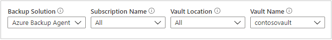

1. To view the usage by billed entity, navigate to the **Usage** tab. 

   The total protected instances billed. and the storage usage data are displayed. You can also see the trend information.
 
    

1. To view the average backup data added by backup jobs for each volume in the protected server, navigate to the **Jobs** tab. 
 
    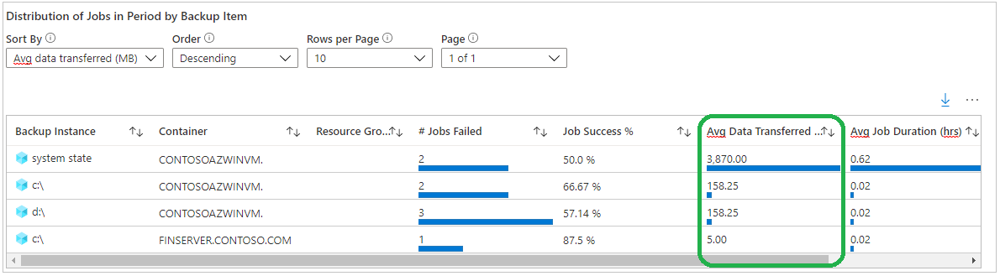

Learn more about [other report tabs](configure-reports.md) and receiving those [reports through email](backup-reports-email.md).

## Next steps

- For information about supported scenarios and limitations, refer to the [Support Matrix for the MARS Agent](./backup-support-matrix-mars-agent.md).
- Learn more about [On demand backup policy retention behavior](backup-windows-with-mars-agent.md#set-up-on-demand-backup-policy-retention-behavior).
- For more frequently asked questions, see the [MARS agent FAQ](backup-azure-file-folder-backup-faq.yml).
