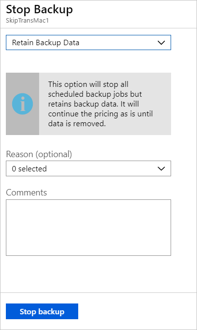
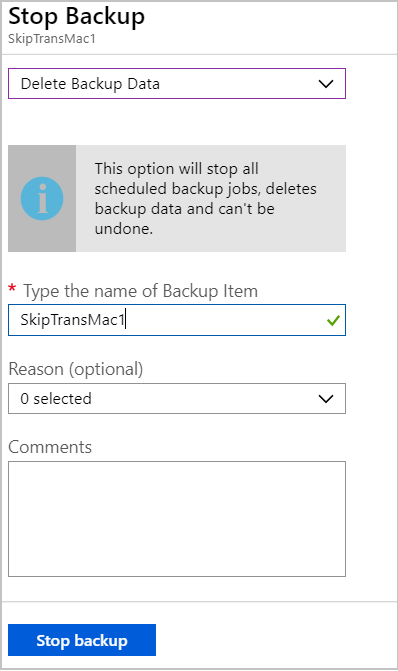

# Manage Microsoft Azure Recovery Services Agent backups by using the Azure Backup service

This article describes how to manage Files and Folder that are backed up by using Microsoft Azure Recovery Services Agent.

## Create a backup policy

The backup policy specifies when to take snapshots of the data to create recovery points and how long to retain recovery points.

- You configure a backup policy using the MARS agent.
- Azure Backup does not support automatic adjustment of clock for daylight savings time (DST). You have to modify the policy to ensure day light saving is taken into account to prevent discrepancy between the actual time and scheduled backup time.

Create a policy as follows:
1. After downloading and registering MARS agent launch it where it is installed. You can find it by searching your machine for **Microsoft Azure Backup**. This has to be done on each machine where the agent is installed. 
2. In **Actions**, click **Schedule Backup**.

    
3. In the Schedule Backup Wizard >  **Getting started**, click **Next**.
4. In **Select Items to Backup**, click **Add Items**.

    

5. In **Select Items**, select what you want to back up and click **OK**.

    

6. In **Select Items to Backup** page, click **Next**.
7. In **Specify Backup Schedule** page, specify when you want to take daily or weekly backups. Then click **Next**.

    - A recovery point is created when a backup is taken.
    - The number of recovery points created in your environment is dependent upon your backup schedule.

8. You can schedule daily backups, up to three times a day. For example, the screenshot shows two daily backups, one at midnight and one at 6pm.

    

9. You can run weekly backups too. For example, the screenshot shows backups taken every alternate Sunday & Wednesday at 9:30AM and 1:00AM.

    

10. On the **Select Retention Policy** page, specify how you store historical copies of your data. Then click **Next**.

    - Retention settings specify which recovery points should be stored, and how long they should be stored for.
    - For example, when you set a daily retention setting, you indicate that at the time specified for the daily retention, the latest recovery point will be retained for the specified number of days. Or, as another example, you could specify a monthly retention policy to indicate that the recovery point created on the 30th of every month should be stored for 12 months.
    - Daily and weekly recovery point retention usually coincides with the backup schedule. Meaning that when the backup is triggered according to schedule, the recovery point created by the backup is stored for the duration indicated in the daily or weekly retention policy.
    - As an example, in the following screenshot:
             - Daily backups at midnight and 6 PM are kept for seven days.
             - Backups taken on a Saturday at midnight and 6 PM are kept for 4 weeks.
            - Backups taken on Saturday on the last week of the month at midnight and 6 PM are kept for 12 months. - Backups taken on a Saturday in the last week of March are kept for 10 years.

   

11. In **Choose Initial Backup Type** specify how to take the initial backup, over the network or offline and click **Next**.

  

10. In **Confirmation**, review the information, and then click **Finish**.

  

11. After the wizard finishes creating the backup schedule, click **Close**.

  

## View VMs on the dashboard

To view VMs on the vault dashboard:

1. Sign in to the [Azure portal](https://portal.azure.com/).
2. On the Hub menu, select **Browse**. In the list of resources, type **Recovery Services**. As you type, the list is filtered based on your input. Select **Recovery Services vaults**.

    

3. For ease of use, right-click the vault and select **Pin to dashboard**.
4. Open the vault dashboard.

    

5. On the **Backup Items** tile, select **Azure Virtual Machines**.

    

6. On the **Backup Items** blade, you can view the list of protected VMs. In this example, the vault protects one virtual machine: demobackup.  

    

7. From the vault item's dashboard, modify backup policies, run an on-demand backup, stop or resume protection of VMs,  delete backup data, view restore points, and run a restore.

    

## Manage backup policy for a VM

To manage a backup policy:

1. Sign in to the [Azure portal](https://portal.azure.com/). Open the vault dashboard.
2. On the **Backup Items** tile, select **Azure Virtual Machines**.

    

3. On the **Backup Items** blade, you can view the list of protected VMs and last backup status with latest restore points time.

    

4. From the vault item's dashboard, you can select a backup policy.

   * To switch policies, select a different policy and then select **Save**. The new policy is immediately applied to the vault.

     

## Run an on-demand backup
You can run an on-demand backup of a VM after you set up its protection. Keep these details in mind:

- If the initial backup is pending, on-demand backup creates a full copy of the VM in the Recovery Services vault.
- If the initial backup is complete, an on-demand backup will only send changes from the previous snapshot to the Recovery Services vault. That is, later backups are always incremental.
- The retention range for an on-demand backup is the retention value that you specify when you trigger the backup.

To trigger an on-demand backup:

1. On the [vault item dashboard](#view-vms-on-the-dashboard), under **Protected Item**, select **Backup Item**.

    

2. From **Backup Management Type**, select **Azure Virtual Machine**. The **Backup Item (Azure Virtual Machine)** blade appears.
3. Select a VM and select **Backup Now** to create an on-demand backup. The **Backup Now** blade appears.
4. In the **Retain Backup Till** field, specify a date for the backup to be retained.

    

5. Select **OK** to run the backup job.

To track the job's progress, on the vault dashboard, select the **Backup Jobs** tile.

## Stop protecting a VM

There are two ways to stop protecting a VM:

* **Stop protection and retain backup data**. This option will stop all future backup jobs from protecting your VM; however, Azure Backup service will retain the recovery points that have been backed up.  You'll need to pay to keep the recovery points in the vault (see [Azure Backup pricing](https://azure.microsoft.com/pricing/details/backup/) for details). You'll be able to restore the VM if needed. If you decide to resume VM protection, then you can use *Resume backup* option.
* **Stop protection and delete backup data**. This option will stop all future backup jobs from protecting your VM and delete all the recovery points. You won't be able to restore the VM nor use *Resume backup* option.

>[!NOTE]
>If you delete a data source without stopping backups, new backups will fail. Old recovery points will expire according to the policy, but one last recovery point will always be kept until you stop the backups and delete the data.
>

### Stop protection and retain backup data

To stop protection and retain data of a VM:

1. On the [vault item's dashboard](#view-vms-on-the-dashboard), select **Stop backup**.
2. Choose **Retain Backup Data**, and confirm your selection as needed. Add a comment if you want. If you aren't sure of the item's name, hover over the exclamation mark to view the name.

    

A notification lets you know that the backup jobs have been stopped.

### Stop protection and delete backup data

To stop protection and delete data of a VM:

1. On the [vault item's dashboard](#view-vms-on-the-dashboard), select **Stop backup**.
2. Choose **Delete Backup Data**, and confirm your selection as needed. Enter the name of the backup item and add a comment if you want.

    

## Resume protection of a VM

If you had chosen [Stop protection and retain backup data](#stop-protection-and-retain-backup-data) option during stop VM protection, then you can use **Resume backup**. This option is not available if you choose [Stop protection and delete backup data](#stop-protection-and-delete-backup-data) option or [Delete backup data](#delete-backup-data).

To resume protection for a VM:

1. On the [vault item's dashboard](#view-vms-on-the-dashboard), select **Resume backup**.

2. Follow the steps in [Manage backup policies](#manage-backup-policy-for-a-vm) to assign the policy for the VM. You don't need to choose the VM's initial protection policy.
3. After you apply the backup policy to the VM, you see the following message:

    

## Delete backup data

There are two ways to delete a VM's backup data:

- From the vault item dashboard, select Stop backup and follow the instructions for [Stop protection and delete backup data](#stop-protection-and-delete-backup-data) option.

  

- From the vault item dashboard, select Delete backup data. This option is enabled if you had chosen to [Stop protection and retain backup data](#stop-protection-and-retain-backup-data) option during stop VM protection

  

  - On the [vault item dashboard](#view-vms-on-the-dashboard), select **Delete backup data**.
  - Type the name of the backup item to confirm that you want to delete the recovery points.

    

  - To delete the backup data for the item, select **Delete**. A notification message lets you know that the backup data has been deleted.

  > [!NOTE]
  > When you delete backup data you delete all associated recovery points. You can't choose specific recovery points to delete.

### Backup item where primary data source no longer exists

- If Azure VMs configured for Azure backup are either deleted or moved without stopping protection, then both scheduled backup jobs and on demand (ad-hoc) backup jobs will fail with the error UserErrorVmNotFoundV2. The backup pre-check will appear as critical only for failed ad-hoc backup jobs (failed scheduled jobs are not displayed). 
- These backup items remain active in the system adhering to the backup and retention policy set by the user. The backed-up data for these Azure VMs will be retained according to the retention policy. The expired recovery points (except the last recovery point) are cleaned according to the retention range set in the backup policy.
- Users are recommended to delete the backup items where the primary data source no longer exists to avoid any additional cost, if the backup item/data for the delete resources is no longer required as the last recovery point is retained forever and the user is charged as per the backup pricing applicable.

## Next steps
- Learn how to [back up Azure VMs from the VM's settings](backup-azure-vms-first-look-arm.md).
- Learn how to [restore VMs](backup-azure-arm-restore-vms.md).
- Learn how to [monitor Azure VM backups](backup-azure-monitor-vms.md).
