<properties
	pageTitle="Manage and monitor Azure virtual machine backups | Microsoft Azure"
	description="Learn how to manage and monitor an Azure virtual machine backups"
	services="backup"
	documentationCenter=""
	authors="trinadhk"
	manager="shreeshd"
	editor=""/>

<tags
	ms.service="backup"
	ms.workload="storage-backup-recovery"
	ms.tgt_pltfrm="na"
	ms.devlang="na"
	ms.topic="article"
	ms.date="06/03/2016"
	ms.author="trinadhk; jimpark; markgal;"/>

# Manage and monitor Azure virtual machine backups

> [AZURE.SELECTOR]
- [Manage Azure VM backups](backup-azure-manage-vms.md)
- [Manage Classic VM backups](backup-azure-manage-vms-classic.md)

This article provides information about common management and monitoring tasks for Classic-model virtual machines protected in Azure.  

>[AZURE.NOTE] Azure has two deployment models for creating and working with resources: [Resource Manager and Classic](../resource-manager-deployment-model.md). See [Prepare your environment to back up Azure virtual machines](backup-azure-vms-prepare.md) for details on working with Classic deployment model VMs.

## Manage protected virtual machines

To manage protected virtual machines:

1. To view and manage backup settings for a virtual machine click the **Protected Items** tab.

2. Click on the name of a protected item to see the **Backup Details** tab, which shows you information about the last backup.

    

3. To view and manage backup policy settings for a virtual machine click the **Policies** tab.

    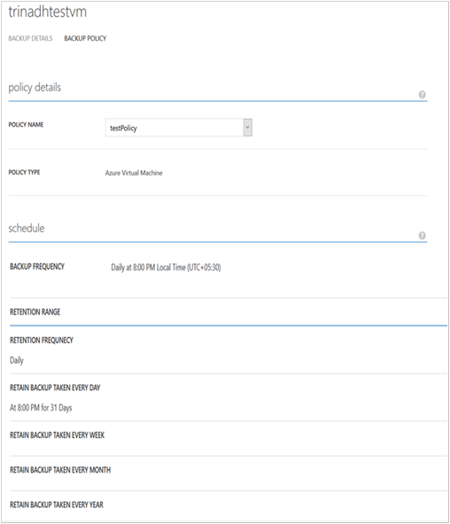

    The **Backup Policies** tab shows you the existing policy. You can modify as needed. If you need to create a new policy click **Create** on the **Policies** page. Note that if you want to remove a policy it shouldn't have any virtual machines associated with it.

    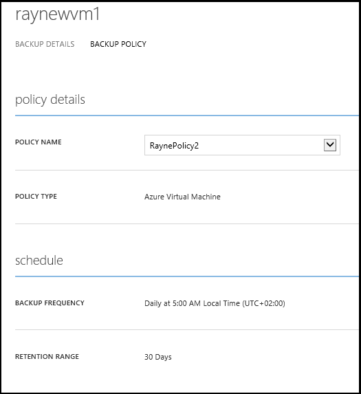

4. You can get more information about actions or status for a virtual machine on the **Jobs** page. Click a job in the list to get more details, or filter jobs for a specific virtual machine.

    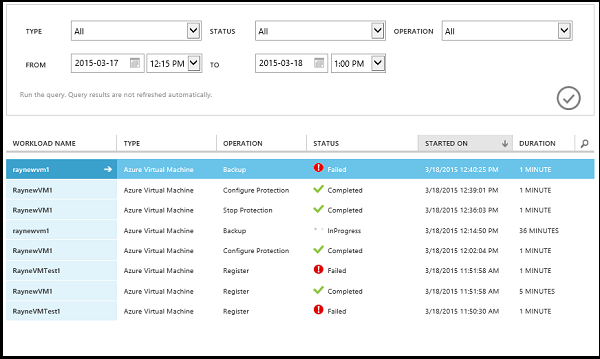

## On-demand backup of a virtual machine
You can take an on-demand backup of a virtual machine once it is configured for protection. If the initial backup is pending for the virtual machine, on-demand backup will create a full copy of the virtual machine in Azure backup vault. If first backup is completed, on-demand backup will only send changes from previous backup to Azure backup vault i.e. it is always incremental.

>[AZURE.NOTE] Retention range of an on-demand backup is set to retention value specified for Daily retention in backup policy corresponding to the VM.  

To take an on-demand backup of a virtual machine:

1. Navigate to the **Protected Items** page and select **Azure Virtual Machine** as **Type** (if not already selected) and click on **Select** button.

    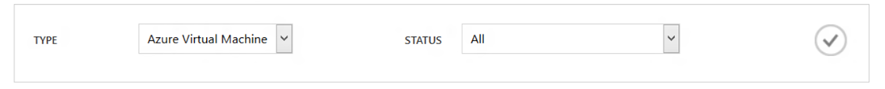

2. Select the virtual machine on which you want to take an on-demand backup and click on **Backup Now** button at the bottom of the page.

    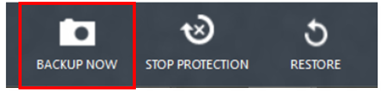

    This will create a backup job on the selected virtual machine. Retention range of recovery point created through this job will be same as that specified in the policy associated with the virtual machine.

    

    >[AZURE.NOTE] To view the policy associated with a virtual machine, drill down into virtual machine in the **Protected Items** page and go to backup policy tab.

3. Once the job is created, you can click on **View job** button in the toast bar to see the corresponding job in the jobs page.

    

4. After successful completion of the job, a recovery point will be created which you can use to restore the virtual machine. This will also increment the recovery point column value by 1 in **Protected Items** page.

## Stop protecting virtual machines
You can choose to stop the future backups of a virtual machine with the following options:

- Retain backup data associated with virtual machine in Azure Backup vault
- Delete backup data associated with virtual machine

If you have selected to retain backup data associated with virtual machine, you can use the backup data to restore the virtual machine. For pricing details for such virtual machines, click [here](https://azure.microsoft.com/pricing/details/backup/).

To Stop protection for a virtual machine:

1. Navigate to **Protected Items** page and select **Azure virtual machine** as the filter type (if not already selected) and click on **Select** button.

    

2. Select the virtual machine and click on **Stop Protection** at the bottom of the page.

    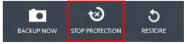

3. By default, Azure Backup doesn’t delete the backup data associated with the virtual machine.

    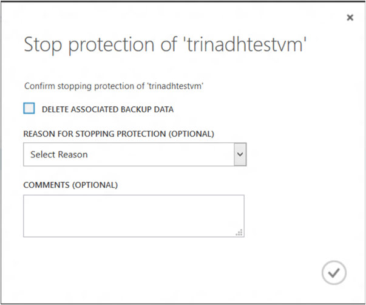

    If you want to delete backup data, select the check box.

    

    Please select a reason for stopping the backup. While this is optional, providing a reason will help Azure Backup to work on the feedback and prioritize the customer scenarios.

4. Click on **Submit** button to submit the **Stop protection** job. Click on **View Job** to see the corresponding the job in **Jobs** page.

    

    If you have not selected **Delete associated backup data** option during **Stop Protection** wizard, then post job completion, protection status changes to **Protection Stopped**. The data remains with Azure Backup until it is explicitly deleted. You can always delete the data by selecting the virtual machine in the **Protected Items** page and clicking **Delete**.

    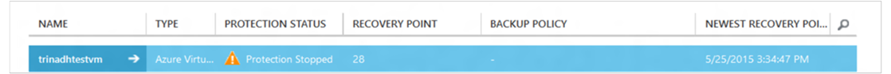

    If you have selected the **Delete associated backup data** option, the virtual machine won’t be part of the **Protected Items** page.

## Re-protect Virtual machine
If you have not selected the **Delete associate backup data** option in **Stop Protection**, you can re-protect the virtual machine by following the steps similar to backing up registered virtual machines. Once protected, this virtual machine will have backup data retained prior to stop protection and recovery points created after re-protect.

After re-protect, the virtual machine’s protection status will be changed to **Protected** if there are recovery points prior to **Stop Protection**.

  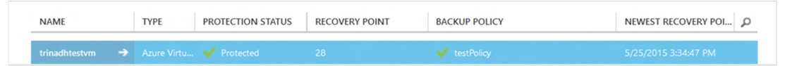

>[AZURE.NOTE] When re-protecting the virtual machine, you can choose a different policy than the policy with which virtual machine was protected initially.

## Unregister virtual machines

If you want to remove the virtual machine from the backup vault:

1. Click on the **UNREGISTER** button at the bottom of the page.

    

    A toast notification will appear at the bottom of the screen requesting confirmation. Click **YES** to continue.

    

## Delete Backup data
You can delete the backup data associated with a virtual machine, either:

- During Stop Protection Job
- After a stop protection job is completed on a virtual machine

To delete backup data on a virtual machine, which is in the *Protection Stopped* state post successful completion of a **Stop Backup** job:

1. Navigate to the **Protected Items** page and select **Azure Virtual Machine** as *type* and click the **Select** button.

    

2. Select the virtual machine. The virtual machine will be in **Protection Stopped** state.

    

3. Click the **DELETE** button at the bottom of the page.

    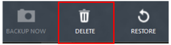

4. In the **Delete backup data** wizard, select a reason for deleting backup data (highly recommended) and click **Submit**.

    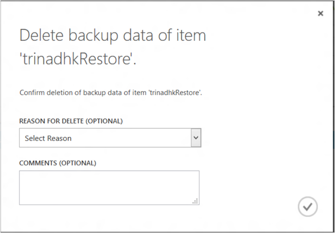

5. This will create a job to delete backup data of selected virtual machine. Click **View job** to see corresponding job in Jobs page.

    

    Once the job is completed, the entry corresponding to the virtual machine will be removed from **Protected items** page.

## Dashboard
On the **Dashboard** page you can review information about Azure virtual machines, their storage, and jobs associated with them in the last 24 hours. You can view backup status and any associated backup errors.

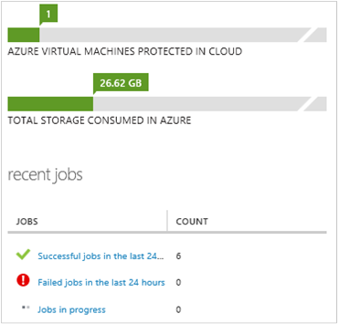

>[AZURE.NOTE] Values in the dashboard are refreshed once every 24 hours.

## Auditing Operations
Azure backup provides review of the "operation logs" of backup operations triggered by the customer making it easy to see exactly what management operations were performed on the backup vault. Operations logs enable great post-mortem and audit support for the backup operations.

The following operations are logged in Operation logs:

- Register
- Unregister
- Configure protection
- Backup ( Both scheduled as well as on-demand backup through BackupNow)
- Restore
- Stop protection
- Delete backup data
- Add policy
- Delete policy
- Update policy
- Cancel job

To view operation logs corresponding to a backup vault:

1. Navigate to **Management services** in Azure portal, and then click the **Operation Logs** tab.

    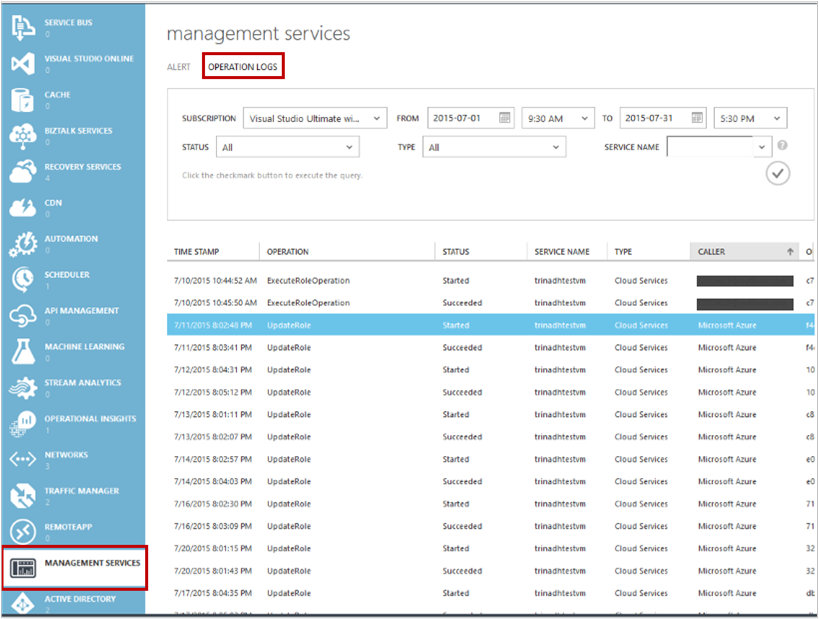

2. In the filters, select **Backup** as *Type* and specify the backup vault name in *service name* and click on **Submit**.

    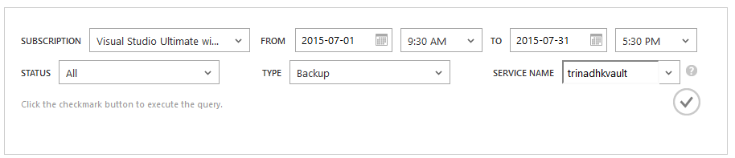

3. In the operations logs, select any operation and click  **Details** to see details corresponding to an operation.

    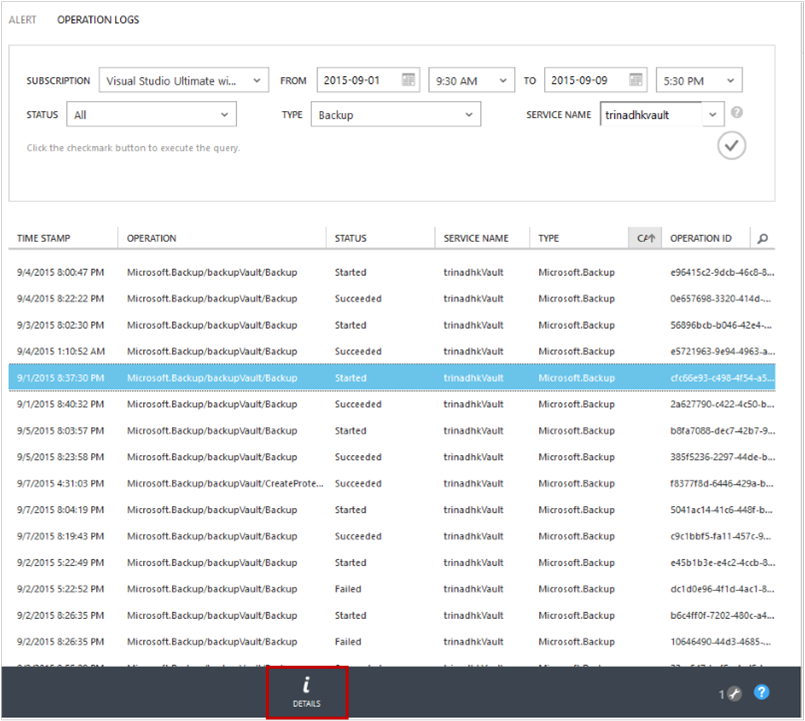

    The **Details wizard** contains information about the operation triggered, job Id, resource on which this operation is triggered, and start time of the operation.

    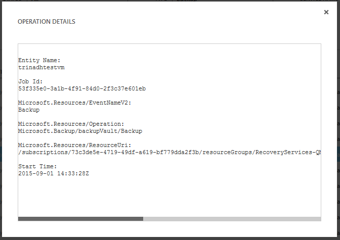

## Alert notifications
You can get custom alert notifications for the jobs in portal. This is achieved by defining PowerShell-based alert rules on operational logs events. We recommend using *PowerShell version 1.3.0 or above*.

To define a custom notification to alert for backup failures, a sample command will look like:

```
PS C:\> $actionEmail = New-AzureRmAlertRuleEmail -CustomEmail contoso@microsoft.com
PS C:\> Add-AzureRmLogAlertRule -Name backupFailedAlert -Location "East US" -ResourceGroup RecoveryServices-DP2RCXUGWS3MLJF4LKPI3A3OMJ2DI4SRJK6HIJH22HFIHZVVELRQ-East-US -OperationName Microsoft.Backup/backupVault/Backup -Status Failed -TargetResourceId /subscriptions/86eeac34-eth9a-4de3-84db-7a27d121967e/resourceGroups/RecoveryServices-DP2RCXUGWS3MLJF4LKPI3A3OMJ2DI4SRJK6HIJH22HFIHZVVELRQ-East-US/providers/microsoft.backupbvtd2/BackupVault/trinadhVault -Actions $actionEmail
```

**ResourceId**: You can get this from Operations Logs popup as described in above section. ResourceUri in details popup window of an operation is the ResourceId to be supplied for this cmdlet.

**OperationName**: This will be of the format "Microsoft.Backup/backupvault/<EventName>" where EventName is one of Register,Unregister,ConfigureProtection,Backup,Restore,StopProtection,DeleteBackupData,CreateProtectionPolicy,DeleteProtectionPolicy,UpdateProtectionPolicy

**Status**: Supported values are- Started, Succeeded and Failed.

**ResourceGroup**:ResourceGroup of the resource on which operation is triggered. You can obtain this from ResourceId value. Value between fields */resourceGroups/* and */providers/* in ResourceId value is the value for ResourceGroup.

**Name**: Name of the Alert Rule.

**CustomEmail**: Specify the custom email address to which you want to send alert notification

**SendToServiceOwners**: This option sends alert notification to all administrators and co-administrators of the subscription. It can be used in **New-AzureRmAlertRuleEmail** cmdlet

### Limitations on Alerts
Event-based alerts are subjected to the following limitations:

1. Alerts are triggered on all virtual machines in the backup vault. You cannot customize it to get alerts for specific set of virtual machines in a backup vault.
2. This feature is in Preview. [Learn more](../azure-portal/insights-powershell-samples.md#create-alert-rules)
3. You will receive alerts from "alerts-noreply@mail.windowsazure.com". Currently you can't modify the email sender.

## Next steps

- [Restore Azure VMs](backup-azure-restore-vms.md)
