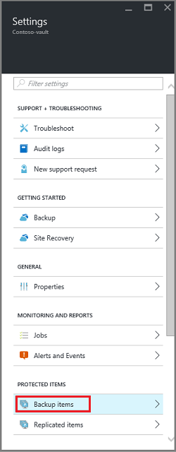
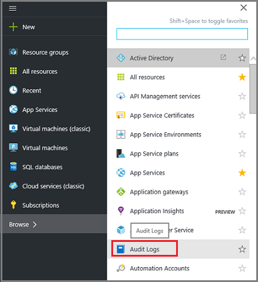
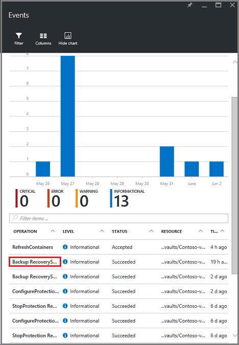
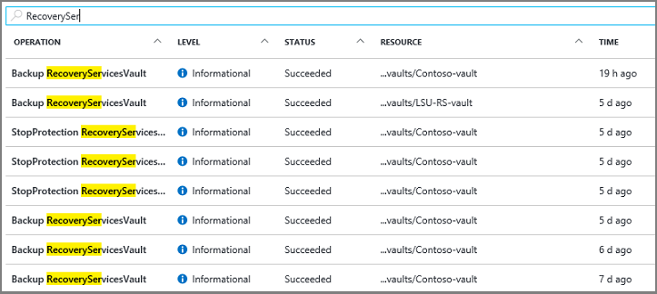
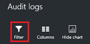
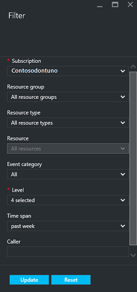
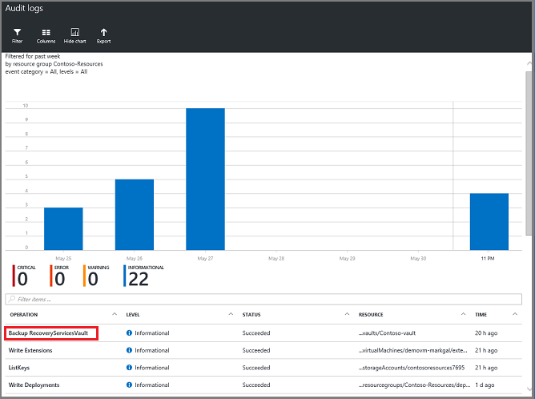
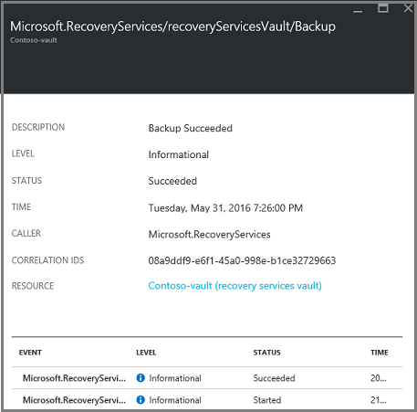

<properties
	pageTitle="Manage and monitor ARM virtual machine backups | Microsoft Azure"
	description="Learn how to manage and monitor ARM virtual machine backups"
	services="backup"
	documentationCenter=""
	authors="trinadhk"
	manager="shreeshd"
	editor=""/>

<tags
	ms.service="backup"
	ms.workload="storage-backup-recovery"
	ms.tgt_pltfrm="na"
	ms.devlang="na"
	ms.topic="article"
	ms.date="06/01/2016"
	ms.author="jimpark; markgal;"/>

# Manage and monitor Azure virtual machine backups

> [AZURE.SELECTOR]
- [Manage Azure VM backups](backup-azure-manage-vms.md)
- [Manage Classic VM backups](backup-azure-manage-vms-classic.md)

This article provides guidance on how to manage the backups for your virtual machines (VM), as well as explain the backup information available in the portal dashboard. The guidance in this article applies to using VMs with Recovery Services vaults. This article does not cover the creation of VMs. For a primer on protecting Azure Resource Manager (ARM)-deployed VMs in Azure with a Recovery Services vault, see [First look: Back up ARM VMs to a Recovery Services vault](backup-azure-vms-first-look-arm.md).   

## Manage protected virtual machines

In the Azure portal, the Recovery Services vault dashboard provides access to all information about the vault including:

- the most recent backup snapshot, which is also the latest restore point <br\>
- the backup policy <br\>
- total size of all backup snapshots <br\>
- number of virtual machines that are protected with the vault <br\>

Many management tasks with a virtual machine backup begins with opening the vault in the dashboard. However, you will need to open the individual vault in the vault item dashboard, to execute the tasks. The following procedure shows you how to open the vault item dashboard.

To open a Recovery Services vault in the dashboard:

1. Sign in to the [Azure portal](https://portal.azure.com/).

2. On the Hub menu, click **Browse** and in the list of resources, type **Recovery Services**. As you begin typing, the list will filter based on your input. Click **Recovery Services vault**.

     <br/>

    The list of Recovery Services vaults are displayed.

     <br/>

3. From the list of vaults, select the vault to open its dashboard. When you select the vault, the vault dashboard and the **Settings** blade open.

    

4. In the **Settings** blade, click **Backup Items** to open that blade.

    

    Use the drop-down menu to choose the type of items that are displayed. You can choose between a list of Files and folders, or Azure Virtual Machines. The **Backup Items** blade lists the last backup job for each item. In this example, there is one virtual machine, demovm-markgal, protected by this vault.  

    

    >[AZURE.TIP] If you have multiple blades open, you can use the dark-blue slider at the bottom of the window to slide back to the dashboard or the vault list.

    

5. In the **Backup Items** blade, click the item to open the vault item dashboard.

    

    The dashboard and its **Settings** blade opens.

    

    From the vault item dashboard, you can accomplish many key management tasks, such as:

    - change policies or create a new backup policy<br\>
	- view restore points, and see their consistency state <br\>
	- on-demand back up of a virtual machine <br\>
	- stop protecting virtual machines <br\>
	- resume protection of a virtual machine <br\>
	- delete a backup data (or recovery point) <br\>
	- [restore a backup (or recovery point)](./backup-azure-arm-restore-vms.md#restore-a-recovery-point)  <br\>

The details for accomplishing each of these tasks, follows. For each task, you will need to start the procedure from the vault item dashboard (as noted in the procedure).

### Change policies or Create a new backup policy

1. On the vault item dashboard, click **All Settings** to open the **Settings** blade.

    

2. On the **Settings** blade, click **Backup policy** to open that blade.

    On the blade, the backup frequency and retention range details are shown.

    

3. From the **Choose backup policy** menu:
    - To change policies, select a different policy and click **Save**. The new policy is immediately applied to the vault. <br\>
    - To create a new policy, select **Create New**.

    

    For instructions on creating a backup policy, see [Defining a backup policy](backup-azure-manage-vms.md#defining-a-backup-policy).


## On-demand backup of a virtual machine
You can take an on-demand backup of a virtual machine once it is configured for protection. If the initial backup is pending for the virtual machine, on-demand backup will create a full copy of the virtual machine in the Recovery Services vault. If the initial backup is completed, an on-demand backup will only send changes from the previous snapshot, to the Recovery Services vault i.e. it is always incremental.

>[AZURE.NOTE] The retention range for an on-demand backup is the retention value specified for the Daily backup point in the policy. If no Daily backup point is selected, then the weekly backup point is used.

To trigger an on-demand backup of a virtual machine:

1. On the vault item dashboard, click **Backup now**.

    

    The portal makes sure that you want to start an on-demand backup job. Click **Yes** to start the backup job.

    

    The backup job creates a new recovery point. The retention range of the recovery point created is the same as that specified in the policy associated with the virtual machine. To track the progress for the job, in the vault dashboard, click the **Backup Jobs** tile.  


## Stop protecting virtual machines
If you choose to stop protecting a virtual machine, you are asked if you want to retain the recovery points. There are two ways to stop protecting virtual machines: stop all future backup jobs and delete all recovery points, or stop all future backup jobs but leave the recovery points. There is a cost associated with leaving the recovery points in storage. However, the benefit of leaving the recovery points is you can restore the virtual machine later, if desired. For pricing details for such virtual machines, click [here](https://azure.microsoft.com/pricing/details/backup/). If you choose to delete all recovery points, there is no option for restoring the virtual machine.

To stop protection for a virtual machine:

1. On the vault item dashboard, click **Stop backup**.

    

    The Stop Backup blade opens.

    

2. On the **Stop Backup** blade, choose whether to retain or delete the backup data. The information box provides details about your choice.

    

3. If you chose to retain backup data, skip to the step 4. If you chose to delete backup data, confirm that you want to stop the backup jobs and delete the recovery points - type the name of the item.

    

    If you aren't sure of the item name, hover over the exclamation mark to view the name. Also, the name of the item is under **Stop Backup** at the top of the blade.

4. Optionally provide a **Reason** or **Comment**.

5. To stop the backup job for the current item, click
    

    A notification message lets you know the backup jobs have been stopped.

    


## Resume protection of a virtual machine
If the **Retain Backup Data** option was chosen when protection for the virtual machine was stopped, then it is possible to resume protection. If the **Delete Backup Data** option was chosen, then protection for the virtual machine cannot resume.

To resume protection for the virtual machine

1. On the vault item dashboard, click **Resume backup**.

    

    The Backup Policy blade opens.

    >[AZURE.NOTE] When re-protecting the virtual machine, you can choose a different policy than the policy with which virtual machine was protected initially.

2. Follow the steps in [Change policies or Create a new backup policy](backup-azure-manage-vms.md#change-policies-or-create-a-new-backup-policy), to assign the policy for the virtual machine.

    Once the backup policy is applied to the virtual machine, you will see the following message.

    

## Delete Backup data
You can delete the backup data associated with a virtual machine during the **Stop backup** job, or anytime after the backups have stopped. If it is beneficial to allow to stop the backup job for a virtual machine, and wait days or weeks before deciding whether to delete the recovery points, then that is possible. Unlike restoring recovery points, when deleting backup data, you cannot choose specific recovery points to delete. If you choose to delete it, you delete all recovery points associated with the item.

The following procedure assumes the Backup job for the virtual machine has been stopped or disabled. Only when the Backup job has been disabled, will the **Resume backup** and **Delete backup** options be available in the vault item dashboard.


To delete backup data on a virtual machine with the *Backup disabled*:

1. On the vault item dashboard, click **Delete backup**.

    

    The **Delete Backup Data** blade opens.

    

2. You must type the name of the item to confirm that you want to delete the recovery points.

    

    If you aren't sure of the item name, hover over the exclamation mark to view the name. Also, the name of the item is under **Delete Backup Data** at the top of the blade.

3. Optionally provide a **Reason** or **Comment**.

4. To delete the backup data for the current item, click
    

    A notification message lets you know the backup data has been deleted.

## Auditing Operations
You can review the "operation logs" to see what management operations were performed on the Recovery Services vault. Operations logs enable great post-mortem and audit support for the backup operations.

The following operations are logged in Operation logs:

- Register
- Unregister
- Configure protection
- Backup (Both scheduled as well as on-demand backup)
- Restore
- Stop protection
- Delete backup data
- Add policy
- Delete policy
- Update policy
- Cancel job

To view operation logs corresponding to a Recovery Services vault:

1. In the Azure portal hub menu, browse to **Audit Logs**.

    

    The Audit logs blade opens to the operational events in the current subscription. The blade will show the Critical, Error, Warning, and Informational operations that have recently occurred.

    

2. In the Filter items dialog, type **RecoveryServices** to filter the current list of operations for RecoveryServices operations. If a subscription contains both Recovery Services vaults as well as Backup vaults, RecoveryServicesVault operations can be distinguished from BackupVault operations by the name of the operation.

    

3. To use all available filters, on the Audit logs menu, click **Filter** to open the **Filter** blade.

    

4. On the Filter blade, use the filters that provide the information you want.

    

    On the **Filter** blade, there are four types of filters: **Subscription**, **Resource Group**, **Resource type**, and **Resource**. In addition, you can filter on the **Level** of event: Critical, Error, Warning, or Informational. You can choose any combination of event Levels, but you must have at least one Level selected. Toggle the event on or off. The **Time span** filter allows you to specify the length of time to use for capturing events. If you use a Custom Time span, you can set the start and end times.

5. Once you are ready to execute your filter, click **Update**. The results display in the **Audit Logs** blade.

    

6. Click an Operation to open its blade. The details blade contains information about the operation.

    

7. In the details blade, click an Event to open its details blade.

    

## Alert notifications
You can get custom alert notifications for the jobs in the portal. To get these jobs, define PowerShell-based alert rules on the operational logs events. Use *PowerShell version 1.3.0 or later*.

To define a custom notification to alert for backup failures, a sample command will look like:

```
PS C:\> $actionEmail = New-AzureRmAlertRuleEmail -CustomEmail contoso@microsoft.com
PS C:\> Add-AzureRmLogAlertRule -Name backupFailedAlert -Location "East US" -ResourceGroup RecoveryServices-DP2RCXUGWS3MLJF4LKPI3A3OMJ2DI4SRJK6HIJH22HFIHZVVELRQ-East-US -OperationName Microsoft.Backup/RecoveryServicesVault/Backup -Status Failed -TargetResourceId /subscriptions/86eeac34-eth9a-4de3-84db-7a27d121967e/resourceGroups/RecoveryServices-DP2RCXUGWS3MLJF4LKPI3A3OMJ2DI4SRJK6HIJH22HFIHZVVELRQ-East-US/providers/microsoft.backupbvtd2/RecoveryServicesVault/trinadhVault -Actions $actionEmail
```

**ResourceId**: You can get this from Operations Logs popup as described in above section. ResourceUri in details popup window of an operation is the ResourceId to besupplied for this cmdlet.

**OperationName**: This will be of the format "Microsoft.Backup/backupvault/<EventName>" where EventName is one of Register,Unregister,ConfigureProtection,Backup,Restore,StopProtection,DeleteBackupData,CreateProtectionPolicy,DeleteProtectionPolicy,UpdateProtectionPolicy

**Status**: Supported values are- Started, Succeeded and Failed.

**ResourceGroup**:ResourceGroup of the resource on which operation is triggered. You can obtain this from ResourceId value. Value between fields */resourceGroups/* and */providers/* in ResourceId value is the value for ResourceGroup.

**Name**: Name of the Alert Rule.

**CustomEmail**: Specify the custom email address to which you want to send alert notification

**SendToServiceOwners**: This option sends alert notification to all administrators and co-administrators of the subscription. It can be used in **New-AzureRmAlertRuleEmail** cmdlet

### Limitations on Alerts
Event-based alerts are subjected to the following limitations:

1. Alerts are triggered on all virtual machines in the backup vault. You cannot customize it to get alerts for specific set of virtual machines in a backup vault.
2. This feature in in Preview. [Learn more](../azure-portal/insights-powershell-samples.md#create-alert-rules)
3. You will receive alerts from "alerts-noreply@mail.windowsazure.com". Currently you can't modify the email sender.

[AZURE.INCLUDE [backup-create-backup-policy-for-vm](../../includes/backup-create-backup-policy-for-vm.md)]

## Next steps

For information on re-creating a virtual machine from a recovery point, check out [Restore Azure VMs](backup-azure-restore-vms.md). If you need information on protecting your virtual machines, see [First look: Back up ARM VMs to a Recovery Services vault](backup-azure-vms-first-look-arm.md).
