# Monitor and manage Recovery Services vaults

This article explains how to use the Recovery Services vault **Overview** dashboard to monitor and manage your Recovery Services vaults. When you open a Recovery Services vault from the list, the **Overview** dashboard for the selected vault, opens. The dashboard provides various details about the vault. There are *tiles* that show: the status of critical and warning alerts, in-progress and failed backup jobs, and the amount of locally redundant storage (LRS) and geo redundant storage (GRS) used. If you back up Azure VMs to the vault, the [**Backup Pre-Check Status** tile displays any critical or warning items](https://azure.microsoft.com/blog/azure-vm-backup-pre-checks/). The following image is the **Overview** dashboard for **Contoso-vault**. The **Backup Items** tile shows there are nine items registered to the vault.

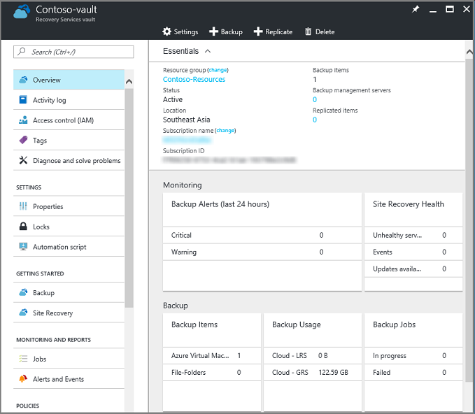

The prerequisites for this article are: an Azure subscription, a Recovery Services vault, and that there is at least one backup item configured for the vault.

[!INCLUDE [learn-about-deployment-models](../../includes/learn-about-deployment-models-rm-include.md)]


## Open a Recovery Services vault

To monitor alerts, or view management data about a Recovery Services vault, open the vault.

1. Sign in to the [Azure Portal](https://portal.azure.com/) using your Azure subscription.

2. In the portal, click **All services**.

   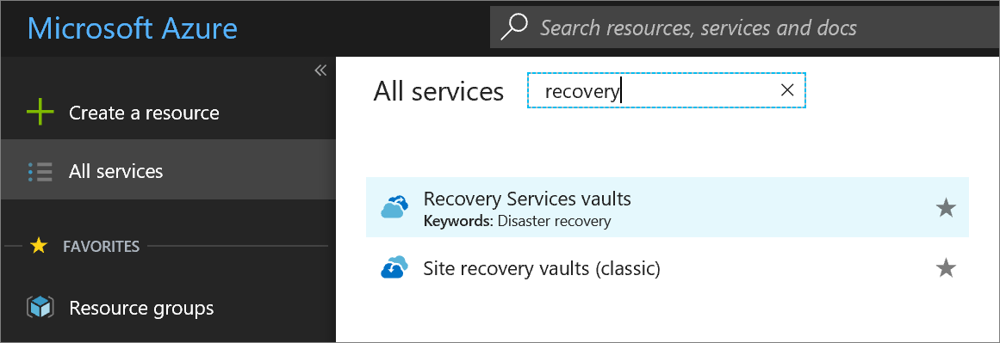

3. In the **All services** dialog box, type **Recovery Services**. As you begin typing, the list filters based on your input. When the **Recovery Services vaults** option appears, click it to open the list of Recovery Services vaults in your subscription.

    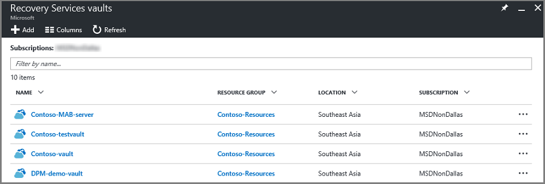 <br/>

4. From the list of vaults, click a vault to open its **Overview** dashboard. 

     <br/>

    The Overview dashboard uses tiles to provide alerts and backup job data.

## Monitor backup jobs and alerts

The Recovery Services vault **Overview** dashboard provides tiles for Monitoring and Usage information. The tiles in the Monitoring section display Critical and Warning alerts, and In progress and Failed jobs. Click a particular alert or job to open the Backup Alerts or Backup Jobs menu, filtered for that job or alert.

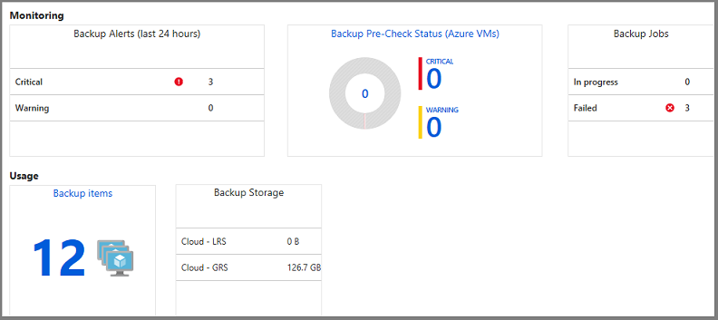

The Monitoring section shows the results of predefined **Backup Alerts** and **Backup Jobs** queries. The Monitoring tiles provide up-to-date information about:

* Critical and Warning alerts for Backup jobs (in the last 24 hours)
* Pre-check status for Azure VMs - For complete information on the pre-check status, see the [Backup blog on Backup Pre-check status](https://azure.microsoft.com/blog/azure-vm-backup-pre-checks/).
* The Backup jobs in progress, and jobs that have failed (in the last 24 hours).

The Usage tiles provide:

* The number of Backup items configured for the vault.
* The Azure storage (separated by LRS and GRS) consumed by the vault.

Click the tiles (except Backup Storage) to open the associated menu. In the image above, the Backup Alerts tile shows three Critical alerts. Clicking the Critical alerts row in the Backup Alerts tile, opens the Backup Alerts filtered for Critical alerts.

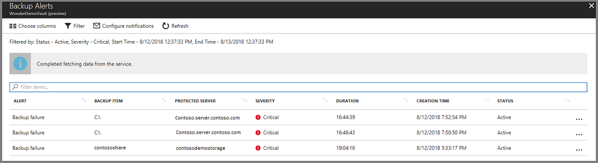

The Backup Alerts menu, in the image above, is filtered by: Status is Active, Severity is Critical, and time is the previous 24 hours.

## Manage Backup alerts

To access the Backup Alerts menu, in the Recovery Services vault menu, click **Backup Alerts**.

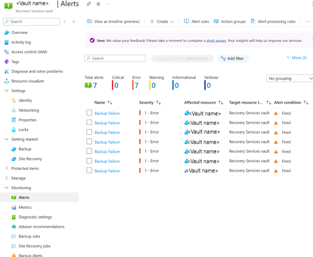

The Backup Alerts report lists the alerts for the vault. 

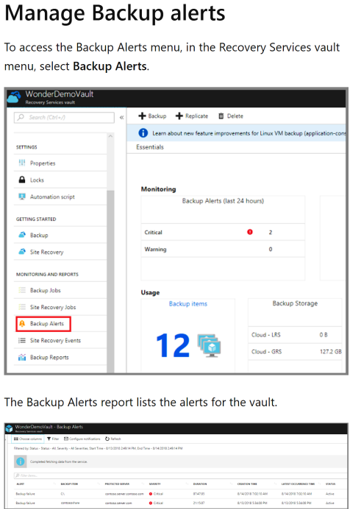

### Alerts

The Backup Alerts list displays the selected information for the filtered alerts. In the Backup Alerts menu, you can filter for Critical or Warning alerts.

| Alert Level | Events that generate alerts |
| ----------- | ----------- |
| Critical | You receive critical alerts when: Backup jobs fail, recovery jobs fail, and when you stop protection on a server, but retain the data.|
| Warning | You receive warning alerts when: Backup jobs complete with warnings, for example when fewer than 100 files are not backed up due to corruption issues, or when greater than 1,000,000 files are successfully backed up). |
| Informational | currently, no informational alerts are in use. |

### Viewing alert details

The Backup Alerts report tracks eight details about each alert. Use the **Choose columns** button to edit the details in the report.


By default, all details, except **Latest Occurrence Time**, appear in the report.

* Alert
* Backup Item
* Protected Server
* Severity
* Duration
* Creation Time
* Status
* Latest Occurrence Time

### Change the details in alerts report

1. To change the report information, in the **Backup Alerts** menu, click **Choose columns**.

   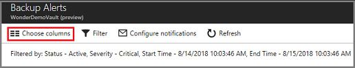

   The **Choose columns** menu opens.

2. In the **Choose columns** menu, choose the details you want to appear in the report.

    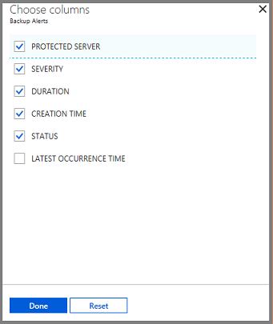

3. Click **Done** to save your changes and close the Choose columns menu.

   If you make changes, but don't want to keep the changes, click **Reset** to return the selected to the last saved configuration.

### Change the filter in alerts report

Use the **Filter** menu to change the Severity, Status, Start time and End time for the alerts. 

> [!NOTE]
> Editing the Backup Alerts filter doesn't change the Critical or Warning alerts in the vault Overview dashboard.
>  

1. To change the Backup Alerts filter, in the Backup Alerts menu, click **Filter**.

   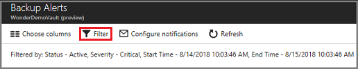

   The Filter menu appears.

   

2. Edit the Severity, Status, Start time, or End time, and click **Done** to save your changes.

## Configuring notifications for alerts

Configure notifications to generate emails when a Warning or Critical alert occurs. You can send email alerts each hour, or when a particular alert occurs.

   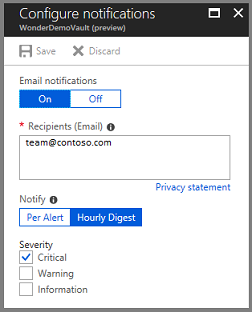

By default, Email notifications are **On**. Click **Off** to stop the email notifications.

On the **Notify** control, choose **Per Alert** if don't want grouping or don't have many items that could generate alerts. Every alert results in one notification (the default setting), and a resolution email is sent immediately.

If you select **Hourly Digest**, an email is sent to the recipients explaining the unresolved alerts generated in the last hour. A resolution email is sent out at the end of the hour.

Choose the alert severity (Critical or Warning) used to generate email. Currently there are no Information alerts.

## Manage Backup items

A Recovery Services vault holds many types of backup data. For a complete list of backup types, see [Which applications and workloads can be backed up](backup-introduction-to-azure-backup.md#which-azure-backup-components-should-i-use). To manage the various servers, computers, databases, and workloads, click the **Backup Items** tile to view the contents of the vault.

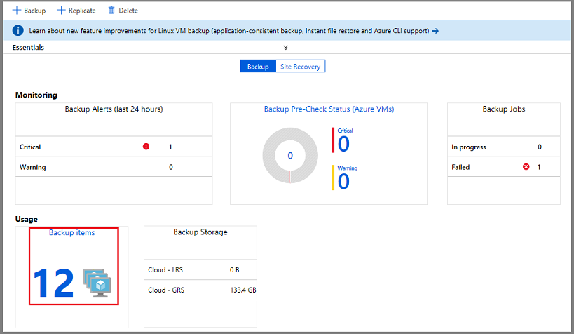

The list of Backup Items, organized by Backup Management Type, opens.

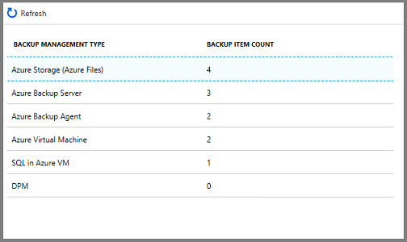

To explore a specific type of protected instance, click the item in the Backup Management Type column. For example, in the above image, there are two Azure virtual machines protected in this vault. Clicking **Azure Virtual Machine**, opens the list of protected virtual machines in this vault.

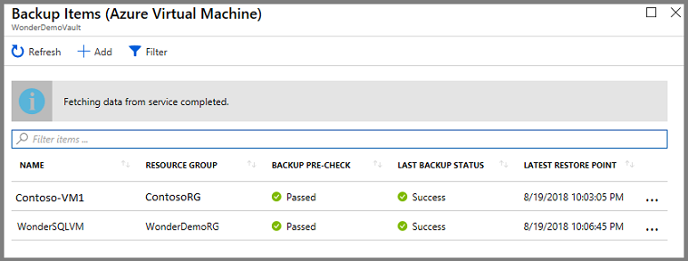

The list of virtual machines has helpful data: the associated Resource Group, previous [Backup Pre-Check](https://azure.microsoft.com/blog/azure-vm-backup-pre-checks/), Last Backup Status, and date of the most recent Restore Point. The ellipsis, in the last column, opens the menu to trigger common tasks. The helpful data provided in columns, is different for each backup type.

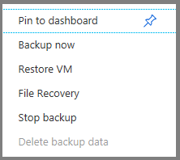

## Manage Backup jobs

The **Backup Jobs** tile in the vault dashboard shows the number of jobs that are In Progress, or Failed in the last 24 hours. The tile provides a glimpse into the Backup Jobs menu.

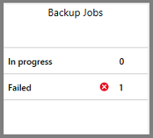

To see additional details about the jobs, click **In Progress** or **Failed** to open the Backup Jobs menu filtered for that state.

### Backup jobs menu

The **Backup Jobs** menu displays information about the Item type, Operation, Status, Start Time, and Duration.  

To open the Backup Jobs menu, in the vault's main menu, click **Backup Jobs**. 

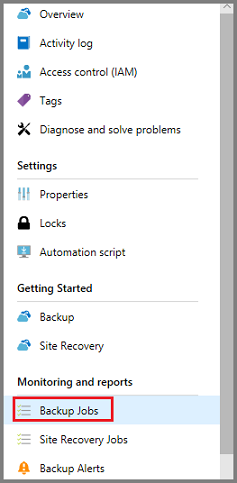

The list of Backup jobs opens.

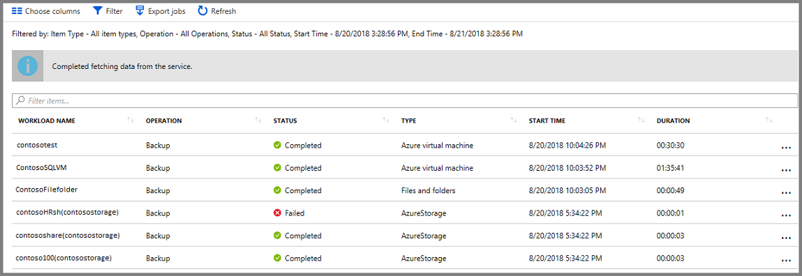

The Backup Jobs menu shows the status for all operations, on all backup types, for the last 24 hours. Use **Filter** to change the filters. The filters are explained in the following sections.

To change the filters:

1. In the vault Backup Jobs menu, click **Filter**.

   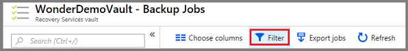

    The Filter menu opens.

   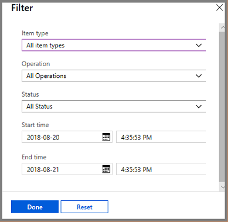

2. Choose the filter settings and click **Done**. The filtered list refreshes based on the new settings.

#### Item type

The Item type is the backup management type of the protected instance. There are four types; see the following list. You can view all item types, or one item type. You can't select two or three item types. The available Item types are:

* All item types
* Azure virtual machine
* Files and folders
* Azure Storage
* Azure workload

#### Operation

You can view one operation, or all operations. You can't select two or three operations. The available Operations are:

* All Operations
* Register
* Configure backup
* Backup
* Restore
* Disable backup
* Delete backup data

#### Status

You can view All Status or one. You can't select two or three statuses. The available statuses are:

* All Status
* Completed
* In progress
* Failed
* Canceled
* Completed with warnings

#### Start time

The day and time that the query begins. The default is a 24-hour period.

#### End time

The day and time when the query ends.

### Export jobs

Use **Export jobs** to create a spreadsheet containing all Jobs menu information. The spreadsheet has one sheet that holds a summary of all jobs, and individual sheets for each job.

To export the jobs information to a spreadsheet, click **Export jobs**. The service creates a speadsheet using the name of the vault and date, but you can change the name.

## Monitor Backup usage

The Backup Storage tile in the dashboard shows the storage consumed in Azure. Storage usage is provided for:

* Cloud LRS storage usage associated with the vault
* Cloud GRS storage usage associated with the vault


## Frequently asked questions

**Q1. How long does it take for the Azure backup agent job status to reflect in the portal?**

A1. The Azure portal can take up to 15 mins to reflect the Azure backup agent job status.

**Q2. When a backup job fails, how long does it take to raise an alert?**

A2. An alert is raised within 20 mins of the Azure backup failure.

**Q3. Is there a case where an email won’t be sent if notifications are configured?**

A3. Yes. In the following situations, notifications are not sent.

* If notifications are configured hourly, and an alert is raised and resolved within the hour
* When a job is canceled
* If a second backup job fails because the original backup job is in progress

## Troubleshooting Monitoring Issues

**Issue:** Jobs and/or alerts from the Azure Backup agent do not appear in the portal.

**Troubleshooting steps:** The process, ```OBRecoveryServicesManagementAgent```, sends the job and alert data to the Azure Backup service. Occasionally this process can become stuck or shutdown.

1. To verify the process isn't running, open **Task Manager**, and check ```OBRecoveryServicesManagementAgent``` is running.

2. If the process isn't running, open **Control Panel**, and browse the list of services. Start or restart **Microsoft Azure Recovery Services Management Agent**.

    For further information, browse the logs at:<br/>
   `<AzureBackup_agent_install_folder>\Microsoft Azure Recovery Services Agent\Temp\GatewayProvider*`
    For example:<br/>
   `C:\Program Files\Microsoft Azure Recovery Services Agent\Temp\GatewayProvider0.errlog`

## Next steps
* [Restore Windows Server or Windows Client from Azure](backup-azure-restore-windows-server.md)
* To learn more about Azure Backup, see [Azure Backup Overview](backup-introduction-to-azure-backup.md)
* Visit the [Azure Backup Forum](http://go.microsoft.com/fwlink/p/?LinkId=290933)
