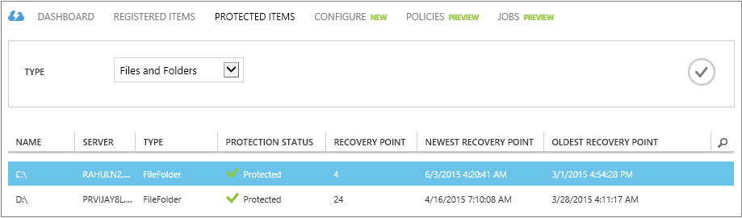
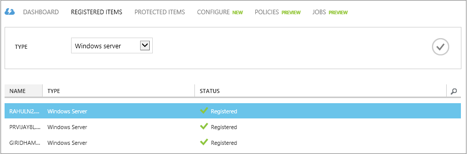

<properties
	pageTitle="Manage Azure Backup vaults and servers | Microsoft Azure"
	description="Use this tutorial to learn how to manage Azure Backup vaults and servers."
	services="backup"
	documentationCenter=""
	authors="Jim-Parker"
	manager="jwhit"
	editor="tysonn"/>

<tags
	ms.service="backup"
	ms.workload="storage-backup-recovery"
	ms.tgt_pltfrm="na"
	ms.devlang="na"
	ms.topic="article"
	ms.date="12/15/2015"
	ms.author="jimpark; markgal"/>

# Manage Azure Backup vaults and servers
In this article you'll find an overview of the backup management tasks available through the management portal.

1. Sign in to the [Management Portal](https://manage.windowsazure.com).
2. Click **Recovery Services**, then click the name of backup vault to view the Quick Start page.

    By selecting the options at the top of the Quick Start page, you can see the available management tasks.

    

## Dashboard
Select **Dashboard** to see the usage overview for the server. At the bottom of the Dashboard you can perform the following tasks:

- **Manage certificate**. If a certificate was used to register the server, then use this to update the certificate. If you are using vault credentials, do not use **Manage certificate**.
- **Delete**. Deletes the current backup vault. If a backup vault is no longer being used, you can delete it to free up storage space. **Delete** is only enabled after all registered servers have been deleted from the vault.
- **Vault credentials**. Use this Quick Glance menu item to configure your vault credentials.

## Protected Items
Select **Protected Items** to view the items that have been backed up from the servers. This list is for information purposes only.

## Registered Items
Select **Registered Items** to view the names of the servers that are registered to this vault.

From here you can perform the following tasks:

- **Allow Re-registration** - When this option is selected for a server you can use the **Registration Wizard** in the agent to register the server with the backup vault a second time. You might need to re-register due to an error in the certificate or if a server had to be rebuilt.
- **Delete** - Deletes a server from the backup vault. All of the stored data associated with the server is deleted immediately.

## Next steps
- [Restore Windows Server or Windows Client from Azure](backup-azure-restore-windows-server.md)
- To learn more about Azure Backup, see [Azure Backup Overview](backup-introduction-to-azure-backup.md)
- Visit the [Azure Backup Forum](http://go.microsoft.com/fwlink/p/?LinkId=290933)
