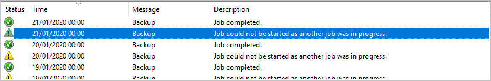
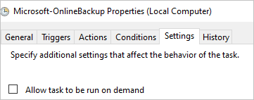
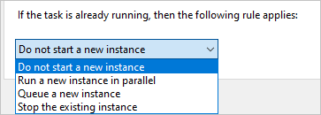

# Troubleshoot the Microsoft Azure Recovery Services (MARS) agent

This article describes how to resolve errors you might see during configuration, registration, backup, and restore.

## Basic troubleshooting

We recommend that you check the following before you start troubleshooting Microsoft the Azure Recovery Services (MARS) agent:

- [Ensure the MARS agent is up to date](https://go.microsoft.com/fwlink/?linkid=229525&clcid=0x409).
- [Ensure you have network connectivity between the MARS agent and Azure](#the-microsoft-azure-recovery-service-agent-was-unable-to-connect-to-microsoft-azure-backup).
- Ensure MARS is running (in Service console). If you need to, restart and retry the operation.
- [Ensure 5% to 10% free volume space is available in the scratch folder location](./backup-azure-file-folder-backup-faq.yml#what-s-the-minimum-size-requirement-for-the-cache-folder-).
- [Check if another process or antivirus software is interfering with Azure Backup](./backup-azure-troubleshoot-slow-backup-performance-issue.md#cause-another-process-or-antivirus-software-interfering-with-azure-backup).
- If the backup job completed with warnings, see [Backup Jobs Completed with Warning](#backup-jobs-completed-with-warning)
- If scheduled backup fails but manual backup works, see [Backups don't run according to schedule](#backups-dont-run-according-to-schedule).
- Ensure your OS has the latest updates.
- [Ensure unsupported drives and files with unsupported attributes are excluded from backup](backup-support-matrix-mars-agent.md#supported-drives-or-volumes-for-backup).
- Ensure the clock on the protected system is configured to the correct time zone.
- [Ensure .NET Framework 4.5.2 or later is installed on the server](https://www.microsoft.com/download/details.aspx?id=30653).
- If you're trying to reregister your server to a vault:
  - Ensure the agent is uninstalled on the server and that it's deleted from the portal.
  - Use the same passphrase that was initially used to register the server.
- [Ensure your server is running on TLS 1.2](transport-layer-security.md).
- For offline backups, ensure Azure PowerShell 3.7.0 is installed on both the source and the copy computer before you start the backup.
- If the Backup agent is running on an Azure virtual machine, see [this article](./backup-azure-troubleshoot-slow-backup-performance-issue.md#cause-backup-agent-running-on-an-azure-virtual-machine).

## Invalid vault credentials provided

**Error message**: Invalid vault credentials provided. The file is either corrupted or does not have the latest credentials associated with recovery service. (ID: 34513)

> [!NOTE]
> Ensure to update the MARS agent for vault credentials to work successfully. The older versions can cause validation errors.

| Causes | Recommended actions |
| ---     | ---    |
| **Vault credentials aren't valid** <br/> <br/> Vault credential files might be corrupt, might have expired, or they might have a different file extension than `.vaultCredentials`. (For example, they might have been downloaded more than 10 days before the time of registration.) | [Download new credentials](backup-azure-file-folder-backup-faq.yml#where-can-i-download-the-vault-credentials-file-) from the Recovery Services vault on the Azure portal. Then take these steps, as appropriate: <br><br>- If you've already installed and registered MARS, open the Microsoft Azure Backup Agent MMC console. Then select **Register Server** in the **Actions** pane to complete the registration with the new credentials. <br> - If the new installation fails, try reinstalling with the new credentials. <br><br> **Note**: If multiple vault credential files have been downloaded, only the latest file is valid for the next 10 days. We recommend that you download a new vault credential file. <br><br> - To prevent errors during vault registration, ensure that the MARS agent version 2.0.9249.0 or above is installed. If not, we recommend you to install it [from here](https://aka.ms/azurebackup_agent).|
| **Proxy server/firewall is blocking registration** <br/>Or <br/>**No internet connectivity** <br/><br/> If your machine has limited internet access, and you don't ensure the firewall, proxy, and network settings allow access to the FQDNS and public IP addresses, the registration will fail.| Follow these steps:<br/> <br><br>- Work with your IT team to ensure the system has internet connectivity.<br>- If you don't have a proxy server, ensure the proxy option isn't selected when you register the agent. [Check your proxy settings](#verifying-proxy-settings-for-windows).<br>- If you do have a firewall/proxy server, work with your networking team to allow access to the following FQDNs and public IP addresses. Access to all of the URLs and IP addresses listed below uses the HTTPS protocol on port 443.<br/> <br> **URLs**<br> `*.microsoft.com` <br> `*.windowsazure.com` <br> `*.microsoftonline.com` <br> `*.windows.net` <br> `*blob.core.windows.net` <br> `*queue.core.windows.net` <br> `*blob.storage.azure.net`<br><br><br>- If you are a US Government customer, ensure that you have access to the following URLs:<br><br> `www.msftncsi.com` <br> `*.microsoft.com` <br> `*.windowsazure.us` <br> `*.microsoftonline.us` <br> `*.windows.net` <br> `*.usgovcloudapi.net` <br> `*blob.core.windows.net` <br> `*queue.core.windows.net` <br> `*blob.storage.azure.net` <br><br> Try registering again after you complete the preceding troubleshooting steps.<br></br> If your connection is via Azure ExpressRoute, make sure the settings are configured as described in Azure [ExpressRoute support](../backup/backup-support-matrix-mars-agent.md#azure-expressroute-support). |
| **Antivirus software is blocking registration** |  If you've antivirus software installed on the server, add the exclusion rules to the antivirus scan for: <br><br> - Every file and folder under the *scratch* and *bin* folder locations - `<InstallPath>\Scratch\*` and `<InstallPath>\Bin\*`. <br> - cbengine.exe   |

### Additional recommendations

- Go to C:/Windows/Temp and check whether there are more than 60,000 or 65,000 files with the .tmp extension. If there are, delete these files.
- Ensure the machine's date and time match the local time zone.
- Ensure [these sites](install-mars-agent.md#verify-internet-access) are added to your trusted sites in Internet Explorer.

### Verifying proxy settings for Windows

1. Download PsExec from the [Sysinternals](/sysinternals/downloads/psexec) page.
1. Run `psexec -i -s "c:\Program Files\Internet Explorer\iexplore.exe"` from an elevated command prompt.

   This command will open Internet Explorer.
1. Go to **Tools** > **Internet options** > **Connections** > **LAN settings**.
1. Check the proxy settings for the system account.
1. If no proxy is configured and proxy details are provided, remove the details.
1. If a proxy is configured and the proxy details are incorrect, ensure the **Proxy IP** and **Port** details are correct.
1. Close Internet Explorer.

## Unable to download vault credential file

| Error   | Recommended actions |
| ---     | ---    |
|Failed to download the vault credential file. (ID: 403) | - Try downloading the vault credentials by using a different browser, or follow these steps: <br><br> a. Start Internet Explorer. Select F12. <br> b. Go to the **Network** tab and clear the cache and cookies. <br> c. Refresh the page. <br><br> - Check if the subscription is disabled/expired.<br><br> - Check if any firewall rule is blocking the download. <br><br> - Ensure you haven't exhausted the limit on the vault (50 machines per vault). <br><br> - Ensure the user has the Azure Backup permissions that are required to download vault credentials and register a server with the vault. See [Use Azure role-based access control to manage Azure Backup recovery points](backup-rbac-rs-vault.md). |

## The Microsoft Azure Recovery Service Agent was unable to connect to Microsoft Azure Backup

| Error  | Possible cause | Recommended actions |
| ---     | ---     | ---    |
| - The Microsoft Azure Recovery Service Agent was unable to connect to Microsoft Azure Backup. (ID: 100050) Check your network settings and ensure that you are able to connect to the internet. <br><br> - (407) Proxy Authentication Required. | A proxy is blocking the connection. |  - On Internet Explorer, go to **Tools** > **Internet options** > **Security** > **Internet**. Select **Custom Level** and scroll down to the **File download** section. Select **Enable**. <br> You might also have to add [URLs and IP addresses](install-mars-agent.md#verify-internet-access) to your trusted sites in Internet Explorer. <br><br> - Change the settings to use a proxy server. Then provide the proxy server details. <br><br><br> - If your machine has limited internet access, ensure that firewall settings on the machine or proxy allow these [URLs and IP addresses](install-mars-agent.md#verify-internet-access). <br><br> - If you have antivirus software installed on the server, exclude these files from the antivirus scan: <br> - CBEngine.exe (instead of dpmra.exe). <br> - CSC.exe (related to .NET Framework). There's a CSC.exe for every .NET Framework version installed on the server. Exclude CSC.exe files for all versions of .NET Framework on the affected server. <br><br> - The scratch folder or cache location. <br> The default location for the scratch folder or the cache path is C:\Program Files\Microsoft Azure Recovery Services Agent\Scratch. <br><br> - The bin folder at C:\Program Files\Microsoft Azure Recovery Services Agent\Bin. |
| The server registration status could not be verified with Microsoft Azure Backup. Verify that you are connected to the internet and that the proxy settings are configured correctly. | The MARS agent isn't able to contact Azure services. | - Ensure network connectivity and proxy settings. <br><br> - Ensure that you are running the latest MARS agent. <br><br> - [Ensure your server is running on TLS 1.2](transport-layer-security.md). |
## The specified vault credential file cannot be used as it is not downloaded from the vault associated with this server

| Error  | Possible cause | Recommended actions |
| ---     | ---     | ---    |
| The specified vault credential file cannot be used as it is not downloaded from the vault associated with this server. (ID: 100110) Please provide appropriate vault credentials. | The vault credential file is from a different vault than the one this server is already registered to. | Ensure that the target machine and the source machine are registered to the same Recovery Services vault. If the target server has already been registered to a different vault, use the **Register Server** option to register to the correct vault.

## Backup jobs completed with warning

- When the MARS agent iterates over files and folders during backup, it might encounter various conditions that can cause the backup to be marked as completed with warnings. During these conditions, a job shows as completed with warnings. That's fine, but it means that at least one file wasn't able to be backed up. So the job skipped that file, but backed up all other files in question on the data source.

  

- Conditions that can cause the backups to skip files include:
  - Unsupported file attributes (for example: in a OneDrive folder, Compressed stream, reparse points). For the complete list, refer to the [support matrix](./backup-support-matrix-mars-agent.md#supported-file-types-for-backup).
  - A file system issue
  - Another process interfering (for example: antivirus software holding handles on files can prevent the MARS agent from accessing the files)
  - Files locked by an application

- The backup service will mark these files as failed in the log file, with the following naming convention: *LastBackupFailedFilesxxxx.txt* under the *C:\Program Files\Microsoft Azure Recovery Service Agent\temp* folder.
- To resolve the issue, review the log file to understand the nature of the issue:

  | Error code             | Reasons                                             | Recommendations                                              |
  | ---------------------- | --------------------------------------------------- | ------------------------------------------------------------ |
  | 0x80070570             | The file or directory is  corrupted and unreadable. | Run **chkdsk** on the source  volume.                             |
  | 0x80070002, 0x80070003 | The system cannot find the  file specified.         | [Ensure the scratch folder isn't full](./backup-azure-file-folder-backup-faq.yml)  <br><br>  Check if the volume where  scratch space is configured exists (not deleted)  <br><br>   [Ensure the MARS agent is excluded from the antivirus installed on the machine](./backup-azure-troubleshoot-slow-backup-performance-issue.md#cause-another-process-or-antivirus-software-interfering-with-azure-backup)  |
  | 0x80070005             | Access Is Denied                                    | [Check if antivirus or other third-party software is blocking access](./backup-azure-troubleshoot-slow-backup-performance-issue.md#cause-another-process-or-antivirus-software-interfering-with-azure-backup)     |
  | 0x8007018b             | Access to the cloud file is  denied.                | OneDrive files, Git Files, or any other files that can be in offline state on the machine |

- You can use [Add Exclusion rules to existing policy](./backup-azure-manage-mars.md#add-exclusion-rules-to-existing-policy) to exclude unsupported, missing, or deleted files from your backup policy to ensure successful backups.

- Avoid deleting and recreating protected folders with the same names in the top-level folder. Doing so could result in the backup completing with warnings with the error: *A critical inconsistency was detected, therefore changes cannot be replicated.*  If you need to delete and recreate folders, then consider doing so in subfolders under the protected top-level folder.

## Failed to set the encryption key for secure backups

| Error | Possible causes | Recommended actions |
| ---     | ---     | ---    |
| Failed to set the encryption key for secure backups. Activation did not succeed completely but the encryption passphrase was saved to the following file. | - The server is already registered with another vault. <br><br> - During configuration, the passphrase was corrupted.| Unregister the server from the vault and register it again with a new passphrase. |

## The activation did not complete successfully

| Error  | Possible causes | Recommended actions |
|---------|---------|---------|
| The activation did not complete successfully. The current operation failed due to an internal service error [0x1FC07]. Retry the operation after some time. If the issue persists, please contact Microsoft support.     | - The scratch folder is located on a volume that doesn't have enough space. <br><br> - The scratch folder has been incorrectly moved. <br><br> - The OnlineBackup.KEK file is missing.         | - Upgrade to the [latest version](https://aka.ms/azurebackup_agent) of the MARS agent. <br><br> - Move the scratch folder or cache location to a volume with free space that's between 5% and 10% of the total size of the backup data. To correctly move the cache location, refer to the steps in [Common questions about backing up files and folders](./backup-azure-file-folder-backup-faq.yml). <br><br> - Ensure that the OnlineBackup.KEK file is present. <br>*The default location for the scratch folder or the cache path is C:\Program Files\Microsoft Azure Recovery Services Agent\Scratch*.        |

## Encryption passphrase not correctly configured

| Error  | Possible causes | Recommended actions |
|---------|---------|---------|
| Error 34506. The encryption passphrase stored on this computer is not correctly configured.    | - The scratch folder is located on a volume that doesn't have enough space. <br><br> - The scratch folder has been incorrectly moved. <br><br> - The OnlineBackup.KEK file is missing.        | - Upgrade to the [latest version](https://aka.ms/azurebackup_agent) of the MARS Agent. <br><br> - Move the scratch folder or cache location to a volume with free space that's between 5% and 10% of the total size of the backup data. To correctly move the cache location, refer to the steps in [Common questions about backing up files and folders](./backup-azure-file-folder-backup-faq.yml). <br><br> - Ensure that the OnlineBackup.KEK file is present. <br>*The default location for the scratch folder or the cache path is C:\Program Files\Microsoft Azure Recovery Services Agent\Scratch*. <br><br> - If you've recently moved your scratch folder, ensure that the path of your scratch folder location matches the values of the registry key entries shown below: <br><br> **Registry path**: `HKEY_LOCAL_MACHINE\SOFTWARE\Microsoft\Windows Azure Backup\Config` <br> **Registry Key**: ScratchLocation <br> **Value**: *New cache folder location* <br><br>**Registry path**: `HKEY_LOCAL_MACHINE\SOFTWARE\Microsoft\Windows Azure Backup\Config\CloudBackupProvider` <br> **Registry Key**: ScratchLocation <br> **Value**: *New cache folder location*        |

## Backups don't run according to schedule

If scheduled backups don't get triggered automatically but manual backups work correctly, try the following actions:

- Ensure the Windows Server backup schedule doesn't conflict with the Azure files and folders backup schedule.

- Ensure the  online backup status is set to **Enable**. To verify the status, take these steps:

  1. In Task Scheduler, expand **Microsoft** and select **Online Backup**.
  1. Double-click **Microsoft-OnlineBackup** and go to the **Triggers** tab.
  1. Check if the status is set to **Enabled**. If it isn't, select **Edit**, select **Enabled**, and then select **OK**.

- Ensure the user account selected for running the task is either **SYSTEM** or **Local Administrators' group** on the server. To verify the user account, go to the **General** tab and check the **Security** options.

- Ensure PowerShell 3.0 or later is installed on the server. To check the PowerShell version, run this command and verify that the `Major` version number is 3 or later:

  `$PSVersionTable.PSVersion`

- Ensure this path is part of the `PSMODULEPATH` environment variable:

  `<MARS agent installation path>\Microsoft Azure Recovery Services Agent\bin\Modules\MSOnlineBackup`

- If the PowerShell execution policy for `LocalMachine` is set to `restricted`, the PowerShell cmdlet that triggers the backup task might fail. Run these commands in elevated mode to check and set the execution policy to either `Unrestricted` or `RemoteSigned`:

```powershell
Get-ExecutionPolicy -List

Set-ExecutionPolicy Unrestricted
```

- Ensure there are no missing or corrupt PowerShell module MSOnlineBackup files. If there are any missing or corrupt files, take these steps:

  1. From any machine that has a MARS agent that's working properly, copy the MSOnlineBackup folder from C:\Program Files\Microsoft Azure Recovery Services Agent\bin\Modules.
  1. On the problematic machine, paste the copied files at the same folder location (C:\Program Files\Microsoft Azure Recovery Services Agent\bin\Modules).

    If there's already an MSOnlineBackup folder on the machine, paste the files into it or replace any existing files.

> [!TIP]
> To ensure changes are applied consistently, restart the server after performing the preceding steps.

## Resource not provisioned in service stamp

Error | Possible causes | Recommended actions
--- | --- | ---
The current operation failed due to an internal service error "Resource not provisioned in service stamp". Please retry the operation after some time. (ID: 230006) | The protected server was renamed. | - Rename the server back to the original name as registered with the vault. <br><br> - Re-register the server to the vault with the new name.

## Job could not be started as another job was in progress

If you notice a warning message in the **MARS console** > **Job history**, saying "Job could not be started as another job was in progress", then this could be because of a duplicate instance of the job triggered by the Task Scheduler.



To resolve this issue:

1. Launch the Task Scheduler snap-in by typing *taskschd.msc* in the Run window
1. In the left pane, navigate to **Task Scheduler Library** -> **Microsoft** -> **OnlineBackup**.
1. For each task in this library, double-click on the task to open properties and perform the following steps:
    1. Switch to the **Settings** tab.

         

    1. Change the option for **If the task is already running, then the following rule applies**. Choose **Do not start a new instance**.

         

## Troubleshoot restore problems

Azure Backup might not successfully mount the recovery volume, even after several minutes. And you might receive error messages during the process. To begin recovering normally, take these steps:

1. Cancel the mount process if it's been running for several minutes.

2. Check if you have the latest version of the Backup agent. To check the version, on the **Actions** pane of the MARS console, select **About Microsoft Azure Recovery Services Agent**. Confirm that the **Version** number is equal to or higher than the version mentioned in [this article](https://go.microsoft.com/fwlink/?linkid=229525). Select this link to [download the latest version](https://go.microsoft.com/fwLink/?LinkID=288905).

3. Go to **Device Manager** > **Storage controllers** and locate **Microsoft iSCSI Initiator**. If you locate it, go directly to step 7.

4. If you can't locate the Microsoft iSCSI Initiator service, try to find an entry under **Device Manager** > **Storage controllers** named **Unknown Device** with Hardware ID **ROOT\ISCSIPRT**.

5. Right-click **Unknown Device** and select **Update Driver Software**.

6. Update the driver by selecting the option to  **Search automatically for updated driver software**. This update should change **Unknown Device** to **Microsoft iSCSI Initiator**:

    

7. Go to **Task Manager** > **Services (Local)** > **Microsoft iSCSI Initiator Service**:

    

8. Restart the Microsoft iSCSI Initiator service. To do this, right-click the service and select **Stop**. Then right-click it again and select **Start**.

9. Retry recovery by using [Instant Restore](backup-instant-restore-capability.md).

If the recovery still fails, restart your server or client. If you don't want to restart, or if the recovery still fails even after you restart the server, try [recovering from another machine](backup-azure-restore-windows-server.md#use-instant-restore-to-restore-data-to-an-alternate-machine).

## Troubleshoot Cache problems

Backup operation may fail if the cache folder (also referred as scratch folder) is incorrectly configured, missing prerequisites or has restricted access.

### Prerequisites

For MARS agent operations to succeed the cache folder needs to adhere to the following requirements:

- [Ensure 5% to 10% free volume space is available in the scratch folder location](backup-azure-file-folder-backup-faq.yml#what-s-the-minimum-size-requirement-for-the-cache-folder-)
- [Ensure scratch folder location is valid and accessible](backup-azure-file-folder-backup-faq.yml#how-to-check-if-scratch-folder-is-valid-and-accessible-)
- [Ensure file attributes on the cache folder are supported](backup-azure-file-folder-backup-faq.yml#are-there-any-attributes-of-the-cache-folder-that-aren-t-supported-)
- [Ensure the allocated shadow copy storage space is sufficient for backup process](#increase-shadow-copy-storage)
- [Ensure there are no other processes (ex. anti-virus software) restricting access to cache folder](#another-process-or-antivirus-software-blocking-access-to-cache-folder)

### Increase shadow copy storage

Backup operations could fail if there isn't sufficient shadow copy storage space that's required to protect the data source. To resolve this issue, increase the shadow copy storage space on the protected volume using **vssadmin** as shown below:

- Check the current shadow storage space from the elevated command prompt:<br/>
  `vssadmin List ShadowStorage /For=[Volume letter]:`
- Increase the shadow storage space using the following command:<br/>
  `vssadmin Resize ShadowStorage /On=[Volume letter]: /For=[Volume letter]: /Maxsize=[size]`

### Another process or antivirus software blocking access to cache folder

[!INCLUDE [antivirus-scan-exclusion-rules](../../includes/backup-azure-antivirus-scan-exclusion-rules.md)]

### Backup or restore job is displayed as *in progress* in Azure for many days but is not visible in the console

If a MARS Agent backup or restore job crashes during execution, it is marked as failed in the MARS console, but the status might not get propagated to Azure. Hence, the job might be displayed as "in progress" in the Azure Portal even when it is not running. This stale job entry will be removed from the Azure Portal automatically after 30 days.

## Common issues

This section covers the common errors that you encounter while using MARS agent.

### SalChecksumStoreInitializationFailed

Error message | Recommended action
--|--
Microsoft Azure Recovery Services Agent was unable to access backup checksum stored in scratch location | To resolve this issue, perform the following steps and restart the server <br/> - [Check if there is an antivirus or other processes locking the scratch location files](#another-process-or-antivirus-software-blocking-access-to-cache-folder)<br/> - [Check if the scratch location is valid and accessible to the MARS agent.](backup-azure-file-folder-backup-faq.yml#how-to-check-if-scratch-folder-is-valid-and-accessible-)

### SalVhdInitializationError

Error message | Recommended action
--|--
Microsoft Azure Recovery Services Agent was unable to access the scratch location to initialize VHD | To resolve this issue, perform the following steps and restart the server <br/> - [Check if antivirus or other processes are locking the scratch location files](#another-process-or-antivirus-software-blocking-access-to-cache-folder)<br/> - [Check if the scratch location is valid and accessible to the MARS agent.](backup-azure-file-folder-backup-faq.yml#how-to-check-if-scratch-folder-is-valid-and-accessible-)

### SalLowDiskSpace

Error message | Recommended action
--|--
Backup failed due to insufficient storage in volume  where the scratch folder is located | To resolve this issue, verify the following steps and retry the operation:<br/>- [Ensure the MARS agent is latest](https://go.microsoft.com/fwlink/?linkid=229525&clcid=0x409)<br/> - [Verify and resolve storage issues that impact backup scratch space](#prerequisites)

### SalBitmapError

Error message | Recommended action
--|--
Unable to find changes in a file. This could be due to various reasons. Please retry the operation | To resolve this issue, verify the following steps and retry the operation:<br/> - [Ensure the MARS agent is latest](https://go.microsoft.com/fwlink/?linkid=229525&clcid=0x409) <br/> - [Verify and resolve storage issues that impact backup scratch space](#prerequisites)

## MARS offline seeding using customer-owned disks (Import/Export) is not working

Azure Import/Export now uses Azure Data Box APIs for offline seeding on customer-owned disks. The Azure portal also list the Import/Export jobs created using the new API under [Azure Data Box jobs](../import-export/storage-import-export-view-drive-status.md?tabs=azure-portal-preview) with the Model column as Import/Export.

MARS agent versions lower than *2.0.9250.0* used the [old Azure Import/Export APIs](/rest/api/storageimportexport/), which will be discontinued after February 28, 2023 and the old MARS agents (version lower than 2.0.9250.0) can't do offline seeding using your own disks. So, we recommend you to use MARS agent 2.0.9250 or higher that uses the new Azure Data Box APIs for offline seeding on your own disks.

If you've ongoing Import/Export jobs created from older MARS agents, you can still monitor them in the Azure portal, under Import/Export jobs.

## Next steps

- Get more details on [how to back up Windows Server with the Azure Backup agent](tutorial-backup-windows-server-to-azure.md).
- If you need to restore a backup, see [restore files to a Windows machine](backup-azure-restore-windows-server.md).
