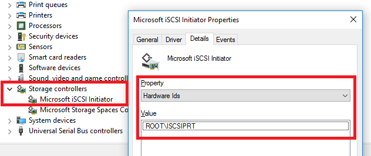
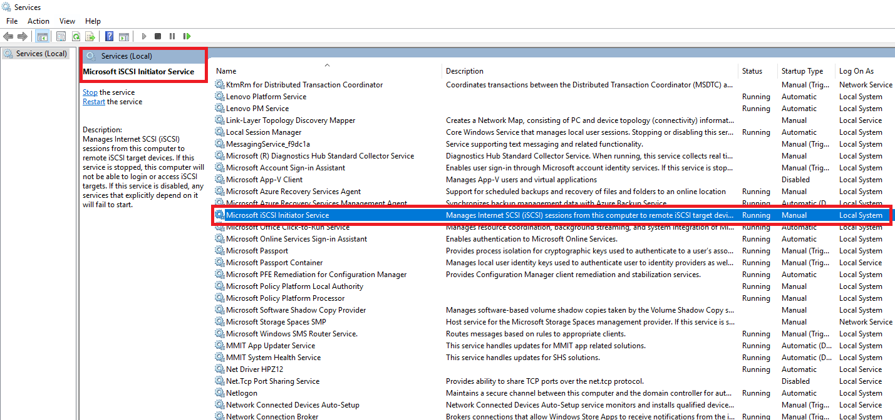

# Troubleshoot the Microsoft Azure Recovery Services (MARS) agent

This article describes how to resolve errors you might see during configuration, registration, backup, and restore.

## Basic troubleshooting

We recommend that you check the following before you start troubleshooting Microsoft the Azure Recovery Services (MARS) agent:

- [Ensure the MARS agent is up to date](https://go.microsoft.com/fwlink/?linkid=229525&clcid=0x409).
- [Ensure you have network connectivity between the MARS agent and Azure](https://aka.ms/AB-A4dp50).
- Ensure MARS is running (in Service console). If you need to, restart and retry the operation.
- [Ensure 5% to 10% free volume space is available in the scratch folder location](https://aka.ms/AB-AA4dwtt).
- [Check if another process or antivirus software is interfering with Azure Backup](https://aka.ms/AB-AA4dwtk).
- If scheduled backup fails but manual backup works, see [Backups don't run according to schedule](https://aka.ms/ScheduledBackupFailManualWorks).
- Ensure your OS has the latest updates.
- [Ensure unsupported drives and files with unsupported attributes are excluded from backup](backup-support-matrix-mars-agent.md#supported-drives-or-volumes-for-backup).
- Ensure the clock on the protected system is configured to the correct time zone.
- [Ensure .NET Framework 4.5.2 or later is installed on the server](https://www.microsoft.com/download/details.aspx?id=30653).
- If you're trying to reregister your server to a vault:
  - Ensure the agent is uninstalled on the server and that it's deleted from the portal.
  - Use the same passphrase that was initially used to register the server.
- For offline backups, ensure Azure PowerShell 3.7.0 is installed on both the source and the copy computer before you start the backup.
- If the Backup agent is running on an Azure virtual machine, see [this article](https://aka.ms/AB-AA4dwtr).

## Invalid vault credentials provided

**Error message**: Invalid vault credentials provided. The file is either corrupted or does not have the latest credentials associated with recovery service. (ID: 34513)

| Cause | Recommended actions |
| ---     | ---    |
| **Vault credentials aren't valid**     Vault credential files might be corrupt or might have expired. (For example, they might have been downloaded more than 48 hours before the time of registration.)| Download new credentials from Recovery Services vault on the Azure portal. (See step 6 in the [Download the MARS agent](https://docs.microsoft.com/azure/backup/backup-configure-vault#download-the-mars-agent) section.) Then take these steps, as appropriate: <ul><li> If you've already installed and registered MARS, open the Microsoft Azure Backup Agent MMC console and then select **Register Server** in the **Actions** pane to complete the registration with the new credentials.   <li> If the new installation fails, try reinstalling with the new credentials.</ul> **Note**: If multiple vault credential files have been downloaded, only the latest file is valid for the next 48 hours. We recommend that you download a new vault credential file.
| **Proxy server/firewall is blocking registration**  or  **No internet connectivity**    If your machine or proxy server has limited internet connectivity and you don't ensure access for the necessary URLs, the registration will fail.| Take these steps:  <ul><li> Work with your IT team to ensure the system has internet connectivity.<li> If you don't have a proxy server, ensure the proxy option isn't selected when you register the agent. [Check your proxy settings](#verifying-proxy-settings-for-windows).<li> If you do have a firewall/proxy server, work with your networking team to ensure these URLs and IP addresses have access:    **URLs**  `www.msftncsi.com`   .Microsoft.com   .WindowsAzure.com   .microsoftonline.com   .windows.net  **IP addresses**   20.190.128.0/18    40.126.0.0/18  </ul></ul>Try registering again after you complete the preceding troubleshooting steps.
| **Antivirus software is blocking registration** | If you have antivirus software installed on the server, add necessary exclusion rules to the antivirus scan for these files and folders:  <ui> <li> CBengine.exe <li> CSC.exe<li> The scratch folder. Its default location is C:\Program Files\Microsoft Azure Recovery Services Agent\Scratch. <li> The bin folder at C:\Program Files\Microsoft Azure Recovery Services Agent\Bin.

### Additional recommendations
- Go to C:/Windows/Temp and check whether there are more than 60,000 or 65,000 files with the .tmp extension. If there are, delete these files.
- Ensure the machine’s date and time match the local time zone.
- Ensure [these sites](backup-configure-vault.md#verify-internet-access) are added to your trusted sites in Internet Explorer.

### Verifying proxy settings for Windows

1. Download PsExec from the [Sysinternals](https://docs.microsoft.com/sysinternals/downloads/psexec) page.
1. Run `psexec -i -s "c:\Program Files\Internet Explorer\iexplore.exe"` from an elevated command prompt.

   This command will open Internet Explorer.
1. Go to **Tools** > **Internet options** > **Connections** > **LAN settings**.
1. Check the proxy settings for the system account.
1. If no proxy is configured and proxy details are provided, remove the details.
1. If a proxy is configured and the proxy details are incorrect, ensure the **Proxy IP** and **Port** details are correct.
1. Close Internet Explorer.

## Unable to download vault credential file

| Error   | Recommended actions |
| ---     | ---    |
|Failed to download the vault credential file. (ID: 403) | <ul><li> Try downloading the vault credentials by using a different browser, or take these steps: <ul><li> Start Internet Explorer. Select F12. </li><li> Go to the **Network** tab and clear the cache and cookies. </li> <li> Refresh the page. </li></ul> <li> Check if the subscription is disabled/expired. </li> <li> Check if any firewall rule is blocking the download.  </li> <li> Ensure you haven't exhausted the limit on the vault (50 machines per vault). </li>  <li> Ensure the user has the Azure Backup permissions that are required to download vault credentials and register a server with the vault. See [Use Role-Based Access Control to manage Azure Backup recovery points](backup-rbac-rs-vault.md).</li></ul> |

## The Microsoft Azure Recovery Service Agent was unable to connect to Microsoft Azure Backup

| Error  | Possible cause | Recommended actions |
| ---     | ---     | ---    |
|  <ul><li>The Microsoft Azure Recovery Service Agent was unable to connect to Microsoft Azure Backup. (ID: 100050) Check your network settings and ensure that you are able to connect to the internet.<li>(407) Proxy Authentication Required. |A proxy is blocking the connection. |  <ul><li>In Internet Explorer, go to **Tools** > **Internet options** > **Security** > **Internet**. Select **Custom Level** and scroll down to the **File download** section. Select **Enable**.
You might also have to add [URLs and IP addresses](backup-configure-vault.md#verify-internet-access) to your trusted sites in Internet Explorer.<li>Change the settings to use a proxy server. Then provide the proxy server details.<li> If your machine has limited internet access, ensure that firewall settings on the machine or proxy allow these [URLs and IP addresses](backup-configure-vault.md#verify-internet-access). <li>If you have antivirus software installed on the server, exclude these files from the antivirus scan: <ul><li>CBEngine.exe (instead of dpmra.exe).<li>CSC.exe (related to .NET Framework). There's a CSC.exe for every .NET Framework version installed on the server. Exclude CSC.exe files for all versions of .NET Framework on the affected server. <li>The scratch folder or cache location.  The default location for the scratch folder or the cache path is C:\Program Files\Microsoft Azure Recovery Services Agent\Scratch.<li>The bin folder at C:\Program Files\Microsoft Azure Recovery Services Agent\Bin.

## Failed to set the encryption key for secure backups

| Error | Possible causes | Recommended actions |
| ---     | ---     | ---    |
|  Failed to set the encryption key for secure backups. Activation did not succeed completely but the encryption passphrase was saved to the following file. |<li>The server is already registered with another vault.<li>During configuration, the passphrase was corrupted.| Unregister the server from the vault and register it again with a new passphrase.

## The activation did not complete successfully

| Error  | Possible causes | Recommended actions |
|---------|---------|---------|
| The activation did not complete successfully. The current operation failed due to an internal service error [0x1FC07]. Retry the operation after some time. If the issue persists, please contact Microsoft support.     | <li> The scratch folder is located on a volume that doesn't have enough space. <li> The scratch folder has been incorrectly moved. <li> The OnlineBackup.KEK file is missing.         | <li>Upgrade to the [latest version](https://aka.ms/azurebackup_agent) of the MARS agent.<li>Move the scratch folder or cache location to a volume with free space that's between 5% and 10% of the total size of the backup data. To correctly move the cache location, refer to the steps in [Common questions about backing up files and folders](https://docs.microsoft.com/azure/backup/backup-azure-file-folder-backup-faq#manage-the-backup-cache-folder).<li> Ensure that the OnlineBackup.KEK file is present.  *The default location for the scratch folder or the cache path is C:\Program Files\Microsoft Azure Recovery Services Agent\Scratch*.        |

## Encryption passphrase not correctly configured

| Error  | Possible causes | Recommended actions |
|---------|---------|---------|
|  Error 34506. The encryption passphrase stored on this computer is not correctly configured.    | <li> The scratch folder is located on a volume that doesn't have enough space. <li> The scratch folder has been incorrectly moved. <li> The OnlineBackup.KEK file is missing.        | <li>Upgrade to the [latest version](https://aka.ms/azurebackup_agent) of the MARS Agent.<li>Move the scratch folder or cache location to a volume with free space that's between 5% and 10% of the total size of the backup data. To correctly move the cache location, refer to the steps in [Common questions about backing up files and folders](https://docs.microsoft.com/azure/backup/backup-azure-file-folder-backup-faq#manage-the-backup-cache-folder).<li> Ensure that the OnlineBackup.KEK file is present.  *The default location for the scratch folder or the cache path is C:\Program Files\Microsoft Azure Recovery Services Agent\Scratch*.         |

## Backups don't run according to schedule
If scheduled backups don't get triggered automatically but manual backups work correctly, try the following actions:

- Ensure the Windows Server backup schedule doesn't conflict with the Azure files and folders backup schedule.

- Ensure the  online backup status is set to **Enable**. To verify the status, take these steps:

  1. In Task Scheduler, expand **Microsoft** and select **Online Backup**.
  1. Double-click **Microsoft-OnlineBackup** and go to the **Triggers** tab.
  1. Check if the status is set to **Enabled**. If it isn't, select **Edit**, select **Enabled**, and then select **OK**.

- Ensure the user account selected for running the task is either **SYSTEM** or **Local Administrators' group** on the server. To verify the user account, go to the **General** tab and check the **Security** options.

- Ensure PowerShell 3.0 or later is installed on the server. To check the PowerShell version, run this command and verify that the `Major` version number is 3 or later:

  `$PSVersionTable.PSVersion`

- Ensure this path is part of the `PSMODULEPATH` environment variable:

  `<MARS agent installation path>\Microsoft Azure Recovery Services Agent\bin\Modules\MSOnlineBackup`

- If the PowerShell execution policy for `LocalMachine` is set to restricted, the PowerShell cmdlet that triggers the backup task might fail. Run these commands in elevated mode to check and set the execution policy to either `Unrestricted` or `RemoteSigned`:

  `PS C:\WINDOWS\system32> Get-ExecutionPolicy -List`

  `PS C:\WINDOWS\system32> Set-ExecutionPolicy Unrestricted`

- Ensure there are no missing or corrupt PowerShell module MSOnlineBackup files. If there are any missing or corrupt files, take these steps:

  1. From any machine that has a MARS agent that's working properly, copy the MSOnlineBackup folder from C:\Program Files\Microsoft Azure Recovery Services Agent\bin\Modules.
  1. On the problematic machine, paste the copied files at the same folder location (C:\Program Files\Microsoft Azure Recovery Services Agent\bin\Modules).

     If there's already an MSOnlineBackup folder on the machine, paste the files into it or replace any existing files.

> [!TIP]
> To ensure changes are applied consistently, restart the server after performing the preceding steps.

## Troubleshoot restore problems

Azure Backup might not successfully mount the recovery volume, even after several minutes. And you might receive error messages during the process. To begin recovering normally, take these steps:

1.  Cancel the mount process if it's been running for several minutes.

2.  Check if you have the latest version of the Backup agent. To check the version, on the **Actions** pane of the MARS console, select **About Microsoft Azure Recovery Services Agent**. Confirm that the **Version** number is equal to or higher than the version mentioned in [this article](https://go.microsoft.com/fwlink/?linkid=229525). Select this link to [download the latest version](https://go.microsoft.com/fwLink/?LinkID=288905).

3.  Go to **Device Manager** > **Storage controllers** and locate **Microsoft iSCSI Initiator**. If you locate it, go directly to step 7.

4.  If you can't locate the Microsoft iSCSI Initiator service, try to find an entry under **Device Manager** > **Storage controllers** named **Unknown Device** with Hardware ID **ROOT\ISCSIPRT**.

5.  Right-click **Unknown Device** and select **Update Driver Software**.

6.	Update the driver by selecting the option to  **Search automatically for updated driver software**. This update should change **Unknown Device** to **Microsoft iSCSI Initiator**:

    

7.  Go to **Task Manager** > **Services (Local)** > **Microsoft iSCSI Initiator Service**:

    

8.  Restart the Microsoft iSCSI Initiator service. To do this, right-click the service and select **Stop**. Then right-click it again and select **Start**.

9.  Retry recovery by using [Instant Restore](backup-instant-restore-capability.md).

If the recovery still fails, restart your server or client. If you don't want to restart, or if the recovery still fails even after you restart the server, try [recovering from another machine](backup-azure-restore-windows-server.md#use-instant-restore-to-restore-data-to-an-alternate-machine).

## Need help? Contact support
If you still need help, [contact support](https://portal.azure.com/?#blade/Microsoft_Azure_Support/HelpAndSupportBlade) to get your problem resolved quickly.

## Next steps
* Get more details on [how to back up Windows Server with the Azure Backup agent](tutorial-backup-windows-server-to-azure.md).
* If you need to restore a backup, see [restore files to a Windows machine](backup-azure-restore-windows-server.md).
