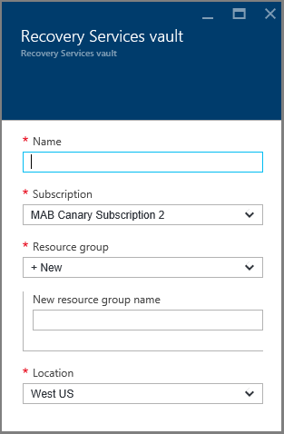
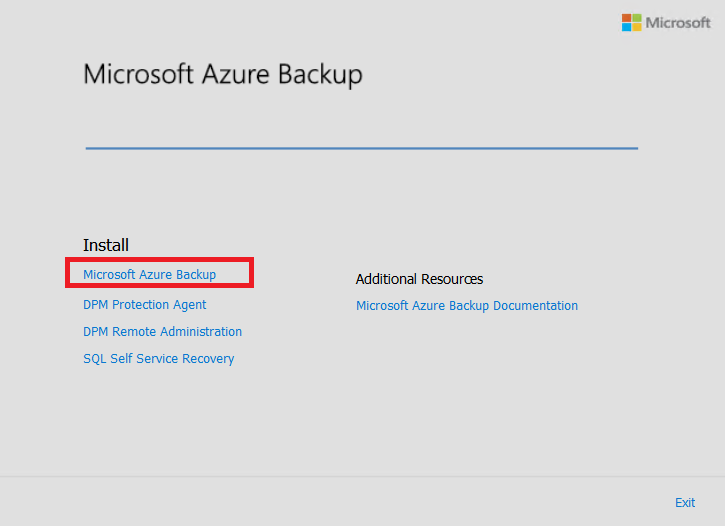
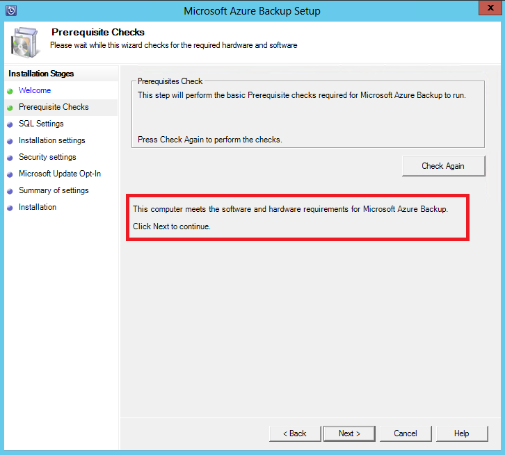
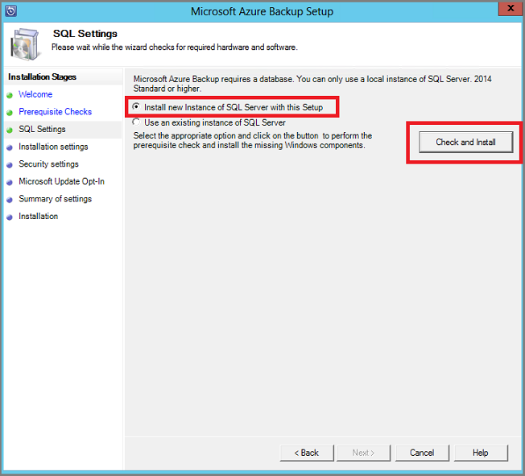
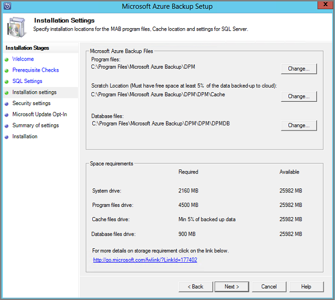
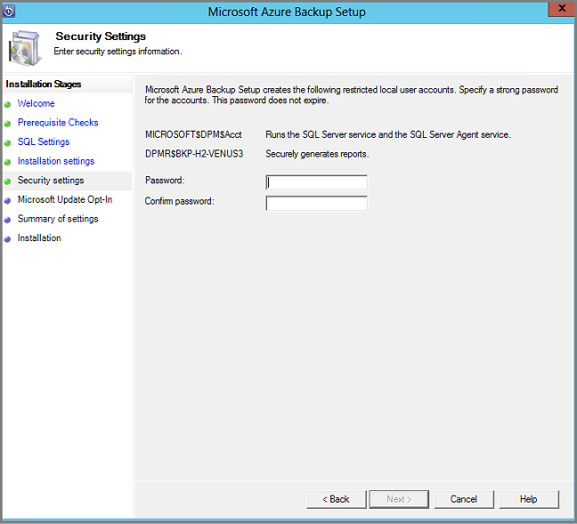
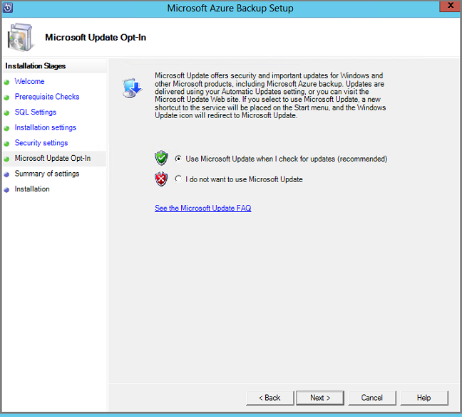
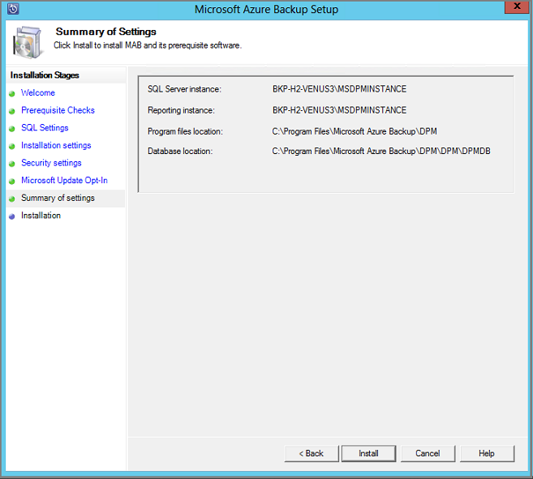
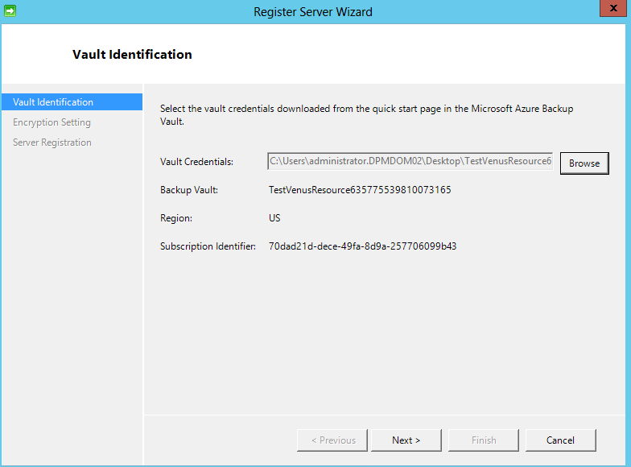
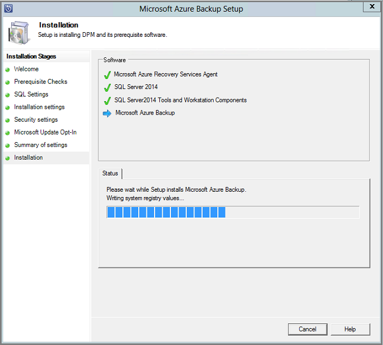

<properties
  pageTitle="Preparing your environment to back up workloads using Azure Backup Server | Microsoft Azure"
  description="Make sure your environment is properly prepared to back up workloads using Azure Backup Server"
  services="backup"
  documentationCenter=""
  authors="trinadhk"
  manager="shreeshd"
  editor=""
  keywords="azure backup server; backup vault"/>

<tags
  ms.service="backup"
  ms.workload="storage-backup-recovery"
  ms.tgt_pltfrm="na"
  ms.devlang="na"
  ms.topic="article"
  ms.date="07/20/2016"
  ms.author="jimpark;trinadhk;pullabhk;markgal"/>

# Preparing to back up workloads using Azure Backup Server

> [AZURE.SELECTOR]
- [Azure Backup Server](backup-azure-microsoft-azure-backup.md)
- [SCDPM](backup-azure-dpm-introduction.md)
- [Azure Backup Server (Classic)](backup-azure-microsoft-azure-backup-classic.md)
- [SCDPM (Classic)](backup-azure-dpm-introduction-classic.md)

This article explains how to prepare your environment to back up workloads using Azure Backup Server. With Azure Backup Server, you can protect application workloads such as Hyper-V VMs, Microsoft SQL Server, SharePoint Server, Microsoft Exchange and Windows clients from a single console. You can also protect information as a server (IaaS) workloads such as VMs in Azure.

> [AZURE.NOTE] Azure has two deployment models for creating and working with resources: [Resource Manager and classic](../resource-manager-deployment-model.md). This article provides the information and procedures for restoring VMs deployed using the Resource Manager model.

Azure Backup Server inherits much of the workload backup functionality from Data Protection Manager (DPM). This article links to DPM documentation to explain some of the shared functionality. Though Azure Backup Server shares much of the same functionality as DPM. Azure Backup Server does not back up to tape, nor does it integrate with System Center.

## 1. Choose an installation platform

The first step towards getting the Azure Backup Server up and running is to set up a Windows Server. Your server can be in Azure or on-premises.

### Using a server in Azure

When choosing a server for running Azure Backup Server, it is recommended you start with a gallery image of Windows Server 2012 R2 Datacenter. The article, [Create your first Windows virtual machine in the Azure portal](..\virtual-machines-windows-hero-tutorial.md), provides a tutorial for getting started with the recommended virtual machine in Azure, even if you've never used Azure before. The recommended minimum requirements for the server virtual machine (VM) should be: A2 Standard with 2 cores and 3.5 GB RAM.

Protecting workloads with Azure Backup Server has many nuances. The article, [Install DPM as an Azure virtual machine](https://technet.microsoft.com/library/jj852163.aspx), helps explain these nuances. Please read this article completely before deploying the machine.

### Using an on-premises server

If you do not want to run the base server in Azure, you can run the server on a Hyper-V VM, a VMware VM, or a physical host. The recommended minimum requirements for the server hardware are 2 cores and 4 GB RAM. The supported operating systems are listed in the following table.

| Operating System        | Platform           | SKU  |
| :------------- |-------------| :-----|
|Windows Server 2012 R2 and latest SPs|	64 bit|	Standard, Datacenter, Foundation|
|Windows Server 2012 and latest SPs|	64 bit|	Datacenter, Foundation, Standard|
|Windows Storage Server 2012 R2 and latest SPs	|64 bit|	Standard, Workgroup|
|Windows Storage Server 2012 and latest SPs	|64 bit	|Standard, Workgroup|


You can deduplicate the DPM storage using Windows Server Deduplication. Learn more about how [DPM and deduplication](https://technet.microsoft.com/library/dn891438.aspx) work together when deployed in Hyper-V VMs.<br/> The FAQ [lists the supported operating systems](backup-azure-backup-faq.md/#installation-amp-configuration) you can use on-premises.

> [AZURE.NOTE]  You cannot install Azure Backup Server on a machine running as a domain controller.

If you plan to join this server to a domain at some point, it is recommended that the domain-joining activity be done before the Azure Backup Server installation. Moving an existing Azure Backup Server machine to a new domain after deployment is *not supported*.

## 2. Recovery Services vault

Whether you send backup data to Azure or keep it locally, the software needs to be connected to Azure. To be more specific, the Azure Backup Server machine needs to be registered with a recovery services vault.

To create a recovery services vault:

1. Sign in to the [Azure portal](https://portal.azure.com/).

2. On the Hub menu, click **Browse** and in the list of resources, type **Recovery Services**. As you begin typing, the list will filter based on your input. Click **Recovery Services vault**.

     <br/>

    The list of Recovery Services vaults is displayed.

3. On the **Recovery Services vaults** menu, click **Add**.

    

    The Recovery Services vault blade opens, prompting you to provide a **Name**, **Subscription**, **Resource group**, and **Location**.

    

4. For **Name**, enter a friendly name to identify the vault. The name needs to be unique for the Azure subscription. Type a name that contains between 2 and 50 characters. It must start with a letter, and can contain only letters, numbers, and hyphens.

5. Click **Subscription** to see the available list of subscriptions. If you are not sure which subscription to use, use the default (or suggested) subscription. There will be multiple choices only if your organizational account is associated with multiple Azure subscriptions.

6. Click **Resource group** to see the available list of Resource groups, or click **New** to create a new Resource group. For complete information on Resource groups, see [Azure Resource Manager overview](../resource-group-overview.md)

7. Click **Location** to select the geographic region for the vault.

8. Click **Create**. It can take a while for the Recovery Services vault to be created. Monitor the status notifications in the upper right-hand area in the portal.
Once your vault is created, it opens in the portal.

### Set Storage Replication

The storage replication option allows you to choose between geo-redundant storage and locally redundant storage. By default, your vault has geo-redundant storage. Leave the option set to geo-redundant storage if this is your primary backup. Choose locally redundant storage if you want a cheaper option that isn't quite as durable. Read more about [geo-redundant](../storage/storage-redundancy.md#geo-redundant-storage) and [locally redundant](../storage/storage-redundancy.md#locally-redundant-storage) storage options in the [Azure Storage replication overview](../storage/storage-redundancy.md).

To edit the storage replication setting:

1. Select your vault to open the vault dashboard and the Settings blade. If the **Settings** blade doesn't open, click **All settings** in the vault dashboard.

2. On the **Settings** blade, click **Backup Infrastructure** > **Backup Configuration** to open the **Backup Configuration** blade. On the **Backup Configuration** blade, choose the storage replication option for your vault.

    

    After choosing the storage option for your vault, you are ready to associate the VM with the vault. To begin the association, you should discover and register the Azure virtual machines.

## 3. Software package

### Downloading the software package
1. Sign in to the [Azure portal](https://portal.azure.com/).

2. If you already have a Recovery Services vault open, proceed to step 3. If you do not have a Recovery Services vault open, but are in the Azure portal,
on the Hub menu, click **Browse**.

    - In the list of resources, type **Recovery Services**.
    - As you begin typing, the list will filter based on your input. When you see **Recovery Services vaults**, click it.

    

    The list of Recovery Services vaults appears.

    - From the list of Recovery Services vaults, select a vault.

    The selected vault dashboard opens.

    

3. Settings blade opens up by default. If it is closed, click on **Settings** to open the settings blade.

    

4. Click on **Backup** in **Getting Started** to open the Getting Started wizard.

    

5. In the Getting Started that opens, Backup Goals screen will be auto-selected.
    

    In the **Backup goals** section, select *on-premises* for *where is your workload running*.

    

6. Select the workloads you want to protect using Azure Backup Server in *what workloads you want to protect* and click on **OK**.

    > [AZURE.NOTE] If you are planning to protect just files and folders, then we recommend using Azure Backup agent. If you are planning to protect more workloads than just files and folders or in future if you are planning to expand the protection needs, select all those workloads.

    This will change the Getting Started wizard to prepare infrastructure for protecting workloads from on-premises to Azure.

    

7. In the **Prepare infrastructure** blade that opens, click on **Download Azure Backup Server** and Vault credentials which you use during registration of Azure Backup Server to recovery services vault. This will take you to the Download Center page from where the software package can be downloaded.

    

8. Select all the files and click **Next**. Download all the files coming in from the Microsoft Azure Backup download page, and place all the files in the same folder.

    

    Since the download size of all the files together is > 3G, on a 10Mbps download link it may take up to 60 minutes for the download to complete.


### Extracting the software package

After you've downloaded all the files, click **MicrosoftAzureBackupInstaller.exe**. This will start the **Microsoft Azure Backup Setup Wizard** to extract the setup files to a location specified by you. Continue through the wizard and click on the **Extract** button to begin the extraction process.

> [AZURE.WARNING] At least 4GB of free space is required to extract the setup files.


Once the extraction process complete, check the box to launch the freshly extracted *setup.exe* to begin installing Microsoft Azure Backup Server and click on the **Finish** button.

### Installing the software package

1. Click **Microsoft Azure Backup** to launch the setup wizard.

    

2. On the Welcome screen click the **Next** button. This takes you to the *Prerequisite Checks* section. On this screen, click on the **Check** button to determine if the hardware and software prerequisites for Azure Backup Server have been met. If all of the prerequisites are have been met successfully, you will see a message indicating that the machine meets the requirements. Click on the **Next** button.

    

3. Microsoft Azure Backup Server requires SQL Server Standard, and the Azure Backup Server installation package comes bundled with the appropriate SQL Server binaries needed. When starting with a new Azure Backup Server installation, you should pick the option **Install new Instance of SQL Server with this Setup** and click the **Check and Install** button. Once the prerequisites are successfully installed, click **Next**.

    

    If a failure occurs with a recommendation to restart the machine, do so and click **Check Again**.

    > [AZURE.NOTE] Azure Backup Server will not work with a remote SQL Server instance. The instance being used by Azure Backup Server needs to be local.

4. Provide a location for the installation of Microsoft Azure Backup server files and click **Next**.

    

    The scratch location is a requirement for back up to Azure. Ensure the scratch location is at least 5% of the data planned to be backed up to the cloud. For disk protection, separate disks need to be configured once the installation completes. For more information regarding storage pools, see [Configure storage pools and disk storage](https://technet.microsoft.com/library/hh758075.aspx).

5. Provide a strong password for restricted local user accounts and click **Next**.

    

6. Select whether you want to use *Microsoft Update* to check for updates and click **Next**.

    >[AZURE.NOTE] We recommend having Windows Update redirect to Microsoft Update, which offers security and important updates for Windows and other products like Microsoft Azure Backup Server.

    

7. Review the *Summary of Settings* and click **Install**.

    

8. The installation happens in phases. In the first phase the Microsoft Azure Recovery Services Agent is installed on the server. The wizard also checks for Internet connectivity. If Internet connectivity is available you can proceed with installation, if not, you need to provide proxy details to connect to the Internet.

    The next step is to configure the Microsoft Azure Recovery Services Agent. As a part of the configuration, you will have to provide your vault credentials to register the machine to the recovery services vault. You will also provide a passphrase to encrypt/decrypt the data sent between Azure and your premises. You can automatically generate a passphrase or provide your own minimum 16-character passphrase. Continue with the wizard until the agent has been configured.

    

9. Once registration of the Microsoft Azure Backup server successfully completes, the overall setup wizard proceeds to the installation and configuration of SQL Server and the Azure Backup Server components. Once the SQL Server component installation completes, the Azure Backup Server components are installed.

    


When the installation step has completed, the product's desktop icons will have been created as well. Just double-click the icon to launch the product.

### Add backup storage

The first backup copy is kept on storage attached to the Azure Backup Server machine. For more information about adding disks, see [Configure storage pools and disk storage](https://technet.microsoft.com/library/hh758075.aspx).

> [AZURE.NOTE] You need to add backup storage even if you plan to send data to Azure. In the current architecture of Azure Backup Server, the Azure Backup vault holds the *second* copy of the data while the local storage holds the first (and mandatory) backup copy.

## 4. Network connectivity

Azure Backup Server requires connectivity to the Azure Backup service for the product to work successfully. To validate whether the machine has the connectivity to Azure, use the ```Get-DPMCloudConnection``` cmdlet in the Azure Backup Server PowerShell console. If the output of the cmdlet is TRUE then connectivity exists, else there is no connectivity.

At the same time, the Azure subscription needs to be in a healthy state. To find out the state of your subscription and to manage it, log in to the [subscription portal]( https://account.windowsazure.com/Subscriptions).

Once you know the state of the Azure connectivity and of the Azure subscription, you can use the table below to find out the impact on the backup/restore functionality offered.

| Connectivity State | Azure Subscription | Backup to Azure| Backup to disk | Restore from Azure | Restore from disk |
| -------- | ------- | --------------------- | ------------------- | --------------------------- | ----------------------- |
| Connected | Active | Allowed | Allowed | Allowed | Allowed |
| Connected | Expired | Stopped | Stopped | Allowed | Allowed |
| Connected | Deprovisioned | Stopped | Stopped | Stopped and Azure recovery points deleted | Stopped |
| Lost connectivity > 15 days | Active | Stopped | Stopped | Allowed | Allowed |
| Lost connectivity > 15 days | Expired | Stopped | Stopped | Allowed | Allowed |
| Lost connectivity > 15 days | Deprovisioned | Stopped | Stopped |  Stopped and Azure recovery points deleted | Stopped |

### Recovering from loss of connectivity
If you have a firewall or a proxy that is preventing access to Azure, you need to whitelist the following domain addresses in the firewall/proxy profile:

- www.msftncsi.com
- \*.Microsoft.com
- \*.WindowsAzure.com
- \*.microsoftonline.com
- \*.windows.net

Once connectivity to Azure has been restored to the Azure Backup Server machine, the operations that can be performed are determined by the Azure subscription state. The table above has details about the operations allowed once the machine is "Connected".

### Handling subscription states

It is possible to take an Azure subscription from an *Expired* or *Deprovisioned* state to the *Active* state. However this has some implications on the product behavior while the state is not *Active*:

- A *Deprovisioned* subscription loses functionality for the period that it is deprovisioned. On turning *Active*, the product functionality of backup/restore is revived. The backup data on the local disk also can be retrieved if it was kept with a sufficiently large retention period. However, the backup data in Azure is irretrievably lost once the subscription enters the *Deprovisioned* state.
- An *Expired* subscription only loses functionality for until it has been made *Active* again. Any backups scheduled for the period that the subscription was *Expired* will not run.


## Troubleshooting

If Microsoft Azure Backup server fails with errors during the setup phase (or backup or restore), refer to this [error codes document](https://support.microsoft.com/kb/3041338)  for more information.
You can also refer to [Azure Backup related FAQs](backup-azure-backup-faq.md)


## Next steps

You can get detailed information about [preparing your environment for DPM](https://technet.microsoft.com/library/hh758176.aspx) on the Microsoft TechNet site. It also contains information about supported configurations on which Azure Backup Server can be deployed and used.

You can use these articles to gain a deeper understanding of workload protection using Microsoft Azure Backup server.

- [SQL Server backup](backup-azure-backup-sql.md)
- [SharePoint server backup](backup-azure-backup-sharepoint.md)
- [Alternate server backup](backup-azure-alternate-dpm-server.md)
