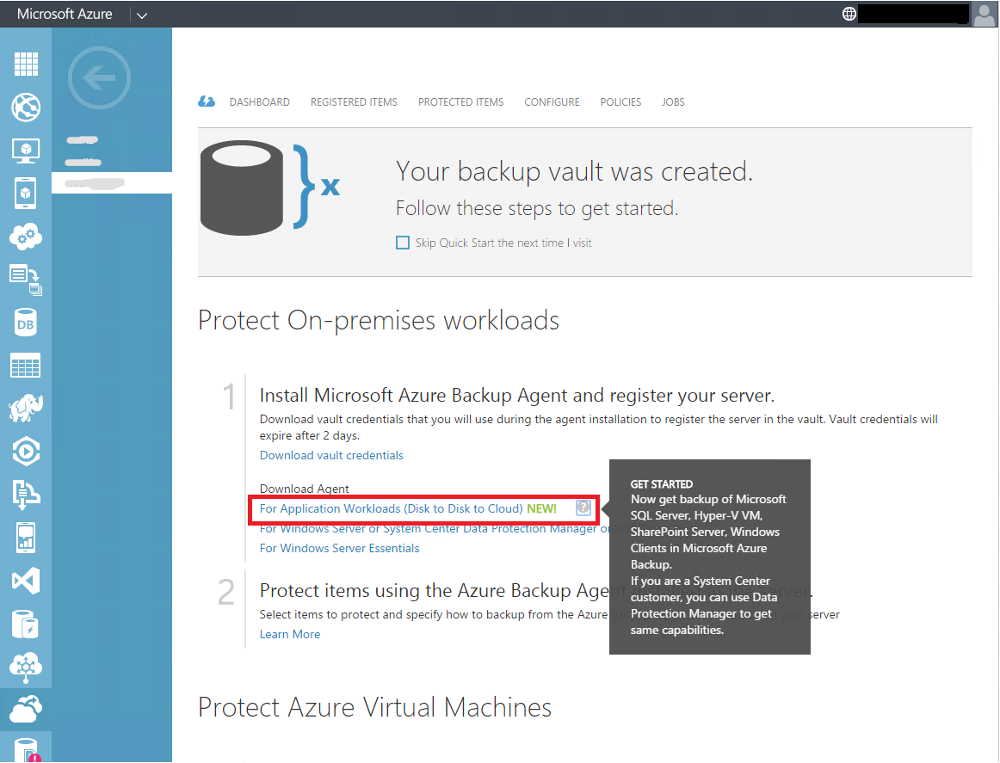
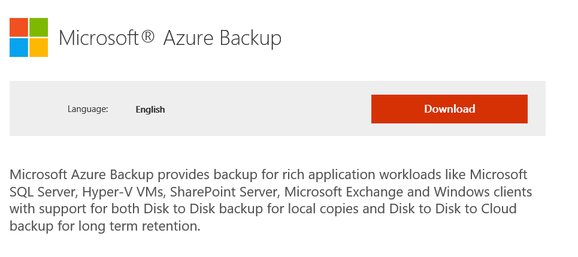
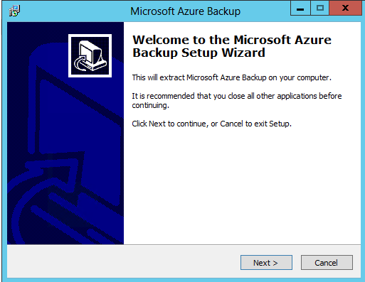
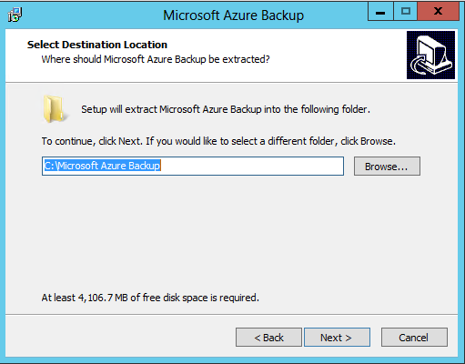
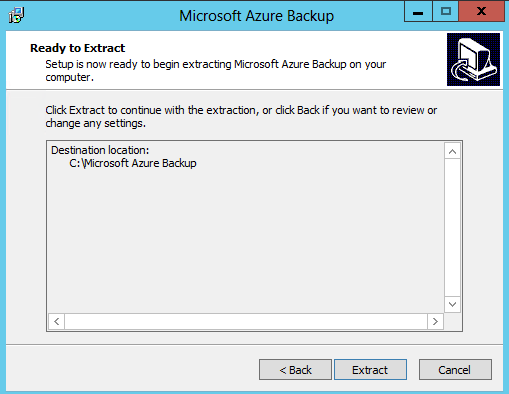
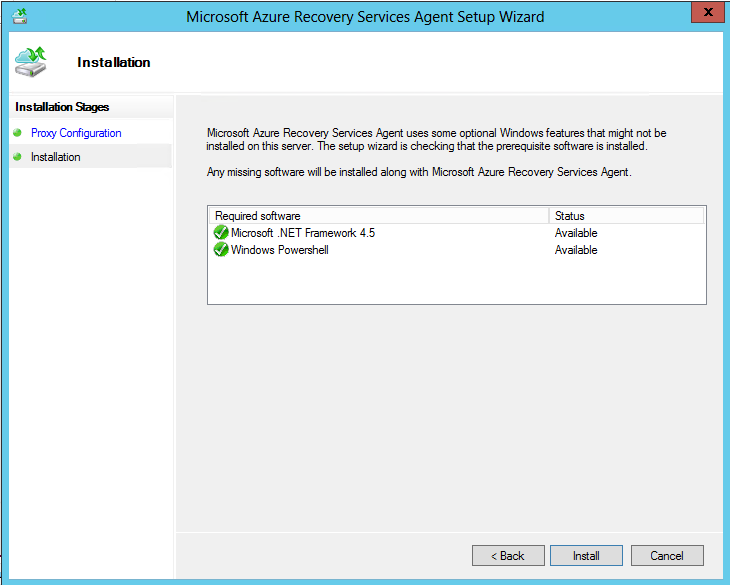
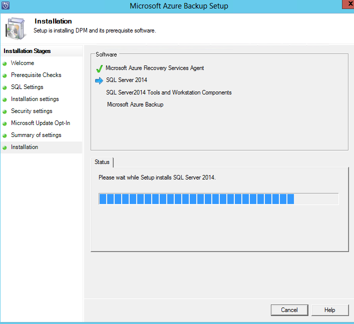
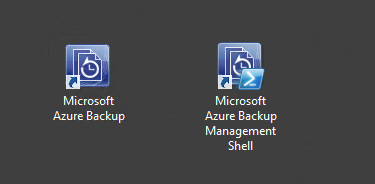

<properties
  pageTitle="Preparing to back up workloads to Microsoft Azure | Microsoft Azure"
  description="This article provides an overview of application workload capabilities into Microsoft Azure Backup"
  services="backup"
  documentationCenter=""
  authors="SamirMehta"
  manager="shreeshd"
  editor=""/>

<tags
  ms.service="backup"
  ms.workload="storage-backup-recovery"
  ms.tgt_pltfrm="na"
  ms.devlang="na"
  ms.topic="article"
  ms.date="10/07/2015"
  ms.author="sammehta; jimpark"/>

# Preparing to back up workloads to Microsoft Azure

> [AZURE.SELECTOR]
- [SCDPM](backup-azure-dpm-introduction.md)
- [Azure Backup](backup-azure-microsoft-azure-backup.md)

This article is about preparing your environment to back up workloads, so you can back up your data to Azure. With Microsoft Azure Backup server, you can protect application workloads such as Hyper-V VMs, Microsoft SQL Server, SharePoint Server, Microsoft Exchange and Windows clients to:

- **Disk** (D2D), giving high RTOs for tier 1 workloads
- **Azure** (D2D2C) for long term retention

And, you can manage the protection of various protected entities (servers and clients) from a single on-premises user interface.

You can deploy Microsoft Azure Backup server as:

- A physical standalone server.
- A Hyper-V virtual machine - You can run DPM as a virtual machine hosted on an on-premises Hyper-V host server to back up on-premises data. For a list of considerations in this environment see [Install DPM as a virtual machine on an on-premises Hyper-V server](https://technet.microsoft.com/library/dn440941.aspx).
- A Windows virtual machine in VMWare - You can deploy DPM to provide protection for Microsoft workloads running on Windows virtual machines in VMWare. In this scenario DPM can be deployed as a physical standalone server, as a Hyper-V virtual machine, or as a Windows virtual machine in VMWare.
- An Azure virtual machine - You can run DPM as a virtual machine in Azure to back up cloud workloads running as Azure virtual machines. For information about this deployment see [Install DPM as an Azure virtual machine](https://technet.microsoft.com/library/hh758176.aspx).

Also,

- Microsoft Azure Backup can be installed on Windows Server 2008 R2 SP1, 2012 and 2012 R2.
- Microsoft Azure Backup server cannot be installed on a machine which has the SCDPM or SCDPM RA agent installed.
- Microsoft Azure Backup server cannot be installed on a machine that has Microsoft Azure Backup agent installed and registered with an Azure Backup vault.

>[AZURE.NOTE] Microsoft Azure Backup server inherits the functionality of Data Protection Manager (DPM) for workload backup, however, it does not provide protection on tape or integrate with System Center.

Once you select the server on which to install Microsoft Azure Backup, you need to:

- Ensure the Microsoft Azure Backup server prerequisites are met
- Create a Backup vault
- Download vault credentials, and
- Download Microsoft Azure Backup server setup files.

Each of these is explained in detail below.

## Before you start

Today, Microsoft Azure Backup server is available for the English locale only. Currently, Microsoft Azure Recovery Services is available in all geographies in which Azure is available other than Microsoft Azure Government datacenter and Microsoft Azure in China.

For a smooth installation, ensure the following prerequisites are met before installing Microsoft Azure backup server.

- The server should have connectivity to Internet. Microsoft Azure should be accessible by the server.
- Server requirements for installing Microsoft Azure Backup are the same as DPM. See these [hardware requirements](https://technet.microsoft.com/library/dn726764.aspx) for additional information.
- Microsoft Azure Backup server must be domain joined.
- Microsoft Azure Backup server must have .Net 3.5, .Net 4.0, .Net 3.5 SP1 features installed. See [more information regarding how to enable .Net Framework](https://technet.microsoft.com/library/dn482071.aspx) for additional information.
- Microsoft Azure Backup server should have Windows Management Framework 4.0 installed. You can download it [here](http://www.microsoft.com/download/details.aspx?id=40855).
- For the disk used as dedicated space for DPM data storage, the recommended storage pool size is 1.5 times the size of protected data. For more information, see the disks and storage section of [this topic](https://technet.microsoft.com/library/hh758176.aspx#DPM server).

Prepare Microsoft Azure Backup server to back up data by:

1. **Creating a Backup vault** — Create a vault in the Azure Backup console.
2. **Downloading the vault credentials** — In Azure Backup, upload the management certificate you created to the vault.
3. **Downloading Microsoft Azure Backup server** — You can download Microsoft Azure Backup server for application workloads from the Quick Start Page of a backup vault.

[AZURE.INCLUDE [backup-create-vault](../../includes/backup-create-vault.md)]

[AZURE.INCLUDE [backup-download-credentials](../../includes/backup-download-credentials.md)]

## Download Microsoft Azure Backup server
Similar to vault credentials, you can download Microsoft Azure Backup for application workloads from the **Quick Start Page** of the backup vault.

1. Click **For Application Workloads (Disk to Disk to Cloud)**.

    

2. Click **Download**.

    

3. Select all the files and click **Next**.


    >[AZURE.NOTE] Since the download size of all the files together is > 3G, on a 10Mbps download link it may take up to 60 minutes for the download to complete.

4. Place all the files in the same folder.

5. Download all the files coming in from the Microsoft Azure Backup download page.

## Install Microsoft Azure Backup server
Ensure that the prerequisites mentioned in previous section are met before launching the setup.

1. After you've downloaded all the files, click **MicrosoftAzureBackupInstaller.exe**. The **Microsoft Azure Backup Setup Wizard** will appear.

    

2. Provide the location on this server where the files will be extracted and click **Next**.

    

3. Click on **Extract** to begin extracting the setup files.

    

4. Check the box to launch setup.exe to begin installing Microsoft Azure Backup server and click **Finish**.

    

5. Click **Microsoft Azure Backup** to launch the setup wizard.

    

6. On the Welcome screen click **Next**.

    

7. Click **Check** to determine if the hardware and software prerequisites for Microsoft Azure Backup server are have been met.

    

8. If all of the prerequisites are have been met successfully, you will see a message indicating that the computer meets the requirements. Click **Next**.

    

9. Microsoft Azure Backup server requires SQL Server Standard. Select an existing 2014 SQL Server Standard local instance or let the wizard install SQL Server Standard. Click **Check and Install** to make sure server has required SQL prerequisites installed.

    

    If a failure occurs with a recommendation to restart the machine, do so and click **Check Again**.

    

10. Once the prerequisites are successfully installed, click **Next**.

    

11. Provide a location for the installation of Microsoft Azure Backup server files and click **Next**.

    

    >[AZURE.NOTE] Scratch location is a requirement for back up to Azure. Ensure the scratch location is at least 5% of the data planned to be backed up to the cloud. For disk protection, separate disks need to be configured once the installation completes. For more information regarding storage pools, see [Configure storage pools and disk storage](https://technet.microsoft.com/library/hh758075.aspx).

12. Provide a strong password for restricted local user accounts and click **Next**.

    

    >[AZURE.NOTE] Setting strong passwords is essential to the security of your system. A strong password is a password that is at least six characters long, does not contain all or part of the user’s account name, and contains at least three of the following four categories of characters: uppercase characters, lowercase characters, base 10 digits, and symbols (such as !, @, #).

13. Select whether you want to use *Microsoft Update* to check for updates and click **Next**.

    >[AZURE.NOTE] We recommend having Windows Update redirect to Microsoft Update, which offers security and important updates for Windows and other products like Microsoft Azure Backup server.

    

14. Review the *Summary of Settings* and click **Install**.

    

    The installation happens in phases. In the first phase an agent is installed on the server and you need to register the server with the valid Azure backup vault credentials that you downloaded with this product. The wizard then checks for direct Internet connectivity. If Internet connectivity is available you can proceed with installation, if not, you need to provide proxy details to connect to the Internet.

15. Click **Next** to launch the installation phase of the Microsoft Azure Recovery Services Agent.

    

    The wizard checks for prerequisites and installs them if it finds any missing.

16. Click **Install**.

    

17. When the installation of the agent completes, click **Next** to register this server with Azure Backup vault.

    

18. Provide your Azure Backup vault credentials to register the server and click **Next**.

    

19. Provide a passphrase used to encrypt/decrypt the data sent to Azure and provide a location to store this passphrase. You can automatically generate a passphrase or provide your own minimum 16-character passphrase. Click **Next**.

    

    >[AZURE.NOTE] To maintain confidentiality, Microsoft Azure Backup server does not send this passphrase along with data to Azure. You need to store this passphrase, which will be needed when you restore data from Azure, in a secure location.

    Once registration of the Microsoft Azure Backup server successfully completes, the installation proceeds to the installation and configuration of SQL Server Standard 2014 (if chosen).

    

    Once SQL installation completes Microsoft Azure Backup server components are installed.

    

20. When the product is installed and the desktop icons have been created, double-click the icon to launch the product.

    

## Add a disk to the storage pool

To back up workloads to disk and Azure, you first need to add a disk to the storage pool. For more information about adding disks, see [Configure storage pools and disk storage](https://technet.microsoft.com/library/hh758075.aspx).

Once the storage pools are configured you can back up application workloads to both disk and Azure.

## Troubleshooting

If Microsoft Azure Backup server fails with errors during the setup phase (or backup or restore), refer to this [error codes document](https://support.microsoft.com/kb/3041338)  for more information.
You can also refer to [Azure Backup related FAQs](backup-azure-backup-faq.md)

## FAQs

### Installation and deployment

Q: Is NTFS compression supported on Microsoft Azure Backup server disks/volumes which are used for disk backups?
<br>A: NTFS is **not** supported on disks/volumes attached to Microsoft Azure Backup server.

Q: Can I move Microsoft Azure Backup server to a new domain post deployment?
<br>A: No, moving Microsoft Azure Backup server to a new domain post deployment is **not** supported.

Q: What resources can Microsoft Azure Backup server protect if installed on a domain controller?
<br>A: Microsoft Azure Backup server can only protect local data sources if co-installed on the same server as a domain controller. For Microsoft Azure Backup server to protect workloads on other servers, do not install it on same machine as domain controller.

Q: Can Microsoft Azure Backup server use a remote SQL Server instance?
<br>A: No, Microsoft Azure Backup server can only use a local SQL Server instance.

### Microsoft Azure Backup server storage pool

Q: Can I provide a virtual disk (VHD/HDx) in the Microsoft Azure Backup server storage pool?
<br>A: Yes.

Q: Can I get dedup on a Microsoft Azure Backup server storage pool?
<br>A: Yes, dedup is available on a Microsoft Azure Backup server storage pool. The user experience for Microsoft Azure Backup server is exactly as detailed in this [DPM blog post](http://blogs.technet.com/b/dpm/archive/2015/01/06/deduplication-of-dpm-storage-reduce-dpm-storage-consumption.aspx).

Q: Can USB or removal drives be used for a Microsoft Azure Backup server storage pool?
<br>A: No.

### Microsoft Azure Backup server Connectivity to Azure service

Q: How does Microsoft Azure Backup server connectivity to Azure service and Azure subscription state affect backups and restore?
<br>A: Microsoft Azure Backup server requires connectivity to Azure service for the product to work successfully. At the same time, the Azure subscription needs to be in a healthy state.

The table below explains the functionality of Microsoft Azure Backup server with respect to different connectivity and Azure subscription states.

| Connectivity State | Azure Subscription | Backup to Azure| Backup to disk | Restore from Azure | Restore from disk |
| -------- | ------- | --------------------- | ------------------- | --------------------------- | ----------------------- |
| Connected | Active | Allowed | Allowed | Allowed | Allowed |
| Connected | Expired | Stopped | Stopped | Allowed | Allowed |
| Normal | Deprovisioned | Stopped | Stopped | Stopped and Azure recovery points deleted | Stopped |
| Lost connectivity > 15 days | Active | Stopped | Stopped | Allowed | Allowed |
| Lost connectivity > 15 days | Expired | Stopped | Stopped | Allowed | Allowed |
| Lost connectivity > 15 days | Deprovisioned | Stopped | Stopped |  Stopped and Azure recovery points deleted | Stopped |

Q: Assuming the subscription state continues to be *Active* what happens if Microsoft Azure Backup server connectivity is restored?
<br>A: Once Microsoft Azure Backup server connectivity to Azure service resumes as normal and the subscription state is *Active*, all operations of Microsoft Azure Backup server are allowed. Backups to both disk, as well as to Azure, will perform as normal.

Q: What happens if the subscription state is restored from an *Expired* state to an *Active* state?
<br>A: Assuming Microsoft Azure Backup server connectivity to the Azure service is normal, once the Microsoft Azure Backup server subscription state is restored to *Active*, all operations of Microsoft Azure Backup server are allowed. Backups to both disk, as well as to Azure, will now perform as normal.

Q: What happens if the subscription state is restored from a *Deprovisioned* state to an *Active* state?
<br>A: Assuming Microsoft Azure Backup server connectivity to the Azure service is normal, once the Microsoft Azure Backup server subscription state is restored to *Active*, all operations of Microsoft Azure Backup server are allowed. However, Azure recovery points get deleted and cannot be restored. Disk recovery points can be restored if the disk backups are in a valid retention range.

Q: What exceptions do I need to create for allowing Microsoft Azure Backup server connectivity to a public Azure service?
<br>A: You need to allow the following domain addresses in the firewall profile - www.msftncsi.com, \*.Microsoft.com, \*.WindowsAzure.com, \*.microsoftonline.com, \*.windows.net.

Q: How can I validate whether Microsoft Azure Backup server has connectivity to the Azure service?
<br>A: Execute the following PowerShell cmdlet in the Microsoft Azure Backup server console:

```
Get-DPMCloudConnection
Output:
TRUE - Connected to Azure service
FALSE - Not connected to Azure service
```

Q: Why is my subscription state not *Active*? How do I change it to *Active*?
<br>A: Log on to the [subscription portal]( https://account.windowsazure.com/Subscriptions) and manage your subscription.

### Billing

Q: What is the billing model for Microsoft Azure Backup server?
<br>A: Users will be billed via a protected instance model. For more information, refer to the FAQs on the [pricing](http://azure.microsoft.com/pricing/details/backup/) page.

Q: What is the billing model if I only protected data on disk?
<br>A: The billing model is the same as the protected instance model. Since this data is protected on on-premises storage there is no Azure storage charge for only disk-based backups. In this case only the protected instance fee would be billed to the customer. For more information about what defines an instance and how much is charged per instance, refer to the FAQs on the [pricing ](http://azure.microsoft.com/pricing/details/backup/) page.

Q: What is the charge per protected instance?
<br>A: Refer to the [pricing ](http://azure.microsoft.com/pricing/details/backup/) page.

Q: Where can I find examples that highlight different application workloads and the protected instance fee for them?
<br>A: Refer to the "Examples section" on the [pricing ](http://azure.microsoft.com/pricing/details/backup/) page.

Q: How would Microsoft Azure Backup server bill for a datasource which is protected on disk as well as cloud?
<br>A: Regardless of whether data is backed up to disk or cloud, Microsoft Azure backup server would charge based on protected instances. Protected instance size is calculated based on the front end size of the datasource. For backup data in Azure storage, Azure storage costs also apply.

## Next steps

You can use these articles to gain a deeper understanding of workload protection using Microsoft Azure Backup server.

- [SQL Server backup](backup-azure-backup-sql.md)
- [SharePoint server backup](backup-azure-backup-sharepoint.md)
- [Alternate server backup](backup-azure-alternate-dpm-server.md)
