# Install and upgrade Azure Backup Server

> [!div class="op_single_selector"]
>
> * [Azure Backup Server](backup-azure-microsoft-azure-backup.md)
> * [SCDPM](backup-azure-dpm-introduction.md)
>
>

> Applies To: MABS v4.

This article explains how to prepare your environment to back up workloads using Microsoft Azure Backup Server (MABS). With Azure Backup Server, you can protect application workloads, such as Hyper-V VMs, VMware VMs, Azure Stack HCI VMs, Microsoft SQL Server, SharePoint Server, Microsoft Exchange, and Windows clients from a single console.

> [!NOTE]
> To learn more about backing up VMware servers with Azure Backup Server, see the article, [Use Azure Backup Server to back up a VMware server](backup-azure-backup-server-vmware.md). To learn about security capabilities, refer to [Azure Backup security features documentation](backup-azure-security-feature.md).
>
>

MABS deployed in an Azure VM can back up VMs in Azure but they should be in same domain to enable backup operation. The process to back an Azure VM remains same as backing up VMs on premises, however deploying MABS in Azure has some limitations. For more information on limitation, see [DPM as an Azure virtual machine](/system-center/dpm/install-dpm#setup-prerequisites).

> [!NOTE]
> Azure has two deployment models for creating and working with resources: [Resource Manager and classic](../azure-resource-manager/management/deployment-models.md). This article provides the information and procedures for restoring VMs deployed using the Resource Manager model.
>
>

Azure Backup Server inherits much of the workload backup functionality from Data Protection Manager (DPM). This article links to DPM documentation to explain some of the shared functionality. Though Azure Backup Server shares much of the same functionality as DPM, Azure Backup Server doesn't back up to tape, nor does it integrate with System Center.

## Choose an installation platform

The first step towards getting the Azure Backup Server up and running is to set up a Windows Server. Your server can be in Azure or on-premises.

* To protect on-premises workloads, the MABS server must be located on-premises, and connected to a domain.
* To protect workloads running on Azure VMs, the MABS server must be located in Azure, running as an Azure VM, and connected to a domain.

### Using a server in Azure

When choosing a server for running Azure Backup Server, it's recommended you start with a gallery image of Windows Server 2022 Datacenter or Windows Server 2019 Datacenter. The article, [Create your first Windows virtual machine in the Azure portal](../virtual-machines/windows/quick-create-portal.md?toc=/azure/virtual-machines/windows/toc.json), provides a tutorial for getting started with the recommended virtual machine in Azure, even if you've never used Azure before. The recommended minimum requirements for the server virtual machine (VM) should be: Standard_A4_v2  with four cores and 8-GB RAM.

Protecting workloads with Azure Backup Server has many nuances. The [protection matrix for MABS](./backup-mabs-protection-matrix.md) helps explain these nuances. Before deploying the machine, read this article completely.

### Using an on-premises server

If you don't want to run the base server in Azure, you can run the server on a Hyper-V VM, a VMware VM, or a physical host. The recommended minimum requirements for the server hardware are two cores and 8-GB RAM. The supported operating systems are listed in the following table:

| Operating System | Platform | SKU |
|:--- | --- |:--- |
| Windows Server 2022 |64 bit |Standard, Datacenter, Essentials |
| Windows Server 2019 |64 bit |Standard, Datacenter, Essentials  |

You can deduplicate the DPM storage using Windows Server Deduplication. Learn more about how [DPM and deduplication](/system-center/dpm/deduplicate-dpm-storage) work together when deployed in Hyper-V VMs.

> [!NOTE]
> Azure Backup Server is designed to run on a dedicated, single-purpose server. You can't install Azure Backup Server on:
>
> * A computer running as a domain controller
> * A computer on which the Application Server role is installed
> * A computer that's a System Center Operations Manager management server
> * A computer on which Exchange Server is running
> * A computer that's a node of a cluster
>
> Installing Azure Backup Server isn't supported on Windows Server Core or Microsoft Hyper-V Server.

Always join Azure Backup Server to a domain. Moving an existing Azure Backup Server machine to a new domain after deployment is *not supported*.

Whether you send backup data to Azure, or keep it locally, Azure Backup Server must be registered with a Recovery Services vault.

>[!Note]
>If you encounter difficulties to register to a vault or other errors, ensure that you've the MARS agent version 2.0.9249.0 or above installed. If not, we recommend you to install the latest version [from here](https://aka.ms/azurebackup_agent).

[!INCLUDE [backup-create-rs-vault.md](../../includes/backup-create-rs-vault.md)]

### Set storage replication

The storage replication option allows you to choose between geo-redundant storage and locally redundant storage. By default, Recovery Services vaults use geo-redundant storage. If this vault is your primary vault, leave the storage option set to geo-redundant storage. Choose locally redundant storage if you want a cheaper option that isn't quite as durable. Read more about [geo-redundant](../storage/common/storage-redundancy.md#geo-redundant-storage), [locally redundant](../storage/common/storage-redundancy.md#locally-redundant-storage), and [zone-redundant](../storage/common/storage-redundancy.md#zone-redundant-storage) storage options in the [Azure Storage replication overview](../storage/common/storage-redundancy.md).

To edit the storage replication setting:

1. From the **Recovery Services vaults** pane, select the new vault. Under the **Settings** section, select  **Properties**.
2. In **Properties**, under **Backup Configuration**, select **Update**.

3. Select the storage replication type, and select **Save**.

     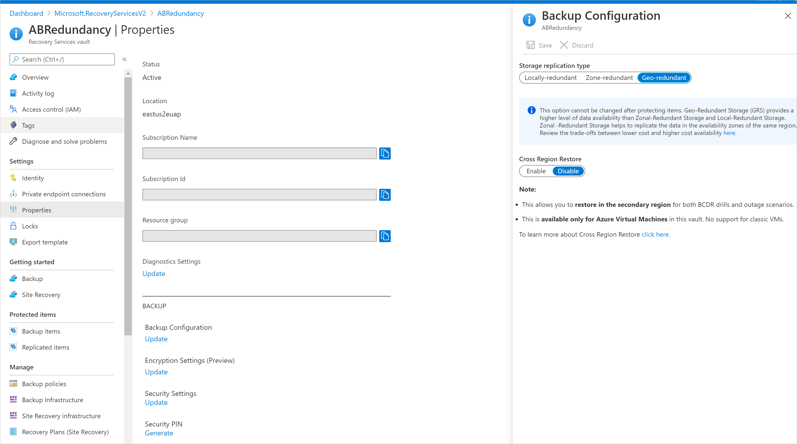

## Software package

### Downloading the software package

1. Sign in to the [Azure portal](https://portal.azure.com/).
2. If you already have a Recovery Services vault open, continue to step 3. If you don't have a Recovery Services vault open, but are in the Azure portal, on the main menu, select **Browse**.

   * In the list of resources, type **Recovery Services**.
   * As you begin typing, the list will filter based on your input. When you see **Recovery Services vaults**, select it.

     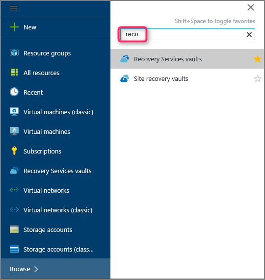

     The list of Recovery Services vaults appears.
   * From the list of Recovery Services vaults, select a vault.

     The selected vault dashboard opens.

     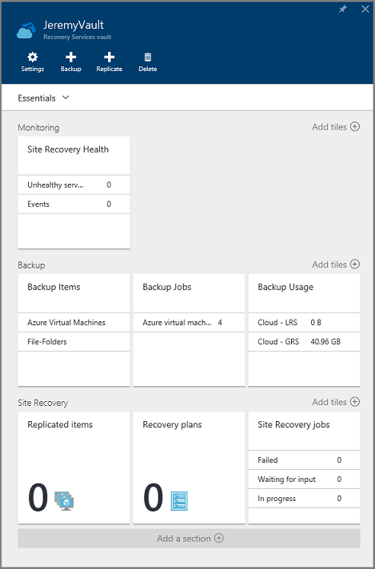
3. The **Settings** pane opens up by default. If it's closed, select **Settings** to open the settings pane.

    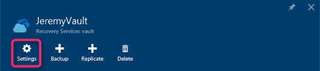
4. Select **Backup** to open the Getting Started wizard.

    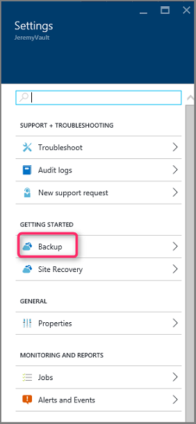

    In the **Getting Started with backup** pane that opens, **Backup Goals** will be auto-selected.

    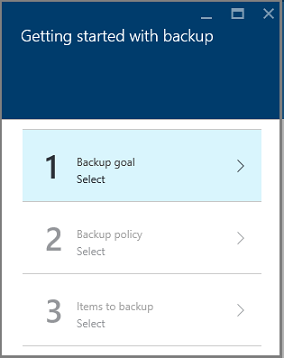

5. In the **Backup Goal** pane, from the **Where is your workload running** menu, select **On-premises**.

    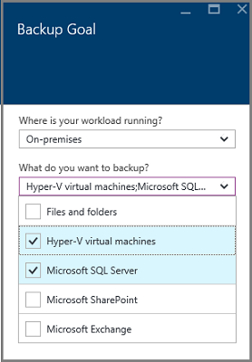

    From the **What do you want to back up?** drop-down menu, select the workloads you want to protect using Azure Backup Server, and then select **OK**.

    The **Getting Started with backup** wizard switches the **Prepare infrastructure** option to back up workloads to Azure.

   > [!NOTE]
   > If you only want to back up files and folders, we recommend using the Azure Backup agent and following the guidance in the article, [First look: back up files and folders](./backup-windows-with-mars-agent.md). If you're going to protect more than files and folders, or you're planning to expand the protection needs in the future, select those workloads.
   >
   >

    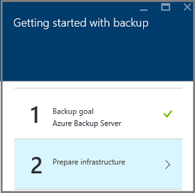

6. In the **Prepare infrastructure** pane that opens, select the **Download** links for Install Azure Backup Server and Download vault credentials. You use the vault credentials during registration of Azure Backup Server to the Recovery Services vault. The links take you to the Download Center where the software package can be downloaded.

    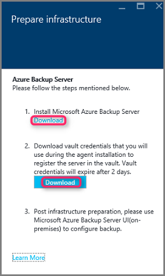

7. Select all the files and select **Next**. Download all the files coming in from the Microsoft Azure Backup download page, and place all the files in the same folder.

    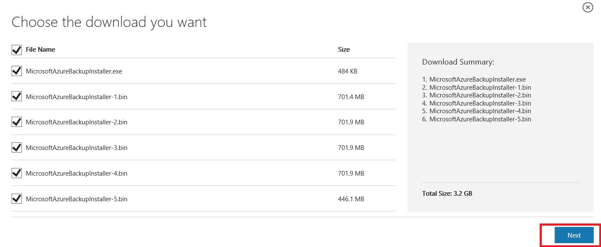

    Since the download size of all the files together is > 3 GB, on a 10-Mbps download link it may take up to 60 minutes for the download to complete.

### Extracting the software package

After you've downloaded all the files, select **MicrosoftAzureBackupInstaller.exe**. This will start the **Microsoft Azure Backup Setup Wizard** to extract the setup files to a location specified by you. Continue through the wizard and select the **Extract** button to begin the extraction process.

> [!WARNING]
> At least 4 GB of free space is required to extract the setup files.
>
>

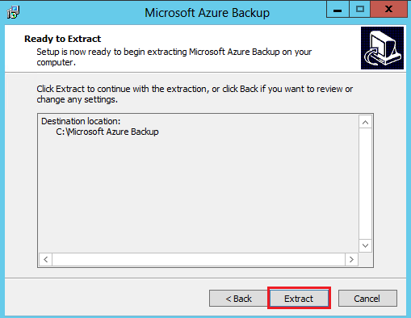

Once the extraction process completes, check the box to launch the freshly extracted *setup.exe* to begin installing Microsoft Azure Backup Server and select the **Finish** button.

### Installing the software package

1. Select **Microsoft Azure Backup Server** to launch the setup wizard.

    :::image type="content" source="./media/backup-azure-microsoft-azure-backup/launch-setup-wizard.png" alt-text="Screenshot shows Microsoft Azure Backup Setup Wizard.":::
2. On the **Welcome** screen, select **Next**.

   This takes you to the *Prerequisite Checks* section. On this screen, select **Check** to determine if the hardware and software prerequisites for Azure Backup Server have been met. If all prerequisites are met successfully, you'll see a message indicating that the machine meets the requirements. Select the **Next** button.

    :::image type="content" source="./media/backup-azure-microsoft-azure-backup/prereq/welcome-screen.png" alt-text="Screenshot shows Azure Backup Server welcome and prerequisites check.":::
3. The Azure Backup Server installation package comes bundled with the appropriate SQL Server binaries needed. When starting  a new Azure Backup Server installation, pick the option **Install new Instance of SQL Server with this Setup** and select the **Check and Install** button. Once the prerequisites are successfully installed, select **Next**.

    >[!NOTE]
    >
    >If you wish to use your own SQL server, the supported SQL Server versions are SQL Server 2022 and 2019. All SQL Server versions should be Standard or Enterprise 64-bit.
    >Azure Backup Server won't work with a remote SQL Server instance. The instance being used by Azure Backup Server needs to be local. If you're using an existing SQL server for MABS, the MABS setup only supports the use of *named instances* of SQL server.

    :::image type="content" source="./media/backup-azure-microsoft-azure-backup/sql/install-new-instance-of-sql-server.png" alt-text="Screenshot shows Azure Backup Server SQL check.":::

    If a failure occurs with a recommendation to restart the machine, do so and select **Check Again**. If there are any SQL configuration issues, reconfigure SQL according to the SQL guidelines and retry to install/upgrade MABS using the existing instance of SQL.

   **Manual configuration**

   When you use your own instance of SQL, make sure you add builtin\Administrators to sysadmin role to master DB.

    **SSRS Configuration with SQL**

    When you're using your own instance of SQL 2019 or 2022 with MABS V4, you need to manually configure SSRS. After SSRS configuration, ensure that *IsInitialized* property of SSRS is set to *True*. When this is set to True, MABS assumes that SSRS is already configured and will skip the SSRS configuration.

    Use the following values for SSRS configuration:
    * Service Account: ‘Use built-in account’ should be Network Service
    * Web Service URL: ‘Virtual Directory’ should be ReportServer_\<SQLInstanceName>
    * Database: DatabaseName should be ReportServer$\<SQLInstanceName>
    * Web Portal URL: ‘Virtual Directory’ should be Reports_\<SQLInstanceName>

    [Learn more](/sql/reporting-services/report-server/configure-and-administer-a-report-server-ssrs-native-mode) about SSRS configuration.

    > [!NOTE]
    > Licensing for SQL Server used as the database for MABS is governed by [Microsoft Online Services Terms](https://www.microsoft.com/licensing/product-licensing/products) (OST). According to OST, SQL Server bundled with MABS can be used only as the database for MABS.

4. Provide a location for the installation of Microsoft Azure Backup server files and select **Next**.

    :::image type="content" source="./media/backup-azure-microsoft-azure-backup/space-screen.png" alt-text="Screenshot shows how to provide location for installation of files.":::

    The scratch location is a requirement for back up to Azure. Ensure the scratch location is at least 5% of the data planned to be backed up to the cloud. For disk protection, separate disks need to be configured once the installation completes. For more information about storage pools, see [Prepare data storage](/system-center/dpm/plan-long-and-short-term-data-storage).

    Capacity requirements for disk storage depend primarily on the size of the protected data, the daily recovery point size, expected volume data growth rate, and retention range objectives. We recommend you make the disk storage twice size of the protected data. This assumes a daily recovery point size that's 10% of the protected data size and a 10 days retention range. To get a good estimate of size, review the [DPM Capacity Planner](https://www.microsoft.com/download/details.aspx?id=54301). 

5. Provide a strong password for restricted local user accounts and select **Next**.

    :::image type="content" source="./media/backup-azure-microsoft-azure-backup/security-screen.png" alt-text="Screenshot shows how to provide strong password.":::
6. Select whether you want to use *Microsoft Update* to check for updates and select **Next**.

   > [!NOTE]
   > We recommend having Windows Update redirect to Microsoft Update, which offers security and important updates for Windows and other products like Microsoft Azure Backup Server.
   >
   >

    :::image type="content" source="./media/backup-azure-microsoft-azure-backup/update-opt-screen2.png" alt-text="Screenshot shows the Microsoft Update Opt-In page.":::
7. Review the *Summary of Settings* and select **Install**.

    :::image type="content" source="./media/backup-azure-microsoft-azure-backup/summary-screen.png" alt-text="Screenshot shows the summary of settings.":::

8. The installation happens in phases. In the first phase, the Microsoft Azure Recovery Services Agent is installed on the server. The wizard also checks for Internet connectivity. If Internet connectivity is available, you can continue with the installation. If not, you need to provide proxy details to connect to the Internet.

    >[!Important]
    >If you run into errors in vault registration, ensure that you're using the latest version of the MARS agent, instead of the version packaged with MABS server. You can download the latest version [from here](https://aka.ms/azurebackup_agent) and replace the *MARSAgentInstaller.exe* file in *MARSAgent* folder in the extracted path before installation and registration on new servers.

    The next step is to configure the Microsoft Azure Recovery Services Agent. As a part of the configuration, you'll have to provide your vault credentials to register the machine to the Recovery Services vault. You'll also provide a passphrase to encrypt/decrypt the data sent between Azure and your premises. You can automatically generate a passphrase or provide your own minimum 16-character passphrase. Continue with the wizard until the agent has been configured.

    :::image type="content" source="./media/backup-azure-microsoft-azure-backup/mars/register-server-wizard.png" alt-text="Screenshot shows the Register Server Wizard.":::
9. Once registration of the Microsoft Azure Backup server successfully completes, the overall setup wizard proceeds to the installation and configuration of SQL Server and the Azure Backup Server components. Once the SQL Server component installation completes, the Azure Backup Server components are installed.

    :::image type="content" source="./media/backup-azure-microsoft-azure-backup/final-install/venus-installation-screen.png" alt-text="Screenshot shows the Azure Backup Server setup progress.":::

When the installation step has completed, the product's desktop icons will have been created as well. Double-click the icon to launch the product.

### Add backup storage

The first backup copy is kept on storage attached to the Azure Backup Server machine. For more information about adding disks, see [Configure storage pools and disk storage](./backup-mabs-add-storage.md).

> [!NOTE]
> You need to add backup storage even if you plan to send data to Azure. In the current architecture of Azure Backup Server, the Azure Backup vault holds the *second* copy of the data while the local storage holds the first (and mandatory) backup copy.
>
>

### Install and update the Data Protection Manager protection agent

MABS uses the System Center Data Protection Manager protection agent. [Here are the steps](/system-center/dpm/deploy-dpm-protection-agent) to install the Protection Agent on your Protection Servers.

The following sections describe how to update protection agents for client computers.

1. In the Backup Server Administrator Console, select **Management** > **Agents**.

2. In the display pane, select the client computers for which you want to update the protection agent.

   > [!NOTE]
   > The **Agent Updates** column indicates when a protection agent update is available for each protected computer. In the **Actions** pane, the **Update** action is available only when a protected computer is selected and updates are available.
   >
   >

3. To install updated protection agents on the selected computers, in the **Actions** pane, select **Update**.

4. For a client computer that isn't connected to the network, until the computer is connected to the network, the **Agent Status** column shows a status of **Update Pending**.

   After a client computer is connected to the network, the **Agent Updates** column for the client computer shows a status of **Updating**.

## Move MABS to a new server

Here are the steps if you need to move MABS to a new server, while retaining the storage. This can be done only if all the data is on Modern Backup Storage.

  > [!IMPORTANT]
  >
  > * The new server name must have the same name as the original Azure Backup Server instance. You can't change the name of the new Azure Backup Server instance if you want to use the previous storage pool and MABS Database (DPMDB) to retain recovery points.
  > * You must have a backup of the MABS Database (DPMDB). You'll need it to restore the database.

1. In the display pane, select the client computers for which you want to update the protection agent.
2. Shut down the original Azure Backup server or take it offline.
3. Reset the machine account in Active Directory.
4. Install Windows Server on a new machine and give it the same machine name as the original Azure Backup server.
5. Join the domain.
6. Install Azure Backup Server V4 or later (move MABS Storage pool disks from old server and import).
7. Restore the DPMDB taken in step 1.
8. Attach the storage from the original backup server to the new server.
9. From SQL, restore the DPMDB.
10. Run CMD (as an administrator) on the new server. Go to the Microsoft Azure Backup install location and bin folder.

    Path example:
    `C:\windows\system32>cd "c:\Program Files\Microsoft Azure Backup\DPM\DPM\bin\"`

11. To connect to Azure Backup, run `DPMSYNC -SYNC`.

    If you've added **new** disks to the DPM Storage pool instead of moving the old ones, then run `DPMSYNC -Reallocatereplica`.

## Network connectivity

Azure Backup Server requires connectivity to the Azure Backup service for the product to work successfully. To validate whether the machine has the connectivity to Azure, use the ```Get-DPMCloudConnection``` cmdlet in the Azure Backup Server PowerShell console. If the output of the cmdlet is TRUE, then connectivity exists, otherwise there's no connectivity.

At the same time, the Azure subscription needs to be in a healthy state. To find out the state of your subscription and to manage it, sign in to the [subscription portal](https://account.windowsazure.com/Subscriptions).

Once you know the state of the Azure connectivity and of the Azure subscription, you can use the table below to find out the impact on the backup/restore functionality offered.

| Connectivity State | Azure Subscription | Back up to Azure | Back up to disk | Restore from Azure | Restore from disk |
| --- | --- | --- | --- | --- | --- |
| Connected |Active |Allowed |Allowed |Allowed |Allowed |
| Connected |Expired |Stopped |Stopped |Allowed |Allowed |
| Connected |Deprovisioned |Stopped |Stopped |Stopped and Azure recovery points deleted |Stopped |
| Lost connectivity > 15 days |Active |Stopped |Stopped |Allowed |Allowed |
| Lost connectivity > 15 days |Expired |Stopped |Stopped |Allowed |Allowed |
| Lost connectivity > 15 days |Deprovisioned |Stopped |Stopped |Stopped and Azure recovery points deleted |Stopped |

### Recovering from loss of connectivity

If your machine has limited internet access, ensure that firewall settings on the machine or proxy allow the following URLs and IP addresses:

* URLs
  * `www.msftncsi.com`
  * `*.Microsoft.com`
  * `*.WindowsAzure.com`
  * `*.microsoftonline.com`
  * `*.windows.net`
  * `www.msftconnecttest.com`
  *  `www.msftconnecttest.com`
  * `*.blob.core.windows.net`
  * `*.queue.core.windows.net`
  *  `*.blob.storage.azure.net`

* IP addresses
  * 20.190.128.0/18
  * 40.126.0.0/18

If you're using ExpressRoute Microsoft peering, select the following services/regions:

* Microsoft Entra ID (12076:5060)
* Microsoft Azure Region (according to the location of your Recovery Services vault)
* Azure Storage (according to the location of your Recovery Services vault)

For more details, visit [ExpressRoute routing requirements](../expressroute/expressroute-routing.md).

Once connectivity to Azure has been restored to the Azure Backup Server machine, the operations that can be performed are determined by the Azure subscription state. The table above has details about the operations allowed once the machine is "Connected".

### Handling subscription states

It's possible to take an Azure subscription from an *Expired* or *Deprovisioned* state to the *Active* state. However, this has some implications on the product behavior when the state isn't *Active*:

* A *Deprovisioned* subscription loses functionality for the period that it's deprovisioned. On turning *Active*, the product functionality of backup/restore is revived. The backup data on the local disk also can be retrieved if it was kept with a sufficiently large retention period. However, the backup data in Azure is irretrievably lost once the subscription enters the *Deprovisioned* state.
* An *Expired* subscription only loses functionality for until it has been made *Active* again. Any backups scheduled for the period that the subscription was *Expired* won't run.

## Upgrade MABS

Use the following procedures to upgrade MABS.

### Upgrade from MABS V3 to V4

> [!NOTE]
>
> MABS V3 isn't a prerequisite for installing MABS V4. However, you can upgrade to MABS V4 only from MABS V3 (RTM, Update Rollup 1 and Update Rollup 2).

Use the following steps to upgrade MABS:

1. To upgrade from MABS V3 to MABS V4, upgrade your OS to Windows Server 2022 or Windows Server 2019 if needed.

2. Upgrade your server. The steps are similar to [installation](#install-and-upgrade-azure-backup-server). However, for SQL settings, you'll get an option to upgrade your SQL instance to SQL 2022, or to use your own instance of SQL server.

   > [!NOTE]
   >
   > Don't exit while your SQL instance is being upgraded. Exiting will uninstall the SQL reporting instance and so an attempt to re-upgrade MABS will fail.

3. Update the protection agents on the protected servers.
4. Backups should continue without the need to restart your production servers.
5. You can begin protecting your data now. If you're upgrading to Modern Backup Storage, while protecting, you can also choose the volumes you wish to store the backups in, and check for under provisioned space. [Learn more](backup-mabs-add-storage.md).

## Increase maximum parallel online backups

You can increase the number of maximum parallel online backup jobs from the default 8 to a configurable number using the following registry keys (if your underlying hardware and network bandwidth can support it).

The example below increases the limit to 12 jobs.

- `[HKEY_LOCAL_MACHINE\Software\Microsoft\Windows Azure Backup\DbgSettings\OnlineBackup]`

  "MaxParallelBackupJobs"=dword:0000000C

- `[HKEY_LOCAL_MACHINE\Software\Microsoft\Microsoft Data Protection Manager\Configuration\DPMTaskController\MaxRunningTasksThreshold]`

  "6e7c76f4-a832-4418-a772-8e58fd7466cb"=dword:0000000C

## Troubleshooting

If Microsoft Azure Backup server fails with errors during the setup phase (or backup or restore), refer to this [error codes document](https://support.microsoft.com/kb/3041338)  for more information.

You can also refer to [Azure Backup related FAQs](backup-azure-backup-faq.yml).

## Next steps

You can get detailed information here about [preparing your environment for DPM](/system-center/dpm/prepare-environment-for-dpm). It also contains information about supported configurations on which Azure Backup Server can be deployed and used. You can use a series of [PowerShell cmdlets](/powershell/module/dataprotectionmanager/) for performing various operations.

You can use these articles to gain a deeper understanding of workload protection using Microsoft Azure Backup server.

* [SQL Server backup](backup-azure-backup-sql.md)
* [SharePoint Server backup](backup-azure-backup-sharepoint.md)
* [Alternate server backup](backup-azure-alternate-dpm-server.md)
