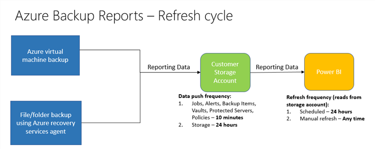

# Azure Backup Monitoring Alert - FAQ
This article answers common questions about the Azure monitoring alert.

## Configure Azure Backup reports

### How do I check if reporting data has started flowing into a storage account?
Go to the storage account you configured, and select containers. If the container has an entry for insights-logs-azurebackupreport, it indicates that reporting data has started flowing in.

### What is the frequency of data push to a storage account and the Azure Backup content pack in Power BI?
  For Day 0 users, it takes around 24 hours to push data to a storage account. After this initial push is finished, data is refreshed with the frequency shown in the following figure.

  * Data related to **Jobs**, **Alerts**, **Backup Items**, **Vaults**, **Protected Servers**, and **Policies** is pushed to a customer storage account as and when it's logged.

  * Data related to **Storage** is pushed to a customer storage account every 24 hours.

       

  * Power BI has a [scheduled refresh once a day](https://powerbi.microsoft.com/documentation/powerbi-refresh-data/#what-can-be-refreshed). You can perform a manual refresh of the data in Power BI for the content pack.

### How long can I retain reports?
When you configure a storage account, you can select a retention period for report data in the storage account. Follow step 6 in the [Configure storage account for reports](backup-azure-configure-reports.md#configure-storage-account-for-reports) section. You also can [analyze reports in Excel](https://powerbi.microsoft.com/documentation/powerbi-service-analyze-in-excel/) and save them for a longer retention period, based on your needs.

### Will I see all my data in reports after I configure the storage account?
 All the data generated after you configure a storage account is pushed to the storage account and is available in reports. In-progress jobs aren't pushed for reporting. After the job finishes or fails, it's sent to reports.

### If I already configured the storage account to view reports, can I change the configuration to use another storage account?
Yes, you can change the configuration to point to a different storage account. Use the newly configured storage account while you connect to the Azure Backup content pack. Also, after a different storage account is configured, new data flows in this storage account. Older data (before you change the configuration) still remains in the older storage account.

### Can I view reports across vaults and subscriptions?
Yes, you can configure the same storage account across various vaults to view cross-vault reports. Also, you can configure the same storage account for vaults across subscriptions. Then you can use this storage account while you connect to the Azure Backup content pack in Power BI to view the reports. The storage account selected must be in the same region as the Recovery Services vault.

### How long does it take for the Azure backup agent job status to reflect in the portal?
The Azure portal can take up to 15 mins to reflect the Azure backup agent job status.

### When a backup job fails, how long does it take to raise an alert?
An alert is raised within 20 mins of the Azure backup failure.

### Is there a case where an email won’t be sent if notifications are configured?
Yes. In the following situations, notifications are not sent.

* If notifications are configured hourly, and an alert is raised and resolved within the hour
* When a job is canceled
* If a second backup job fails because the original backup job is in progress

## Recovery Services Vault

### How long does it take for the Azure backup agent job status to reflect in the portal?
The Azure portal can take up to 15 mins to reflect the Azure backup agent job status.

### When a backup job fails, how long does it take to raise an alert?
An alert is raised within 20 mins of the Azure backup failure.

### Is there a case where an email won’t be sent if notifications are configured?
Yes. In the following situations, notifications are not sent.

* If notifications are configured hourly, and an alert is raised and resolved within the hour
* When a job is canceled
* If a second backup job fails because the original backup job is in progress

## Next steps

Read the other FAQs:

- [Common questions](backup-azure-vm-backup-faq.md) about Azure VM backups.
- [Common questions](backup-azure-file-folder-backup-faq.md) about the Azure Backup agent
