<properties
   pageTitle="Monitor Resource Manager-deployed virtual machine backups | Microsoft Azure"
   description="Monitor events and alerts from Resource Manager-deployed virtual machine backups"
   services="backup"
   documentationCenter="dev-center-name"
   authors="markgalioto"
   manager="cfreeman"
   editor=""/>

<tags
ms.service="backup"
ms.workload="storage-backup-recovery"
ms.tgt_pltfrm="na"
ms.devlang="na"
ms.topic="article"
ms.date="08/11/2016"
ms.author="trinadhk; giridham;"/>

# Monitor alerts for Azure virtual machine backups

Alerts are responses from the service that an event threshold has been met or surpassed. Knowing when problems start can be critical to keeping business costs down. Alerts typically do not occur on a schedule, and so it is helpful to know when alerts occur. In the vault dashboard, the Backup Alerts tile displays Critical and Warning-level events. In the Backup Alerts settings, you can view all events. But what do you do if an alert occurs when you are working on a separate issue? If you don't know when the alert happens, it could be a minor inconvenience, or it could compromise data. To make sure the correct people are aware of an alert - when it occurs, configure the service to send alert notifications via email. For details on setting up email notifications, see [Configure notifications](backup-azure-monitor-vms.md#configure-notifications).

To view information about the event that threw an alert, you must open the Backup Alerts blade. There are two ways to open the Backup Alerts blade: either from the Backup Alerts tile in the vault dashboard, or from the Alerts and Events blade.

To open the Backup Alerts blade from Backup Alerts tile:

- On the **Backup Alerts** tile on the vault dashboard, click **Critical** or **Warning** to view the operational events for that severity level.

    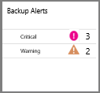


To open the Backup Alerts blade from the Alerts and Events blade:

1. From the vault dashboard, click **All Settings**. 

2. On the **Settings** blade, click **Alerts and Events**. 

3. On the **Alerts and Events** blade, click **Backup Alerts**. 

    The **Backup Alerts** blade opens and displays the filtered alerts.

    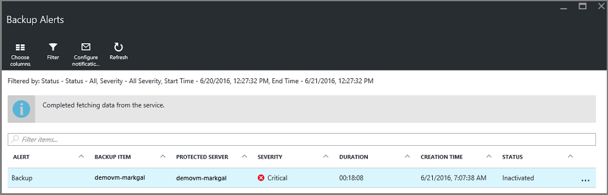

4. To view detailed information about a particular alert, from the list of events, click the alert to open its **Details** blade.

    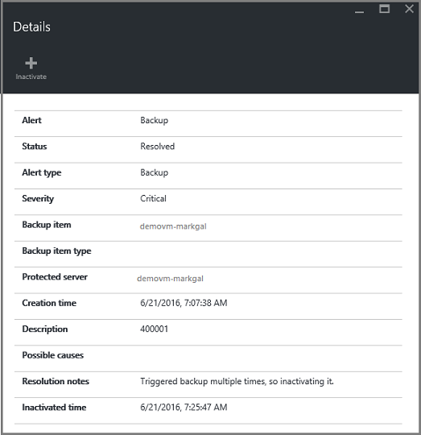

    To customize the attributes displayed in the list, see [View additional event attributes](backup-azure-monitor-vms.md#view-additional-event-attributes)

## Configure notifications

 You can configure the service to send email notifications for the alerts that occurred over the past hour, or when particular types of events occur.

To set up email notifications for alerts

1. On the Backup Alerts menu, click **Configure notifications**

    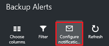

    The Configure notifications blade opens.

    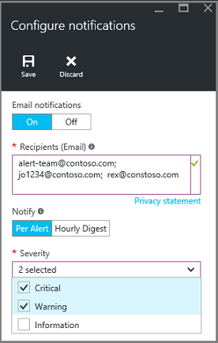

2. On the Configure notifications blade, for Email notifications, click **On**.

    The Recipients and Severity dialogs have a star next to them because that information is required. Provide at least one email address, and select at least one Severity.

3. In the **Recipients (Email)** dialog, type the email addresses for who receive the notifications. Use the format: username@domainname.com. Separate multiple email addresses with a semicolon (;).

4. In the **Notify** area, choose **Per Alert** to send notification when the specified alert occurs, or **Hourly Digest** to send a summary for the past hour.

5. In the **Severity** dialog, choose one or more levels that you want to trigger email notification.

6. Click **Save**.

## Customize your view of events

The **Audit logs** setting comes with a pre-defined set of filters and columns showing operational event information. You can customize the view so that when the **Events** blade opens, it shows you the information you want.

1. In the [vault dashboard](./backup-azure-manage-vms.md#open-a-recovery-services-vault-in-the-dashboard), browse to and click **Audit Logs** to open the **Events** blade.

    

    The **Events** blade opens to the operational events filtered just for the current vault.

    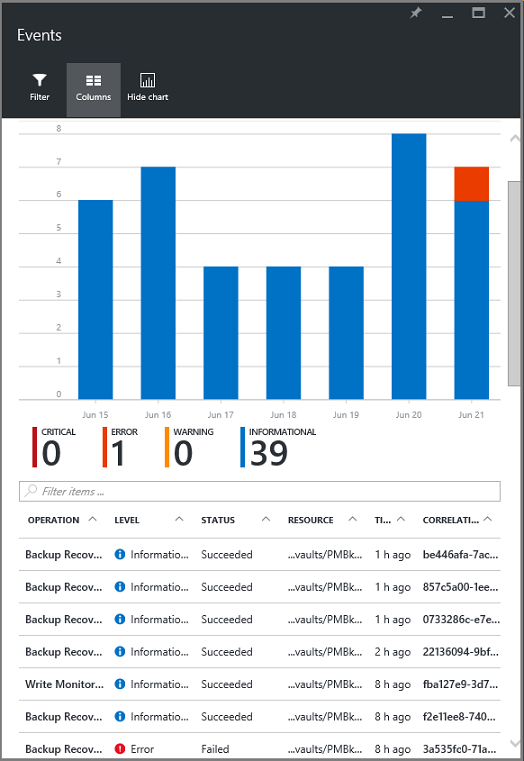

    The blade shows the list of Critical, Error, Warning, and Informational events that occurred in the past week. The time span is a default value set in the **Filter**. The **Events** blade also shows a bar chart tracking when the events occurred. If you don't want to see the bar chart, in the **Events** menu, click **Hide chart** to toggle off the chart. The default view of Events shows Operation, Level, Status, Resource, and Time information. For information about exposing additional Event attributes, see the section [expanding Event information](backup-azure-monitor-vms.md#view-additional-event-attributes).

2. For additional information on an operational event, in the **Operation** column, click an operational event to open its blade. The blade contains detailed information about the events. Events are grouped by their correlation ID and a list of the events that occurred in the Time span.

    

3. To view detailed information about a particular event, from the list of events, click the event to open its **Details** blade.

    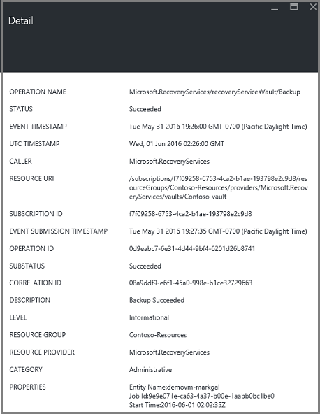

    The Event-level information is as detailed as the information gets. If you prefer seeing this much information about each event, and would like to add this much detail to the **Events** blade, see the section [expanding Event information](backup-azure-monitor-vms.md#view-additional-event-attributes).


## Customize the event filter
Use the **Filter** to adjust or choose the information that appears in a particular blade. To filter the event information:

1. In the [vault dashboard](./backup-azure-manage-vms.md#open-a-recovery-services-vault-in-the-dashboard), browse to and click **Audit Logs** to open the **Events** blade.

    

    The **Events** blade opens to the operational events filtered just for the current vault.

    

2. On the **Events** menu, click **Filter** to open that blade.

    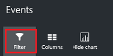

3. On the **Filter** blade, adjust the **Level**, **Time span**, and **Caller** filters. The other filters are not available since they were set to provide the current information for the Recovery Services vault.

    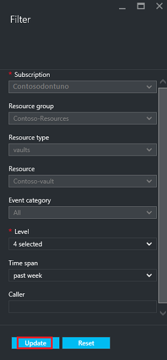

    You can specify the **Level** of event: Critical, Error, Warning, or Informational. You can choose any combination of event Levels, but you must have at least one Level selected. Toggle the Level on or off. The **Time span** filter allows you to specify the length of time for capturing events. If you use a custom Time span, you can set the start and end times.

4. Once you are ready to query the operations logs using your filter, click **Update**. The results display in the **Events** blade.

    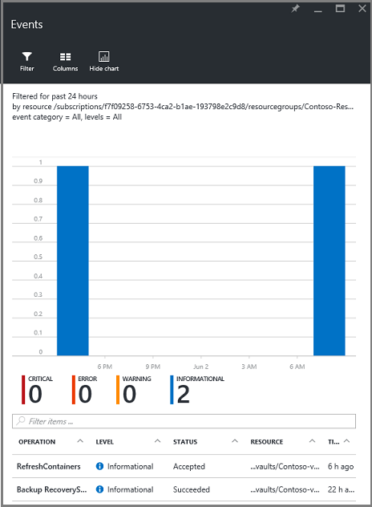


### View additional event attributes
Using the **Columns** button, you can enable additional event attributes to appear in the list on the **Events** blade. The default list of events displays information for Operation, Level, Status, Resource, and Time. To enable additional attributes:

1. On the **Events** blade, click **Columns**.

    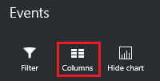

    The **Choose columns** blade opens.

    

2. In order to select the attribute, click the checkbox. The attribute checkbox toggles on and off.

3. Click **Reset** to reset the list of attributes in the **Events** blade. After adding or removing attributes from the list, use **Reset** to view the new list of Event attributes.

4. Click **Update** to update the data in the Event attributes. The following table provides information about each attribute.

| Column name      |Description|
| -----------------|-----------|
| Operation|The name of the operation|
| Level|The level of the operation, values can be: Informational, Warning, Error, or Critical|
|Status|Descriptive state of the operation|
|Resource|URL that identifies the resource; also known as the resource ID|
|Time|Time, measured from the current time, when the event occurred|
|Caller|Who or what called or triggered the event; can be the system, or a user|
|Timestamp|The time when the event was triggered|
|Resource Group|The associated resource group|
|Resource Type|The internal resource type used by Resource Manager|
|Subscription ID|The associated subscription ID|
|Category|Category of the event|
|Correlation ID|Common ID for related events|


## Use PowerShell to customize alerts
You can get custom alert notifications for the jobs in the portal. To get these jobs, define PowerShell-based alert rules on the operational logs events. Use *PowerShell version 1.3.0 or later*.

To define a custom notification to alert for backup failures, use a command like the following script:

```
PS C:\> $actionEmail = New-AzureRmAlertRuleEmail -CustomEmail contoso@microsoft.com
PS C:\> Add-AzureRmLogAlertRule -Name backupFailedAlert -Location "East US" -ResourceGroup RecoveryServices-DP2RCXUGWS3MLJF4LKPI3A3OMJ2DI4SRJK6HIJH22HFIHZVVELRQ-East-US -OperationName Microsoft.Backup/RecoveryServicesVault/Backup -Status Failed -TargetResourceId /subscriptions/86eeac34-eth9a-4de3-84db-7a27d121967e/resourceGroups/RecoveryServices-DP2RCXUGWS3MLJF4LKPI3A3OMJ2DI4SRJK6HIJH22HFIHZVVELRQ-East-US/providers/microsoft.backupbvtd2/RecoveryServicesVault/trinadhVault -Actions $actionEmail
```

**ResourceId** : You can get ResourceId from the Audit logs. The ResourceId is a URL provided in the Resource column of the Operation logs.

**OperationName** : OperationName is in the format "Microsoft.RecoveryServices/recoveryServicesVault/*EventName*" where *EventName* can be:<br/>
- Register
- Unregister
- ConfigureProtection
- Backup
- Restore
- StopProtection
- DeleteBackupData
- CreateProtectionPolicy
- DeleteProtectionPolicy
- UpdateProtectionPolicy

**Status** : Supported values are- Started, Succeeded, or Failed.

**ResourceGroup** : This is the Resource Group to which the resource belongs. You can add the Resource Group column to the generated logs. Resource Group is one of the available types of event information.

**Name** : Name of the Alert Rule.

**CustomEmail** : Specify the custom email address to which you want to send an alert notification

**SendToServiceOwners** : This option sends alert notifications to all administrators and co-administrators of the subscription. It can be used in **New-AzureRmAlertRuleEmail** cmdlet

### Limitations on Alerts
Event-based alerts are subject to the following limitations:

1. Alerts are triggered on all virtual machines in the Recovery Services vault. You cannot customize the alert for a subset of virtual machines in a Recovery Services vault.
2. This feature is in Preview. [Learn more](../azure-portal/insights-powershell-samples.md#create-alert-rules)
3. Alerts are sent from "alerts-noreply@mail.windowsazure.com". Currently you can't modify the email sender.


## Next steps

Event logs enable great post-mortem and audit support for the backup operations. The following operations are logged:

- Register
- Unregister
- Configure protection
- Backup (Both scheduled as well as on-demand backup)
- Restore
- Stop protection
- Delete backup data
- Add policy
- Delete policy
- Update policy
- Cancel job

For a broad explanation of events, operations, and audit logs across the Azure services, see the article, [View events and audit logs](../azure-portal/insights-debugging-with-events.md).

For information on re-creating a virtual machine from a recovery point, check out [Restore Azure VMs](backup-azure-restore-vms.md). If you need information on protecting your virtual machines, see [First look: Back up VMs to a Recovery Services vault](backup-azure-vms-first-look-arm.md). Learn about the management tasks for VM backups in the article, [Manage Azure virtual machine backups](backup-azure-manage-vms.md).
