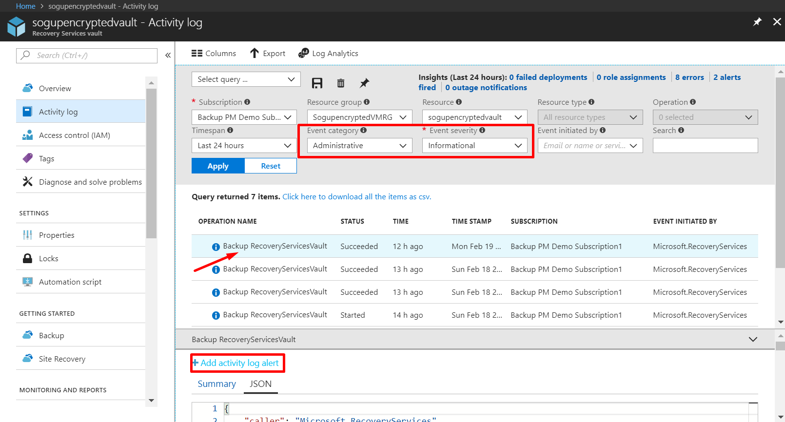
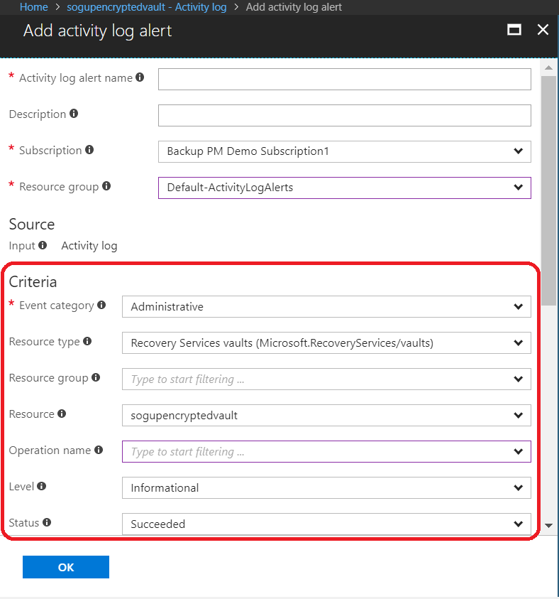
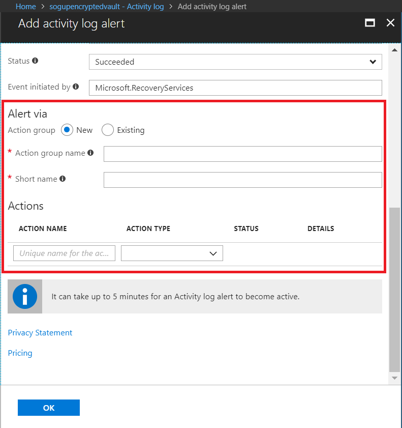

# Monitor alerts for Azure virtual machine backups

Alerts are responses from the service that an event threshold has been met or surpassed. Knowing when problems start can be critical to keeping business costs down. Alerts typically do not occur on a schedule, and so it is helpful to know as soon as possible after alerts occur. For example, when a backup or restore job fails, an alert occurs within five minutes of the failure. In the vault dashboard, the Backup Alerts tile displays Critical and Warning-level events. In the Backup Alerts settings, you can view all events. But what do you do if an alert occurs when you are working on a separate issue? If you don't know when the alert happens, it could be a minor inconvenience, or it could compromise data. To make sure the correct people are aware of an alert - when it occurs, configure the service to send alert notifications via email. For details on setting up email notifications, see [Configure notifications](backup-azure-monitor-vms.md#configure-notifications).

## How do I find information about the alerts?

To view information about the event that threw an alert, you must open the Backup Alerts section. There are two ways to open the Backup Alerts section: either from the Backup Alerts tile in the vault dashboard, or from the Alerts and Events section.

To open the Backup Alerts blade from Backup Alerts tile:

* On the **Backup Alerts** tile on the vault dashboard, click **Critical** or **Warning** to view the operational events for that severity level.

    

To open the Backup Alerts blade from the Alerts and Events section:

1. From the vault dashboard, click **All Settings**. 
2. On the **Settings** blade, click **Alerts and Events**. 
3. On the **Alerts and Events** blade, click **Backup Alerts**. 

    The **Backup Alerts** section opens and displays the filtered alerts.

    
4. To view detailed information about a particular alert, from the list of events, click the alert to open its **Details** section.

    

    To customize the attributes displayed in the list, see [View additional event attributes](backup-azure-monitor-vms.md)

## Configure notifications

 You can configure the service to send email notifications for the alerts that occurred over the past hour, or when particular types of events occur.

To set up email notifications for alerts

1. On the Backup Alerts menu, click **Configure notifications**

    

    The Configure notifications section opens.

    
2. On the Configure notifications section, for Email notifications, click **On**.

    The Recipients and Severity dialogs have a star next to them because that information is required. Provide at least one email address, and select at least one Severity.
3. In the **Recipients (Email)** dialog, type the email addresses for who receive the notifications. Use the format: username@domainname.com. Separate multiple email addresses with a semicolon (;).
4. In the **Notify** area, choose **Per Alert** to send notification when the specified alert occurs, or **Hourly Digest** to send a summary for the past hour.
5. In the **Severity** dialog, choose one or more levels that you want to trigger email notification.
6. Click **Save**.

### What alert types are available for Azure IaaS VM backup

   | Alert Level | Alerts sent |
   | --- | --- |
   | Critical | for Backup failure, recovery failure |
   | Warning | for Backup succeeded with warnings for Azure Backup Agent (MAB) (for example: some writers failed while creating a snapshot) |
   | Informational | currently, no informational alerts are available for Azure VM backup |

### Situations where email isn't sent even if notifications are configured

There are situations where an alert is not sent, even though the notifications have been properly configured. In the following situations email notifications are not sent to avoid alert noise:

* If notifications are configured to Hourly Digest, and an alert is raised and resolved within the hour.
* The job is canceled.
* A backup job is triggered and then fails, and another backup job is in progress.
* A scheduled backup job for a Resource Manager-enabled VM starts, but the VM no longer exists.

## Using Activity logs to get notifications for successful backups

> [!NOTE]
> We have moved to a new model of pumping Activity logs from Azure Backup on Recovery Services vaults. Unfortunately, this has impacted generation of activity logs in Azure Sovereign Clouds. If Azure Sovereign Cloud users created/configured any alerts from Activity logs via Azure Monitor as mentioned here, they would not be triggered. In that case, we would advise such users to use diagnostic settings and LA workspace or [PowerBI reporting solution](backup-azure-configure-reports.md) to get the relevant information. Also, in all Azure public regions, if a user is collecting Recovery Services Activity logs into a Log Analytic workspace as mentioned [here](https://docs.microsoft.com/azure/log-analytics/log-analytics-activity), these logs also would not appear.

If you want to be notified after backups are successful, you can use alerts built on the [activity logs](https://docs.microsoft.com/azure/azure-resource-manager/resource-group-audit) of the vault.

### Login into Azure portal

Login into the Azure portal and proceed to the relevant Azure Recovery Services vault and click the “Activity log” section in the properties.

### Identify appropriate log

Apply the filters shown in the following picture to verify whether you are receiving activity logs for successful backups. Change the timespan accordingly to view records.

You can click the “JSON” segment to get more details and view it by copy-pasting it onto a text editor. It should display the vault details and the item which triggered the activity log i.e., the backup item.

Then click “Add activity log alert” to generate alerts for all such logs.

### Add Activity log alert

Clicking “Add activity log alert” will show you a screen as shown below

The subscription and resource group are used to store the alert. The criteria will be pre-filled. Make sure all the values are relevant to your requirement.

For successful backups, the 'Level' is marked as "Informational" and Status as "Succeeded".

If you select a "resource" above, the alert will be generated when activity logs are recorded for that resource or vault. If you want the rule to be applicable to all vaults, leave the "resource" to be empty.

### Define action on alert firing

Use the “action group” to define the action upon generating an alert. You can click on “Action type” to know more about available actions such email/SMS/Integration with ITSM etc.

Once you click OK, an activity log alert will be generated and subsequent activity logs recorded for successful backups will fire the action as defined in the action group.

### Limitations on Alerts

Event-based alerts are subject to the following limitations:

1. Alerts are triggered on all virtual machines in the Recovery Services vault. You cannot customize the alert for a subset of virtual machines in a Recovery Services vault.
2. Alerts are sent from "alerts-noreply@mail.windowsazure.com". Currently you can't modify the email sender.

## Next steps

For information on re-creating a virtual machine from a recovery point, check out [Restore Azure VMs](backup-azure-arm-restore-vms.md).

If you need information on protecting your virtual machines, see [First look: Back up VMs to a Recovery Services vault](backup-azure-vms-first-look-arm.md).

Learn more about the management tasks for VM backups in the article, [Manage Azure virtual machine backups](backup-azure-manage-vms.md).
