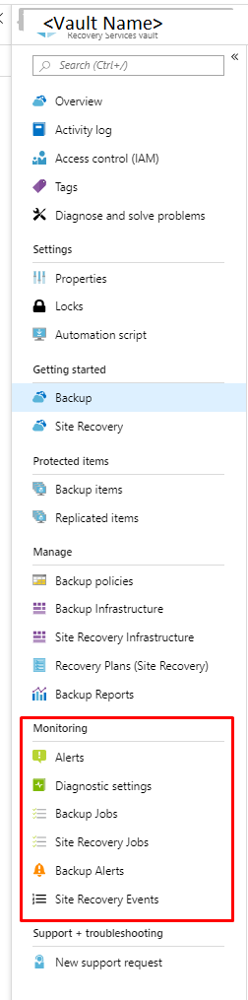
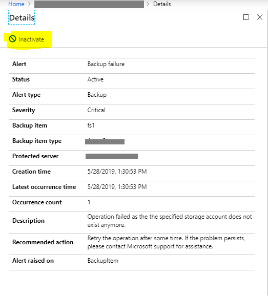

# Monitoring Azure Backup workloads

Azure Backup provides multiple backup solutions based on the backup requirement and infrastructure topology (On-premises vs Azure). Any backup user or admin should see what is going on across all solutions and can expect to be notified in important scenarios. This article details the monitoring and notification capabilities provided by Azure Backup service.

## Backup Jobs in Recovery Services vault

Azure Backup provides in-built monitoring and alerting capabilities for workloads being protected by Azure Backup. In the Recovery Services vault settings, the **Monitoring** section provides in-built jobs and alerts.

Jobs are generated when operations such as configuring backup, back up, restore, delete backup, and so on, are performed.

Jobs from the following Azure Backup solutions are shown here:

- Azure VM backup
- Azure File backup
- Azure workload back up such as SQL and SAP HANA
- Azure Backup agent (MAB)

Jobs from System Center Data Protection Manager (SC-DPM), Microsoft Azure Backup Server (MABS) are NOT displayed.

> [!NOTE]
> Azure workloads such as SQL and SAP HANA backups within Azure VMs have huge number of backup jobs. For example, log backups can run for every 15 minutes. So for such DB workloads, only user triggered operations are displayed. Scheduled backup operations are NOT displayed.

## Backup Alerts in Recovery Services vault

Alerts are primarily scenarios where users are notified so that they can take relevant action. The **Backup Alerts** section shows alerts generated by Azure Backup service. These alerts are defined by the service and user can't custom create any alerts.

### Alert scenarios

The following scenarios are defined by service as alertable scenarios.

- Backup/Restore failures
- Backup succeeded with warnings for Azure Backup Agent (MAB)
- Stop protection with retain data/Stop protection with delete data

### Alerts from the following Azure Backup solutions are shown here

- Azure VM backups
- Azure File backups
- Azure workload backups such as SQL, SAP HANA
- Azure Backup agent (MAB)

> [!NOTE]
> Alerts from System Center Data Protection Manager (SC-DPM), Microsoft Azure Backup Server (MABS) are NOT displayed here.

### Consolidated Alerts

For Azure workload backup solutions such as SQL and SAP HANA, log backups can be generated very frequently (up to every 15 minutes according to the policy). So it's also possible that the log backup failures are also very frequent (up to every 15 minutes). In this scenario, the end user will be overwhelmed if an alert is raised for each failure occurrence. So an alert is sent for the first occurrence and if the later failures are because of the same root cause, then further alerts aren't generated. The first alert is updated with the failure count. But if the alert is inactivated by the user, the next occurrence will trigger another alert and this will be treated as the first alert for that occurrence. This is how Azure Backup performs alert consolidation for SQL and SAP HANA backups.

### Exceptions when an alert is not raised

There are few exceptions when an alert isn't raised on a failure. They are:

- User explicitly canceled the running job
- The job fails because another backup job is in progress (nothing to act on here since we just have to wait for the previous job to finish)
- The VM backup job fails because the backed-up Azure VM no longer exists
- [Consolidated Alerts](#consolidated-alerts)

The above exceptions are designed from the understanding that the result of these operations (primarily user triggered) shows up immediately on portal/PS/CLI clients. So the user is immediately aware and doesn't need a notification.

### Alert types

Based on alert severity, alerts can be defined in three types:

- **Critical**: In principle, any backup or recovery failure (scheduled or user triggered) would lead to generation of an alert and would be shown as a Critical alert and also destructive operations such as delete backup.
- **Warning**: If the backup operation succeeds but with few warnings, they're listed as Warning alerts. Warning alerts are currently available only for Azure Backup Agent backups.
- **Informational**: Currently, no informational alert is generated by Azure Backup service.

## Notification for Backup Alerts

> [!NOTE]
> Configuration of notification can be done only through Azure Portal. PS/CLI/REST API/Azure Resource Manager Template support is not supported.

Once an alert is raised, users are notified. Azure Backup provides an inbuilt notification mechanism via e-mail. One can specify individual email addresses or distribution lists to be notified when an alert is generated. You can also choose whether to get notified for each individual alert or to group them in an hourly digest and then get notified.

When notification is configured, you'll receive a welcome or introductory email. This confirms that Azure Backup can send emails to these addresses when an alert is raised. 

If the frequency was set to an hourly digest and an alert was raised and resolved within an hour, it won't be a part of the upcoming hourly digest.

> [!NOTE]
>
> - If a destructive operation such as **stop protection with delete data** is performed, an alert is raised and an email is sent to subscription owners, admins, and co-admins even if notifications are NOT configured for the Recover Service vault.
> - To configure notification for successful jobs use [Log Analytics](backup-azure-monitoring-use-azuremonitor.md#using-log-analytics-workspace).

## Inactivating alerts

To inactivate/resolve an active alert, you can click on the list item corresponding to the alert you wish to inactivate. This opens up a screen that displays detailed information about the alert, with an 'Inactivate' button on the top. Clicking this button would change the status of the alert to 'Inactive'. You may also inactivate an alert by right-clicking on the list item corresponding to that alert and selecting 'Inactivate'.

## Next steps

[Monitor Azure backup workloads using Azure Monitor](backup-azure-monitoring-use-azuremonitor.md)
