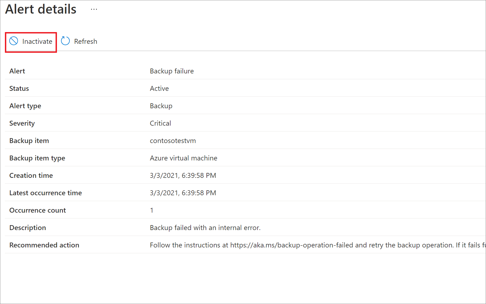
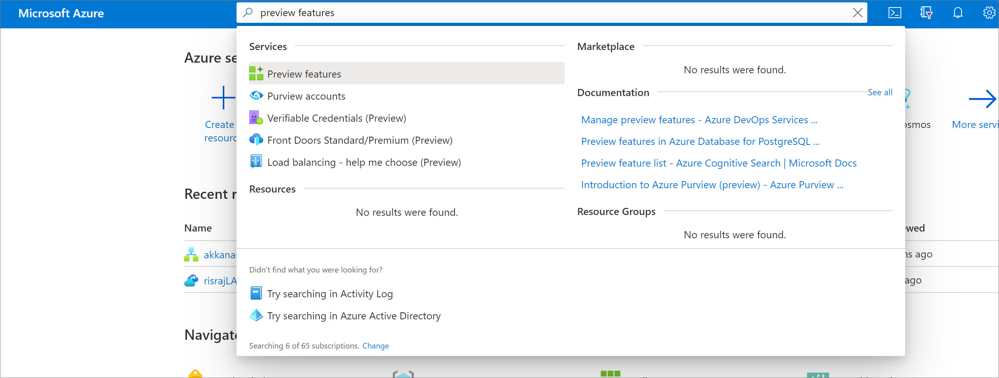
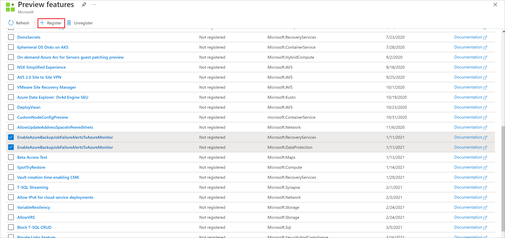
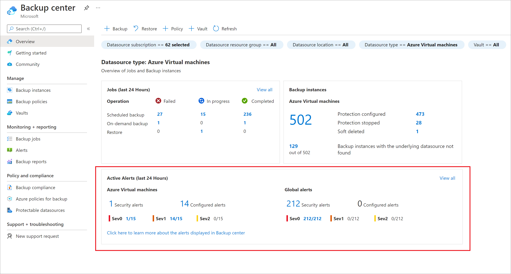
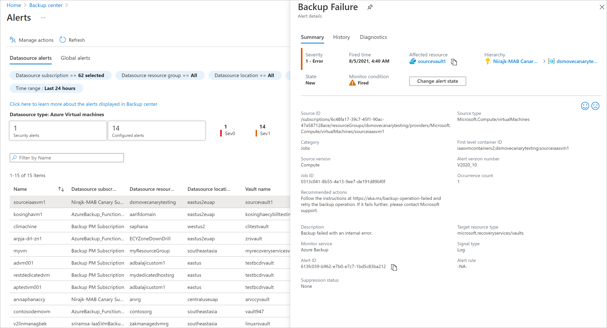
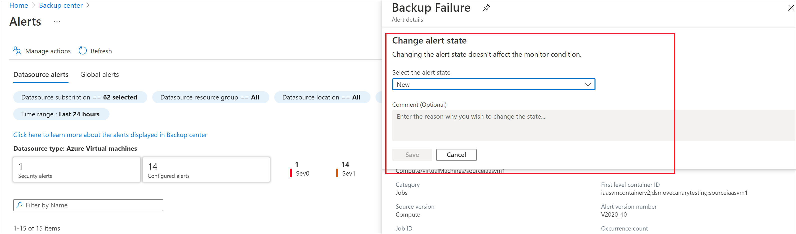
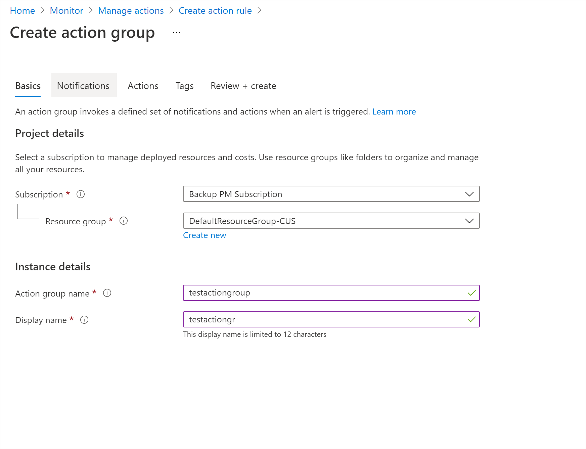
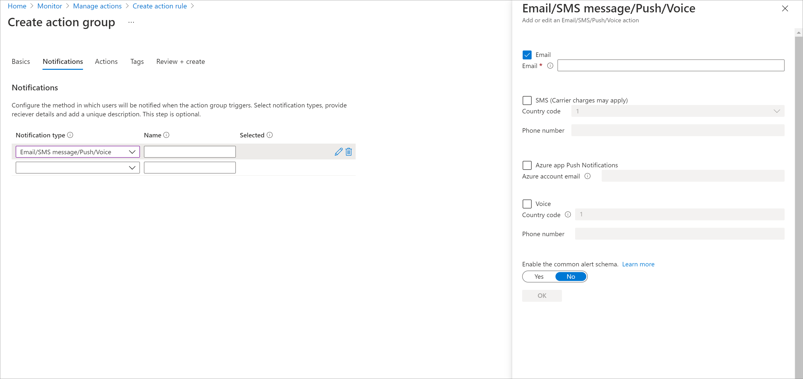

# Monitoring Azure Backup workloads

Azure Backup provides multiple backup solutions based on the backup requirement and infrastructure topology (On-premises vs Azure). Any backup user or admin should see what's going on across all solutions and can expect to be notified in important scenarios. This article details the monitoring and notification capabilities provided by Azure Backup service.

[!INCLUDE [backup-center.md](../../includes/backup-center.md)]

## Backup Items in Recovery Services vault

You can monitor all your backup items via a Recovery Services vault. Navigating to the **Backup Instances** section in **Backup center** opens a view that provides a detailed list of all backup items of the given workload type, with information on the last backup status for each item, latest restore point available, and so on.

:::image type="content" source="./media/backup-azure-monitoring-laworkspace/backup-center-instances-inline.png" alt-text="Screenshot showing to view Recovery Services vault backup items." lightbox="./media/backup-azure-monitoring-laworkspace/backup-center-instances-expanded.png":::

>[!NOTE]
>For items backed-up to Azure using DPM, the list will show all the data sources protected (both disk and online) using the DPM server. If the protection is stopped for the datasource with backup data retained, the datasource will be still listed in the portal. You can go to the details of the data source to see if the recovery points are present in disk, online or both. Also, datasources for which the online protection is stopped but data is retained,  billing for the online recovery points continue until the data is completely deleted.
>
> The DPM version must be DPM 1807 (5.1.378.0) or DPM 2019 ( version 10.19.58.0 or above), for the backup items to be visible in the Recovery Services vault portal.

## Backup Jobs in Backup center

Azure Backup provides in-built monitoring and alerting capabilities for workloads being protected by Azure Backup. Navigating to the **Backup Jobs** pane in **Backup center** allows you to view the recent backup and restore jobs across your vaults.

:::image type="content" source="./media/backup-azure-monitoring-laworkspace/backup-center-jobs-inline.png" alt-text="Screenshot showing the Recovery Services vault built-in monitoring." lightbox="./media/backup-azure-monitoring-laworkspace/backup-center-jobs-expanded.png":::

Jobs are generated when operations such as configuring backup, back up, restore, delete backup, and so on, are performed.

Jobs from the following Azure Backup solutions are shown here:

- Azure VM backup
- Azure File backup
- Azure workload back up such as SQL and SAP HANA
- Microsoft Azure Recovery Services (MARS) agent

Jobs from System Center Data Protection Manager (SC-DPM), Microsoft Azure Backup Server (MABS) aren't displayed.

> [!NOTE]
> Azure workloads such as SQL and SAP HANA backups within Azure VMs have huge number of backup jobs. For example, log backups can run for every 15 minutes. So for such DB workloads, only user triggered operations are displayed. Scheduled backup operations aren't displayed.

## Backup Alerts in Recovery Services vault

Alerts are primarily scenarios where users are notified so that they can take relevant action. The **Backup Alerts** section shows alerts generated by Azure Backup service. These alerts are defined by the service and user can't custom create any alerts.

### Alert scenarios

The following scenarios are defined by service as alertable scenarios.

- Backup/Restore failures
- Backup succeeded with warnings for Microsoft Azure Recovery Services (MARS) agent
- Stop protection with retain data/Stop protection with delete data
- Soft-delete functionality disabled for vault
- [Unsupported backup type for database workloads](./backup-sql-server-azure-troubleshoot.md#backup-type-unsupported)

### Alerts from the following Azure Backup solutions are shown here

- Azure VM backups
- Azure File backups
- Azure workload backups such as SQL, SAP HANA
- Microsoft Azure Recovery Services (MARS) agent

> [!NOTE]
> Alerts from System Center Data Protection Manager (SC-DPM), Microsoft Azure Backup Server (MABS) aren't displayed here.

### Consolidated Alerts

For Azure workload backup solutions such as SQL and SAP HANA, log backups can be generated very frequently (up to every 15 minutes according to the policy). So it's also possible that the log backup failures are also very frequent (up to every 15 minutes). In this scenario, the end user will be overwhelmed if an alert is raised for each failure occurrence. So an alert is sent for the first occurrence and if the later failures are because of the same root cause, then further alerts aren't generated. The first alert is updated with the failure count. But if the alert is inactivated by the user, the next occurrence will trigger another alert and this will be treated as the first alert for that occurrence. This is how Azure Backup performs alert consolidation for SQL and SAP HANA backups. On-demand backup jobs are not consolidated.

### Exceptions when an alert is not raised

There are few exceptions when an alert isn't raised on a failure. They are:

- User explicitly canceled the running job
- The job fails because another backup job is in progress (nothing to act on here since we just have to wait for the previous job to finish)
- The VM backup job fails because the backed-up Azure VM no longer exists
- [Consolidated Alerts](#consolidated-alerts)

The exceptions above are designed from the understanding that the result of these operations (primarily user triggered) shows up immediately on portal/PS/CLI clients. So the user is immediately aware and doesn't need a notification.

### Alert types

Based on alert severity, alerts can be defined in three types:

- **Critical**: In principle, any backup or recovery failure (scheduled or user triggered) would lead to generation of an alert and would be shown as a Critical alert and also destructive operations such as delete backup.
- **Warning**: If the backup operation succeeds but with few warnings, they're listed as Warning alerts. Warning alerts are currently available only for Azure Backup Agent backups.
- **Informational**: Currently, no informational alert is generated by Azure Backup service.

## Notification for Backup Alerts

> [!NOTE]
> Configuration of notification can be done only through the Azure portal. PS/CLI/REST API/Azure Resource Manager Template support isn't supported.

Once an alert is raised, users are notified. Azure Backup provides an inbuilt notification mechanism via e-mail. One can specify individual email addresses or distribution lists to be notified when an alert is generated. You can also choose whether to get notified for each individual alert or to group them in an hourly digest and then get notified.


When notification is configured, you'll receive a welcome or introductory email. This confirms that Azure Backup can send emails to these addresses when an alert is raised.<br>

If the frequency was set to an hourly digest and an alert was raised and resolved within an hour, it won't be a part of the upcoming hourly digest.

> [!NOTE]
>
> - If a destructive operation such as **stop protection with delete data** is performed, an alert is raised and an email is sent to subscription owners, admins, and co-admins even if notifications aren't configured for the Recovery Services vault.
> - To configure notification for successful jobs use [Log Analytics](backup-azure-monitoring-use-azuremonitor.md#using-log-analytics-workspace).

## Inactivating alerts

To inactivate/resolve an active alert, you can select the list item corresponding to the alert you wish to inactivate. This opens up a screen that displays detailed information about the alert, with an **Inactivate** button on the top. Selecting this button will change the status of the alert to **Inactive**. You may also inactivate an alert by right-clicking on the list item corresponding to that alert and selecting **Inactivate**.



## Azure Monitor alerts for Azure Backup (preview)

Azure Backup also provides alerts via Azure Monitor, to enable users to have a consistent experience for alert management across different Azure services, including backup. With Azure Monitor alerts, you can route alerts to any notification channel supported by Azure Monitor such as email, ITSM, Webhook, Logic App and so on.

Currently, Azure Backup has made two main types of built-in alerts available:

* **Security Alerts**: For scenarios, such as deletion of backup data, or disabling of soft-delete functionality for a vault, security alerts (of severity Sev 0) are fired, and displayed in the Azure portal or consumed via other clients (PowerShell, CLI and REST API). Security alerts are generated by default and can't be turned off. However, you can control the scenarios for which the notifications (for example, emails) should be fired. For more information on how to configure notifications, see [Action rules](../azure-monitor/alerts/alerts-action-rules.md).
* **Job Failure Alerts**: For scenarios, such as backup failure and restore failure, Azure Backup provides built-in alerts via Azure Monitor (of Severity Sev 1). Unlike security alerts, you can choose to turn off Azure Monitor alerts for job failure scenarios. For example, if you have already configured custom alert rules for job failures via Log Analytics, and don't need built-in alerts to be fired for every job failure. By default, alerts for job failures are turned off. Refer to the [section on turning on alerts for these scenarios](#turning-on-azure-monitor-alerts-for-job-failure-scenarios) for more details.
 
The following table summarizes the different backup alerts currently available (in preview) via Azure Monitor and the supported workload/vault types:

| **Alert Category** | **Alert Name** | **Supported workload types / vault types** | **Description** | 
| ------------------ | -------------  | ------------------------------------------ | -------- |
| Security | Delete Backup Data | <li> Azure Virtual Machine <br><br> <li> SQL in Azure VM (non-AG scenarios) <br><br> <li> SAP HANA in Azure VM <br><br> <li> Azure Backup Agent <br><br> <li> DPM <br><br> <li> Azure Backup Server <br><br> <li> Azure Database for PostgreSQL Server <br><br> <li> Azure Blobs <br><br> <li> Azure Managed Disks  | This alert is fired when a user stops backup and deletes backup data (Note – If soft-delete feature is disabled for the vault, Delete Backup Data alert is not received) |
| Security | Upcoming Purge | <li> Azure Virtual Machine <br><br> <li> SQL in Azure VM (non-AG scenarios) <br><br> <li> SAP HANA in Azure VM | For all workloads which support soft-delete, this alert is fired when the backup data for an item is 2 days away from being permanently purged by the Azure Backup service | 
| Security | Purge Complete | <li> Azure Virtual Machine <br><br> <li> SQL in Azure VM (non-AG scenarios) <br><br> <li> SAP HANA in Azure VM | Delete Backup Data |
| Security | Soft Delete Disabled for Vault | Recovery Services vaults | This alert is fired when the soft-deleted backup data for an item has been permanently deleted by the Azure Backup service | 
| Jobs | Backup Failure | <li> Azure Virtual Machine <br><br> <li> SQL in Azure VM (non-AG scenarios) <br><br> <li> SAP HANA in Azure VM <br><br> <li> Azure Backup Agent <br><br> <li> Azure Files <br><br> <li> Azure Database for PostgreSQL Server <br><br> <li> Azure Managed Disks | This alert is fired when a backup job failure has occurred. By default, alerts for backup  failures are turned off. Refer to the [section on turning on alerts for this scenario](#turning-on-azure-monitor-alerts-for-job-failure-scenarios) for more details. | 
| Jobs | Restore Failure | <li> Azure Virtual Machine <br><br> <li> SQL in Azure VM (non-AG scenarios) <br><br> <li> SAP HANA in Azure VM <br><br> <li> Azure Backup Agent <br><br> <li> Azure Files <br><br> <li> Azure Database for PostgreSQL Server <br><br> <li> Azure Blobs <br><br> <li> Azure Managed Disks| This alert is fired when a restore job failure has occurred. By default, alerts for restore failures are turned off. Refer to the [section on turning on alerts for this scenario](#turning-on-azure-monitor-alerts-for-job-failure-scenarios) for more details. | 

### Turning on Azure Monitor alerts for job failure scenarios

To opt in to Azure Monitor alerts for backup failure and restore failure scenarios, follow the below steps:

1. Navigate to the Azure portal and search for **Preview Features**.

    

2. You can view the list of all preview features that are available for you to opt in to.

    * If you wish to receive job failure alerts for workloads backed up to Recovery Services vaults, select the flag named **EnableAzureBackupJobFailureAlertsToAzureMonitor** corresponding to Microsoft.RecoveryServices provider (column 3).
    * If you wish to receive job failure alerts for workloads backed up to the Backup vaults, select the flag named **EnableAzureBackupJobFailureAlertsToAzureMonitor** corresponding to Microsoft.DataProtection provider (column 3).

    

3. Click **Register** to enable this feature for your subscription.
    > [!NOTE]
    > It may take up to 24 hours for the registration to take effect. To enable this feature for multiple subscriptions, repeat the above process by selecting the relevant subscription at the top of the screen. We also recommend to re-register the preview flag if a new resource has been created in the subscription after the initial registration to continue receiving alerts.

4. As a best practice, we also recommend you to register the resource provider to ensure that the feature registration information gets synced with the Azure Backup service as expected. To register the resource provider, run the following PowerShell command in the subscription for which you have registered the feature flag.

```powershell
Register-AzResourceProvider -ProviderNamespace <ProviderNamespace>
```

To receive alerts for Recovery Services vaults, use the value _Microsoft.RecoveryServices_ for the _ProviderNamespace_ parameter. To receive alerts for Backup vaults, use the value _Microsoft.DataProtection_.

### Viewing fired alerts in the Azure portal 

Once an alert is fired for a vault, you can view the alert in the Azure portal by navigating to Backup center. On the **Overview** tab, you can see a summary of active alerts split by severity. There're two kinds of alerts displayed:

* **Datasource Alerts**: Alerts that are tied to a specific datasource being backed up (for example, back up or restore failure for a VM, deleting backup data for a database, and so on) appear under the **Datasource Alerts** section.
* **Global Alerts**: Alerts that are not tied to a specific datasource (for example, disabling soft-delete functionality for a vault) appear under the **Global Alerts** section.

Each of the above types of alerts is further split into **Security** and **Configured** alerts. Currently, Security alerts include the scenarios of deleting backup data, or disabling soft-delete for vault (for the applicable workloads as detailed in the above section). Configured alerts include backup failure and restore failure since these alerts are only fired after registering the feature in the preview portal.



Clicking on any of the numbers (or on the **Alerts** menu item) opens up a list of all active alerts fired with the relevant filters applied. You can filter on a range of properties, such as subscription, resource group, vault, severity, state, and so on. You can click any of the alerts to get more details about the alert, such as the affected datasource, alert description and recommended action, and so on.

 

You can change the state of an alert to **Acknowledged** or **Closed** by clicking on **Change Alert State**.

 

> [!NOTE]
> - In Backup center, only alerts for Azure-based workloads are displayed currently. To view alerts for on-premises resources, navigate to the Recovery Services vault and click the **Alerts** menu item.
> - Only Azure Monitor alerts are displayed in Backup center. Alerts raised by the older alerting solution (accessed via the [Backup Alerts](#backup-alerts-in-recovery-services-vault) tab in Recovery Services vault) are not displayed in Backup center.
For more information about Azure Monitor alerts, see [Overview of alerts in Azure](../azure-monitor/alerts/alerts-overview.md).

### Configuring notifications for alerts

To configure notifications for Azure Monitor alerts, create an [alert processing rule](../azure-monitor/alerts/alerts-action-rules.md). To create an alert processing rule (earlier called _action rule_) to send email notifications to a given email address, follow these steps. Also, follow these steps to routing these alerts to other notification channels, such as ITSM, webhook, logic app, and so on.

1. Go to **Backup center** in the Azure portal.

1. Click **Alerts (Preview)** from the menu and select **Alert processing rules (preview)**.

   :::image type="content" source="./media/backup-azure-monitoring-laworkspace/backup-center-manage-alert-processing-rules-inline.png" alt-text="Screenshot for Manage Actions in Backup center." lightbox="./media/backup-azure-monitoring-laworkspace/backup-center-manage-alert-processing-rules-expanded.png":::

1. Click **Create**.

   :::image type="content" source="./media/backup-azure-monitoring-laworkspace/backup-center-create-alert-processing-rule.png" alt-text="Screenshot for creating a new action rule.":::

1. Select the scope for which the alert processing rule should be applied.

   You can apply the rule for all resources within a subscription. Optionally, you can also apply filters on the alerts; for example, to only generate notifications for alerts of a certain severity.

   :::image type="content" source="./media/backup-azure-monitoring-laworkspace/alert-processing-rule-scope-inline.png" alt-text="Screenshot for setting the action rule scope." lightbox="./media/backup-azure-monitoring-laworkspace/alert-processing-rule-scope-expanded.png":::

1. Under **Rule Settings**, create an action group (or use an existing one).

   An action group is the destination to which the notification for an alert should be sent. For example, an email address.
 
   :::image type="content" source="media/backup-azure-monitoring-laworkspace/create-action-group.png" alt-text="Screenshot for creating a new action group.":::

1. On the **Basics** tab, select the name of the action group, the subscription, and resource group under which it should be created.

     

1. On the **Notifications** tab, select **Email/SMS message/Push/Voice** and enter the recipient email ID.

     

1. Click **Review+Create** and then **Create** to deploy the action group.

8. Save the action rule.

[Learn more](../azure-monitor/alerts/alerts-action-rules.md) about Action Rules in Azure Monitor.


## Next steps

[Monitor Azure Backup workloads using Azure Monitor](backup-azure-monitoring-use-azuremonitor.md)