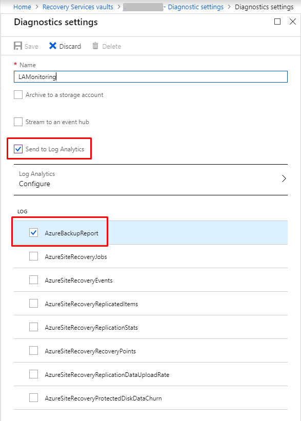
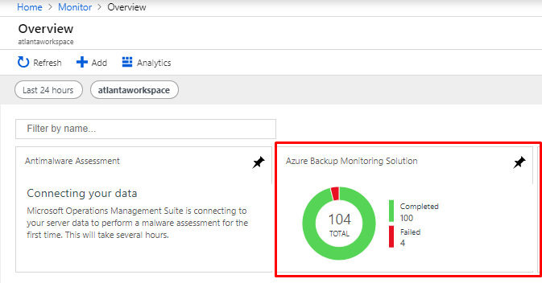
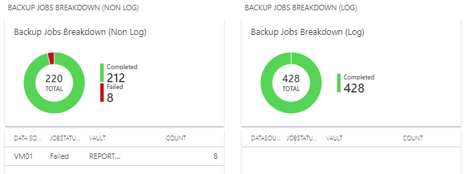
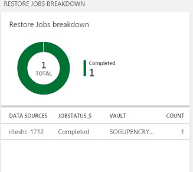
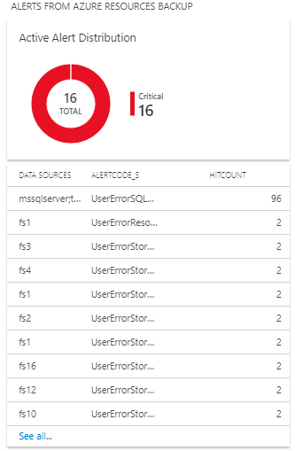
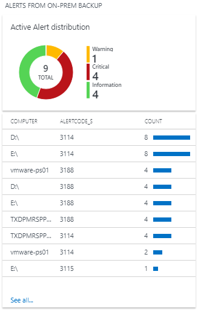
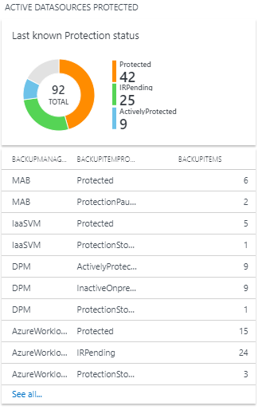
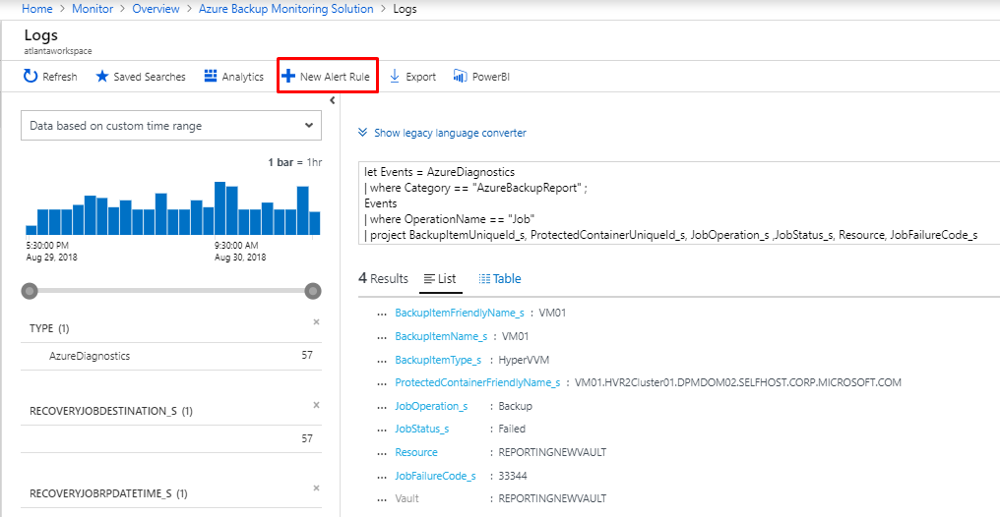

# Monitor at scale by using Azure Monitor

Azure Backup provides [built-in monitoring and alerting capabilities](backup-azure-monitoring-built-in-monitor.md) in a Recovery Services vault. These capabilities are available without any additional management infrastructure. But this built-in service is limited in the following scenarios:

- If you monitor data from multiple Recovery Services vaults across subscriptions
- If the preferred notification channel is *not* email
- If users want alerts for more scenarios
- If you want to view information from an on-premises component such as System Center Data Protection Manager in Azure, which the portal doesn't show in [**Backup Jobs**](backup-azure-monitoring-built-in-monitor.md#backup-jobs-in-recovery-services-vault) or [**Backup Alerts**](backup-azure-monitoring-built-in-monitor.md#backup-alerts-in-recovery-services-vault)

## Using Log Analytics workspace

> [!NOTE]
> Data from Azure VM backups, the Azure Backup agent, System Center Data Protection Manager, SQL backups in Azure VMs, and Azure Files share backups is pumped to the Log Analytics workspace through diagnostic settings. 

To monitor at scale, you need the capabilities of two Azure services. *Diagnostic settings* send data from multiple Azure Resource Manager resources to another resource. *Log Analytics* generates custom alerts where you can use action groups to define other notification channels. 

The following sections detail how to use Log Analytics to monitor Azure Backup at scale.

### Configure diagnostic settings

Azure Resource Manager resources, such as the Recovery Services vault, record information about scheduled operations and user-triggered operations as diagnostic data. 

In the monitoring section, select **Diagnostic settings** and specify the target for the Recovery Services vault's diagnostic data.



You can target a Log Analytics workspace from another subscription. To monitor vaults across subscriptions in a single place, select the same Log Analytics workspace for multiple Recovery Services vaults. To channel all the information that's related to Azure Backup to the Log Analytics workspace, select **AzureBackupReport** as the log.

> [!IMPORTANT]
> After you finish the configuration, you should wait 24 hours for the initial data push to finish. After that initial data push, all the events are pushed as described later in this article, in the [frequency section](#diagnostic-data-update-frequency).

### Deploy a solution to the Log Analytics workspace

After the data is inside the Log Analytics workspace, [deploy a GitHub template](https://azure.microsoft.com/resources/templates/101-backup-oms-monitoring/) to Log Analytics to visualize the data. To properly identify the workspace, make sure you give it the same resource group, workspace name, and workspace location. Then install this template on the workspace.

> [!NOTE]
> If you don't have alerts, backup jobs, or restore jobs in your Log Analytics workspace, you might see a "BadArgumentError" error code in the portal. Ignore this error and continue using the solution. After the relevant data type starts flowing into the workspace, the visualizations will reflect the same, and you won't see the error anymore.

### View Azure Backup data by using Log Analytics

After the template is deployed, the solution for monitoring Azure Backup will show up in the workspace summary region. To go to the summary, follow one of these paths:

- **Azure Monitor**: In the **Insights** section, select **More** and then choose the relevant workspace.
- **Log Analytics workspaces**: Select the relevant workspace, and then under **General**, select **Workspace summary**.



When you select the monitoring tile, the designer template opens a series of graphs about basic monitoring data from Azure Backup. Here are some of the graphs you'll see:

* All backup jobs

   

* Restore jobs

   

* Built-in Azure Backup alerts for Azure resources

   

* Built-in Azure Backup alerts for on-premises resources

   

* Active data sources

   

* Recovery Services vault cloud storage

   

These graphs are provided with the template. You can edit the graphs or add more graphs if you need to.

> [!IMPORTANT]
> When you deploy the template, you're essentially creating a read-only lock. To edit and save the template, you need to remove the lock. You can remove a lock in the **Settings** section of the Log Analytics workspace,on the **Locks** pane.

### Create alerts by using Log Analytics

In Azure Monitor, you can create your own alerts in a Log Analytics workspace. In the workspace, you use *Azure action groups* to select your preferred notification mechanism. 

> [!IMPORTANT]
> For information on the cost of creating this query, see [Azure Monitor pricing](https://azure.microsoft.com/pricing/details/monitor/).

Select any of the graphs to open the **Logs** section of the Log Analytics workspace. In the **Logs** section, edit the queries and create alerts on them.



When you select **New Alert Rule**, the Azure Monitor alert-creation page opens, as shown in the following image. Here the resource is already marked as the Log Analytics workspace, and action group integration is provided.


#### Alert condition

The defining characteristic of an alert is its triggering condition. Select **Condition** to automatically load the Kusto query on the **Logs** page as shown in the following image. Here you can edit the condition to suit your needs. For more information, see [Sample Kusto queries](#sample-kusto-queries).


If necessary, you can edit the Kusto query. Choose a threshold, period, and frequency. The threshold determines when the alert will be raised. The period is the window of time in which the query is run. For example, if the threshold is greater than 0, the period is 5 minutes, and the frequency is 5 minutes, then the rule runs the query every 5 minutes, reviewing the previous 5 minutes. If the number of results is greater than 0, you're notified through the selected action group.

#### Alert action groups

Use an action group to specify a notification channel. To see the available notification mechanisms, under **Action groups**, select **Create New**.


You can satisfy all alerting and monitoring requirements from Log Analytics alone, or you can use Log Analytics to supplement built-in notifications.

For more information, see [Create, view, and manage log alerts by using Azure Monitor](https://docs.microsoft.com/azure/azure-monitor/platform/alerts-log) and [Create and manage action groups in the Azure portal](https://docs.microsoft.com/azure/azure-monitor/platform/action-groups).

### Sample Kusto queries

The default graphs give you Kusto queries for basic scenarios on which you can build alerts. You can also modify the queries to get the data you want to be alerted on. Paste the following sample Kusto queries in the **Logs** page and then create alerts on the queries:

* All successful backup jobs

    ````Kusto
    AzureDiagnostics
    | where Category == "AzureBackupReport"
    | where SchemaVersion_s == "V2"
    | where OperationName == "Job" and JobOperation_s == "Backup"
    | where JobStatus_s == "Completed"
    ````
    
* All failed backup jobs

    ````Kusto
    AzureDiagnostics
    | where Category == "AzureBackupReport"
    | where SchemaVersion_s == "V2"
    | where OperationName == "Job" and JobOperation_s == "Backup"
    | where JobStatus_s == "Failed"
    ````
    
* All successful Azure VM backup jobs

    ````Kusto
    AzureDiagnostics
    | where Category == "AzureBackupReport"
    | where SchemaVersion_s == "V2"
    | extend JobOperationSubType_s = columnifexists("JobOperationSubType_s", "")
    | where OperationName == "Job" and JobOperation_s == "Backup" and JobStatus_s == "Completed" and JobOperationSubType_s != "Log" and JobOperationSubType_s != "Recovery point_Log"
    | join kind=inner
    (
        AzureDiagnostics
        | where Category == "AzureBackupReport"
        | where OperationName == "BackupItem"
        | where SchemaVersion_s == "V2"
        | where BackupItemType_s == "VM" and BackupManagementType_s == "IaaSVM"
        | distinct BackupItemUniqueId_s, BackupItemFriendlyName_s
        | project BackupItemUniqueId_s , BackupItemFriendlyName_s
    )
    on BackupItemUniqueId_s
    | extend Vault= Resource
    | project-away Resource
    ````

* All successful SQL log backup jobs

    ````Kusto
    AzureDiagnostics
    | where Category == "AzureBackupReport"
    | where SchemaVersion_s == "V2"
    | extend JobOperationSubType_s = columnifexists("JobOperationSubType_s", "")
    | where OperationName == "Job" and JobOperation_s == "Backup" and JobStatus_s == "Completed" and JobOperationSubType_s == "Log"
    | join kind=inner
    (
        AzureDiagnostics
        | where Category == "AzureBackupReport"
        | where OperationName == "BackupItem"
        | where SchemaVersion_s == "V2"
        | where BackupItemType_s == "SQLDataBase" and BackupManagementType_s == "AzureWorkload"
        | distinct BackupItemUniqueId_s, BackupItemFriendlyName_s
        | project BackupItemUniqueId_s , BackupItemFriendlyName_s
    )
    on BackupItemUniqueId_s
    | extend Vault= Resource
    | project-away Resource
    ````

* All successful Azure Backup agent jobs

    ````Kusto
    AzureDiagnostics
    | where Category == "AzureBackupReport"
    | where SchemaVersion_s == "V2"
    | extend JobOperationSubType_s = columnifexists("JobOperationSubType_s", "")
    | where OperationName == "Job" and JobOperation_s == "Backup" and JobStatus_s == "Completed" and JobOperationSubType_s != "Log" and JobOperationSubType_s != "Recovery point_Log"
    | join kind=inner
    (
        AzureDiagnostics
        | where Category == "AzureBackupReport"
        | where OperationName == "BackupItem"
        | where SchemaVersion_s == "V2"
        | where BackupItemType_s == "FileFolder" and BackupManagementType_s == "MAB"
        | distinct BackupItemUniqueId_s, BackupItemFriendlyName_s
        | project BackupItemUniqueId_s , BackupItemFriendlyName_s
    )
    on BackupItemUniqueId_s
    | extend Vault= Resource
    | project-away Resource
    ````

### Diagnostic data update frequency

The diagnostic data from the vault is pumped to the Log Analytics workspace with some lag. Every event arrives at the Log Analytics workspace *20 to 30 minutes* after it's pushed from the Recovery Services vault. Here are further details about the lag:

- Across all solutions, the backup service's built-in alerts are pushed as soon as they're created. So they usually appear in the Log Analytics workspace after 20 to 30 minutes.
- Across all solutions, ad hoc backup jobs and restore jobs are pushed as soon as they *finish*.
- For all solutions except SQL backup, scheduled backup jobs are pushed as soon as they *finish*.
- For SQL backup, because log backups can occur every 15 minutes, information for all the completed scheduled backup jobs, including logs, is batched and pushed every 6 hours.
- Across all solutions, other information such as the backup item, policy, recovery points, storage, and so on is pushed at least *once per day.*
- A change in the backup configuration (such as changing policy or editing policy) triggers a push of all related backup information.

## Using the Recovery Services vault's activity logs

> [!CAUTION]
> The following steps apply only to *Azure VM backups.* You can't use these steps for solutions such as the Azure Backup agent, SQL backups within Azure, or Azure Files.

You can also use activity logs to get notification for events such as backup success. To begin, follow these steps:

1. Sign in into the Azure portal.
1. Open the relevant Recovery Services vault. 
1. In the vault's properties, open the **Activity log** section.

To identify the appropriate log and create an alert:

1. Verify that you're receiving activity logs for successful backups by applying the filters shown in the following image. Change the **Timespan** value as necessary to view records.

   

1. Select the operation name to see the relevant details.
1. Select **New alert rule** to open the **Create rule** page. 
1. Create an alert by following the steps in [Create, view, and manage activity log alerts by using Azure Monitor](https://docs.microsoft.com/azure/azure-monitor/platform/alerts-activity-log).

   

Here the resource is the Recovery Services vault itself. You must repeat the same steps for all of the vaults in which you want to be notified through activity logs. The condition won't have a threshold, period, or frequency because this alert is based on events. As soon as the relevant activity log is generated, the alert is raised.

## Using Log Analytics to monitor at scale

You can view all alerts created from activity logs and Log Analytics workspaces in Azure Monitor. Just open the **Alerts** pane on the left.

Although you can get notifications through activity logs, we highly recommend using Log Analytics rather than activity logs for monitoring at scale. Here's why:

- **Limited scenarios**: Notifications through activity logs apply only to Azure VM backups. The notifications must be set up for every Recovery Services vault.
- **Definition fit**: The scheduled backup activity doesn't fit with the latest definition of activity logs. Instead, it aligns with [diagnostic logs](https://docs.microsoft.com/azure/azure-monitor/platform/diagnostic-logs-overview#what-you-can-do-with-diagnostic-logs). This alignment causes unexpected effects when the data that flows through the activity log channel changes.
- **Problems with the activity log channel**: In Recovery Services vaults, activity logs that are pumped from Azure Backup follow a new model. Unfortunately, this change affects the generation of activity logs in Azure Government, Azure Germany, and Azure China 21Vianet. If users of these cloud services create or configure any alerts from activity logs in Azure Monitor, the alerts aren't triggered. Also, in all Azure public regions, if a user [collects Recovery Services activity logs into a Log Analytics workspace](https://docs.microsoft.com/azure/azure-monitor/platform/collect-activity-logs), these logs don't appear.

Use a Log Analytics workspace for monitoring and alerting at scale for all your workloads that are protected by Azure Backup.

## Next steps

To create custom queries, see [Log Analytics data model](backup-azure-log-analytics-data-model.md).
