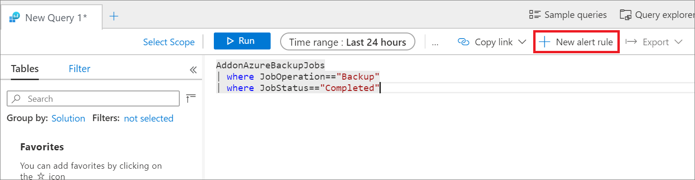
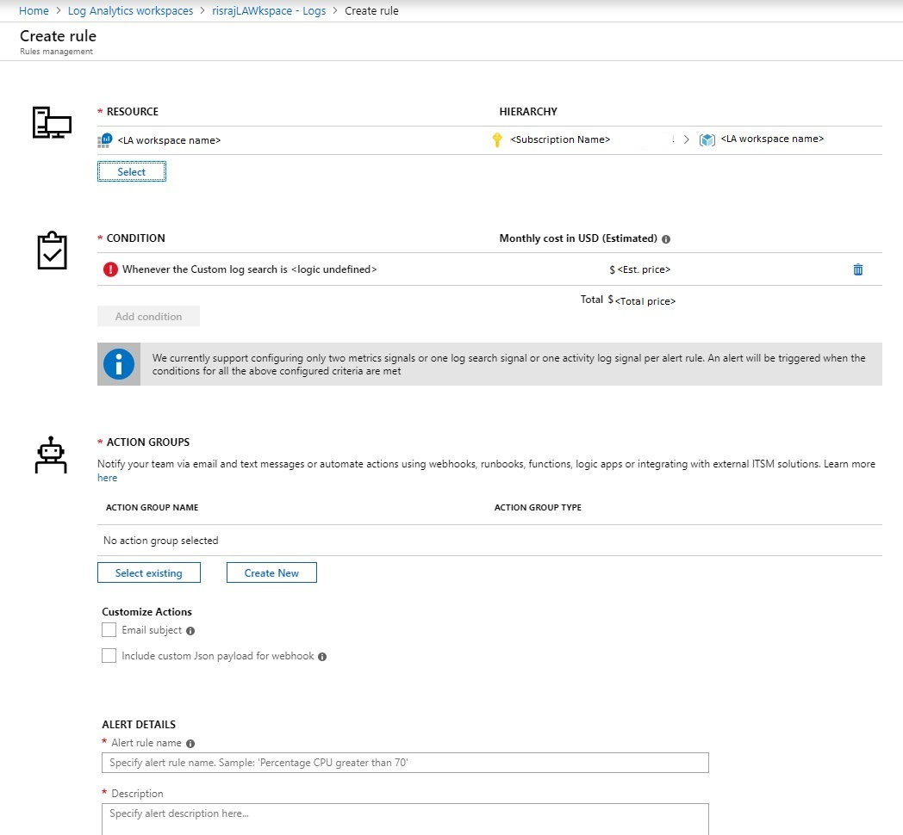
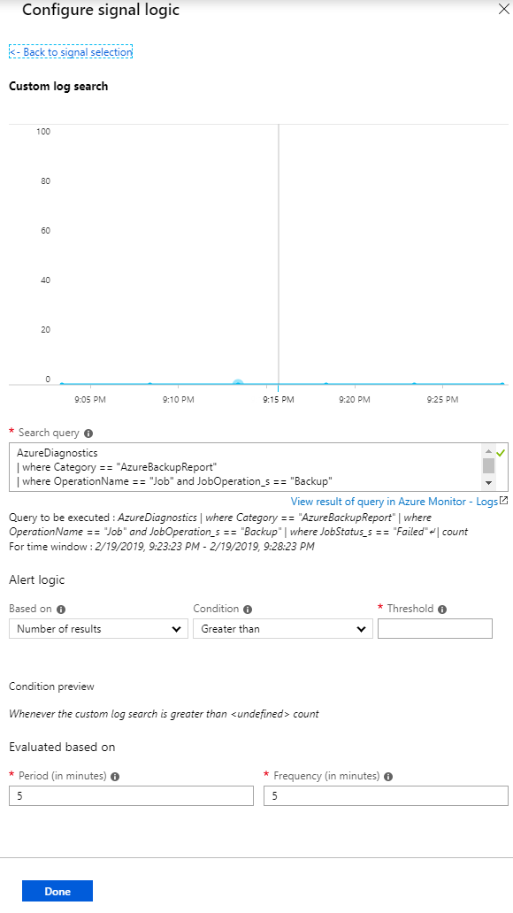
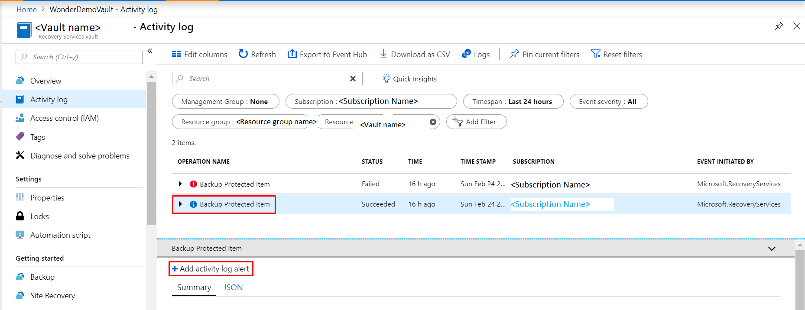
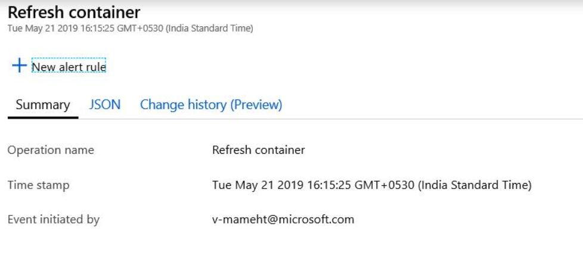

# Monitor at scale by using Azure Monitor

Azure Backup provides [built-in monitoring and alerting capabilities](backup-azure-monitoring-built-in-monitor.md) in a Recovery Services vault. These capabilities are available without any additional management infrastructure. But this built-in service is limited in the following scenarios:

- If you monitor data from multiple Recovery Services vaults across subscriptions
- If the preferred notification channel is *not* email
- If users want alerts for more scenarios
- If you want to view information from an on-premises component such as System Center Data Protection Manager in Azure, which the portal doesn't show in [**Backup Jobs**](backup-azure-monitoring-built-in-monitor.md#backup-jobs-in-recovery-services-vault) or [**Backup Alerts**](backup-azure-monitoring-built-in-monitor.md#backup-alerts-in-recovery-services-vault)

## Using Log Analytics workspace

### Create alerts by using Log Analytics

In Azure Monitor, you can create your own alerts in a Log Analytics workspace. In the workspace, you use *Azure action groups* to select your preferred notification mechanism.

> [!IMPORTANT]
> For information on the cost of creating this query, see [Azure Monitor pricing](https://azure.microsoft.com/pricing/details/monitor/).

Open the **Logs** section of the Log Analytics workspace and create a query for your own Logs. When you select **New Alert Rule**, the Azure Monitor alert-creation page opens, as shown in the following image.



Here the resource is already marked as the Log Analytics workspace, and action group integration is provided.



#### Alert condition

The defining characteristic of an alert is its triggering condition. Select **Condition** to automatically load the Kusto query on the **Logs** page as shown in the following image. Here you can edit the condition to suit your needs. For more information, see [Sample Kusto queries](#sample-kusto-queries).



If necessary, you can edit the Kusto query. Choose a threshold, period, and frequency. The threshold determines when the alert will be raised. The period is the window of time in which the query is run. For example, if the threshold is greater than 0, the period is 5 minutes, and the frequency is 5 minutes, then the rule runs the query every 5 minutes, reviewing the previous 5 minutes. If the number of results is greater than 0, you're notified through the selected action group.

> [!NOTE]
> To run the alert rule once a day, across all the events/logs that were created on the given day, change the value of both 'period' and 'frequency' to 1440, i.e., 24 hours.

#### Alert action groups

Use an action group to specify a notification channel. To see the available notification mechanisms, under **Action groups**, select **Create New**.


You can satisfy all alerting and monitoring requirements from Log Analytics alone, or you can use Log Analytics to supplement built-in notifications.

For more information, see [Create, view, and manage log alerts by using Azure Monitor](https://docs.microsoft.com/azure/azure-monitor/platform/alerts-log) and [Create and manage action groups in the Azure portal](https://docs.microsoft.com/azure/azure-monitor/platform/action-groups).

### Sample Kusto queries

The default graphs give you Kusto queries for basic scenarios on which you can build alerts. You can also modify the queries to get the data you want to be alerted on. Paste the following sample Kusto queries in the **Logs** page and then create alerts on the queries:

- All successful backup jobs

    ````Kusto
    AddonAzureBackupJobs
    | where JobOperation=="Backup"
    | summarize arg_max(TimeGenerated,*) by JobUniqueId
    | where JobStatus=="Completed"
    ````

- All failed backup jobs

    ````Kusto
    AddonAzureBackupJobs
    | where JobOperation=="Backup"
    | summarize arg_max(TimeGenerated,*) by JobUniqueId
    | where JobStatus=="Failed"
    ````

- All successful Azure VM backup jobs

    ````Kusto
    AddonAzureBackupJobs
    | where JobOperation=="Backup"
    | summarize arg_max(TimeGenerated,*) by JobUniqueId
    | where JobStatus=="Completed"
    | join kind=inner
    (
        CoreAzureBackup
        | where OperationName == "BackupItem"
        | where BackupItemType=="VM" and BackupManagementType=="IaaSVM"
        | distinct BackupItemUniqueId, BackupItemFriendlyName
    )
    on BackupItemUniqueId
    ````

- All successful SQL log backup jobs

    ````Kusto
    AddonAzureBackupJobs
    | where JobOperation=="Backup" and JobOperationSubType=="Log"
    | summarize arg_max(TimeGenerated,*) by JobUniqueId
    | where JobStatus=="Completed"
    | join kind=inner
    (
        CoreAzureBackup
        | where OperationName == "BackupItem"
        | where BackupItemType=="SQLDataBase" and BackupManagementType=="AzureWorkload"
        | distinct BackupItemUniqueId, BackupItemFriendlyName
    )
    on BackupItemUniqueId
    ````

- All successful Azure Backup agent jobs

    ````Kusto
    AddonAzureBackupJobs
    | where JobOperation=="Backup"
    | summarize arg_max(TimeGenerated,*) by JobUniqueId
    | where JobStatus=="Completed"
    | join kind=inner
    (
        CoreAzureBackup
        | where OperationName == "BackupItem"
        | where BackupItemType=="FileFolder" and BackupManagementType=="MAB"
        | distinct BackupItemUniqueId, BackupItemFriendlyName
    )
    on BackupItemUniqueId
    ````

- Backup Storage Consumed per Backup Item

    ````Kusto
    CoreAzureBackup
    //Get all Backup Items
    | where OperationName == "BackupItem"
    //Get distinct Backup Items
    | distinct BackupItemUniqueId, BackupItemFriendlyName
    | join kind=leftouter
    (AddonAzureBackupStorage
    | where OperationName == "StorageAssociation"
    //Get latest record for each Backup Item
    | summarize arg_max(TimeGenerated, *) by BackupItemUniqueId
    | project BackupItemUniqueId , StorageConsumedInMBs)
    on BackupItemUniqueId
    | project BackupItemUniqueId , BackupItemFriendlyName , StorageConsumedInMBs
    | sort by StorageConsumedInMBs desc
    ````

### Diagnostic data update frequency

The diagnostic data from the vault is pumped to the Log Analytics workspace with some lag. Every event arrives at the Log Analytics workspace *20 to 30 minutes* after it's pushed from the Recovery Services vault. Here are further details about the lag:

- Across all solutions, the backup service's built-in alerts are pushed as soon as they're created. So they usually appear in the Log Analytics workspace after 20 to 30 minutes.
- Across all solutions, on-demand backup jobs and restore jobs are pushed as soon as they *finish*.
- For all solutions except SQL backup, scheduled backup jobs are pushed as soon as they *finish*.
- For SQL backup, because log backups can occur every 15 minutes, information for all the completed scheduled backup jobs, including logs, is batched and pushed every 6 hours.
- Across all solutions, other information such as the backup item, policy, recovery points, storage, and so on, is pushed at least *once per day.*
- A change in the backup configuration (such as changing policy or editing policy) triggers a push of all related backup information.

## Using the Recovery Services vault's activity logs

> [!CAUTION]
> The following steps apply only to *Azure VM backups.* You can't use these steps for solutions such as the Azure Backup agent, SQL backups within Azure, or Azure Files.

You can also use activity logs to get notification for events such as backup success. To begin, follow these steps:

1. Sign in into the Azure portal.
2. Open the relevant Recovery Services vault.
3. In the vault's properties, open the **Activity log** section.

To identify the appropriate log and create an alert:

1. Verify that you're receiving activity logs for successful backups by applying the filters shown in the following image. Change the **Timespan** value as necessary to view records.

   

2. Select the operation name to see the relevant details.
3. Select **New alert rule** to open the **Create rule** page.
4. Create an alert by following the steps in [Create, view, and manage activity log alerts by using Azure Monitor](https://docs.microsoft.com/azure/azure-monitor/platform/alerts-activity-log).

   

Here the resource is the Recovery Services vault itself. Repeat the same steps for all of the vaults in which you want to be notified through activity logs. The condition won't have a threshold, period, or frequency because this alert is based on events. As soon as the relevant activity log is generated, the alert is raised.

## Using Log Analytics to monitor at scale

You can view all alerts created from activity logs and Log Analytics workspaces in Azure Monitor. Just open the **Alerts** pane on the left.

Although you can get notifications through activity logs, we highly recommend using Log Analytics rather than activity logs for monitoring at scale. Here's why:

- **Limited scenarios**: Notifications through activity logs apply only to Azure VM backups. The notifications must be set up for every Recovery Services vault.
- **Definition fit**: The scheduled backup activity doesn't fit with the latest definition of activity logs. Instead, it aligns with [resource logs](https://docs.microsoft.com/azure/azure-monitor/platform/resource-logs-collect-workspace#what-you-can-do-with-platform-logs-in-a-workspace). This alignment causes unexpected effects when the data that flows through the activity log channel changes.
- **Problems with the activity log channel**: In Recovery Services vaults, activity logs that are pumped from Azure Backup follow a new model. Unfortunately, this change affects the generation of activity logs in Azure Government, Azure Germany, and Azure China 21Vianet. If users of these cloud services create or configure any alerts from activity logs in Azure Monitor, the alerts aren't triggered. Also, in all Azure public regions, if a user [collects Recovery Services activity logs into a Log Analytics workspace](https://docs.microsoft.com/azure/azure-monitor/platform/collect-activity-logs), these logs don't appear.

Use a Log Analytics workspace for monitoring and alerting at scale for all your workloads that are protected by Azure Backup.

## Next steps

To create custom queries, see [Log Analytics data model](backup-azure-reports-data-model.md).
