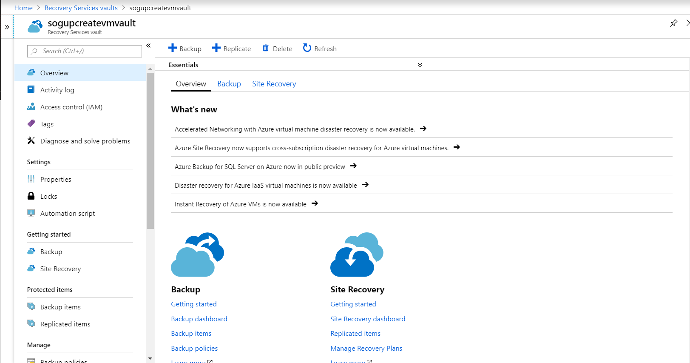
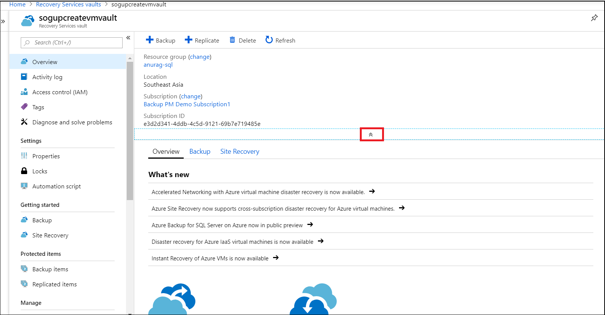
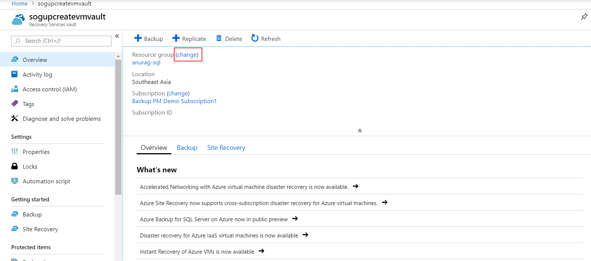
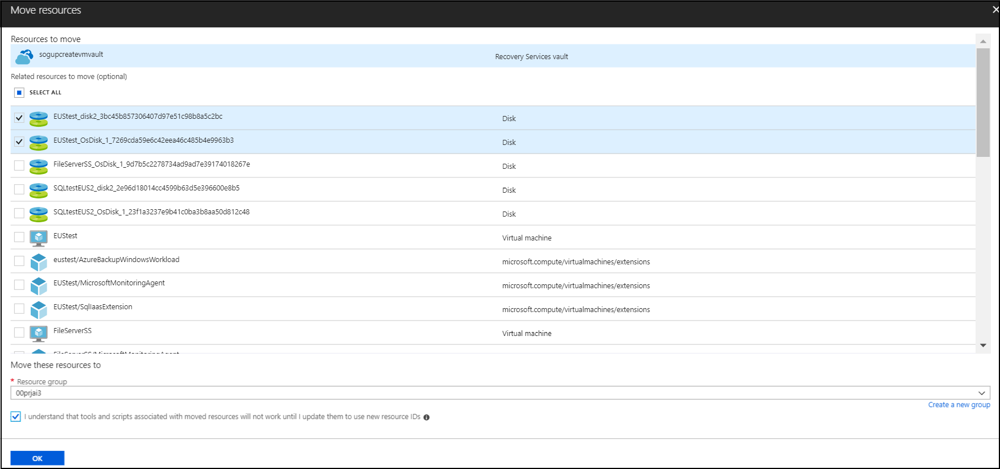
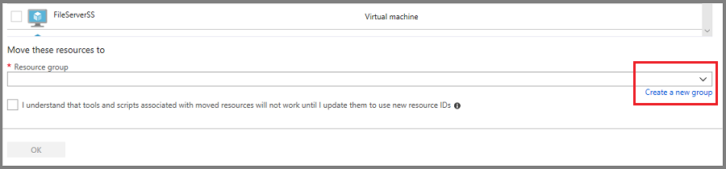
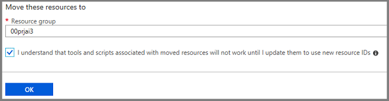
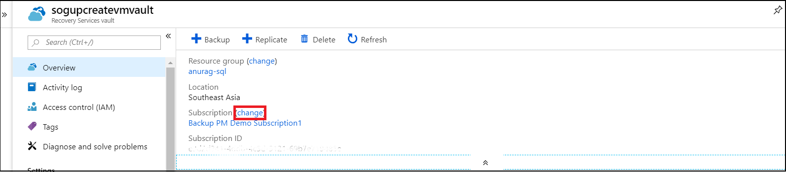
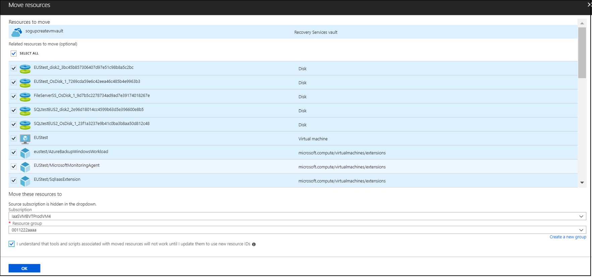
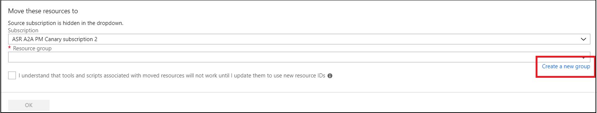

# Move a Recovery Services vault across Azure Subscriptions and Resource Groups

This article explains how to move a Recovery Services vault configured for Azure Backup across Azure subscriptions, or to another resource group in the same subscription. You can use the Azure portal or PowerShell to move a Recovery Services vault.

## Supported regions

Resource move for Recovery Services vault is supported in Australia East, Australia South East, Canada Central, Canada East, South East Asia, East Asia, Central US, North Central US, East US, East US2, South central US, West Central US, West Central US2, West US, Central India, South India, Japan East, Japan West, Korea Central, Korea South, North Europe, West Europe, South Africa North, South Africa West, UK South, and UK West.

## Unsupported regions

France Central, France South, Germany Northeast, Germany Central, US Gov Iowa, China North, China North2, China East, China East2

## Prerequisites for moving Recovery Services vault

- During vault move across resource groups, both the source and target resource groups are locked preventing the write and delete operations. For more information, see this [article](https://docs.microsoft.com/azure/azure-resource-manager/resource-group-move-resources).
- Only admin subscription has the permissions to move a vault.
- For moving vaults across subscriptions, the target subscription must reside in the same tenant as the source subscription and its state should be enabled.
- You must have permission to perform write operations on the target resource group.
- Moving the vault only changes the resource group. The Recovery Services vault will reside on the same location and it can't be changed.
- You can move only one Recovery Services vault, per region, at a time.
- If a VM doesn't move with the Recovery Services vault across subscriptions, or to a new resource group, the current VM recovery points will remain intact in the vault until they expire.
- Whether the VM is moved with the vault or not, you can always restore the VM from the retained backup history in the vault.
- The Azure Disk Encryption requires that the key vault and VMs reside in the same Azure region and subscription.
- To move a virtual machine with managed disks, see this [article](https://azure.microsoft.com/blog/move-managed-disks-and-vms-now-available/).
- The options for moving resources deployed through the Classic model differ depending on whether you're moving the resources within a subscription, or to a new subscription. For more information, see this [article](https://docs.microsoft.com/azure/azure-resource-manager/resource-group-move-resources).
- Backup policies defined for the vault are retained after the vault moves across subscriptions or to a new resource group.
- You can only move a vault that contains any of the following types of backup items. Any backup items of types not listed below will need to be stopped and the data permanently deleted before moving the vault.
  - Azure Virtual Machines
  - Microsoft Azure Recovery Services (MARS) Agent
  - Microsoft Azure Backup Server (MABS)
  - Data Protection Manager (DPM)
- If you move a vault containing VM backup data, across subscriptions, you must move your VMs to the same subscription, and use the same target VM resource group name (as it was in old subscription) to continue backups.

> [!NOTE]
> Moving Recovery Services vaults for Azure Backup across Azure regions isn't supported.<br><br>
> If you have configured any VMs (Azure IaaS, Hyper-V, VMware) or physical machines for disaster recovery using **Azure Site Recovery**, the move operation will be blocked. If you want to move vaults for Azure Site Recovery, review [this article](https://docs.microsoft.com/azure/site-recovery/move-vaults-across-regions) to learn about moving vaults manually.

## Use Azure portal to move Recovery Services vault to different resource group

To move a recovery services vault and its associated resources to different resource group

1. Sign in to the [Azure portal](https://portal.azure.com/).
2. Open the list of **Recovery Services vaults** and select the vault you want to move. When the vault dashboard opens, it appears as shown in the following image.

   

   If you don't see the **Essentials** information for your vault, click the drop-down icon. You should now see the Essentials information for your vault.

   

3. In the vault overview menu, click **change** next to the **Resource group**, to open the **Move resources** blade.

   

4. In the **Move resources** blade, for the selected vault it's recommended to move the optional related resources by selecting the checkbox as shown in the following image.

   

5. To add the target resource group, in the **Resource group** drop-down list select an existing resource group or click **create a new group** option.

   

6. After adding the resource group, confirm **I understand that tools and scripts associated with moved resources will not work until I update them to use new resource IDs** option and then click **OK** to complete moving the vault.

   

## Use Azure portal to move Recovery Services vault to a different subscription

You can move a Recovery Services vault and its associated resources to a different subscription

1. Sign in to the [Azure portal](https://portal.azure.com/).
2. Open the list of Recovery Services vaults and select the vault you want to move. When the vault dashboard opens, it appears as shown the following image.

    

    If you do not see the **Essentials** information for your vault, click the drop-down icon. You should now see the Essentials information for your vault.

    

3. In the vault overview menu, click **change** next to **Subscription**, to open the **Move resources** blade.

   

4. Select the resources to be moved, here we recommend you to use the **Select All** option to select all the listed optional resources.

   

5. Select the target subscription from the **Subscription** drop-down list, where you want the vault to be moved.
6. To add the target resource group, in the **Resource group** drop-down list select an existing resource group or click **create a new group** option.

   

7. Click **I understand that tools and scripts associated with moved resources will not work until I update them to use new resource IDs** option to confirm, and then click **OK**.

> [!NOTE]
> Cross subscription backup (RS vault and protected VMs are in different subscriptions) is not a supported scenario. Also, storage redundancy option from local redundant storage (LRS) to global redundant storage (GRS) and vice versa cannot be modified during the vault move operation.
>
>

## Use PowerShell to move Recovery Services vault

To move a Recovery Services vault to another resource group, use the `Move-AzureRMResource` cmdlet. `Move-AzureRMResource` requires the resource name and type of resource. You can get both from the `Get-AzureRmRecoveryServicesVault` cmdlet.

```powershell
$destinationRG = "<destinationResourceGroupName>"
$vault = Get-AzureRmRecoveryServicesVault -Name <vaultname> -ResourceGroupName <vaultRGname>
Move-AzureRmResource -DestinationResourceGroupName $destinationRG -ResourceId $vault.ID
```

To move the resources to different subscription, include the `-DestinationSubscriptionId` parameter.

```powershell
Move-AzureRmResource -DestinationSubscriptionId "<destinationSubscriptionID>" -DestinationResourceGroupName $destinationRG -ResourceId $vault.ID
```

After executing the above cmdlets, you'll be asked to confirm that you want to move the specified resources. Type **Y** to confirm. After a successful validation, the resource moves.

## Use CLI to move Recovery Services vault

To move a Recovery Services vault to another resource group, use the following cmdlet:

```azurecli
az resource move --destination-group <destinationResourceGroupName> --ids <VaultResourceID>
```

To move to a new subscription, provide the `--destination-subscription-id` parameter.

## Post migration

1. Set/verify the access controls for the resource groups.  
2. The Backup reporting and monitoring feature needs to be configured again for the vault post the move completes. The previous configuration will be lost during the move operation.

## Next steps

You can move many different types of resources between resource groups and subscriptions.

For more information, see [Move resources to new resource group or subscription](https://docs.microsoft.com/azure/azure-resource-manager/resource-group-move-resources).
