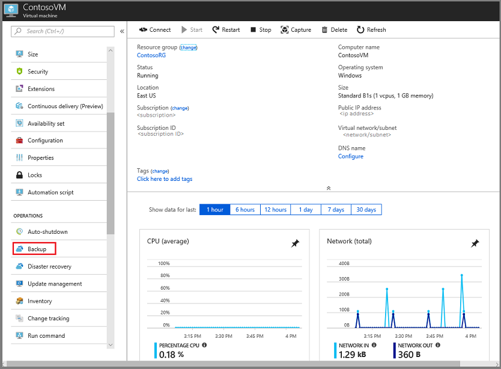
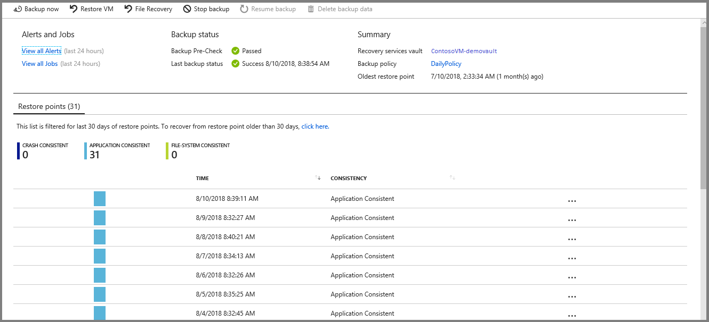

# Recovery Services vaults overview

This article describes the features of a Recovery Services vault. A Recovery Services vault is a storage entity in Azure that houses data. The data is typically copies of data, or configuration information for virtual machines (VMs), workloads, servers, or workstations. You can use Recovery Services vaults to hold backup data for various Azure services such as IaaS VMs (Linux or Windows) and Azure SQL databases. Recovery Services vaults support System Center DPM, Windows Server, Azure Backup Server, and more. Recovery Services vaults make it easy to organize your backup data, while minimizing management overhead.

Within an Azure subscription, you can create up to 500 Recovery Services vaults per subscription per region.

## Comparing Recovery Services vaults and Backup vaults

If you still have Backup vaults, they're being auto-upgraded to Recovery Services vaults. By November 2017, all Backup vaults have been upgraded to Recovery Services vaults.

Recovery Services vaults are based on the Azure Resource Manager model of Azure, however Backup vaults were based on the Azure Service Manager model. When you upgrade a Backup vault to a Recovery Services vault, the backup data remains intact during and after the upgrade process. Recovery Services vaults provide features not available for Backup vaults, such as:

- **Enhanced capabilities to help secure backup data**: With Recovery Services vaults, Azure Backup provides security capabilities to protect cloud backups. The security features ensure you can secure your backups, and safely recover data, even if production and backup servers are compromised. [Learn more](backup-azure-security-feature.md)

- **Central monitoring for your hybrid IT environment**: With Recovery Services vaults, you can monitor not only your [Azure IaaS VMs](backup-azure-manage-vms.md) but also your [on-premises assets](backup-azure-manage-windows-server.md#manage-backup-items) from a central portal. [Learn more](https://azure.microsoft.com/blog/alerting-and-monitoring-for-azure-backup)

- **Role-Based Access Control (RBAC)**: RBAC provides fine-grained access management control in Azure. [Azure provides various built-in roles](../role-based-access-control/built-in-roles.md), and Azure Backup has three [built-in roles to manage recovery points](backup-rbac-rs-vault.md). Recovery Services vaults are compatible with RBAC, which restricts backup and restore access to the defined set of user roles. [Learn more](backup-rbac-rs-vault.md)

- **Protect all configurations of Azure Virtual Machines**: Recovery Services vaults protect Resource Manager-based VMs including Premium Disks, Managed Disks, and Encrypted VMs. Upgrading a Backup vault to a Recovery Services vault gives you the opportunity to upgrade your Service Manager-based VMs to Resource Manager-based VMs. While upgrading the vault, you can retain your Service Manager-based VM recovery points and configure protection for the upgraded (Resource Manager-enabled) VMs. [Learn more](https://azure.microsoft.com/blog/azure-backup-recovery-services-vault-ga)

- **Instant restore for IaaS VMs**: Using Recovery Services vaults, you can restore files and folders from an IaaS VM without restoring the entire VM, which enables faster restore times. Instant restore for IaaS VMs is available for both Windows and Linux VMs. [Learn more](backup-instant-restore-capability.md)

## Storage settings in the Recovery Services vault

A Recovery Services vault is an entity that stores the backups and recovery points created over time. The Recovery Services vault also contains the backup policies that are associated with the protected virtual machines.

Azure Backup automatically handles storage for the vault. See how [storage settings can be changed](https://docs.microsoft.com/azure/backup/backup-create-rs-vault#set-storage-redundancy).

To learn more about storage redundancy, see these articles on [geo](https://docs.microsoft.com/azure/storage/common/storage-redundancy-grs) and [local](https://docs.microsoft.com/azure/storage/common/storage-redundancy-lrs) redundancy.

## Managing your Recovery Services vaults in the portal

Creation and management of Recovery Services vaults in the Azure portal is easy because the Backup service integrates into other Azure services. This integration means you can create or manage a Recovery Services vault *in the context of the target service*. For example, to view the recovery points for a VM, select your VM, and click **Backup** in the Operations menu.

If the VM doesn't have backup configured, then it will prompt you to configure backup. If backup has been configured, you'll see backup information about the VM, including a list of restore points.  

In the previous example, **ContosoVM** is the name of the virtual machine. **ContosoVM-demovault** is the name of the Recovery Services vault. You don't need to remember the name of the Recovery Services vault that stores the recovery points, you can access this information from the virtual machine.  

If one Recovery Services vault protects multiple servers, it may be more logical to look at the Recovery Services vault. You can search for all Recovery Services vaults in the subscription, and choose one from the list.

The following sections contain links to articles that explain how to use a Recovery Services vault in each type of activity.

> [!NOTE]
> Recovery Services vault cannot be created with the same name if it has been deleted within 24 hours. Use a different resource name or choose a different resource group or retry again after 24 hours.

### Back up data

- [Back up an Azure VM](backup-azure-vms-first-look-arm.md)
- [Back up Windows Server or Windows workstation](backup-try-azure-backup-in-10-mins.md)
- [Back up DPM workloads to Azure](backup-azure-dpm-introduction.md)
- [Prepare to back up workloads using Azure Backup Server](backup-azure-microsoft-azure-backup.md)

### Manage recovery points

- [Manage Azure VM backups](backup-azure-manage-vms.md)
- [Managing files and folders](backup-azure-manage-windows-server.md)

### Restore data from the vault

- [Recover individual files from an Azure VM](backup-azure-restore-files-from-vm.md)
- [Restore an Azure VM](backup-azure-arm-restore-vms.md)

### Secure the vault

- [Securing cloud backup data in Recovery Services vaults](backup-azure-security-feature.md)

## Azure Advisor

[Azure Advisor](https://docs.microsoft.com/azure/advisor/) is a personalized cloud consultant that helps optimize the use of Azure. It analyzes your Azure usage and provides timely recommendations to help optimize and secure your deployments. It provides recommendations in four categories: High Availability, Security, Performance, and Cost.

Azure Advisor provides hourly [recommendations](https://docs.microsoft.com/azure/advisor/advisor-high-availability-recommendations#protect-your-virtual-machine-data-from-accidental-deletion) for VMs that aren't backed up, so you never miss backing up important VMs. You can also control the recommendations by snoozing them.  You can click on the recommendation and enable backup on VMs in-line by specifying the vault (where backups will be stored) and the backup policy (schedule of backups and retention of backup copies).

## Next steps

Use the following articles to: 
[Back up an IaaS VM](backup-azure-arm-vms-prepare.md) 
[Back up an Azure Backup Server](backup-azure-microsoft-azure-backup.md) 
[Back up a Windows Server](backup-windows-with-mars-agent.md)
