# Recover files from Azure virtual machine backup

> [!CAUTION]
> This article references CentOS, a Linux distribution that is nearing End Of Life (EOL) status. Please consider your use and planning accordingly. For more information, see the [CentOS End Of Life guidance](~/articles/virtual-machines/workloads/centos/centos-end-of-life.md).

Azure Backup provides the capability to restore [Azure virtual machines (VMs) and disks](./backup-azure-arm-restore-vms.md) from Azure VM backups, also known as recovery points. This article explains how to recover files and folders from an Azure VM backup. Restoring files and folders is available only for Azure VMs deployed using the Resource Manager model and protected to a Recovery Services vault.


> [!NOTE]
> This feature is available for Azure VMs deployed using the Resource Manager model and protected to a Recovery Services vault.
> File recovery from an encrypted VM backup isn't supported.
>

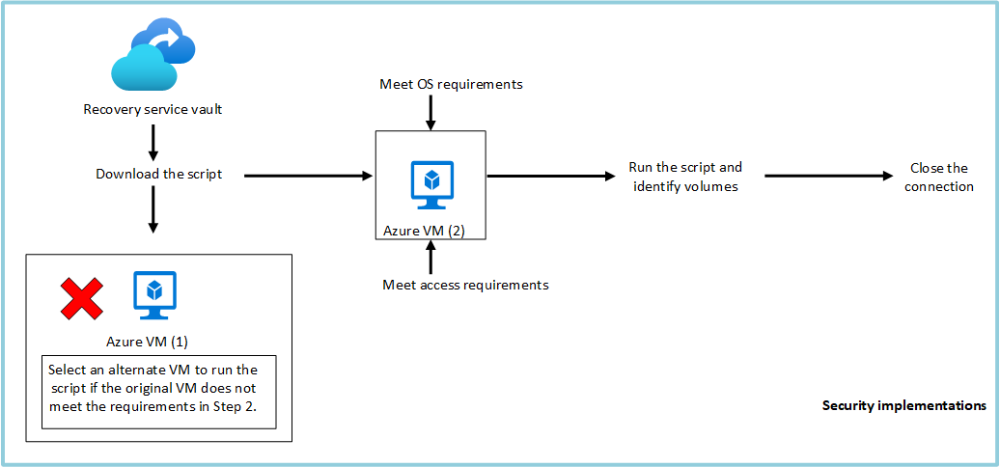

## Step 1: Generate and download script to browse and recover files

To restore files or folders from the recovery point, go to the virtual machine and perform the following steps:

1. Sign in to the [Azure portal](https://portal.Azure.com) and in the left pane, select **Virtual machines**. From the list of virtual machines, select the virtual machine to open that virtual machine's dashboard.

2. In the virtual machine's menu, select **Backup** to open the Backup dashboard.

    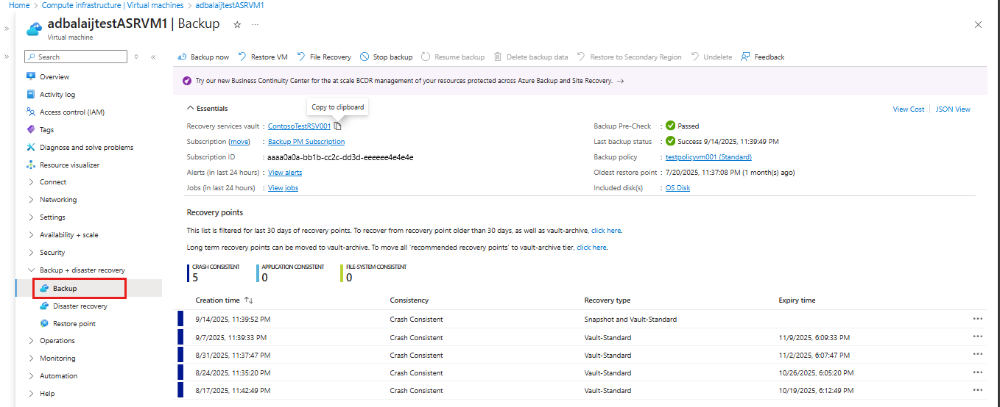

3. In the Backup dashboard menu, select **File Recovery**.

    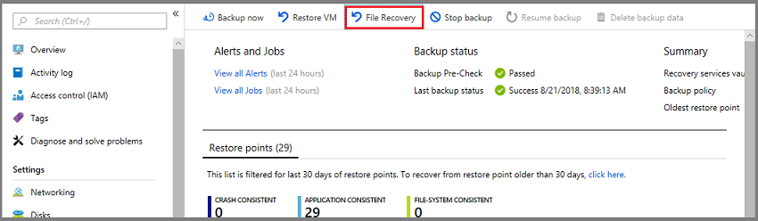32

    The **File Recovery** menu opens.

    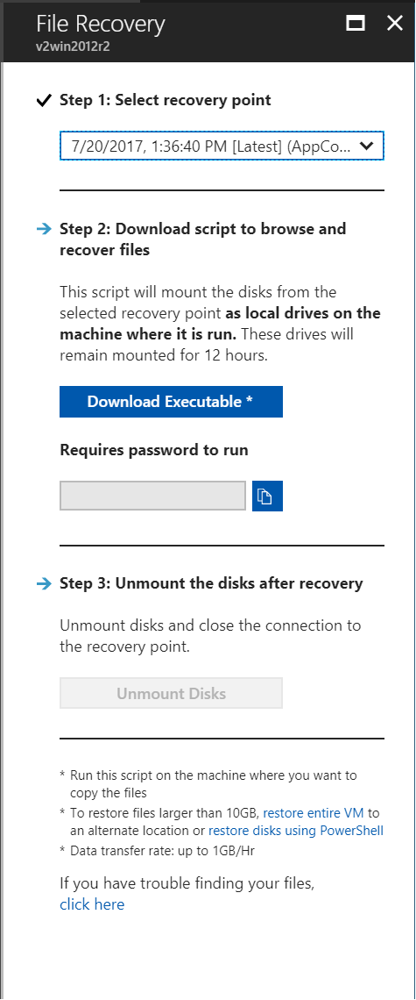

> [!IMPORTANT]
> Users should note the performance limitations of this feature. As pointed out in the footnote section of the above blade, this feature should be used when the total size of recovery is 10 GB or less. The expected data transfer speeds are around 1 GB per hour.

4. From the **Select recovery point** drop-down menu, select the recovery point that holds the files you want. By default, the latest recovery point is already selected.

5. Select **Download Executable** (for Windows Azure VMs) or **Download Script** (for Linux Azure VMs, a Python script is generated) to download the software used to copy files from the recovery point.

    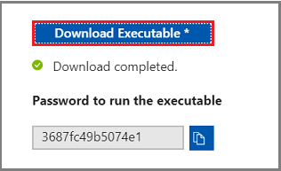

    Azure downloads the executable or script to the local computer.

    

    To run the executable or script as an administrator, it's suggested you save the downloaded file to your computer.

6. The executable or script is password protected and requires a password. In the **File Recovery** menu, select the copy button to load the password into memory.

    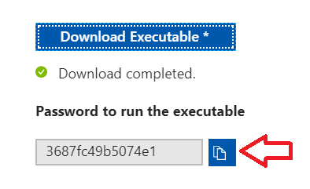


## Step 2: Ensure the machine meets the requirements before executing the script

After the script is successfully downloaded, make sure you have the right machine to execute this script. The VM where you are planning to execute the script, should not have any of the following unsupported configurations. **If it does, then choose an alternate machine that meets the requirements**.

### Dynamic disks

You can't run the executable script on the VM with any of the following characteristics: Choose an alternate machine

- Volumes that span multiple disks (spanned and striped volumes).
- Fault-tolerant volumes (mirrored and RAID-5 volumes) on dynamic disks.

### Windows Storage Spaces

You can't run the downloaded executable on the same backed-up VM if the backed-up VM has Windows Storage Spaces. Choose an alternate machine.

### Virtual machine backups having large disks

If the backed-up machine has large number of disks (>16) or large disks (> 4 TB each) it's not recommended to execute the script on the same machine for restore, since it will have a significant impact on the VM. Instead it's recommended to have a separate VM only for file recovery (Azure VM D2v3 VMs) and then shut it down when not required.

See requirements to restore files from backed-up VMs with large disk:<br>
[Windows OS](#for-backed-up-vms-with-large-disks-windows)<br>
[Linux OS](#for-backed-up-vms-with-large-disks-linux)

After you choose the correct machine to run the ILR script, ensure that it meets the [OS requirements](#step-3-os-requirements-to-successfully-run-the-script) and [access requirements](#step-4-access-requirements-to-successfully-run-the-script).

## Step 3: OS requirements to successfully run the script

The VM on which you want to run the downloaded script must meet the following requirements.

### For Windows OS

The following table shows the compatibility between server and computer operating systems. When recovering files, you can't restore files to a previous or future operating system version. For example, you can't restore a file from a Windows Server 2016 VM to Windows Server 2012 or a Windows 8 computer. You can restore files from a VM to the same server operating system, or to the compatible client operating system.

|Server OS | Compatible client OS  |
| --------------- | ---- |
| Windows Server 2022    | Windows 11 and Windows 10 |
| Windows Server 2019    | Windows 10 |
| Windows Server 2016    | Windows 10 |
| Windows Server 2012 R2 | Windows 8.1 |
| Windows Server 2012    | Windows 8  |
| Windows Server 2008 R2 | Windows 7   |

### For Linux OS

In Linux, the OS of the computer used to restore files must support the file system of the protected virtual machine. When selecting a computer to run the script, ensure the computer has a compatible OS, and uses one of the versions identified in the following table:

|Linux OS | Versions  |
| --------------- | ---- |
| Ubuntu | 12.04 and above |
| CentOS | 6.5 and above  |
| RHEL | 6.7 and above |
| Debian | 7 and above |
| Oracle Linux | 6.4 and above |
| SLES | 12 and above |
| openSUSE | 42.2 and above |

### Additional components

The script also requires Python and bash components to execute and connect securely to the recovery point.

|Component | Version  | OS type |
| --------------- | ---- | --- |
| bash | 4 and above | Linux |
| Python | 2.6.6 and above  | Linux |
| .NET | 4.6.2 and above | Windows |
| TLS | 1.2 should be supported  | Linux/ Windows |

Also, ensure that you have the [right machine to execute the ILR script](#step-2-ensure-the-machine-meets-the-requirements-before-executing-the-script) and it meets the [access requirements](#step-4-access-requirements-to-successfully-run-the-script).

## Step 4: Access requirements to successfully run the script

If you run the script on a computer with restricted access, ensure there's access to:

- `download.microsoft.com` or `AzureFrontDoor.FirstParty` service tag in NSG on port 443 (outbound)
- Recovery Service URLs (GEO-NAME refers to the region where the Recovery Services vault resides) on port 3260 (outbound)
  - `https://pod01-rec2.GEO-NAME.backup.windowsazure.com` (For Azure public regions) or `AzureBackup` service tag in NSG
  - `https://pod01-rec2.GEO-NAME.backup.windowsazure.cn` (For Microsoft Azure operated by 21Vianet) or `AzureBackup` service tag in NSG
  - `https://pod01-rec2.GEO-NAME.backup.windowsazure.us` (For Azure US Government) or `AzureBackup` service tag in NSG
  - `https://pod01-rec2.GEO-NAME.backup.windowsazure.de` (For Azure Germany) or `AzureBackup` service tag in NSG
- Public DNS resolution on port 53 (outbound)

> [!NOTE]
> Proxies may not support iSCSI protocol or give access to port 3260. Hence it is strongly recommended to run this script on machines which have direct access as required above and not on the machines which will redirect to proxy.

> [!NOTE]
>
> In case, the backed up VM is Windows, then the geo-name will be mentioned in the password generated.<br><br>
> For example, if the generated password is *ContosoVM_wcus_GUID*, then geo-name is wcus and the URL would be: <`https://pod01-rec2.wcus.backup.windowsazure.com`><br><br>
>
>
> If the backed up VM is Linux, then the script file you downloaded in step 1 [above](#step-1-generate-and-download-script-to-browse-and-recover-files) will have the **geo-name** in the name of the file. Use that **geo-name** to fill in the URL. The downloaded script name will begin with: \'VMname\'\_\'geoname\'_\'GUID\'.<br><br>
> So for example, if the script filename is *ContosoVM_wcus_12345678*, the **geo-name** is *wcus* and the URL would be: <`https://pod01-rec2.wcus.backup.windowsazure.com`><br><br>
>


For Linux, the script requires 'open-iscsi' and 'lshw' components to connect to the recovery point. If the components don't exist on the computer where the script is run, the script asks for permission to install the components. Provide consent to install the necessary components.

The access to `download.microsoft.com` is required to download components used to build a secure channel between the machine where the script is run and the data in the recovery point.

Also, ensure that you have the [right machine to execute the ILR script](#step-2-ensure-the-machine-meets-the-requirements-before-executing-the-script) and it meets the [OS requirements](#step-3-os-requirements-to-successfully-run-the-script).

## Step 5: Running the script and identifying volumes

> [!NOTE]
>
> The script is generated in English language only and is not localized. Hence it might require that the system locale is in English for the script to execute properly
>


### For Windows

After you meet all the requirements listed in [Step 2](#step-2-ensure-the-machine-meets-the-requirements-before-executing-the-script), [Step 3](#step-3-os-requirements-to-successfully-run-the-script) and [Step 4](#step-4-access-requirements-to-successfully-run-the-script), copy the script from the downloaded location (usually the Downloads folder), see [Step 1 to learn how to generate and download script](#step-1-generate-and-download-script-to-browse-and-recover-files). Right-click the executable file and run it with Administrator credentials. When prompted, type the password or paste the password from memory, and press Enter. Once the valid password is entered, the script connects to the recovery point.

  :::image type="content" source="./media/backup-azure-restore-files-from-vm/executable-output.png" alt-text="Screenshot shows the executable output for file restore from VM." lightbox="./media/backup-azure-restore-files-from-vm/executable-output.png":::


When you run the executable, the operating system mounts the new volumes and assigns drive letters. You can use Windows Explorer or File Explorer to browse those drives. The drive letters assigned to the volumes may not be the same letters as the original virtual machine. However, the volume name is preserved. For example, if the volume on the original virtual machine was "Data Disk (E:`\`)", that volume can be attached on the local computer as "Data Disk ('Any letter':`\`). Browse through all volumes mentioned in the script output until you find your files or folder.

   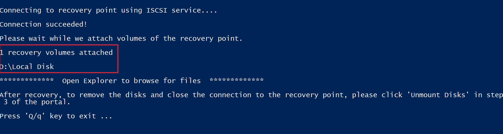

#### For backed-up VMs with large disks (Windows)

If the file recovery process hangs after you run the file-restore script (for example, if the disks are never mounted, or they're mounted but the volumes don't appear), perform the following  steps:

1. Ensure that the OS is WS 2012 or higher.
2. Ensure the registry keys are set as suggested below in the restore server and make sure to reboot the server. The number beside the GUID can range from 0001-0005. In the following example, it's 0004. Navigate through the registry key path until the parameters section.

    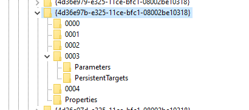

```registry
- HKEY_LOCAL_MACHINE\SYSTEM\CurrentControlSet\Services\Disk\TimeOutValue – change this from 60 to 2400 secs.
- HKEY_LOCAL_MACHINE\SYSTEM\ControlSet001\Control\Class\{4d36e97b-e325-11ce-bfc1-08002be10318}\0003\Parameters\SrbTimeoutDelta – change this from 15 to 2400 secs.
- HKEY_LOCAL_MACHINE\SYSTEM\ControlSet001\Control\Class\{4d36e97b-e325-11ce-bfc1-08002be10318}\0003\Parameters\EnableNOPOut – change this from 0 to 1
- HKEY_LOCAL_MACHINE\SYSTEM\ControlSet001\Control\Class\{4d36e97b-e325-11ce-bfc1-08002be10318}\0003\Parameters\MaxRequestHoldTime - change this from 60 to 2400 secs.
```

### For Linux

After you meet all the requirements listed in [Step 2](#step-2-ensure-the-machine-meets-the-requirements-before-executing-the-script), [Step 3](#step-3-os-requirements-to-successfully-run-the-script) and [Step 4](#step-4-access-requirements-to-successfully-run-the-script), generate a Python script for Linux machines. See [Step 1 to learn how to generate and download script](#step-1-generate-and-download-script-to-browse-and-recover-files). Download the script and copy it to the relevant/compatible Linux server. You may have to modify the permissions to execute it with ```chmod +x <python file name>```. Then run the Python file with ```./<python file name>```.


In Linux, the volumes of the recovery point are mounted to the folder where the script is run. The attached disks, volumes, and the corresponding mount paths are shown accordingly. These mount paths are visible to users having root level access. Browse through the volumes mentioned in the script output.

  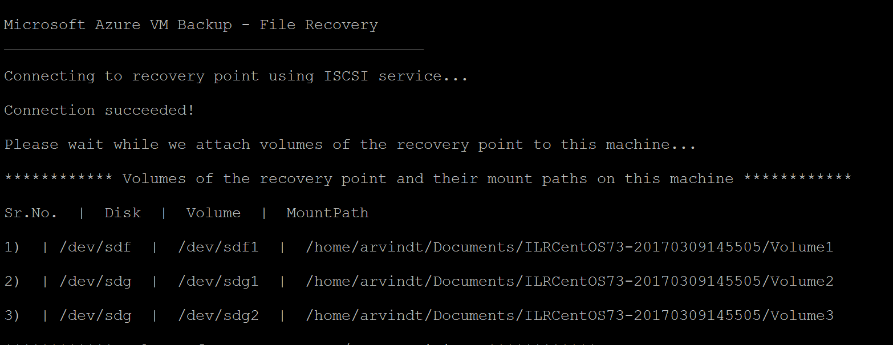


#### For backed-up VMs with large disks (Linux)**

If the file recovery process hangs after you run the file-restore script (for example, if the disks are never mounted, or they're mounted but the volumes don't appear), perform the following  steps:

1. In the file /etc/iscsi/iscsid.conf, change the setting from:
    - `node.conn[0].timeo.noop_out_timeout = 5`  to `node.conn[0].timeo.noop_out_timeout = 120`
2. After making the above changes, rerun the script. If there are transient failures, ensure there is a gap of 20 to 30 minutes between reruns to avoid successive bursts of requests impacting the target preparation. This interval between re-runs will ensure the target is ready for connection from the script.
3. After file recovery, make sure you go back to the portal and select **Unmount disks** for recovery points where you weren't able to mount volumes. Essentially, this step will clean any existing processes/sessions and increase the chance of recovery.


#### LVM/RAID arrays (For Linux VMs)

In Linux, Logical Volume Manager (LVM) and/or software RAID Arrays are used to manage logical volumes over multiple disks. If the protected Linux VM uses LVM and/or RAID Arrays, you can't run the script on the same VM.<br>
Instead run the script on any other machine with a compatible OS and which supports the file system of the protected VM.<br>
The following script output displays the LVM and/or RAID Arrays disks and the volumes with the partition type.

   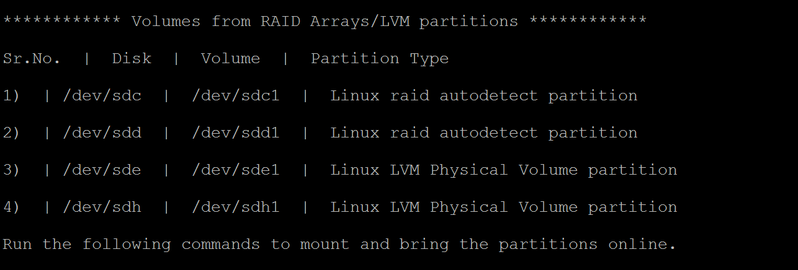

To bring these partitions online, run the commands in the following sections.

#### For LVM partitions

Once the script is run, the LVM partitions are mounted in the physical volume(s)/disk(s) specified in the script output. The process is to

1. Get the unique list of volume group names from the physical volumes or disks
2. Then list the logical volumes in those volume groups
3. Then mount the logical volumes to a desired path.

##### Listing volume group names from physical volumes

To list the volume group names:

```bash
sudo pvs -o +vguuid
```

This command will list all physical volumes (including the ones present before running the script), their corresponding volume group names, and the volume group's unique user IDs (UUIDs). A sample output of the command is shown below.

```output
PV         VG        Fmt  Attr PSize   PFree    VG UUID

  /dev/sda4  rootvg    lvm2 a--  138.71g  113.71g EtBn0y-RlXA-pK8g-de2S-mq9K-9syx-B29OL6

  /dev/sdc   APPvg_new lvm2 a--  <75.00g   <7.50g njdUWm-6ytR-8oAm-8eN1-jiss-eQ3p-HRIhq5

  /dev/sde   APPvg_new lvm2 a--  <75.00g   <7.50g njdUWm-6ytR-8oAm-8eN1-jiss-eQ3p-HRIhq5

  /dev/sdf   datavg_db lvm2 a--   <1.50t <396.50g dhWL1i-lcZS-KPLI-o7qP-AN2n-y2f8-A1fWqN

  /dev/sdd   datavg_db lvm2 a--   <1.50t <396.50g dhWL1i-lcZS-KPLI-o7qP-AN2n-y2f8-A1fWqN
```

The first column (PV) shows the physical volume, the subsequent columns show the relevant volume group name, format, attributes, size, free space, and the unique ID of the volume group. The command output shows all physical volumes. Refer to the script output and identify the volumes related to the backup. In the above example, the script output would have shown /dev/sdf and /dev/sdd. And so, the *datavg_db* volume group belongs to script and the *Appvg_new* volume group belongs to the machine. The final idea is to make sure a unique volume group name should have one unique ID.

###### Duplicate Volume groups

There are scenarios where volume group names can have 2 UUIDs after running the script. It means that the volume group names in the machine where the script is executed and in the backed-up VM are the same. Then we need to rename the backed-up VMs volume groups. Take a look at the example below.

```output
PV         VG        Fmt  Attr PSize   PFree    VG UUID

  /dev/sda4  rootvg    lvm2 a--  138.71g  113.71g EtBn0y-RlXA-pK8g-de2S-mq9K-9syx-B29OL6

  /dev/sdc   APPvg_new lvm2 a--  <75.00g   <7.50g njdUWm-6ytR-8oAm-8eN1-jiss-eQ3p-HRIhq5

  /dev/sde   APPvg_new lvm2 a--  <75.00g   <7.50g njdUWm-6ytR-8oAm-8eN1-jiss-eQ3p-HRIhq5

  /dev/sdg   APPvg_new lvm2 a--  <75.00g  508.00m lCAisz-wTeJ-eqdj-S4HY-108f-b8Xh-607IuC

  /dev/sdh   APPvg_new lvm2 a--  <75.00g  508.00m lCAisz-wTeJ-eqdj-S4HY-108f-b8Xh-607IuC

  /dev/sdm2  rootvg    lvm2 a--  194.57g  127.57g efohjX-KUGB-ETaH-4JKB-MieG-EGOc-XcfLCt
```

The script output would have shown /dev/sdg, /dev/sdh, /dev/sdm2 as attached. So, the corresponding VG names are Appvg_new and rootvg. But the same names are also present in the machine's VG list. We can verify that one VG name has two UUIDs.

Now we need to rename VG names for script-based volumes, for example: /dev/sdg, /dev/sdh, /dev/sdm2. To rename the volume group, use the following command

```bash
sudo vgimportclone -n rootvg_new /dev/sdm2
sudo vgimportclone -n APPVg_2 /dev/sdg /dev/sdh
```

Now we have all VG names with unique IDs.

###### Active volume groups

Make sure that the Volume groups corresponding to script's volumes are active. The following command is used to display active volume groups. Check whether the script's related volume groups are present in this list.

```bash
sudo vgdisplay -a
```

Otherwise, activate the volume group by using the following command.

```bash
sudo vgchange –a y  <volume-group-name>
```

##### Listing logical volumes within Volume groups

Once we get the unique, active list of VGs related to the script, then the logical volumes present in those volume groups can be listed using the following command.

```bash
sudo lvdisplay <volume-group-name>
```

This command displays the path of each logical volume as 'LV Path'.

##### Mounting logical volumes

To mount the logical volumes to the path of your choice:

```bash
sudo mount <LV path from the lvdisplay cmd results> </mountpath>
```

> [!WARNING]
> Don't use 'mount -a'. This command mounts all devices described in '/etc/fstab'. This might mean duplicate devices can get mounted. Data can be redirected to devices created by a script, which don't persist the data, and so might result in data loss.

#### For RAID arrays

The following command displays details about all raid disks:

```bash
sudo mdadm –detail –scan
```

 The relevant RAID disk is displayed as `/dev/mdm/<RAID array name in the protected VM>`

Use the mount command if the RAID disk has physical volumes:

```bash
sudo mount [RAID Disk Path] [/mountpath]
```

If the RAID disk has another LVM configured in it, then use the preceding procedure for LVM partitions but use the volume name in place of the RAID Disk name.

## Step 6: Closing the connection

After identifying the files and copying them to a local storage location, remove (or unmount) the additional drives. To unmount the drives, on the **File Recovery** menu in the Azure portal, select **Unmount Disks**.

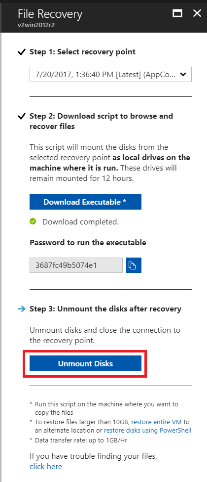

Once the disks have been unmounted, you'll receive a message. It may take a few minutes for the connection to refresh so that you can remove the disks.

In Linux, after the connection to the recovery point is severed, the OS doesn't remove the corresponding mount paths automatically. The mount paths exist as "orphan" volumes and are visible, but throw an error when you access/write the files. They can be manually removed. The script, when run, identifies any such volumes existing from any previous recovery points and cleans them up upon consent.

> [!NOTE]
> Make sure that the connection is closed after the required files are restored. This is important, especially in the scenario where the machine in which the script is executed is also configured for backup. If the connection is still open, the subsequent backup might fail with the error "UserErrorUnableToOpenMount". This happens because the mounted drives/volumes are assumed to be available and when accessed they might fail because the underlying storage, that is, the iSCSI target server may not available. Cleaning up the connection will remove these drives/volumes and so they won't be available during backup.

## Security

This section discusses the various security measures taken for the implementation of file recovery from Azure VM backups.

### Feature flow

This feature was built to access the VM data without the need to restore the entire VM or VM disks and with the minimum number of steps. Access to VM data is provided by a script (which mounts the recovery volume when run as shown below) and it forms the cornerstone of all security implementations:

  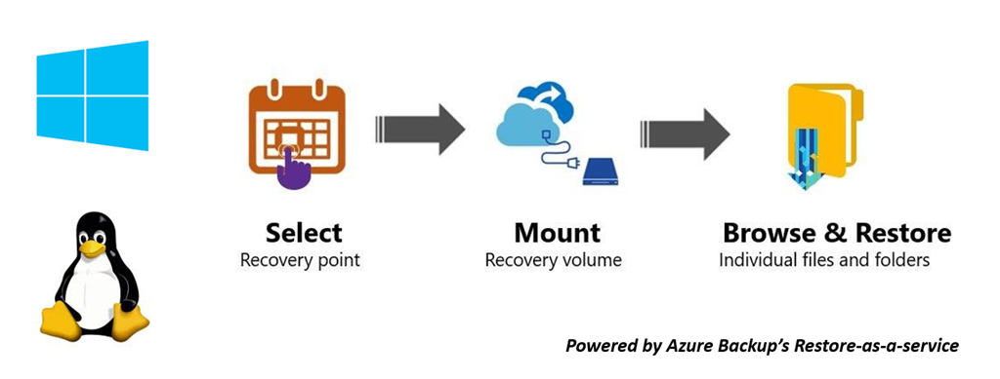

### Security implementations

#### Select Recovery point (who can generate script)

The script provides access to VM data, so it's important to regulate who can generate it in the first place. You need to sign in into the Azure portal and be [Azure RBAC authorized](backup-rbac-rs-vault.md#mapping-backup-built-in-roles-to-backup-management-actions) to generate the script.

File recovery needs the same level of authorization as required for VM restore and disks restore. In other words, only authorized users can view the VM data can generate the script.

The generated script is signed with the official Microsoft certificate for the Azure Backup service. Any tampering with the script means the signature is broken, and any attempt to run the script is highlighted as a potential risk by the OS.

#### Mount Recovery volume (who can run script)

Only an Admin can run the script and it should run in elevated mode. The script only runs a pre-generated set of steps and doesn't accept input from any external source.

To run the script, a password is required that's only shown to the authorized user at the time of generation of script in the Azure portal or PowerShell/CLI. This is to ensure the authorized user who downloads the script is also responsible for running the script.

#### Browse files and folders

To browse files and folders, the script uses the iSCSI initiator in the machine and connects to the recovery point that's configured as an iSCSI target. Here you can imagine scenarios where one is trying to imitate/spoof either/all components.

We use a mutual CHAP authentication mechanism so that each component authenticates the other. This means it's extremely difficult for a fake initiator to connect to the iSCSI target and for a fake target to be connected to the machine where the script is run.

The data flow between the recovery service and the machine is protected by building a secure TLS tunnel over TCP ([TLS 1.2 should be supported](#step-3-os-requirements-to-successfully-run-the-script) in the machine where script is run).

Any file Access Control List (ACL) present in the parent/backed-up VM is preserved in the mounted file system as well.

The script gives read-only access to a recovery point and is valid for only 12 hours. If you wish to remove the access earlier, then sign into Azure portal/PowerShell/CLI and perform **unmount disks** for that particular recovery point. The script will be invalidated immediately.


## Next steps

- Learn how to [restore files via PowerShell](./backup-azure-vms-automation.md#restore-files-from-an-azure-vm-backup)
- Learn how to [restore files via Azure CLI](./tutorial-restore-files.md)
- After VM is restored, learn how to [manage backups](./backup-azure-manage-vms.md)
