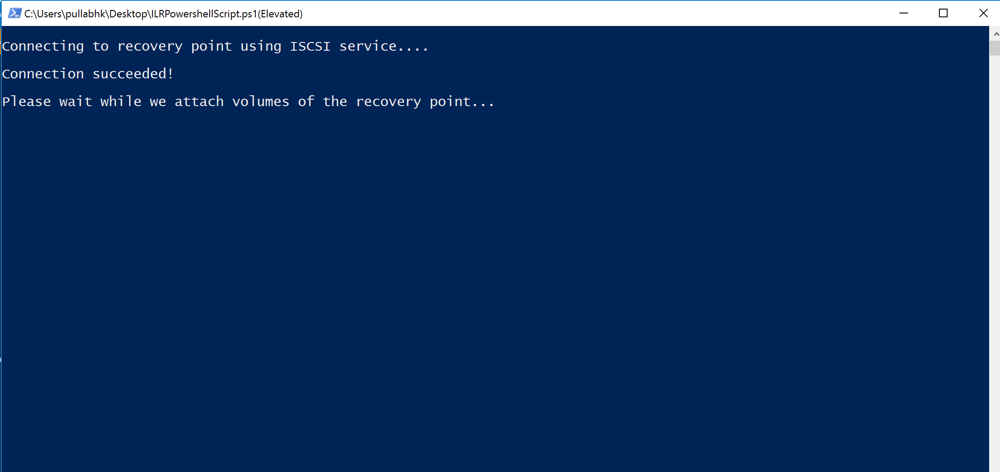

# Recover files from Azure virtual machine backup

Azure Backup provides the capability to restore [Azure virtual machines (VMs) and disks](./backup-azure-arm-restore-vms.md) from Azure VM backups, also known as recovery points. This article explains how to recover files and folders from an Azure VM backup. Restoring files and folders is available only for Azure VMs deployed using the Resource Manager model and protected to a Recovery services vault.

> [!Note]
> This feature is available for Azure VMs deployed using the Resource Manager model and protected to a Recovery Services vault.
> File recovery from an encrypted VM backup is not supported.
>

## Mount the volume and copy files

To restore files or folders from the recovery point, go to the virtual machine and choose the desired recovery point.

1. Sign in to the [Azure portal](https://portal.Azure.com) and in the left pane, click **Virtual machines**. From the list of virtual machines, select the virtual machine to open that virtual machine's dashboard.

2. In the virtual machine's menu, click **Backup** to open the Backup dashboard.

    

3. In the Backup dashboard menu, click **File Recovery**.

    

    The **File Recovery** menu opens.

    

4. From the **Select recovery point** drop-down menu, select the recovery point that holds the files you want. By default, the latest recovery point is already selected.

5. To download the software used to copy files from the recovery point, click **Download Executable** (for Windows Azure VM) or **Download Script** (for Linux Azure VM, a python script is generated).

    

    Azure downloads the executable or script to the local computer.

    

    To run the executable or script as an administrator, it is suggested you save the download to your computer.

6. The executable or script is password protected and requires a password. In the **File Recovery** menu, click the copy button to load the password into memory.

    

7. From the download location (usually the Downloads folder), right-click the executable or script and run it with Administrator credentials. When prompted, type the password or paste the password from memory, and press Enter. Once the valid password is entered, the script connects to the recovery point.

    

    If you run the script on a computer with restricted access, ensure there is access to:

    - download.microsoft.com
    - Recovery Service URLs (geo-name refers to the region where the recovery service vault resides)
        - https:\//pod01-rec2.geo-name.backup.windowsazure.com (For Azure public geos)
        - https:\//pod01-rec2.geo-name.backup.windowsazure.cn (For Azure China)
        - https:\//pod01-rec2.geo-name.backup.windowsazure.us (For Azure US Government)
        - https:\//pod01-rec2.geo-name.backup.windowsazure.de (For Azure Germany)
    - outbound port 3260

> [!Note]
> 
> * The downloaded script file name will have the **geo-name** to be filled in the URL. For eg: The downloaded script name begins with \'VMname\'\_\'geoname\'_\'GUID\', like ContosoVM_wcus_12345678.....<br><br>
> * The URL would be "https:\//pod01-rec2.wcus.backup.windowsazure.com"


   For Linux, the script requires 'open-iscsi' and 'lshw' components to connect to the recovery point. If the components do not exist on the computer where the script is run, the script asks for permission to install the components. Provide consent to install the necessary components.

   The access to download.microsoft.com is required to download components used to build a secure channel between the machine where the script is run and the data in the recovery point.

   You can run the script on any machine that has the same (or compatible) operating system as the backed-up VM. See the [Compatible OS table](backup-azure-restore-files-from-vm.md#system-requirements) for compatible operating systems. If the protected Azure virtual machine uses Windows Storage Spaces (for Windows Azure VMs) or LVM/RAID Arrays (for Linux VMs), you can't run the executable or script on the same virtual machine. Instead, run the executable or script on any other machine with a compatible operating system.

### Identifying Volumes

#### For Windows

When you run the executable, the operating system mounts the new volumes and assigns drive letters. You can use Windows Explorer or File Explorer to browse those drives. The drive letters assigned to the volumes may not be the same letters as the original virtual machine, however, the volume name is preserved. For example, if the volume on the original virtual machine was “Data Disk (E:`\`)”, that volume can be attached on the local computer as “Data Disk ('Any letter':`\`). Browse through all volumes mentioned in the script output until you find your files/folder.  

   

#### For Linux

In Linux, the volumes of the recovery point are mounted to the folder where the script is run. The attached disks, volumes, and the corresponding mount paths are shown accordingly. These mount paths are visible to users having root level access. Browse through the volumes mentioned in the script output.

  

## Closing the connection

After identifying the files and copying them to a local storage location, remove (or unmount) the additional drives. To unmount the drives, on the **File Recovery** menu in the Azure portal, click **Unmount Disks**.


Once the disks have been unmounted, you receive a message. It may take a few minutes for the connection to refresh so that you can remove the disks.

In Linux, after the connection to the recovery point is severed, the OS doesn't remove the corresponding mount paths automatically. The mount paths exist as "orphan" volumes and they are visible but throw an error when you access/write the files. They can be manually removed. The script, when run, identifies any such volumes existing from any previous recovery points and cleans them up upon consent.

## Special configurations

### Dynamic Disks

If the protected Azure VM has volumes with one or both of the following characteristics, you can't run the executable script on the same VM.

- Volumes that span multiple disks (spanned and striped volumes)
- Fault-tolerant volumes (mirrored and RAID-5 volumes) on dynamic disks

Instead, run the executable script on any other computer with a compatible operating system.

### Windows Storage Spaces

Windows Storage Spaces is a Windows technology that enables you to virtualize storage. With Windows Storage Spaces you can group industry-standard disks into storage pools. Then you use the available space in those storage pools to create virtual disks, called storage spaces.

If the protected Azure VM uses Windows Storage Spaces, you can't run the executable script on the same VM. Instead, run the executable script on any other machine with a compatible operating system.

### LVM/RAID Arrays

In Linux, Logical volume manager (LVM) and/or software RAID Arrays are used to manage logical volumes over multiple disks. If the protected Linux VM uses LVM and/or RAID Arrays, you can't run the script on the same VM. Instead run the script on any other machine with a compatible OS and which supports the file system of the protected VM.

The following script output displays the LVM and/or RAID Arrays disks and the volumes with the partition type.

   

To bring these partitions online, run the commands in the following sections.

#### For LVM Partitions

To list the volume group names under a physical volume.

```bash
#!/bin/bash
$ pvs <volume name as shown above in the script output>
```

To list all logical volumes, names, and their paths in a volume group.

```bash
#!/bin/bash
$ lvdisplay <volume-group-name from the pvs command’s results>
```

To mount the logical volumes to the path of your choice.

```bash
#!/bin/bash
$ mount <LV path> </mountpath>
```

#### For RAID Arrays

The following command displays details about all raid disks.

```bash
#!/bin/bash
$ mdadm –detail –scan
```

 The relevant RAID disk is displayed as `/dev/mdm/<RAID array name in the protected VM>`

Use the mount command if the RAID disk has physical volumes.

```bash
#!/bin/bash
$ mount [RAID Disk Path] [/mountpath]
```

If the RAID disk has another LVM configured in it, then use the preceding procedure for LVM partitions but use the volume name in place of the RAID Disk name

## System requirements

### For Windows OS

The following table shows the compatibility between server and computer operating systems. When recovering files, you can't restore files to a previous or future operating system version. For example, you can't restore a file from a Windows Server 2016 VM to Windows Server 2012 or a Windows 8 computer. You can restore files from a VM to the same server operating system, or to the compatible client operating system.

|Server OS | Compatible client OS  |
| --------------- | ---- |
| Windows Server 2016    | Windows 10 |
| Windows Server 2012 R2 | Windows 8.1 |
| Windows Server 2012    | Windows 8  |
| Windows Server 2008 R2 | Windows 7   |

### For Linux OS

In Linux, the OS of the computer used to restore files must support the file system of the protected virtual machine. When selecting a computer to run the script, ensure the computer has a compatible OS, and uses one of the versions identified in the following table:

|Linux OS | Versions  |
| --------------- | ---- |
| Ubuntu | 12.04 and above |
| CentOS | 6.5 and above  |
| RHEL | 6.7 and above |
| Debian | 7 and above |
| Oracle Linux | 6.4 and above |
| SLES | 12 and above |
| openSUSE | 42.2 and above |

> [!Note]
> We have found some issues in running the file recovery script on machines with SLES 12 SP4 OS. Investigating with SLES team.
> Currently, running the file recovery script is working on machines with SLES 12 SP2 and SP3 OS versions.
>

The script also requires Python and bash components to execute and connect securely to the recovery point.

|Component | Version  |
| --------------- | ---- |
| bash | 4 and above |
| python | 2.6.6 and above  |
| TLS | 1.2 should be supported  |

## Troubleshooting

If you have problems while recovering files from the virtual machines, check the following table for additional information.

| Error Message / Scenario | Probable Cause | Recommended action |
| ------------------------ | -------------- | ------------------ |
| Exe output: *Exception connecting to the target* |Script is not able to access the recovery point    | Check whether the machine fulfills the previous access requirements. |  
| Exe output: *The target has already been logged in via an iSCSI session.* | The script was already executed on the same machine and the drives have been attached | The volumes of the recovery point have already been attached. They may NOT be mounted with the same drive letters of the original VM. Browse through all the available volumes in the file explorer for your file |
| Exe output: *This script is invalid because the disks have been dismounted via portal/exceeded the 12-hr limit. Download a new script from the portal.* |    The disks have been dismounted from the portal or the 12-hr limit exceeded | This particular exe is now invalid and can’t be run. If you want to access the files of that recovery point-in-time, visit the portal for a new exe|
| On the machine where the exe is run: The new volumes are not dismounted after the dismount button is clicked | The iSCSI initiator on the machine is not responding/refreshing its connection to the target and maintaining the cache. |  After clicking **Dismount**, wait a few minutes. If the new volumes are not dismounted, browse through all volumes. Browsing all volumes forces the initiator to refresh the connection, and the volume is dismounted with an error message that the disk is not available.|
| Exe output: Script is run successfully but “New volumes attached” is not displayed on the script output |    This is a transient error    | The volumes would have been already attached. Open Explorer to browse. If you are using the same machine for running scripts every time, consider restarting the machine and the list should be displayed in the subsequent exe runs. |
| Linux specific: Not able to view the desired volumes | The OS of the machine where the script is run may not recognize the underlying filesystem of the protected VM | Check whether the recovery point is crash consistent or file-consistent. If file consistent, run the script on another machine whose OS recognizes the protected VM's filesystem |
| Windows specific: Not able to view the desired volumes | The disks may have been attached but the volumes were not configured | From the disk management screen, identify the additional disks related to the recovery point. If any of these disks are in offline state try making them online by right-clicking on the disk and click 'Online'|

## Security

This section discusses the various security measures taken for the implementation of File recovery from Azure VM backups, such that users are aware of the security aspects of the feature.

### Feature flow

This feature was built to access the VM data without the need to restore the entire VM or VM disks and in minimum steps. Access to VM data is provided by a script (which mounts the recovery volume when run as shown below) and hence it forms the cornerstone of all security implementations

  

### Security implementations

#### Select Recovery point (who can generate script)

The script provides access to VM data, it is important to regulate who can generate it in the first place. One needs to login into Azure portal and should be [RBAC authorized](backup-rbac-rs-vault.md#mapping-backup-built-in-roles-to-backup-management-actions) to be able to generate the script.

File recovery needs the same level of authorization as required for VM restore and disks restore. In other words, only authorized users can view the VM data can generate the script.

The generated script is signed with official Microsoft certificate for Azure Backup service. Any tampering with the script means that the signature is broken and any attempt to run the script is highlighted as a potential risk by the OS.

#### Mount Recovery volume (who can run script)

Only Admin can run the script and should run it in elevated mode. The script only runs a pre-generated set of steps and does not accept input from any external source.

To run the script, one requires a password which is only shown to the authorized user at the time of generation of script in the Azure portal or PowerShell/CLI. This is to ensure that the authorized user who downloads the script is also responsible for running the script.

#### Browse files and folders

To browse files and folders, the script uses the iSCSI initiator in the machine and connect to the recovery point which is configured as an iSCSI target. Here one can assume scenarios where one is trying to imitate/spoof either/all components.

We use mutual CHAP authentication mechanism so that each component authenticates the other. This means it is extremely difficult for a fake initiator to connect to the iSCSI target and a fake target to be connected to the machine where the script is run.

The data flow between the recovery service and the machine is protected by building a secure SSL tunnel over TCP ([TLS 1.2 should be supported](#system-requirements) in the machine where script is run)

Any file Access Control List (ACL) present in the parent/backed up VM are preserved in the mounted file system also.

The script gives read-only access to a recovery point and is valid for only 12 hours. If the user wishes to remove the access earlier, then sign into Azure Portal/PowerShell/CLI and perform the **unmount disks** for that particular recovery point. The script will be invalidated immediately.
