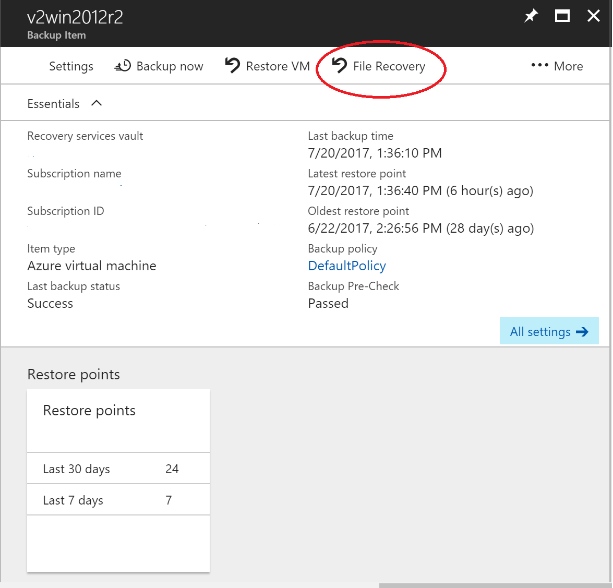

# Recover files from Azure virtual machine backup (Preview)

Azure backup provides the capability to restore [Azure VMs and disks](./backup-azure-arm-restore-vms.md) from Azure VM backups. Now this article explains how you can recover items such as files and folders from an Azure VM backup.

> [!Note]
> This feature is available for Azure VMs deployed using the Resource Manager model and protected to a Recovery services vault.
> Currently, File recovery from a Windows Azure VM backup is in preview. File recovery from a Linux Azure VM is coming soon.
Currently, File recovery from an encrypted VM backup is not supported.
>

## Mount the volume and copy files

1. Sign into the [Azure portal](http://portal.Azure.com). Find the relevant Recovery services vault and the required backup item.

2. On the Backup Item blade, click **File Recovery (Preview)**

    

    The **File Recovery** blade opens.

    

3. From the **Select recovery point** drop-down menu, select the recovery point that contains the files you want. By default, the latest recovery point is already selected.

4. Click **Download Executable** to download the software that you'll use to copy files from the recovery point.

  The executable is a script that creates a connection between the local computer and the specified recovery point.

5. On the computer where you want to recover the files, run the executable. You must run the script with Administrator credentials. If you run the script on a computer with restricted access, ensure there is access to:

    - go.microsoft.com
    - Azure endpoints used for Azure VM backups
    - outbound port 3260

    

    You can run the script on any machine that has the same (or compatible) operating system as the machine used to generate the recovery point. See the [Compatible OS table](backup-azure-restore-files-from-vm.md#compatible-os) for compatible operating systems. If the protected Azure virtual machine uses Windows Storage Spaces, then you can't run the executable script on this virtual machine. Instead, run the executable script on any other machine that uses Windows Storage Spaces. Running the executable script on a computer with a compatible operating system is recommended.

    

### Compatible OS

The following table shows the compatibility between server and computer operating systems. When recovering files, you can't restore files between incompatible operating systems.

|Server OS | Compatible client OS  |
| --------------- | ---- |
| Windows Server 2012 R2 | Windows 8.1 |
| Windows Server 2012    | Windows 8  |
| Windows Server 2008 R2 | Windows 7   |

### Drive letter assignments

When you run the script, the operating system mounts the new volumes and assigns drive letters. You can use Windows Explorer or File Explorer to browse those drives. The drive letters assigned to the volumes may not be the same letters as the original virtual machine, however, the volume name is preserved. For example, if the volume on the original virtual machine was “Data Disk (E:\)”, that volume can be attached as “Data Disk ('Any drive letter available':\) on the local computer. Browse through all volumes mentioned in the script output until you find your files/folder.  

## Closing the connection

After identifying the files and copying them to a local storage location, remove (or unmount) the additional drives. To unmount the drives, on the **File Recovery** blade in the Azure portal, click **Unmount Disks**.

Once the disks have been unmounted, you receive a message letting you know it was successful. It may take a few minutes for the connection to refresh so that you can remove the disks.

## Windows Storage Spaces

Windows Storage Spaces is a technology in Windows storage that enables you to virtualize storage. With Windows Storage Spaces you can group industry-standard disks into storage pools, and then create virtual disks, called storage spaces, from the available space in those storage pools.

If the Azure VM that was backed up uses Windows Storage Spaces, then you can't run the executable script on this VM. Instead, run the executable script on any other machine that uses Windows Storage Spaces. Running the executable script on a computer with a compatible operating system is recommended.

## Troubleshooting

If you have problems while recovering files from the virtual machines, check the following table for additional information.

| Error Message / Scenario | Probable Cause | Recommended action |
| ------------------------ | -------------- | ------------------ |
| Exe output: *Exception connecting to the target* |Script is not able to access the recovery point	| Check whether the machine fulfills the access requirements mentioned above|  
|	Exe output: *The target has already been logged in via an ISCSI session.* |	The script was already executed on the same machine and the drives have been attached |	The volumes of the recovery point have already been attached. They may NOT be mounted with the same drive letters of the original VM. Browse through all the available volumes in the file explorer for your file |
| Exe output: *This script is invalid because the disks have been dismounted via portal/exceeded the 12-hr limit. Please download a new script from the portal.* |	The disks have been dismounted from the portal or the 12 hr limit exceeded |	This particular exe is now invalid and can’t be run. If you want to access the files of that recovery point-in-time, visit the portal for a new exe|
| On the machine where the exe is run: The new volumes are not dismounted after the dismount button is clicked |	The ISCSI initiator on the machine is not responding/refreshing its connection to the target and maintaining the cache |	Wait for some mins after the dismount button is pressed. If the new volumes are still not dismounted, please browse through all the volumes. This forces the initiator to refresh the connection and the volume is dismounted with an error message that the disk is not available|
| Exe output: Script is run successfully but “New volumes attached” is not displayed on the script output |	This is a transient error	| The volumes would have been already attached. Open Explorer to browse. If you are using the same machine for running scripts every time, consider restarting the machine and the list should be displayed in the subsequent exe runs. |
