# Restore System State to Windows Server

This article explains how to restore Windows Server System State backups from an Azure Recovery Services vault. To restore System State, you must have a System State backup (created using the instructions in [Back up System State](backup-azure-system-state.md#back-up-windows-server-system-state), and make sure you have installed the [latest version of the Microsoft Azure Recovery Services (MARS) agent](https://aka.ms/azurebackup_agent). Recovering Windows Server System State data from an Azure Recovery Services vault is a two-step process:

1. Restore System State as files from Azure Backup. When restoring System State as files from Azure Backup, you can either:
   * Restore System State to the same server where the backups were taken, or
   * Restore System State file to an alternate server.

2. Apply the restored System State files to a Windows Server.

## Recover System State files to the same server

The following steps explain how to roll back your Windows Server configuration to a previous state. Rolling your server configuration back to a known, stable state, can be extremely valuable. The following steps restore the server's System State from a Recovery Services vault.

1. Open the **Microsoft Azure Backup** snap-in. If you don't know where the snap-in was installed, search the computer or server for **Microsoft Azure Backup**.

    The desktop app should appear in the search results.

2. Click **Recover Data** to start the wizard.

    

3. On the **Getting Started** pane, to restore the data to the same server or computer, select **This server (`<server name>`)** and click **Next**.

    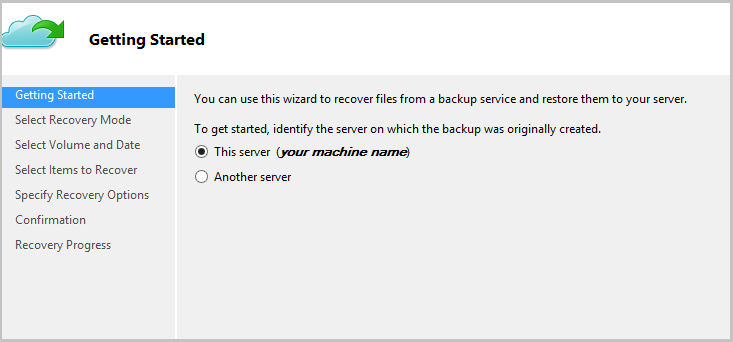

4. On the **Select Recovery Mode** pane, choose **System State** and then click **Next**.

    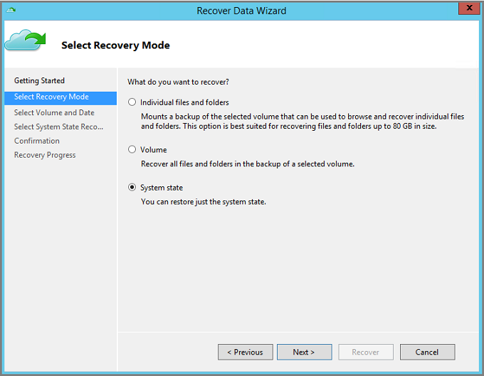

5. On the calendar in **Select Volume and Date** pane, select a recovery point.

    You can restore from any recovery point in time. Dates in **bold** indicate the availability of at least one recovery point. Once you select a date, if multiple recovery points are available, choose the specific recovery point from the **Time** drop-down menu.

    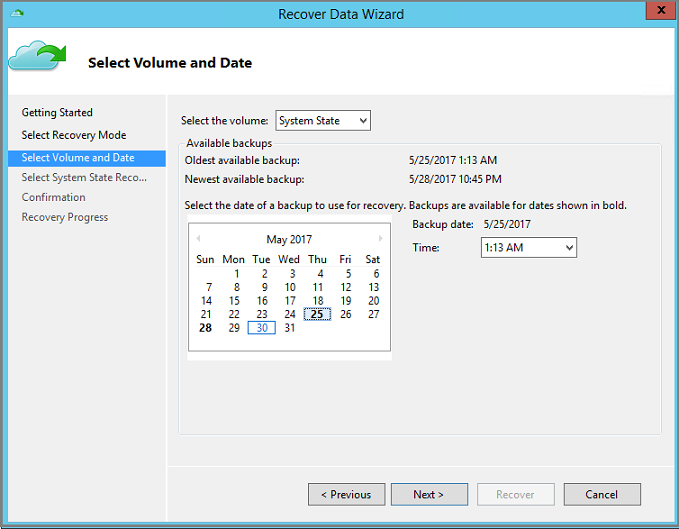

6. Once you have chosen the recovery point to restore, click **Next**.

    Azure Backup mounts the local recovery point, and uses it as a recovery volume.

7. On the next pane, specify the destination for the recovered System State files and click **Browse** to open Windows Explorer and find the files and folders you want. The option, **Create copies so that you have both versions**, creates copies of individual files in an existing System State file archive instead of creating the copy of the entire System State archive.

    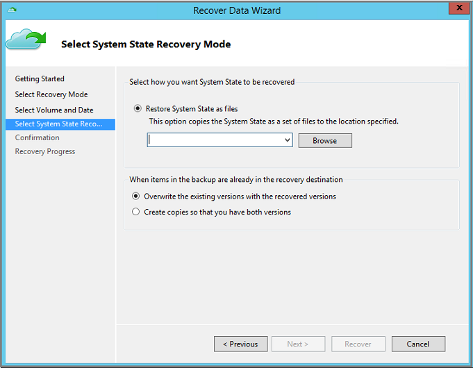

8. Verify the details of recovery on the **Confirmation** pane and click **Recover**.

   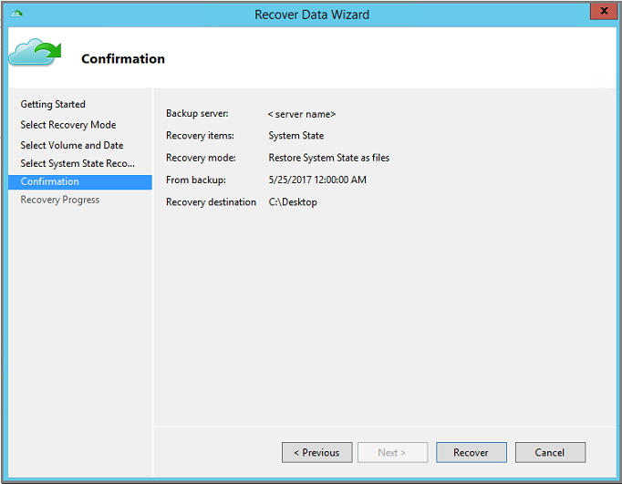

9. Copy the *WindowsImageBackup* directory in the Recovery destination to a non-critical volume of the server. Usually, the Windows OS volume is the critical volume.

10. Once the recovery is successful, follow the steps in the section, [Apply restored System State files to the Windows Server](backup-azure-restore-system-state.md), to complete the System State recovery process.

## Recover System State files to an alternate server

If your Windows Server is corrupted or inaccessible, and you want to restore it to a stable state by recovering the Windows Server System State, you can restore the corrupted server's System State from another server. Use the following steps to the restore System State on a separate server.  

The terminology used in these steps includes:

* *Source machine* – The original machine from which the backup was taken and which is currently unavailable.
* *Target machine* – The machine to which the data is being recovered.
* *Sample vault* – The Recovery Services vault to which the *Source machine* and *Target machine* are registered. <br/>

> [!NOTE]
> Backups taken from one machine cannot be restored to a machine running an earlier version of the operating system. For example, backups taken from a Windows Server 2016 machine can't be restored to Windows Server 2012 R2. However, the inverse is possible. You can use backups from Windows Server 2012 R2 to restore Windows Server 2016.
>

1. Open the **Microsoft Azure Backup** snap-in on the *Target machine*.
2. Ensure that the *Target machine* and the *Source machine* are registered to the same Recovery Services vault.
3. Click **Recover Data** to initiate the workflow.
4. Select **Another server**

    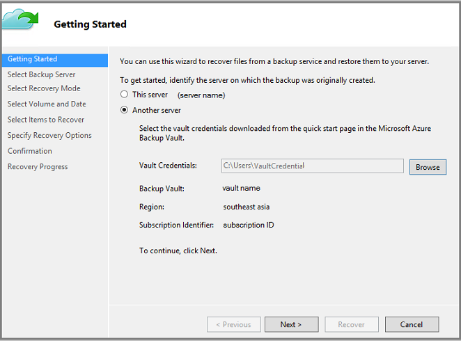

5. Provide the vault credential file that corresponds to the *Sample vault*. If the vault credential file is invalid (or expired), download a new vault credential file from the *Sample vault* in the Azure portal. Once the vault credential file is provided, the Recovery Services vault associated with the vault credential file appears.

6. On the Select Backup Server pane, select the *Source machine* from the list of displayed machines.
7. On the Select Recovery Mode pane, choose **System State** and click **Next**.

    

8. On the Calendar in the **Select Volume and Date** pane, select a recovery point. You can restore from any recovery point in time. Dates in **bold** indicate the availability of at least one recovery point. Once  you select a date, if multiple recovery points are available, choose the specific recovery point from the **Time** drop-down menu.

    

9. Once you have chosen the recovery point to restore, click **Next**.

10. On the **Select System State Recovery Mode** pane, specify the destination where you want System State files to be recovered, then click **Next**.

    

    The option, **Create copies so that you have both versions**, creates copies of individual files in an existing System State file archive instead of creating the copy of the entire System State archive.

11. Verify the details of recovery on the Confirmation pane, and click **Recover**.

    

12. Copy the *WindowsImageBackup* directory to a non-critical volume of the server (for example D:\). Usually the Windows OS volume is the critical volume.

13. To complete the recovery process, use the following section to [apply the restored System State files on a Windows Server](#apply-restored-system-state-on-a-windows-server).

## Apply restored System State on a Windows Server

Once you have recovered System State as files using Azure Recovery Services Agent, use the Windows Server Backup utility to apply the recovered System State to Windows Server. The Windows Server Backup utility is already available on the server. The following steps explain how to apply the recovered System State.

1. Use the following commands to reboot your server in *Directory Services Repair Mode*. In an elevated command prompt:

    ```cmd
    Bcdedit /set safeboot dsrepair
    Shutdown /r /t 0
    ```

2. After the reboot, open the Windows Server Backup snap-in. If you don't know where the snap-in was installed, search the computer or server for **Windows Server Backup**.

    The desktop app appears in the search results. If it doesn't appear, or you encounter errors when opening the application, you must install the **Windows Server Backup Features**, and dependent components below it, that are available in the **Add Features Wizard** in **Server Manager**.

3. In the snap-in, select **Local Backup**.

    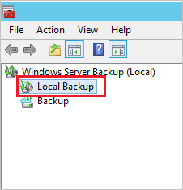

4. On the Local Backup console, in the **Actions Pane**, click **Recover** to open the Recovery Wizard.

5. Select the option, **A backup stored in another location**, and click **Next**.

   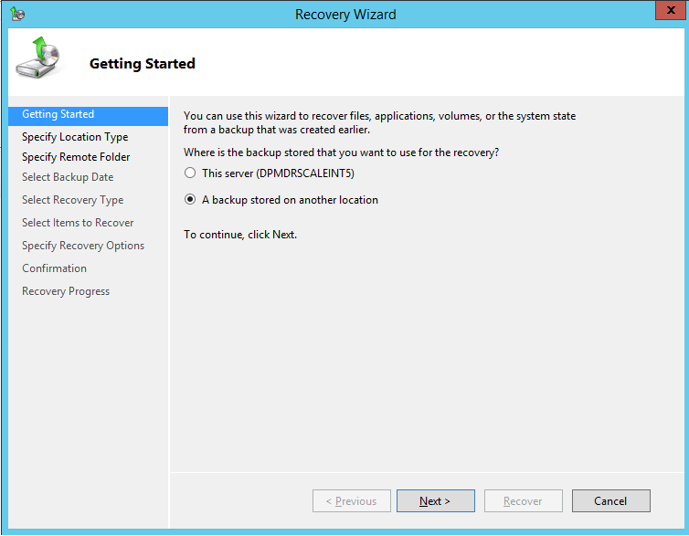

6. When specifying the location type, select **Remote shared folder** if your System State backup was recovered to another server. If your System State was recovered locally, then select **Local drives**.

    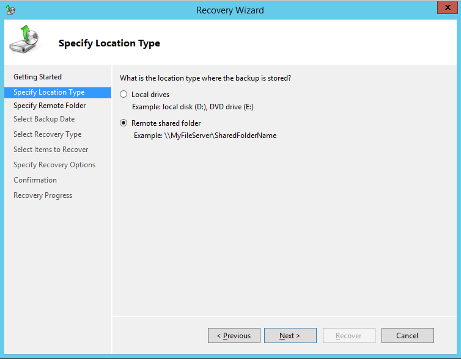

7. Enter the path to the *WindowsImageBackup* directory, or choose the local drive containing this directory (for example, D:\WindowsImageBackup), recovered as part of the System State files recovery using Azure Recovery Services Agent and click **Next**.

    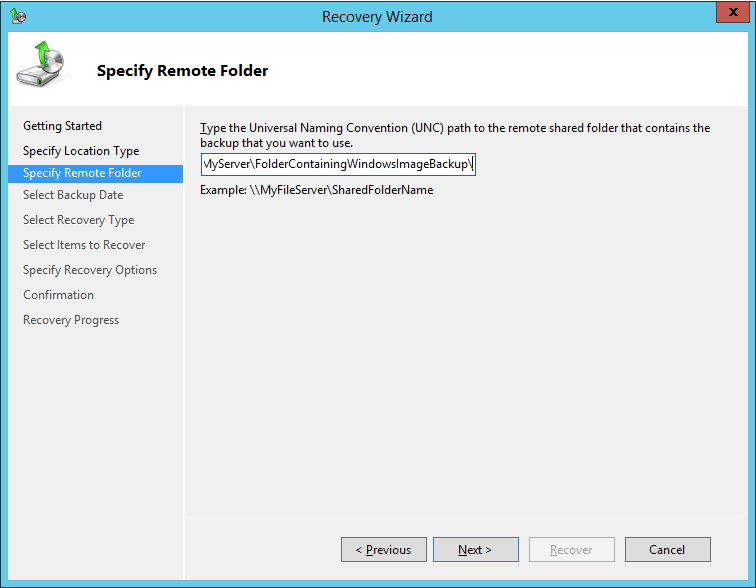

8. Select the System State version that you want to restore, and click **Next**.

9. In the Select Recovery Type pane, select **System State** and click **Next**.

10. For the location of the System State Recovery, select **Original Location**, and click **Next**.

11. Review the confirmation details, verify the reboot settings, and click **Recover** to apply the restored System State files.

    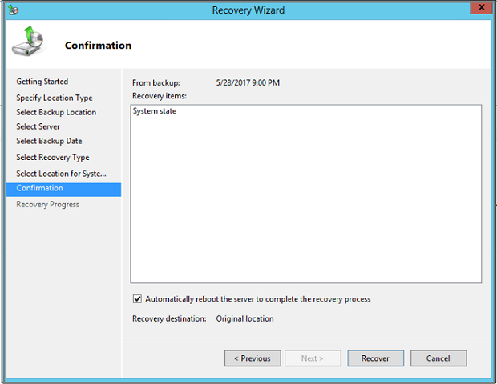

## Special considerations for System State recovery on Active Directory server

System State backup includes Active Directory data. Use the following steps to restore Active Directory Domain Service (AD DS) from its current state to a previous state.

1. Restart the domain controller in Directory Services Restore Mode (DSRM).
2. Follow the steps [here](https://docs.microsoft.com/windows-server/identity/ad-ds/manage/ad-forest-recovery-nonauthoritative-restore) to use Windows Server Backup cmdlets to recover AD DS.

## Troubleshoot failed System State restore

If the previous process of applying System State does not complete successfully, use the Windows Recovery Environment (Win RE) to recover your Windows Server. The following steps explain how to recover using Win RE. Use this option only if Windows Server does not boot normally after a System State restore. The following process erases non-system data, use caution.

1. Boot your Windows Server into the Windows Recovery Environment (Win RE).

2. Select Troubleshoot from the three available options.

    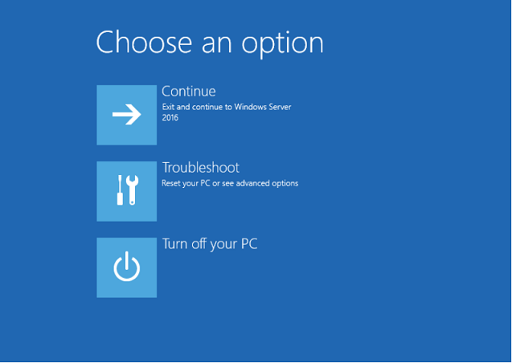

3. From the **Advanced Options** screen, select **Command Prompt** and provide the server administrator username and password.

   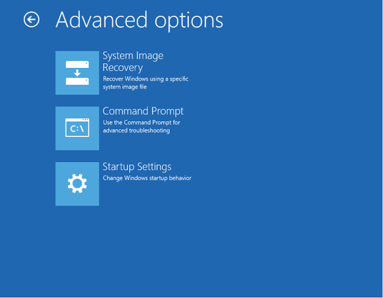

4. Provide the server administrator username and password.

    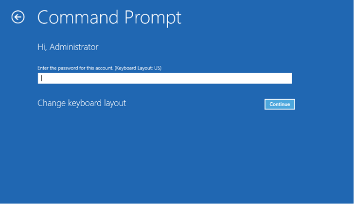

5. When you open the command prompt in administrator mode, run following command to get the System State backup versions.

    ```cmd
    Wbadmin get versions -backuptarget:<Volume where WindowsImageBackup folder is copied>:
    ```

    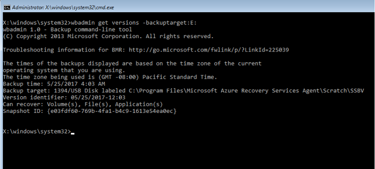

6. Run the following command to get all volumes available in the backup.

    ```cmd
    Wbadmin get items -version:<copy version from above step> -backuptarget:<Backup volume>
    ```

    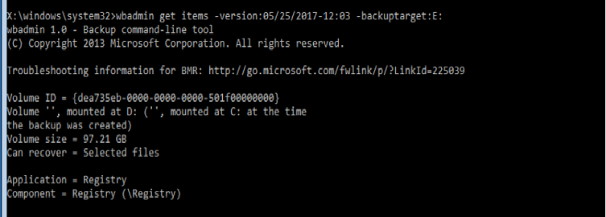

7. The following command recovers all volumes that are part of the System State Backup. Note that this step recovers only the critical volumes that are part of the System State. All non-System data is erased.

    ```cmd
    Wbadmin start recovery -items:C: -itemtype:Volume -version:<Backupversion> -backuptarget:<backup target volume>
    ```

     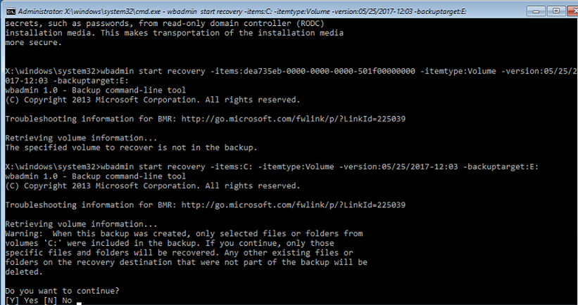

## Next steps

* Now that you've recovered your files and folders, you can [manage your backups](backup-azure-manage-windows-server.md).
