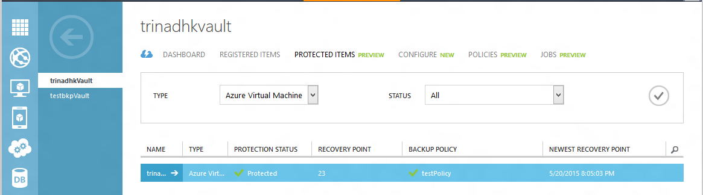
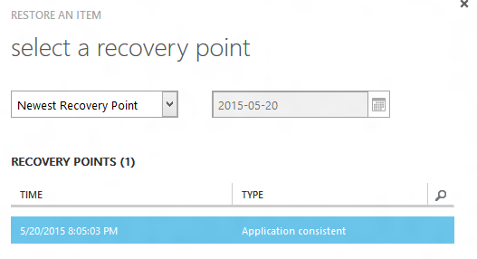
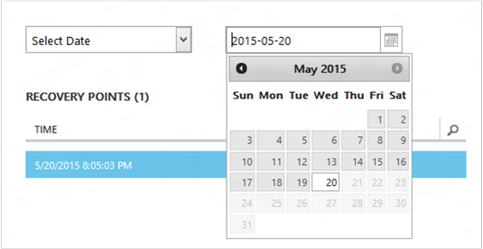
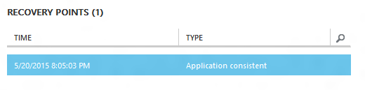
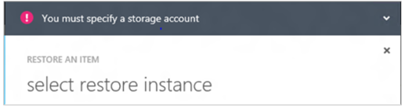
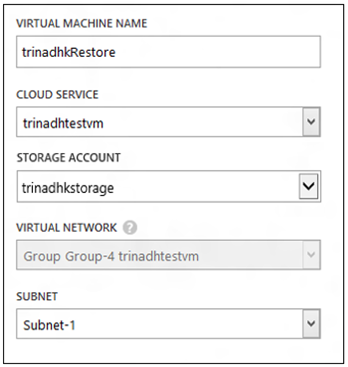
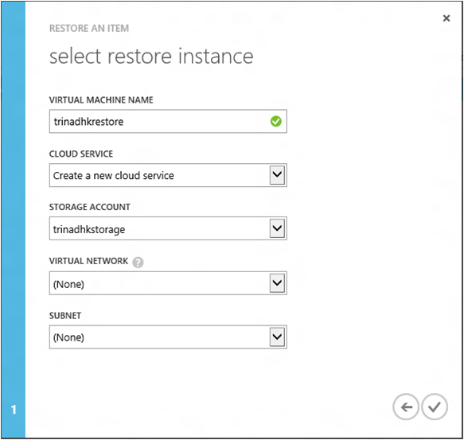
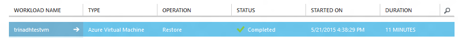

# Restore virtual machines in Azure
> [!div class="op_single_selector"]
> * [Restore VMs in Azure portal](backup-azure-arm-restore-vms.md)
> * [Restore VMs in Classic portal](backup-azure-restore-vms.md)
>
>

Restore a virtual machine to a new VM from the backups stored in an Azure Backup vault with the following steps.

> [!IMPORTANT]
> You can now upgrade your Backup vaults to Recovery Services vaults. For details, see the article [Upgrade a Backup vault to a Recovery Services vault](backup-azure-upgrade-backup-to-recovery-services.md). Microsoft encourages you to upgrade your Backup vaults to Recovery Services vaults.  **Starting November 1, 2017**:
>- Any remaining Backup vaults will be automatically upgraded to Recovery Services vaults.
>- You won't be able to access your backup data in the classic portal. Instead, use the Azure portal to access your backup data in Recovery Services vaults.
>

## Restore workflow
### Step 1: Choose an item to restore
1. Navigate to the **Protected Items** tab and select the virtual machine you want to restore to a new VM.

    

    The **Recovery Point** column in the **Protected Items** page will tell you the number of recovery points for a virtual machine. The **Newest Recovery Point** column tells you the time of the most recent backup from which a virtual machine can be restored.
2. Click **Restore** to open the **Restore an Item** wizard.

    

### Step 2: Pick a recovery point
1. In the **select a recovery point** screen, you can restore from the newest recovery point, or from a previous point in time. The default option selected when wizard opens is *Newest Recovery Point*.

    
2. To pick an earlier point in time, choose the **Select Date** option in the dropdown and select a date in the calendar control by clicking on the **calendar icon**. In the control, all dates that have recovery points are filled with a light gray shade and are selectable by the user.

    

    Once you click a date in the calendar control, the recovery points available on that date will be shown in recovery points table below. The **Time** column indicates the time at which the snapshot was taken. The **Type** column displays the [consistency](https://azure.microsoft.com/documentation/articles/backup-azure-vms/#consistency-of-recovery-points) of the recovery point. The table header shows the number of recovery points available on that day in parentheses.

    
3. Select the recovery point from the **Recovery Points** table and click the Next arrow to go to the next screen.

### Step 3: Specify a destination location
1. In the **Select restore instance** screen specify details of where to restore the virtual machine.

   * Specify the virtual machine name: In a given cloud service, the virtual machine name should be unique. We don't support over-writing existing VM.
   * Select a cloud service for the VM: This is mandatory for creating a VM. You can choose to either use an existing cloud service or create a new cloud service.

        Whatever cloud service name is picked should be globally unique. Typically, the cloud service name gets associated with a public-facing URL in the form of [cloudservice].cloudapp.net. Azure will not allow you to create a new cloud service if the name has already been used. If you choose to create a new cloud service, it will be given the same name as the virtual machine – in which case the VM name picked should be unique enough to be applied to the associated cloud service.

        We only display cloud services and virtual networks that are not associated with any affinity groups in the restore instance details. [Learn More](../virtual-network/virtual-networks-migrate-to-regional-vnet.md).
2. Select a storage account for the VM: This is mandatory for creating the VM. You can select from existing storage accounts in the same region as the Azure Backup vault. We don’t support storage accounts that are Zone redundant or of Premium storage type.

    If there are no storage accounts with supported configuration, please create a storage account of supported configuration prior to starting restore operation.

    
3. Select a Virtual Network: The virtual network (VNET) for the virtual machine should be selected at the time of creating the VM. The restore UI shows all the VNETs within this subscription that can be used. It is not mandatory to select a VNET for the restored VM – you will be able to connect to the restored virtual machine over the internet even if the VNET is not applied.

    If the cloud service selected is associated with a virtual network, then you cannot change the virtual network.

    
4. Select a subnet: In case the VNET has subnets, by default the first subnet will be selected. Choose the subnet of your choice from the dropdown options. For subnet details, go to Networks extension in the [portal home page](https://manage.windowsazure.com/), go to **Virtual Networks** and select the virtual network and drill down into Configure to see subnet details.

    
5. Click the **Submit** icon in the wizard to submit the details and create a restore job.

## Track the Restore operation
Once you have input all the information into the restore wizard and submitted it Azure Backup will try to create a job to track the restore operation.

If the job creation is successful, you will see a toast notification indicating that the job is created. You can get more details by clicking the **View Job** button that will take you to **Jobs** tab.

Once the restore operation is finished, it will be marked as completed in **Jobs** tab.

After restoring the virtual machine you may need to re-install the extensions existing on the original VM and [modify the endpoints](../virtual-machines/windows/classic/setup-endpoints.md) for the virtual machine in the Azure portal.

## Post-Restore steps
If you are using a cloud-init based Linux distribution such as Ubuntu, for security reasons, password will be blocked post restore. Please use VMAccess extension on the restored VM to [reset the password](../virtual-machines/linux/classic/reset-access.md). We recommend using SSH keys on these distributions to avoid resetting password post restore.

## Backup for Restored VMs
If you have restored VM to same cloud service with the same name as originally backed up VM, backup will continue on the VM post restore. If you have either restored VM to a different cloud service or specified a different name for restored VM, this will be treated as a new VM and you need to setup backup for restored VM.

## Restoring a VM during Azure DataCenter Disaster
Azure Backup allows restoring backed up VMs to the paired data center in case the primary data center where VMs are running experiences disaster and you configured Backup vault to be geo-redundant. During such scenarios, you need to select a storage account which is present in paired data center and rest of the restore process remains same. Azure Backup uses Compute service from paired geo to create the restored virtual machine. Learn more about [Azure Data center resiliency](../resiliency/resiliency-technical-guidance-recovery-loss-azure-region.md)

## Restoring Domain Controller VMs
Backup of Domain Controller (DC) virtual machines is a supported scenario with Azure Backup. However, care must be taken during
the restore process. The correct restore process depends on the structure of the domain. In the simplest case you have a single DC in a single domain. More commonly for production loads, you will have a single domain with multiple DCs, perhaps with some DCs on premises. Finally, you may have a forest with multiple domains.

From an Active Directory perspective the Azure VM is like any other VM on a modern supported hypervisor. The major difference with on-premises hypervisors is that there is no VM console available in Azure. A console is required for certain scenarios such as recovering using a Bare Metal Recovery (BMR) type backup. However, VM restore from the backup vault is a full replacement for BMR. Active Directory Restore Mode (DSRM) is also available, so all Active Directory recovery scenarios are viable. For more background information, please check [Backup and Restore considerations for virtualized Domain Controllers](https://technet.microsoft.com/en-us/library/virtual_active_directory_domain_controller_virtualization_hyperv(v=ws.10).aspx#backup_and_restore_considerations_for_virtualized_domain_controllers) and [Planning for Active Directory Forest Recovery](https://technet.microsoft.com/en-us/library/planning-active-directory-forest-recovery(v=ws.10).aspx).

### Single DC in a single domain
The VM can be restored (like any other VM) from the Azure portal or using PowerShell.

### Multiple DCs in a single domain
When other DCs of the same domain can be reached over the network, the DC can be restored like any VM. If it is the last remaining DC in the domain, or a recovery in an isolated network is performed, a forest recovery procedure must be followed.

### Multiple domains in one forest
When other DCs of the same domain can be reached over the network, the DC can be restored like any VM. However, in all other cases a forest recovery is recommended.

<!--- WK: this following original supportability statement is incorrect, taking it out.
The challenge arises because DSRM mode is not present in Azure. So to restore such a VM, you cannot use the Azure portal. The only supported restore mechanism is disk-based restore using PowerShell.

> [!WARNING]
> For Domain Controller VMs in a multi-DC environment, do not use the Azure portal for restore! Only PowerShell based restore is supported
>
>

Read more about the [USN rollback problem](https://technet.microsoft.com/library/dd363553) and the strategies suggested to fix it.
--->

## Restoring VMs with special network configurations
Azure Backup supports backup for following special network configurations of virtual machines.

* VMs under load balancer (internal and external)
* VMs with multiple reserved IPs
* VMs with multiple NICs

These configurations mandate following considerations while restoring them.

> [!TIP]
> Please use PowerShell based restore flow to recreate the special network configuration of VMs post restore.
>
>

### Restoring from the UI:
While restoring from UI, **always choose a new cloud service**. Please note that since portal only takes mandatory parameters during restore flow, VMs restored using UI will lose the special network configuration they possess. In other words, restore VMs will be normal VMs without configuration of load balancer or multi NIC or multiple reserved IP.

### Restoring from PowerShell:
PowerShell has the ability to just restore the VM disks from backup and not create the virtual machine. This is helpful when restoring virtual machines which require special network configurations mentioned above.

In order to fully recreate the virtual machine post restoring disks, follow these steps:

1. Restore the disks from backup vault using [Azure Backup PowerShell](backup-azure-vms-classic-automation.md#restore-an-azure-vm)
2. Create the VM config required for load balancer/multiple NIC/multiple reserved IP using the PowerShell cmdlets and use it to create the VM of desired configuration.

   * Create VM in cloud service with [Internal Load balancer ](https://azure.microsoft.com/documentation/articles/load-balancer-internal-getstarted/)
   * Create VM to connect to [Internet facing load balancer](https://azure.microsoft.com/en-us/documentation/articles/load-balancer-internet-getstarted/)
   * Create VM with [multiple NICs](https://azure.microsoft.com/documentation/articles/virtual-networks-multiple-nics/)
   * Create VM with [multiple reserved IPs](https://azure.microsoft.com/documentation/articles/virtual-networks-reserved-public-ip/)

## Next steps
* [Troubleshooting errors](backup-azure-vms-troubleshoot.md#restore)
* [Manage virtual machines](backup-azure-manage-vms.md)
