# Restore files to Windows Server using the MARS Agent

This article explains how to restore data from a backup vault. To restore data, you use the Recover Data wizard in the Microsoft Azure Recovery Services (MARS) Agent. You can:

* Restore data to the same machine from which the backups were taken.
* Restore data to an alternate machine.
* If you have Cross Region Restore enabled on your vault, you can restore the backup data from the secondary region.

Use the Instant Restore feature to mount a writeable recovery point snapshot as a recovery volume. You can then explore the recovery volume and copy files to a local computer, thus selectively restoring files.

> [!NOTE]
> The [January 2017 Azure Backup update](https://support.microsoft.com/help/3216528/azure-backup-update-for-microsoft-azure-recovery-services-agent-januar) is required if you want to use Instant Restore to restore data. Also, the backup data must be protected in vaults in locales listed in the support article. Consult the [January 2017 Azure Backup update](https://support.microsoft.com/help/3216528/azure-backup-update-for-microsoft-azure-recovery-services-agent-januar) for the latest list of locales that support Instant Restore.
>

Use Instant Restore with Recovery Services vaults in the Azure portal. If you stored data in Backup vaults, they've been converted to Recovery Services vaults. If you want to use Instant Restore, download the MARS update, and follow the procedures that mention Instant Restore.

[!INCLUDE [learn-about-deployment-models](../../includes/learn-about-deployment-models-rm-include.md)]

## Use Instant Restore to recover data to the same machine

If you accidentally deleted a file and want to restore it to the same machine (from which the backup is taken), the following steps will help you recover the data.

1. Open the **Microsoft Azure Backup** snap-in. If you don't know where the snap-in was installed, search the computer or server for **Microsoft Azure Backup**.

    The desktop app should appear in the search results.

2. Select **Recover Data** to start the wizard.

    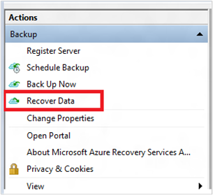

3. On the **Getting Started** page, to restore the data to the same server or computer, select **This server (`<server name>`)** > **Next**.

    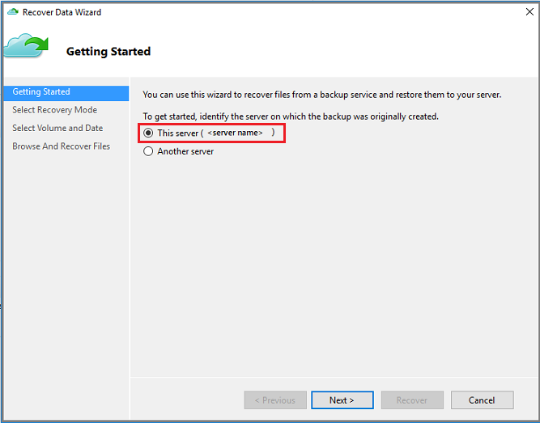

   If you have enabled Cross Region Restore (preview) and want to restore from the secondary region, select **Secondary Region**. Else, select **Primary Region**.

   :::image type="content" source="./media/backup-azure-restore-windows-server/select-source-region-for-restore.png" alt-text="Screenshot shows the selection of the source region of recovery point.":::

4. On the **Select Recovery Mode** page, choose
   **Individual files and folders** > **Next**.

    
   > [!IMPORTANT]
   > The option to restore individual files and folders requires .NET Framework 4.5.2 or later. If you don't see the **Individual files and folders** option, you must upgrade .NET Framework to version 4.5.2 or later, and try again.

   > [!TIP]
   > The **Individual files and folders** option allows for quick access to the recovery point data. It's suitable for recovering individual files, and is recommended for a total size of less than 80 GB. It offers transfer or copy speeds up to 6 MBps during recovery. The **Volume** option recovers all backed up data in a specified volume. This option provides faster transfer speeds (up to 40 MBps), and is recommended for recovering large-sized data or entire volumes.

5. On the **Select Volume and Date** page, select the volume that contains the files and folders you want to restore.

    On the calendar, select a recovery point. Dates in **bold** indicate the availability of at least one recovery point. If multiple recovery points are available within a single date, choose the specific recovery point from the **Time** drop-down menu.

    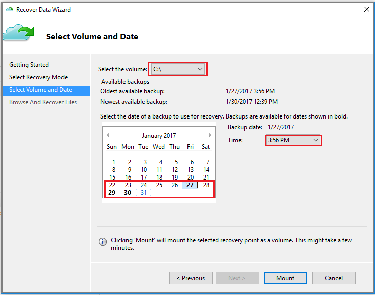

6. After choosing the recovery point to restore, select **Mount**.

    Azure Backup mounts the local recovery point, and uses it as a recovery volume.

7. On the **Browse and Recover Files** page, select **Browse** to open Windows Explorer, and find the files and folders you want.

    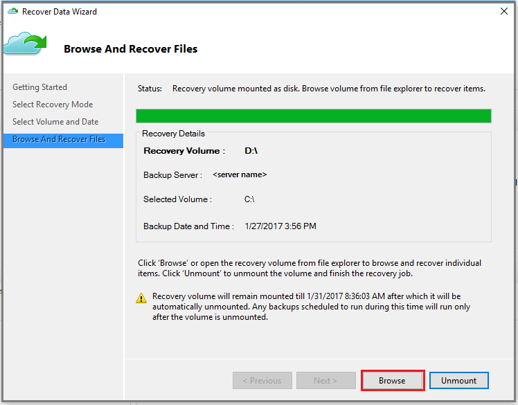

8. In Windows Explorer, copy the files and folders you want to restore, and paste them to any location local to the server or computer. You can open or stream the files directly from the recovery volume, and verify that you're recovering the correct versions.

    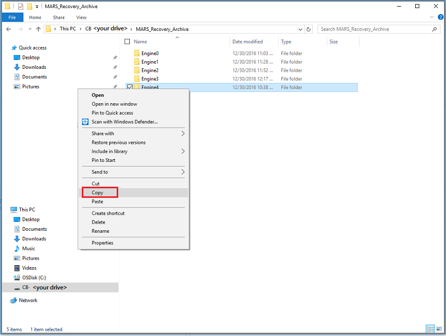

9. When you're finished, on the **Browse and Recover Files** page, select **Unmount**. Then select **Yes** to confirm that you want to unmount the volume.

    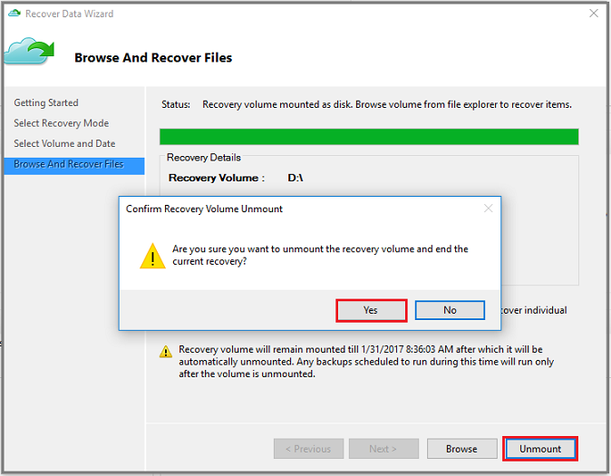

    > [!Important]
    > If you don't select **Unmount**, the recovery volume will remain mounted for 6 hours from the time when it was mounted. However, the mount time is extended to a maximum of 7 days in  case of an ongoing file-copy. No backup operations will run while the volume is mounted. Any backup operation scheduled to run during the time when the volume is mounted will run after the recovery volume is unmounted.
    >

## Use Instant Restore to restore data to an alternate machine

If your entire server is lost, you can still recover data from Azure Backup to a different machine. The following steps illustrate the workflow.

These steps include the following terminology:

* *Source machine* – The original machine from which the backup was taken, and which is currently unavailable.
* *Target machine* – The machine to which the data is being recovered.
* *Sample vault* – The Recovery Services vault to which the source machine and target machine are registered.

> [!NOTE]
> Backups can't be restored to a target machine that's running an earlier version of the operating system. For example, a backup taken from a Windows 7 computer can be restored on a Windows 7 (or later) computer. A backup taken from a Windows 10 computer can't be restored to a Windows 7 computer.
>
>

1. Open the **Microsoft Azure Backup** snap-in on the target machine.

2. Ensure that the target machine and the source machine are registered to the same Recovery Services vault.

3. Select **Recover Data** to open the **Recover Data Wizard**.

    

4. On the **Getting Started** page, select **Another server**.

    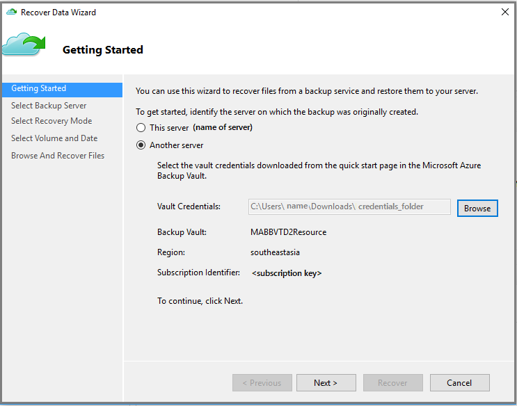

5. Provide the vault credential file that corresponds to the sample vault.

    If the vault credential file is invalid (or expired), [download a new vault credential file from the sample vault](backup-azure-file-folder-backup-faq.yml#where-can-i-download-the-vault-credentials-file-) in the Azure portal. After you provide a valid vault credential, the name of the corresponding backup vault appears.

    If you want to use Cross Region Restore to restore backup data from the secondary region, you need to download the *Secondary Region* vault credential file* from the Azure portal, and then pass the file in the MARS agent.

   :::image type="content" source="./media/backup-azure-restore-windows-server/pass-vault-credentials-in-mars-agent.png" alt-text="Screenshot shows the vault credentials added to MARS agent.":::

   Select **Next** to continue.

6. On the **Select Backup Server** page, select the source machine from the list of displayed machines, and provide the passphrase. Then select **Next**.

    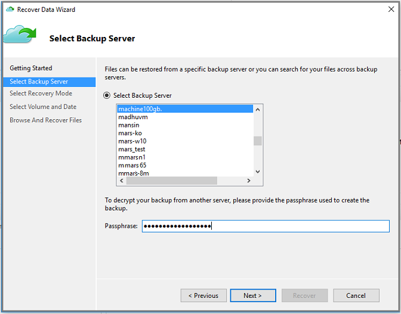

7. On the **Select Recovery Mode** page, select **Individual files and folders** > **Next**.

    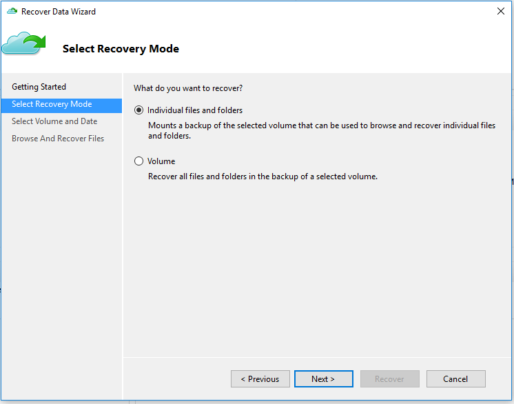

8. On the **Select Volume and Date** page, select the volume that contains the files and folders you want to restore.

    On the calendar, select a recovery point. Dates in **bold** indicate the availability of at least one recovery point. If multiple recovery points are available within a single date, choose the specific recovery point from the **Time** drop-down menu.

    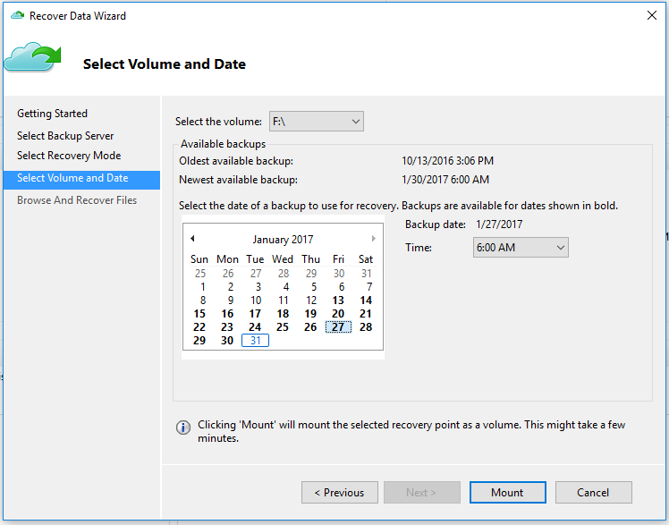

9. Select **Mount** to locally mount the recovery point as a recovery volume on your target machine.

10. On the **Browse And Recover Files** page, select **Browse** to open Windows Explorer, and find the files and folders you want.

    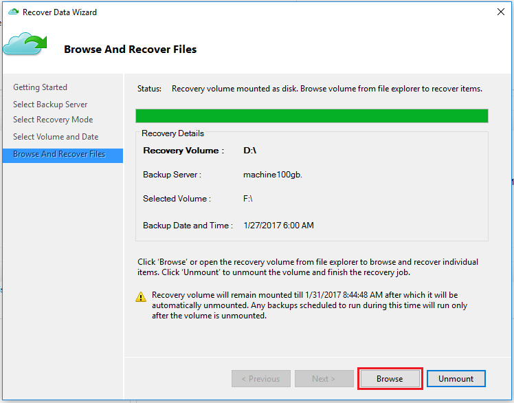

11. In Windows Explorer, copy the files and folders from the recovery volume, and paste them to your target machine location. You can open or stream the files directly from the recovery volume, and verify that the correct versions are recovered.

    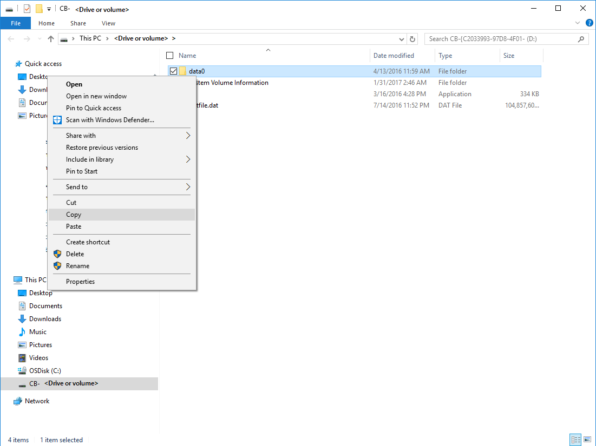

12. When you're finished, on the **Browse and Recover Files** page, select **Unmount**. Then select **Yes** to confirm that you want to unmount the volume.

    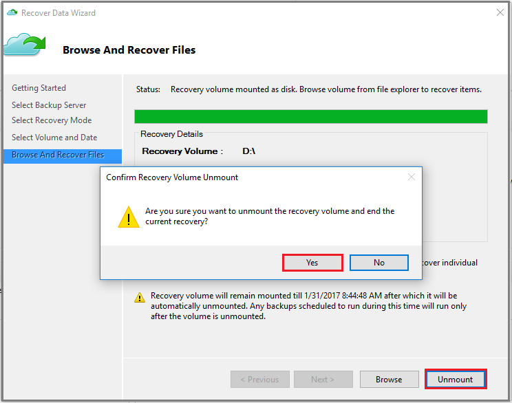

    > [!Important]
    > If you don't select **Unmount**, the recovery volume will remain mounted for 6 hours from the time when it was mounted. However, the mount time is extended up to a maximum of 24 hours in the case of an ongoing file-copy. No backup operations will run while the volume is mounted. Any backup operation scheduled to run during the time when the volume is mounted will run after the recovery volume is unmounted.
    >

## Next steps

* Now that you've recovered your files and folders, you can [manage your backups](backup-azure-manage-windows-server.md).

* Find [Common questions about backing up files and folders](backup-azure-file-folder-backup-faq.yml).
