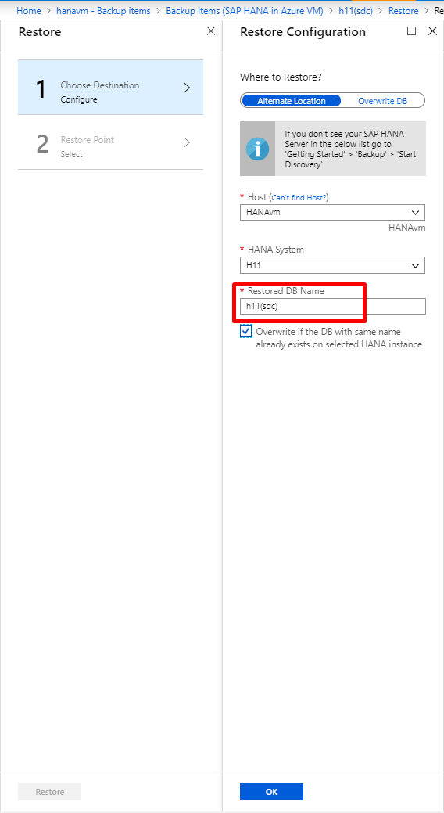

# Troubleshoot backup of SAP HANA databases on Azure

This article provides troubleshooting information for backing up SAP HANA databases on Azure virtual machines. The following section covers important conceptual data required to diagnose common error in SAP HANA backup.

## Prerequisites

As part of the [prerequisites](backup-azure-sap-hana-database.md#prerequisites), make sure the preregistration script has been run on the virtual machine where HANA is installed.

### Setting up permissions

What the preregistration script does:

1. Creates AZUREWLBACKUPHANAUSER in the HANA system and adds these required roles and permissions:
    - DATABASE ADMIN: to create new DBs during restore.
    - CATALOG READ: to read the backup catalog.
    - SAP_INTERNAL_HANA_SUPPORT: to access a few private tables.
2. Adds a key to Hdbuserstore for the HANA plug-in to handle all operations (database queries, restore operations, configuring and running backup).

   To confirm the key creation, run the HDBSQL command on the HANA machine with SIDADM credentials:

    ``` hdbsql
    hdbuserstore list
    ```

    The command output should display the {SID}{DBNAME} key, with the user shown as AZUREWLBACKUPHANAUSER.

> [!NOTE]
> Make sure you have a unique set of SSFS files under **/usr/sap/{SID}/home/.hdb/**. There should be only one folder in this path.

### Setting up BackInt parameters

After a database is chosen for backup, the Azure Backup service  configures backInt parameters at DATABASE level:

- [catalog_backup_using_backint:true]
- [enable_accumulated_catalog_backup:false]
- [parallel_data_backup_backint_channels:1]
- [log_backup_timeout_s:900)]
- [backint_response_timeout:7200]

> [!NOTE]
> Make sure these parameters are *not* present at HOST level. Host-level parameters will override these parameters and might cause unexpected behavior.

## Restore checks

### Single Container Database (SDC) restore

Take care of inputs while restoring a single container database (SDC) for HANA to another SDC machine. The database name should be given with lowercase and with "sdc" appended in brackets. The HANA instance will be displayed in capitals.

Assume an SDC HANA instance "H21" is backed up. The backup items page will show the backup item name as **"h21(sdc)"**. If you attempt to restore this database to another target SDC, say H11, then following inputs need to be provided.



Note the following points:

- By default, the restored db name will be populated with the backup item name i.e., h21(sdc)
- Selecting the target as H11 will NOT change the restored db name automatically. **It should be edited to h11(sdc)**. In case of SDC, the restored db name will be the target instance ID with lowercase letters and 'sdc' appended in brackets.
- Since SDC can have only single database, you also need to click the checkbox to allow override of the existing database data with the recovery point data.
- Linux is case-sensitive and therefore make sure to preserve the case.

### Multiple Container Database (MDC) restore

In multiple container databases for HANA, the standard configuration is SYSTEMDB + 1 or more Tenant DBs. Restoring an entire SAP HANA instance means to restore both SYSTEMDB and Tenant DBs. One restores SYSTEMDB first and then proceeds for Tenant DB. System DB essentially means to override the system information on the selected target. This also overrides the BackInt related information in the target instance. Therefore, after the system DB is restored to a target instance, one needs to run the pre-registration script again. Only then the subsequent tenant DB restores will succeed.

## Common user errors

### UserErrorInOpeningHanaOdbcConnection

data| Error message | Possible causes | Recommended action |
|---|---|---|
| Failed to connect to HANA system. Verify that your system is up and running.| The Azure Backup service can't connect to HANA because the HANA database is down. Or HANA is running but not allowing the Azure Backup service to connect. | Check whether the HANA database or service is down. If the HANA database or service is up and running, check whether [all permissions are set](#setting-up-permissions). If the key is missing, rerun the preregistration script to create a new key. |

### UserErrorInvalidBackintConfiguration

| Error message | Possible causes | Recommended action |
|---|---|---|
| Detected Invalid Backint Configuration. Stop protection and reconfigure the database.| The backInt parameters are incorrectly specified for Azure Backup. | Check whether [the parameters are set](#setting-up-backint-parameters). If backInt-based parameters are present in HOST, remove them. If parameters are not present at HOST level but have been manually modified at a database level, revert them to the appropriate values as described earlier. Or, run **Stop protection and retain backup data** from the Azure portal, and then select **Resume backup**.|
