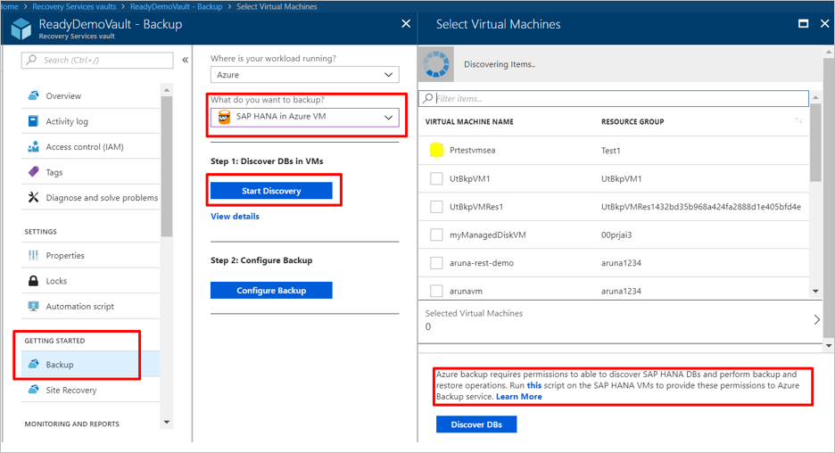
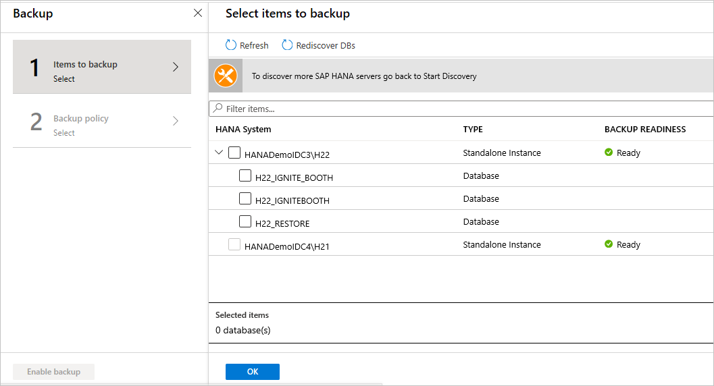
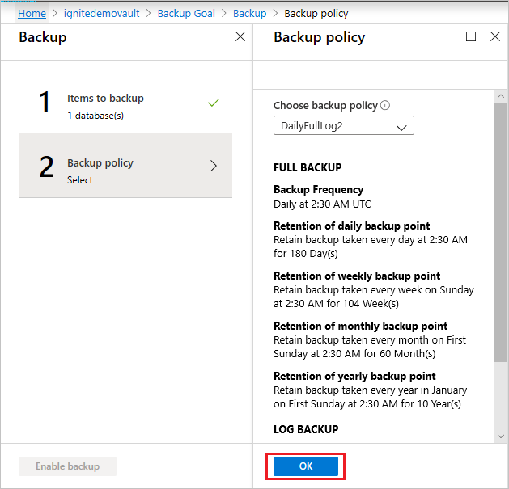
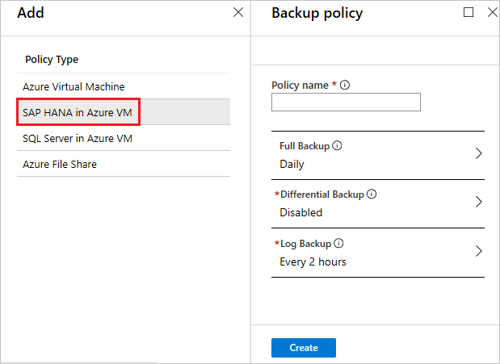
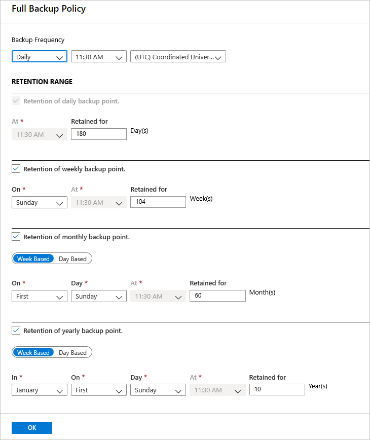
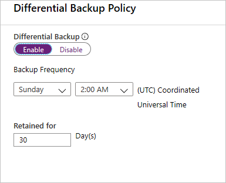

# Back up SAP HANA databases in Azure VMs

SAP HANA databases are critical workloads that require a low recovery-point objective (RPO) and long-term retention. You can back up SAP HANA databases running on Azure virtual machines (VMs) by using [Azure Backup](backup-overview.md).

This article shows how to back up SAP HANA databases that are running on Azure VMs to an Azure Backup Recovery Services vault.

In this article, you will learn how to:
> [!div class="checklist"]
>
> * Create and configure a vault
> * Discover databases
> * Configure backups
> * Run an on-demand backup job

>[!NOTE]
>[Get started](https://docs.microsoft.com/azure/backup/tutorial-backup-sap-hana-db) with SAP HANA backup preview for RHEL (7.4, 7.6, 7.7 or 8.1). For further queries write to us at [AskAzureBackupTeam@microsoft.com](mailto:AskAzureBackupTeam@microsoft.com).

>[!NOTE]
>**Soft delete for SQL server in Azure VM and soft delete for SAP HANA in Azure VM workloads** is now available in preview. 
>To sign up for the preview, write to us at [AskAzureBackupTeam@microsoft.com](mailto:AskAzureBackupTeam@microsoft.com).

## Prerequisites

Refer to the [prerequisites](tutorial-backup-sap-hana-db.md#prerequisites) and the [What the pre-registration script does](tutorial-backup-sap-hana-db.md#what-the-pre-registration-script-does) sections to set up the database for backup.

### Establish network connectivity

For all operations, an SAP HANA database running on an Azure VM requires connectivity to the Azure Backup service, Azure Storage, and Azure Active Directory. This can be achieved by using private endpoints or by allowing access to the required public IP addresses or FQDNs. Not allowing proper connectivity to the required Azure services may lead to failure in operations like database discovery, configuring backup, performing backups, and restoring data.

The following table lists the various alternatives you can use for establishing connectivity:

| **Option**                        | **Advantages**                                               | **Disadvantages**                                            |
| --------------------------------- | ------------------------------------------------------------ | ------------------------------------------------------------ |
| Private endpoints                 | Allow backups over private IPs inside the virtual network       Provide granular control on the network and vault side | Incurs standard private endpoint [costs](https://azure.microsoft.com/pricing/details/private-link/) |
| NSG service tags                  | Easier to manage as range changes are automatically merged        No additional costs | Can be used with NSGs only        Provides access to the entire service |
| Azure Firewall FQDN tags          | Easier to manage since the required FQDNs are automatically managed | Can be used with Azure Firewall only                         |
| Allow access to service FQDNs/IPs | No additional costs       Works with all network security appliances and firewalls | A broad set of IPs or FQDNs may be required to be accessed   |
| Use an HTTP proxy                 | Single point of internet access to VMs                       | Additional costs to run a VM with the proxy software         |

More details around using these options are shared below:

#### Private endpoints

Private endpoints allow you to connect securely from servers inside a virtual network to your Recovery Services vault. The private endpoint uses an IP from the VNET address space for your vault. The network traffic between your resources inside the virtual network and the vault travels over your virtual network and a private link on the Microsoft backbone network. This eliminates exposure from the public internet. Read more on private endpoints for Azure Backup [here](https://docs.microsoft.com/azure/backup/private-endpoints).

#### NSG tags

If you use Network Security Groups (NSG), use the *AzureBackup* service tag to allow outbound access to Azure Backup. In addition to the Azure Backup tag, you also need to allow connectivity for authentication and data transfer by creating similar [NSG rules](https://docs.microsoft.com/azure/virtual-network/security-overview#service-tags) for *Azure AD* and *Azure Storage*.  The following steps describe the process to create a rule for the Azure Backup tag:

1. In **All Services**, go to **Network security groups** and select the network security group.

1. Select **Outbound security rules** under **Settings**.

1. Select **Add**. Enter all the required details for creating a new rule as described in [security rule settings](https://docs.microsoft.com/azure/virtual-network/manage-network-security-group#security-rule-settings). Ensure the option **Destination** is set to *Service Tag* and **Destination service tag** is set to *AzureBackup*.

1. Click **Add**  to save the newly created outbound security rule.

You can similarly create NSG outbound security rules for Azure Storage and Azure AD.

#### Azure Firewall tags

If you're using Azure Firewall, create an application rule by using the *AzureBackup* [Azure Firewall FQDN tag](https://docs.microsoft.com/azure/firewall/fqdn-tags). This allows all outbound access to Azure Backup.

#### Allow access to service IP ranges

If you choose to allow access service IPs, refer to the IP ranges in the JSON file available [here](https://www.microsoft.com/download/confirmation.aspx?id=56519). You'll need to allow access to IPs corresponding to Azure Backup, Azure Storage, and Azure Active Directory.

#### Allow access to service FQDNs

You can also use the following FQDNs to allow access to the required services from your servers:

| Service    | Domain  names to be accessed                             |
| -------------- | ------------------------------------------------------------ |
| Azure  Backup  | `*.backup.windowsazure.com`                             |
| Azure  Storage | `*.blob.core.windows.net`    `*.queue.core.windows.net` |
| Azure  AD      | Allow  access to FQDNs under sections 56 and 59 according to [this article](https://docs.microsoft.com/office365/enterprise/urls-and-ip-address-ranges#microsoft-365-common-and-office-online) |

#### Use an HTTP proxy server to route traffic

When you back up an SAP HANA database running on an Azure VM, the backup extension on the VM uses the HTTPS APIs to send management commands to Azure Backup and data to Azure Storage. The backup extension also uses Azure AD for authentication. Route the backup extension traffic for these three services through the HTTP proxy. Use the list of IPs and FQDNs mentioned above for allowing access to the required services. Authenticated proxy servers aren't supported.

[!INCLUDE [How to create a Recovery Services vault](../../includes/backup-create-rs-vault.md)]

## Discover the databases

1. In the vault, in **Getting Started**, click **Backup**. In **Where is your workload running?**, select **SAP HANA in Azure VM**.
2. Click **Start Discovery**. This initiates discovery of unprotected Linux VMs in the vault region.

   * After discovery, unprotected VMs appear in the portal, listed by name and resource group.
   * If a VM isn't listed as expected, check whether it's already backed up in a vault.
   * Multiple VMs can have the same name but they belong to different resource groups.

3. In **Select Virtual Machines**, click the link to download the script that provides permissions for the Azure Backup service to access the SAP HANA VMs for database discovery.
4. Run the script on each VM hosting SAP HANA databases that you want to back up.
5. After running the script on the VMs, in **Select Virtual Machines**, select the VMs. Then click **Discover DBs**.
6. Azure Backup discovers all SAP HANA databases on the VM. During discovery, Azure Backup registers the VM with the vault, and installs an extension on the VM. No agent is installed on the database.

    

## Configure backup  

Now enable backup.

1. In Step 2, click **Configure Backup**.

    
2. In **Select items to back up**, select all the databases you want to protect > **OK**.

    
3. In **Backup Policy** > **Choose backup policy**, create a new backup policy for the databases, in accordance with the instructions below.

    
4. After creating the policy, on the **Backup** menu, click **Enable backup**.

    
5. Track the backup configuration progress in the **Notifications** area of the portal.

### Create a backup policy

A backup policy defines when backups are taken, and how long they're retained.

* A policy is created at the vault level.
* Multiple vaults can use the same backup policy, but you must apply the backup policy to each vault.

>[!NOTE]
>Azure Backup doesn’t automatically adjust for daylight saving time changes when backing up a SAP HANA database running in an Azure VM.
>
>Modify the policy manually as needed.

Specify the policy settings as follows:

1. In **Policy name**, enter a name for the new policy.

   
2. In **Full Backup policy**, select a **Backup Frequency**, choose **Daily** or **Weekly**.
   * **Daily**: Select the hour and time zone in which the backup job begins.
       * You must run a full backup. You can't turn off this option.
       * Click **Full Backup** to view the policy.
       * You can't create differential backups for daily full backups.
   * **Weekly**: Select the day of the week, hour, and time zone in which the backup job runs.

   

3. In **Retention Range**, configure retention settings for the full backup.
    * By default all options are selected. Clear any retention range limits you don't want to use, and set those that you do.
    * The minimum retention period for any type of backup (full/differential/log) is seven days.
    * Recovery points are tagged for retention based on their retention range. For example, if you select a daily full backup, only one full backup is triggered each day.
    * The backup for a specific day is tagged and retained based on the weekly retention range and setting.
    * The monthly and yearly retention ranges behave in a similar way.

4. In the **Full Backup policy** menu, click **OK** to accept the settings.
5. Select **Differential Backup** to add a differential policy.
6. In **Differential Backup policy**, select **Enable** to open the frequency and retention controls.
    * At most, you can trigger one differential backup per day.
    * Differential backups can be retained for a maximum of 180 days. If you need longer retention, you must use full backups.

    

    > [!NOTE]
    > Incremental backups aren't currently supported.

7. Click **OK** to save the policy and return to the main **Backup policy** menu.
8. Select **Log Backup** to add a transactional log backup policy,
    * In **Log Backup**, select **Enable**.  This cannot be disabled as SAP HANA manages all log backups.
    * Set the frequency and retention controls.

    > [!NOTE]
    > Log backups only begin to flow after a successful full backup is completed.

9. Click **OK** to save the policy and return to the main **Backup policy** menu.
10. After you finish defining the backup policy, click **OK**.

> [!NOTE]
> Each log backup is chained to the previous full backup to form a recovery chain. This full backup will be retained until the retention of the last log backup has expired. This might mean that the full backup is retained for an extra period to make sure all the logs can be recovered. Let's assume user has a weekly full backup, daily differential and 2 hour logs. All of them are retained for 30 days. But, the weekly full can be really cleaned up/deleted only after the next full backup is available i.e., after 30 + 7 days. Say, a weekly full backup happens on Nov 16th. According to the retention policy, it should be retained until Dec 16th. The last log backup for this full happens before the next scheduled full, on Nov 22nd. Until this log is available until Dec 22nd, the Nov 16th full can't be deleted. So, the Nov 16th full is retained until Dec 22nd.

## Run an on-demand backup

Backups run in accordance with the policy schedule. You can run a backup on-demand as follows:

1. In the vault menu, click **Backup items**.
2. In **Backup Items**,  select the VM running the SAP HANA database, and then click **Backup now**.
3. In **Backup Now**, choose the type of backup you want to perform. Then click **OK**. This backup will be retained according to the policy associated with this backup item.
4. Monitor the portal notifications. You can monitor the job progress in the vault dashboard > **Backup Jobs** > **In progress**. Depending on the size of your database, creating the initial backup may take a while.

## Run SAP HANA Studio backup on a database with Azure Backup enabled

If you want to take a local backup (using HANA Studio) of a database that's being backed up with Azure Backup, do the following:

1. Wait for any full or log backups for the database to finish. Check the status in SAP HANA Studio / Cockpit.
2. Disable log backups, and set the backup catalog to the file system for relevant database.
3. To do this, double-click **systemdb** > **Configuration** > **Select Database** > **Filter (Log)**.
4. Set **enable_auto_log_backup** to **No**.
5. Set **log_backup_using_backint** to **False**.
6. Take an on-demand full backup of the database.
7. Wait for the full backup and catalog backup to finish.
8. Revert the previous settings back to those for Azure:
    * Set **enable_auto_log_backup** to **Yes**.
    * Set **log_backup_using_backint** to **True**.

## Next steps

* Learn how to [restore SAP HANA databases running on Azure VMs](https://docs.microsoft.com/azure/backup/sap-hana-db-restore)
* Learn how  to [manage SAP HANA databases that are backed up using Azure Backup](https://docs.microsoft.com/azure/backup/sap-hana-db-manage)
