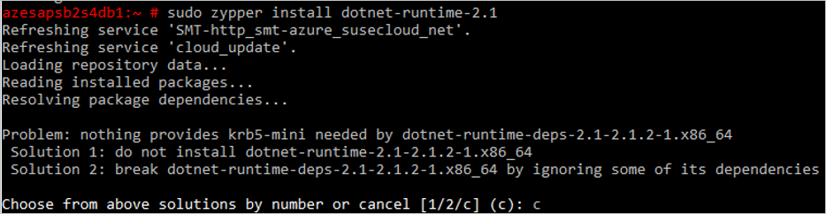

# Back up an SAP HANA database

[Azure Backup](backup-overview.md) supports the backup of SAP HANA databases to Azure.

> [!NOTE]
> This feature is currently in public preview. It's not currently production ready, and doesn't have a guaranteed SLA. 

## Scenario support

**Support** | **Details**
--- | ---
**Supported geos** | Australia South East, East Australia <br> Brazil South <br> Canada Central, Canada East <br> South East Asia, East Asia <br> East US, East US 2, West Central US, West US, West US 2, North Central US, Central US, South Central US<br> India Central, India South <br> Japan East, Japan West<br> Korea Central, Korea South <br> North Europe, West Europe <br> UK South, UK West
**Supported VM operating systems** | SLES 12 with SP2 or SP3.
**Supported HANA versions** | SDC on HANA 1.x, MDC on HANA 2.x <= SPS03

### Current limitations

- You can only back up SAP HANA databases running on Azure VMs.
- You can only configure SAP HANA backup in the Azure portal. The feature can't be configured with PowerShell, CLI, or the REST API.
- You can only back up databases in Scale-Up mode.
- You can back up database logs every 15 minutes. Log backups only begin to flow after a successful full backup for the database has completed.
- You can take full and differential backups. Incremental backup isn't currently supported.
- You can't modify the backup policy after you apply it for SAP HANA backups. If you want to back up with different settings, create a new policy, or assign a different policy.
  - To create a new policy, in the vault click **Policies** > **Backup Policies** > **+Add** > **SAP HANA in Azure VM**, and specify policy settings.
  - To assign a different policy, in the properties of the VM running the database, click the current policy name. Then on the **Backup Policy** page you can select a different policy to use for the backup.

## Prerequisites

Make sure you do the following before you configure backups:

1. On the VM running the SAP HANA database, install the official Microsoft [.NET Core Runtime 2.1](https://dotnet.microsoft.com/download/linux-package-manager/sles/runtime-current) package. Note that:
    - You only need the **dotnet-runtime-2.1** package. You don't need **aspnetcore-runtime-2.1**.
    - If the VM doesn't have internet access, mirror or provide an offline-cache for dotnet-runtime-2.1 (and all dependent RPMs) from the Microsoft package feed specified in the page.
    - During package installation, you might be asked to specify an option. If so, specify **Solution 2**.

        

2. On the VM, install and enable ODBC driver packages from the official SLES package/media using zypper, as follows:

    ```unix
    sudo zypper update
    sudo zypper install unixODBC
    ```

3. Allow connectivity from the VM to the internet, so that it can reach Azure, as described in procedure [below](#set-up-network-connectivity).

4. Run the pre-registration script in the virtual machine where HANA is installed as a root user. The script is provided [in the portal](#discover-the-databases) in the flow and is required to set up the [right permissions](backup-azure-sap-hana-database-troubleshoot.md#setting-up-permissions).

### Set up network connectivity

For all operations, the SAP HANA VM needs connectivity to Azure public IP addresses. VM operations (database discovery, configure backups, schedule backups, restore recovery points, and so on) can't work without connectivity. Establish connectivity by allowing access to the Azure datacenter IP ranges: 

- You can download the [IP address ranges](https://www.microsoft.com/download/details.aspx?id=41653) for Azure datacenters, and then allow access to these IP addresses.
- If you're using network security groups (NSGs), you can use the AzureCloud [service tag](https://docs.microsoft.com/azure/virtual-network/security-overview#service-tags) to allow all Azure public IP addresses. You can use the [Set-AzureNetworkSecurityRule cmdlet](https://docs.microsoft.com/powershell/module/servicemanagement/azure/set-azurenetworksecurityrule?view=azuresmps-4.0.0)  to modify NSG rules.

## Onboard to the public preview

Onboard to the public preview as follows:

- In the portal, register your subscription ID to the Recovery Services service provider by [following this article](https://docs.microsoft.com/azure/azure-resource-manager/resource-manager-register-provider-errors#solution-3---azure-portal). 
- For PowerShell, run this cmdlet. It should complete as "Registered".

    ```powershell
    PS C:>  Register-AzProviderFeature -FeatureName "HanaBackup" –ProviderNamespace Microsoft.RecoveryServices
    ```


[!INCLUDE [How to create a Recovery Services vault](../../includes/backup-create-rs-vault.md)]

## Discover the databases

1. In the vault, in **Getting Started**, click **Backup**. In **Where is your workload running?**, select **SAP HANA in Azure VM**.
2. Click **Start Discovery**. This initiates discovery of unprotected Linux VMs in the vault region.

   - After discovery, unprotected VMs appear in the portal, listed by name and resource group.
   - If a VM isn't listed as expected, check whether it's already backed up in a vault.
   - Multiple VMs can have the same name but they belong to different resource groups.

3. In **Select Virtual Machines**, click the link to download the script that provides permissions for the Azure Backup service to access the SAP HANA VMs for database discovery
4. Run the script on each VM hosting SAP HANA databases that you want to back up.
5. After running the script on the VMs, in **Select Virtual Machines**, select the VMs. Then click **Discover DBs**.
6. Azure Backup discovers all SAP HANA databases on the VM. During discovery, Azure Backup registers the VM with the vault, and installs an extension on the VM. No agent is installed on the database.

    

## Configure backup  

Now enable backup.

1. In Step 2, click **Configure Backup**.
2. In **Select items to back up**, select all the databases you want to protect > **OK**.
3. In **Backup Policy** > **Choose backup policy**, create a new backup policy for the databases, in accordance with the instructions below.
4. After creating the policy, on the **Backup** menu, click **Enable backup**.
5. Track the backup configuration progress in the **Notifications** area of the portal.

### Create a backup policy

A backup policy defines when backups are taken, and how long they're retained.

- A policy is created at the vault level.
- Multiple vaults can use the same backup policy, but you must apply the backup policy to each vault.

Specify the policy settings as follows:

1. In **Policy name**, enter a name for the new policy.
2. In **Full Backup policy**, select a **Backup Frequency**, choose **Daily** or **Weekly**.
   - **Daily**: Select the hour and time zone in which the backup job begins.
   
       - You must run a full backup. You can't turn off this option.
       - Click **Full Backup** to view the policy.
       - You can't create differential backups for daily full backups.
       
   - **Weekly**: Select the day of the week, hour, and time zone in which the backup job runs.
3. In **Retention Range**, configure retention settings for the full backup.
    - By default all options are selected. Clear any retention range limits you don't want to use, and set those that you do.
    - The minimum retention period  for any type of backup (full/differential/log) is seven days.
    - Recovery points are tagged for retention based on their retention range. For example, if you select a daily full backup, only one full backup is triggered each day.
    - The backup for a specific day is tagged and retained based on the weekly retention range and setting.
    - The monthly and yearly retention ranges behave in a similar way.

4. In the **Full Backup policy** menu, click **OK** to accept the settings.
5. Select **Differential Backup** to add a differential policy.
6. In **Differential Backup policy**, select **Enable** to open the frequency and retention controls.
    - At most, you can trigger one differential backup per day.
    - Differential backups can be retained for a maximum of 180 days. If you need longer retention, you must use full backups.

    > [!NOTE]
    > Incremental backups aren't currently supported. 

7. Click **OK** to save the policy and return to the main **Backup policy** menu.
8. Select **Log Backup** to add a transactional log backup policy,
    - In **Log Backup**, select **Enable**.
    - Set the frequency and retention controls.

    > [!NOTE]
    > Log backups only begin to flow after a successful full backup is completed.

9. Click **OK** to save the policy and return to the main **Backup policy** menu.
10. After you finish defining the backup policy, click **OK**.


## Run an on-demand backup

Backups run in accordance with the policy schedule. You can run a backup on-demand as follows:


1. In the vault menu, click **Backup items**.
2. In **Backup Items**,  select the VM running the SAP HANA database, and then click **Backup now**.
3. In **Backup Now**, use the calendar control to select the last day that the recovery point should be retained. Then click **OK**.
4. Monitor the portal notifications. You can monitor the job progress in the vault dashboard > **Backup Jobs** > In progress. Depending on the size of your database, creating the initial backup may take a while.

## Run SAP HANA Studio backup on a database with Azure Backup enabled

If you want to take a local backup (using HANA Studio) of a database that's being backed up with Azure Backup, do the following:

1. Wait for any full or log backups for the database to finish. Check the status in SAP HANA Studio.
2. Disable log backups, and set the backup catalog to the file system for relevant database.
3. To do this, double-click **systemdb** > **Configuration** > **Select Database** > **Filter (Log)**.
4. Set **enable_auto_log_backup** to **No**.
5. Set **log_backup_using_backint** to **False**.
6. Take an ad hoc full backup of the database.
7. Wait for the full backup and catalog backup to finish.
8. Revert the previous settings back to those for Azure:
    - Set **enable_auto_log_backup** to **Yes**.
    - Set **log_backup_using_backint** to **True**.


## Next steps

[Learn about](backup-azure-sap-hana-database-troubleshoot.md) how to troubleshoot common errors while using SAP HANA backup in Azure VMs.
[Learn about](backup-azure-arm-vms-prepare.md) backing up Azure VMs.
