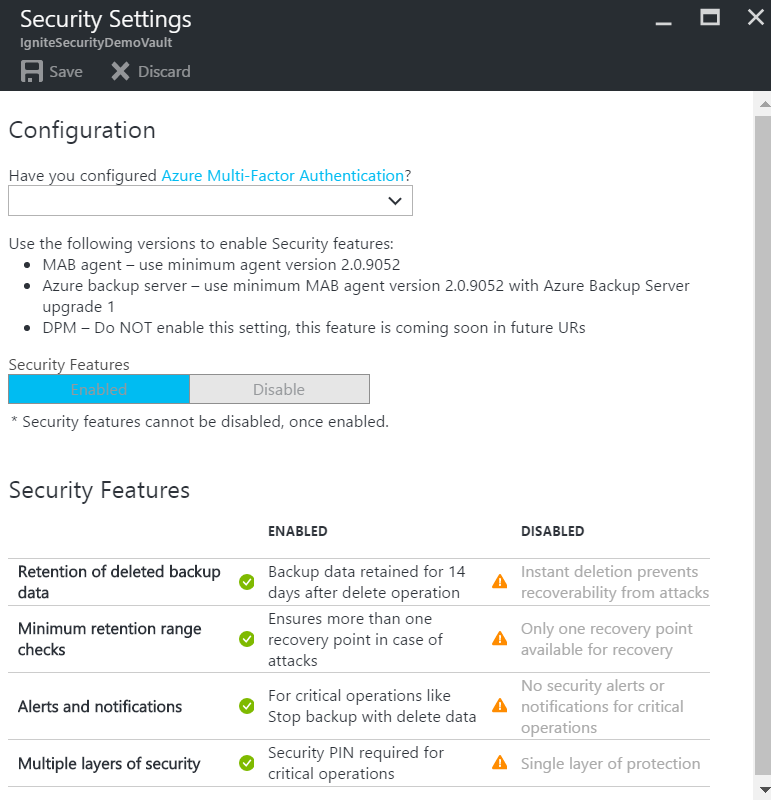

<properties
	pageTitle="Security Features for protecting hybrid backups using Azure Backup | Microsoft Azure"
	description="Learn how to use security features in Azure Backup to make backups more secure"
	services="backup"
	documentationCenter=""
	authors="JPallavi"
	manager="vijayts"
	editor=""/>

<tags
	ms.service="backup"
	ms.workload="storage-backup-recovery"
	ms.tgt_pltfrm="na"
	ms.devlang="na"
	ms.topic="article"
	ms.date="11/02/2016"
	ms.author="JPallavi" />
  
# Security features for protecting hybrid backups using Azure Backup
More and more customers are hit with security issues like malware, ransomware and costs per security breach has been increasing. To guard against such attacks, Azure Backup now provides Security Features to protect hybrid backups. This article talks about how to enable and leverage these features using Microsoft Azure Recovery Services Agent and Microsoft Azure Backup Server. These features have been built on three pillars of security:

1. **Prevention** - An additional layer of authentication is added whenever a critical operation like Change Passphrase is performed. This validation is to ensure that such operations can be performed only by users having valid Azure credentials. Also, more number of minimum recovery points are maintained to guard against corrupt data. 

2. **Alerting** - Email notification is sent to subscription admin whenever a critical operation like Delete Backup data is performed. This email ensures that user is timely notified about such actions.

3. **Recovery** - Deleted backup data is retained for additional 14 days from the date of delete. This ensures recoverability of the data within given time period so there is no data loss even if attack happens.

## Enabling Security features 
Users creating recovery services vault would be able to avail all the Security Features. For existing recovery services vault, following steps should be used to enable these features:

1. Log in to Azure portal using Azure credentials

2. Type in Recovery Services in the Hub menu to navigate to recovery services list. 

	  

	The list of recovery services vaults appears. From this list, select a vault. 
	
	The selected vault dashboard opens.
	
3. From the list of items that appears under vault, click **Properties** under **Settings**.

	

4. Click **Update** under **Security Settings**.

	
	
	Update link opens Security Settings blade, which lets you Enable these features and gives summary of the feature.
	
5. Use the toggle button to **Enable** and click **Save** button on top to save Security Settings as shown in the figure.

	

> [AZURE.NOTE]
- Security Features should be enabled only if you are using:  
	- **MAB agent** - minimum agent version 2.0.9052  
	- **Azure Backup Server** - minimum MAB agent version 2.0.9052 with Azure Backup Server upgrade 1  
	- **DPM** - Do not enable this Setting for DPM. This feature is coming soon in future URs  
- Once enabled, you get Security Features for all the Azure Recovery Services Agent (MARS) machines and Azure Backup Servers registered with the vault.  
- Enabling this setting is a one-time action and you cannot disable these features after enabling them.  
- This feature is available only for Recovery Services vault.

## Recovering deleted backup data
As a security measure, Azure Backup retains deleted backup data for additional 14 days and does not delete it immediately if Stop backup with delete backup data operation is performed. To restore this data in the 14-day period, use the following steps:

For **Microsoft Recovery Services Agent (MARS)** users:

1. If the machine where backups were happening is still available, use [Recover Data feature](backup-azure-restore-windows-server.md) in MARS to recover from all the old recovery points.

2. If the machine mentioned above is not available, use [Alternate Server Recovery](backup-azure-restore-windows-server.md) to use another MARS machine to get this data.

For **Azure Backup Server** users:

1. If the server where backups were happening is still available, re-protect the deleted data sources and use Recover Data feature to recover from all the old recovery points.

2. If the machine mentioned above is not available, use [Alternate Server Recovery](backup-azure-alternate-dpm-server.md) to use another Azure Backup Server to get this data.

## Preventing attacks
As part of this feature, checks have been added to make sure only valid users can perform various operations.

### Authentication to perform critical operations
As part of adding extra layer of authentication for critical operations, you would be prompted to enter Security PIN when performing Stop Protection with Delete data and Change Passphrase operations. 

To receive Security PIN, use the following steps:

1. Log in to Azure portal.

2. Navigate to recovery service vault > Settings > Properties.

3. Click **Generate** under Security PIN. Generate link opens a blade, which contains Security PIN to be entered in Azure Recovery Services Agent UI. 
	This PIN is valid only for 5 minutes and gets generated automatically after that period.
	
### Maintaining minimum retention range
To ensure that there are always a valid number of recovery points available, following checks have been added:

1. For daily retention, minimum **seven** days of retention should be done

2. For weekly retention, minimum **four** weeks of retention should be done

3. For monthly retention, minimum **three** months of retention should be done

4. For yearly retention, minimum **one** year of retention should be done

## Notifications for critical operations
Whenever some critical operations are performed, subscription admin would be sent an email notification with details about the operation. If you want to configure additional email ids to receive email notifications, you can use Azure portal to configure them.

The Security features mentioned in this article, provide defense mechanisms against targeted attacks preventing attackers to touch the backups. More importantly, these features provide an ability to recover backup data if at all attack happens.

## Next Steps

- [Get started with Azure Recovery Services vault](backup-azure-vms-first-look-arm.md) to enable these features
- [Download latest Azure Recovery Services agent](backup-configure-vault.md) to protect Windows machines and guard your backup data against attacks
- [Download latest Azure Backup Server](backup-azure-microsoft-azure-backup.md) to protect workloads and guard your backup data against attacks
