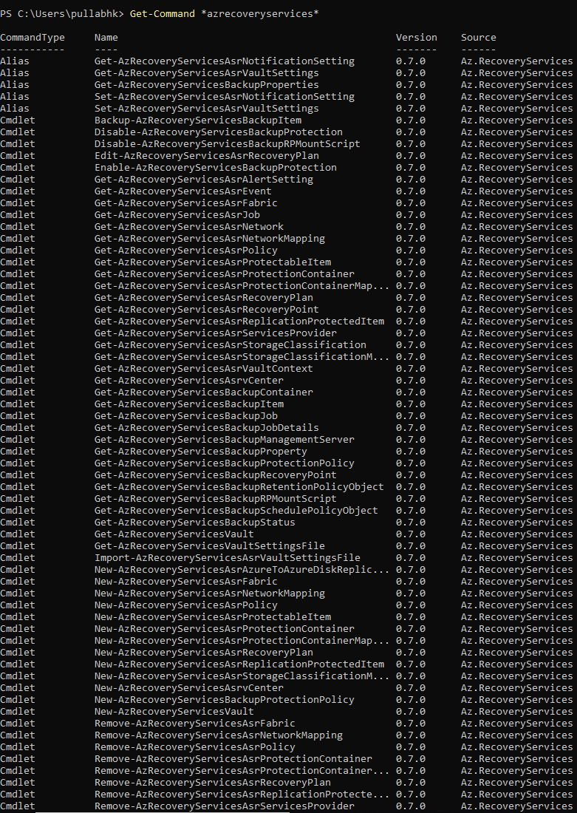

# Back up and restore SQL Databases in Azure  VMs with PowerShell

This article describes how to use Azure PowerShell to back up and recover a SQL DB within an Azure VM using [Azure Backup](backup-overview.md) Recovery Services vault.

This tutorial explains how to:

> [!div class="checklist"]
> * Set up PowerShell and register the Azure Recovery Services Provider.
> * Create a Recovery Services vault.
> * Configure backup for SQL DB within an Azure VM.
> * Run a backup job.
> * Restore a backed up SQL DB.
> * Monitor backup and restore jobs.

## Before you start

* [Learn more](backup-azure-recovery-services-vault-overview.md) about Recovery Services vaults.
* Read about the feature capabilities for [backing up SQL DBs within Azure VMs](backup-azure-sql-database.md#before-you-start).
* Review the PowerShell object hierarchy for Recovery Services.

### Recovery Services object hierarchy

The object hierarchy is summarized in the following diagram.


Review the **Az.RecoveryServices** [cmdlet reference](/powershell/module/az.recoveryservices) reference in the Azure library.

### Set up and install

[!INCLUDE [updated-for-az](../../includes/updated-for-az.md)]

Set up PowerShell as follows:

1. [Download the latest version of Az PowerShell](/powershell/azure/install-az-ps). The minimum version required is 1.5.0.

2. Find the Azure Backup PowerShell cmdlets with this command:

    ```powershell
    Get-Command *azrecoveryservices*
    ```

3. Review the aliases and cmdlets for Azure Backup and the Recovery Services vault. Here's an example of what you might see. It's not a complete list of cmdlets.

    

4. Sign in to your Azure account with **Connect-AzAccount**.
5. On the web page that appears, you're prompted to input your account credentials.

    * Alternately, you can include your account credentials as a parameter in the **Connect-AzAccount** cmdlet with **-Credential**.
    * If you're a CSP partner working for a tenant, specify the customer as a tenant, using their tenantID or tenant primary domain name. An example is **Connect-AzAccount -Tenant** fabrikam.com.

6. Associate the subscription you want to use with the account, because an account can have several subscriptions.

    ```powershell
    Select-AzSubscription -SubscriptionName $SubscriptionName
    ```

7. If you're using Azure Backup for the first time, use the **Register-AzResourceProvider** cmdlet to register the Azure Recovery Services provider with your subscription.

    ```powershell
    Register-AzResourceProvider -ProviderNamespace "Microsoft.RecoveryServices"
    ```

8. Verify that the providers registered successfully:

    ```powershell
    Get-AzResourceProvider -ProviderNamespace "Microsoft.RecoveryServices"
    ```

9. In the command output, verify that **RegistrationState** changes to **Registered**. If it doesn't, run the **Register-AzResourceProvider** cmdlet again.

## Create a Recovery Services vault

Follow these steps to create a Recovery Services vault.

The Recovery Services vault is a Resource Manager resource, so you must place it within a resource group. You can use an existing resource group, or you can create a resource group with the **New-AzResourceGroup** cmdlet. When you create a resource group, specify the name and location for the resource group.

1. A vault is placed in a resource group. If you don't have an existing resource group, create a new one with the [New-AzResourceGroup](https://docs.microsoft.com/powershell/module/az.resources/new-azresourcegroup?view=azps-1.4.0). In this example, we create a new resource group in the West US region.

    ```powershell
    New-AzResourceGroup -Name "test-rg" -Location "West US"
    ```

2. Use the [New-AzRecoveryServicesVault](https://docs.microsoft.com/powershell/module/az.recoveryservices/New-AzRecoveryServicesVault?view=azps-1.4.0) cmdlet to create the vault. Specify the same location for the vault as was used for the resource group.

    ```powershell
    New-AzRecoveryServicesVault -Name "testvault" -ResourceGroupName "test-rg" -Location "West US"
    ```

3. Specify the type of redundancy to use for the vault storage.

    * You can use [locally redundant storage](../storage/common/storage-redundancy-lrs.md) or [geo-redundant storage](../storage/common/storage-redundancy-grs.md).
    * The following example sets the **-BackupStorageRedundancy** option for the[Set-AzRecoveryServicesBackupProperty](https://docs.microsoft.com/powershell/module/az.recoveryservices/set-azrecoveryservicesbackupproperty) cmd for **testvault** set to **GeoRedundant**.

    ```powershell
    $vault1 = Get-AzRecoveryServicesVault -Name "testvault"
    Set-AzRecoveryServicesBackupProperties  -Vault $vault1 -BackupStorageRedundancy GeoRedundant
    ```

### View the vaults in a subscription

To view all vaults in the subscription, use [Get-AzRecoveryServicesVault](https://docs.microsoft.com/powershell/module/az.recoveryservices/get-azrecoveryservicesvault?view=azps-1.4.0).

```powershell
Get-AzRecoveryServicesVault
```

The output is similar to the following. The associated resource group and location are provided.

```powershell
Name              : Contoso-vault
ID                : /subscriptions/1234
Type              : Microsoft.RecoveryServices/vaults
Location          : WestUS
ResourceGroupName : Contoso-docs-rg
SubscriptionId    : 1234-567f-8910-abc
Properties        : Microsoft.Azure.Commands.RecoveryServices.ARSVaultProperties
```

### Set the vault context

Store the vault object in a variable, and set the vault context.

* Many Azure Backup cmdlets require the Recovery Services vault object as an input, so it's convenient to store the vault object in a variable.
* The vault context is the type of data protected in the vault. Set it with [Set-AzRecoveryServicesVaultContext](https://docs.microsoft.com/powershell/module/az.recoveryservices/set-azrecoveryservicesvaultcontext?view=azps-1.4.0). After the context is set, it applies to all subsequent cmdlets.

The following example sets the vault context for **testvault**.

```powershell
Get-AzRecoveryServicesVault -Name "testvault" | Set-AzRecoveryServicesVaultContext
```

### Fetch the vault ID

We plan on deprecating the vault context setting in accordance with Azure PowerShell guidelines. Instead, you can store or fetch the vault ID, and pass it to relevant commands, as follows:

```powershell
$vaultID = Get-AzRecoveryServicesVault -ResourceGroupName "Contoso-docs-rg" -Name "testvault" | select -ExpandProperty ID
```

## Configure a backup policy

A backup policy specifies the schedule for backups, and how long backup recovery points should be kept:

* A backup policy is associated with at least one retention policy. A retention policy defines how long a recovery point is kept before it's deleted.
* View the default backup policy retention using [Get-AzRecoveryServicesBackupRetentionPolicyObject](https://docs.microsoft.com/powershell/module/az.recoveryservices/get-azrecoveryservicesbackupretentionpolicyobject?view=azps-1.4.0).
* View the default backup policy schedule using [Get-AzRecoveryServicesBackupSchedulePolicyObject](https://docs.microsoft.com/powershell/module/az.recoveryservices/get-azrecoveryservicesbackupschedulepolicyobject?view=azps-1.4.0).
* You use the [New-AzRecoveryServicesBackupProtectionPolicy](https://docs.microsoft.com/powershell/module/az.recoveryservices/set-azrecoveryservicesbackupprotectionpolicy?view=azps-1.4.0) cmdlet to create a new backup policy. You input the schedule and retention policy objects.

The following example stores the schedule policy and the retention policy in variables. It then uses those variables as parameters for a new policy (**NewSQLPolicy**). **NewSQLPolicy** takes a daily "Full" backup, retains it for 180 days and takes a log backup every 2 hours

```powershell
$schPol = Get-AzRecoveryServicesBackupSchedulePolicyObject -WorkloadType "MSSQL"
$retPol = Get-AzRecoveryServicesBackupRetentionPolicyObject -WorkloadType "MSSQL"
$NewSQLPolicy = New-AzRecoveryServicesBackupProtectionPolicy -Name "NewSQLPolicy" -WorkloadType "MSSQL" -RetentionPolicy $retPol -SchedulePolicy $schPol
```

The output is similar to the following.

```powershell
Name                 WorkloadType       BackupManagementType BackupTime                Frequency                                IsDifferentialBackup IsLogBackupEnabled
                                                                                                                                Enabled
----                 ------------       -------------------- ----------                ---------                                -------------------- ------------------
NewSQLPolicy         MSSQL              AzureWorkload        3/15/2019 9:00:00 PM      Daily                                    False                True
```

## Enable backup

### Registering the SQL VM

For Azure VM backups and Azure File shares, Backup service can connect to these Azure Resource Manager resources and fetch the relevant details. Since SQL is an application within an Azure VM, Backup service needs permission to access the application and fetch the necessary details. In order to do that, you need to *'register'* the Azure VM that contains the SQL application with a Recovery services vault. Once you register a SQL VM with a vault, you can protect the SQL DBs to that vault only. Use [Register-AzRecoveryServicesBackupContainer](https://docs.microsoft.com/powershell/module/az.recoveryservices/Register-AzRecoveryServicesBackupContainer?view=azps-1.5.0) PS cmdlet to register the VM.

````powershell
 $myVM = Get-AzVM -ResourceGroupName <VMRG Name> -Name <VMName>
Register-AzRecoveryServicesBackupContainer -ResourceId $myVM.ID -BackupManagementType AzureWorkload -WorkloadType MSSQL -VaultId $targetVault.ID -Force
````

The command will return a 'backup container' of this resource and the status will be 'registered'

> [!NOTE]
> If the force parameter is not given, user is asked to confirm with a text 'Do you want to disable protection for this container'. Please ignore this text and say "Y" to confirm. This is a known issue and we are working to remove the text and the requirement for the force parameter

### Fetching SQL DBs

Once the registration is done, Backup service will be able to list all the available SQL components within the VM. To view all the SQL components yet to be backed up to this vault use [Get-AzRecoveryServicesBackupProtectableItem](https://docs.microsoft.com/powershell/module/az.recoveryservices/Get-AzRecoveryServicesBackupProtectableItem?view=azps-1.5.0) PS cmdlet

````powershell
Get-AzRecoveryServicesBackupProtectableItem -WorkloadType MSSQL -VaultId $targetVault.ID
````

The output will show all unprotected SQL components across all SQL VMs registered to this vault with Item Type and ServerName. You can further filter to a particular SQL VM by passing the '-Container' parameter or use the combination of 'Name' and 'ServerName' along with ItemType flag to arrive at a unique SQL item.

````powershell
$SQLDB = Get-AzRecoveryServicesBackupProtectableItem -workloadType MSSQL -ItemType SQLDataBase -VaultId $targetVault.ID -Name "<Item Name>" -ServerName "<Server Name>"
````

### Configuring backup

Now that we have the required SQL DB and the policy with which it needs to be backed up, we can use the [Enable-AzRecoveryServicesBackupProtection](https://docs.microsoft.com/powershell/module/az.recoveryservices/Enable-AzRecoveryServicesBackupProtection?view=azps-1.5.0) cmdlet to configure backup for this SQL DB.

````powershell
Enable-AzRecoveryServicesBackupProtection -ProtectableItem $SQLDB -Policy $NewSQLPolicy
````

The command waits until the configure backup is completed and returns the following output.

```powershell
WorkloadName     Operation            Status               StartTime                 EndTime                   JobID
------------     ---------            ------               ---------                 -------                   -----
master           ConfigureBackup      Completed            3/18/2019 6:00:21 PM      3/18/2019 6:01:35 PM      654e8aa2-4096-402b-b5a9-e5e71a496c4e
```

### Fetching new SQL DBs

Once the machine is registered, Backup service will fetch the details of the DBs available then. If user adds SQL DBs/SQL instances to the registered machine later, one needs to manually trigger the backup service to perform a fresh 'inquiry' to get ALL the unprotected DBs (including the newly added ones) again. Use the [Initialize-AzRecoveryServicesBackupItem](https://docs.microsoft.com/powershell/module/az.recoveryservices/Initialize-AzRecoveryServicesBackupProtectableItem?view=azps-1.5.0) PS cmdlet on the SQL VM to perform a fresh inquiry. The command waits until the operation is completed. Later use the [Get-AzRecoveryServicesBackupProtectableItem](https://docs.microsoft.com/powershell/module/az.recoveryservices/Get-AzRecoveryServicesBackupProtectableItem?view=azps-1.5.0) PS cmdlet to get the list of latest unprotected SQL components

````powershell
$SQLContainer = Get-AzRecoveryServicesBackupContainer -ContainerType AzureVMAppContainer -FriendlyName <VM name> -VaultId $targetvault.ID
Initialize-AzRecoveryServicesBackupProtectableItem -Container $SQLContainer -WorkloadType MSSQL -VaultId $targetvault.ID
Get-AzRecoveryServicesBackupProtectableItem -workloadType MSSQL -ItemType SQLDataBase -VaultId $targetVault.ID
````

Once the relevant protectable items are fetched, enable the backups as instructed in the [above section](#configuring-backup).
If one doesn't want to manually detect new DBs, they can opt for autoprotection as explained [below](#enable-autoprotection).

## Enable AutoProtection

A user can configure backup such that all DBs added in the future are automatically protected with a certain policy. To enable autoprotection, use [Enable-AzRecoveryServicesBackupAutoProtection](https://docs.microsoft.com/powershell/module/az.recoveryservices/Enable-AzRecoveryServicesBackupAutoProtection?view=azps-1.5.0) PS cmdlet.

Since the instruction is to backup all future DBs, the operation is done at a SQLInstance level.

```powershell
$SQLInstance = Get-AzRecoveryServicesBackupProtectableItem -workloadType MSSQL -ItemType SQLInstance -VaultId $targetVault.ID -Name "<Protectable Item name>" -ServerName "<Server Name>"
Enable-AzRecoveryServicesBackupAutoProtection -InputItem $SQLInstance -BackupManagementType AzureWorkload -WorkloadType MSSQL -Policy $targetPolicy -VaultId $targetvault.ID
```

Once the autoprotection intent is given, the inquiry into the machine to fetch newly added DBs takes place as a scheduled background task every 8 hours.

## Restore SQL DBs

Azure Backup can restore SQL Server databases that are running on Azure VMs as follows:

1. Restore to a specific date or time (to the second) by using transaction log backups. Azure Backup automatically determines the appropriate full differential backup and the chain of log backups that are required to restore based on the selected time.
2. Restore a specific full or differential backup to restore to a specific recovery point.

Check the pre-requisites mentioned [here](restore-sql-database-azure-vm.md#prerequisites) before restoring SQL DBs.

First fetch the relevant backed up SQL DB using the [Get-AzRecoveryServicesBackupItem](https://docs.microsoft.com/powershell/module/az.recoveryservices/Get-AzRecoveryServicesBackupItem?view=azps-1.5.0) PS cmdlet.

````powershell
$bkpItem = Get-AzRecoveryServicesBackupItem -BackupManagementType AzureWorkload -WorkloadType MSSQL -Name "<backup item name>" -VaultId $targetVault.ID
````

### Fetch the relevant restore time

As outlined above, user can restore the backed-up SQL DB to a full/differential copy **OR** to a log point-in-time.

#### Fetch distinct recovery points

Use [Get-AzRecoveryServicesBackupRecoveryPoint](https://docs.microsoft.com/powershell/module/az.recoveryservices/Get-AzRecoveryServicesBackupRecoveryPoint?view=azps-1.5.0) to fetch distinct (Full/differential) recovery points for a backed-up SQL DB.

````powershell
$startDate = (Get-Date).AddDays(-7).ToUniversalTime()
$endDate = (Get-Date).ToUniversalTime()
Get-AzRecoveryServicesBackupRecoveryPoint -Item $bkpItem -VaultId $targetVault.ID -StartDate $startdate -EndDate $endDate
````

The output is similar to the following example

````powershell
RecoveryPointId    RecoveryPointType  RecoveryPointTime      ItemName                             BackupManagemen
                                                                                                  tType
---------------    -----------------  -----------------      --------                             ---------------
6660368097802      Full               3/18/2019 8:09:35 PM   MSSQLSERVER;model             AzureWorkload
````

Use the 'RecoveryPointId' filter or an array filter to fetch the relevant recovery point.

````powershell
$FullRP = Get-AzRecoveryServicesBackupRecoveryPoint -Item $bkpItem -VaultId $targetVault.ID -RecoveryPointId "6660368097802"
````

#### Fetch point-in-time recovery point

If the user wants to restore the DB to a certain point-in-time, use [Get-AzRecoveryServicesBackupRecoveryLogChain](https://docs.microsoft.com/powershell/module/az.recoveryservices/Get-AzRecoveryServicesBackupRecoveryLogChain?view=azps-1.5.0) PS cmdlet. The cmdlet returns a list of dates which represent start and end times of an unbroken, continuous log chain for that SQL backup item. The desired point-in-time should be within this range.

```powershell
Get-AzRecoveryServicesBackupRecoveryLogChain -Item $bkpItem -Item -VaultId $targetVault.ID
```

The output will be similar to the following example.

````powershell
ItemName                       StartTime                      EndTime
--------                       ---------                      -------
SQLDataBase;MSSQLSERVER;azu... 3/18/2019 8:09:35 PM           3/19/2019 12:08:32 PM
````

The above output means that user can restore to any point-in-time between the displayed start time and end time. The times are in UTC. Construct any point-in-time in PS that is within the range shown above.

> [!NOTE]
> When a log point-in-time selected for restore, user need not specify the starting point i.e., full backup from which the DB is restored. Azure Backup service will take care of the entire recovery plan i.e., which full backup to choose, what log backups to apply etc.

### Determine recovery configuration

In case of SQL DB restore, the following restore scenarios are supported.

1. Overriding the backed-up SQL DB with data from another recovery point - OriginalWorkloadRestore
2. Restoring the SQL DB as a new DB in the same SQL instance - AlternateWorkloadRestore
3. Restoring the SQL DB as a new DB in another SQL instance in another SQL VM - AlternateWorkloadRestore

After fetching the relevant recovery point (distinct or log point-in-time), use [Get-AzRecoveryServicesBackupWorkloadRecoveryConfig](https://docs.microsoft.com/powershell/module/az.recoveryservices/Get-AzRecoveryServicesBackupWorkloadRecoveryConfig?view=azps-1.5.0) PS cmdlet to fetch the recovery config object as per the desired recovery plan.

#### Original Workload Restore

To override the backed-up DB with data from the recovery point, just specify the right flag and the relevant recovery point as shown in the following example(s).

##### Original restore with distinct Recovery point

````powershell
$OverwriteWithFullConfig = Get-AzRecoveryServicesBackupWorkloadRecoveryConfig -RecoveryPoint $FullRP -OriginalWorkloadRestore -VaultId $targetVault.ID
````

##### Original restore with log point-in-time

```powershell
$OverwriteWithLogConfig = Get-AzRecoveryServicesBackupWorkloadRecoveryConfig -PointInTime $PointInTime -Item $bkpItem  -OriginalWorkloadRestore -VaultId $targetVault.ID
```

#### Alternate Workload Restore

> [!IMPORTANT]
> A backed up SQL DB can be restored as a new DB to another SQLInstance only, in a Azure VM 'registered' to this vault.

As outlined above, if the target SQLInstance lies within another Azure VM, make sure it is [registered to this vault](#registering-the-sql-vm) and the relevant SQLInstance appears as a protectable item.

````powershell
$TargetInstance = Get-AzRecoveryServicesBackupProtectableItem -WorkloadType MSSQL -ItemType SQLInstance -Name "<SQLInstance Name>" -ServerName "<SQL VM name>" -VaultId $targetVault.ID
````

Then just pass the relevant recovery point, target SQL instance with the right flag as shown below.

##### Alternate restore with distinct Recovery point

````powershell
$AnotherInstanceWithFullConfig = Get-AzRecoveryServicesBackupWorkloadRecoveryConfig -RecoveryPoint $FullRP -TargetItem $TargetInstance -AlternateWorkloadRestore -VaultId $targetVault.ID
````

##### Alternate restore with log point-in-time

```powershell
$AnotherInstanceWithLogConfig = Get-AzRecoveryServicesBackupWorkloadRecoveryConfig -PointInTime $PointInTime -Item $bkpItem -AlternateWorkloadRestore -VaultId $targetVault.ID
```

The final recovery point configuration object obtained from [Get-AzRecoveryServicesBackupWorkloadRecoveryConfig](https://docs.microsoft.com/powershell/module/az.recoveryservices/Get-AzRecoveryServicesBackupWorkloadRecoveryConfig?view=azps-1.5.0) PS cmdlet has all the relevant information for restore and is as shown below.

````powershell
TargetServer         : <SQL server name>
TargetInstance       : <Target Instance name>
RestoredDBName       : <Target Instance name>/azurebackup1_restored_3_19_2019_1850
OverwriteWLIfpresent : No
NoRecoveryMode       : Disabled
targetPhysicalPath   : {azurebackup1, azurebackup1_log}
ContainerId          : /Subscriptions/00000000-0000-0000-0000-000000000000/resourceGroups/testRG/providers/Microsoft.RecoveryServices/vaults/testVault/backupFabrics/Azure/protectionContainers/vmappcontainer;compute;computeRG;SQLVMName
SourceResourceId     : /subscriptions/00000000-0000-0000-0000-000000000000/resourceGroups/computeRG/VMAppContainer/SQLVMName
RestoreRequestType   : Alternate WL Restore
RecoveryPoint        : Microsoft.Azure.Commands.RecoveryServices.Backup.Cmdlets.Models.AzureWorkloadRecoveryPoint
PointInTime          : 1/1/0001 12:00:00 AM
````

You can edit the restored DB name, OverwriteWLIfpresent, NoRecoveryMode, and targetPhysicalPath fields. Get more details for the target file paths as shown below.

````powershell
$AnotherInstanceWithFullConfig.targetPhysicalPath

MappingType SourceLogicalName SourcePath                  TargetPath
----------- ----------------- ----------                  ----------
Data        azurebackup1      F:\Data\azurebackup1.mdf    F:\Data\azurebackup1_1553001753.mdf
Log         azurebackup1_log  F:\Log\azurebackup1_log.ldf F:\Log\azurebackup1_log_1553001753.ldf
````

Set the relevant PS properties as string values as shown below.

````powershell
$AnotherInstanceWithFullConfig.OverwriteWLIfpresent = "Yes"
$AnotherInstanceWithFullConfig | fl

TargetServer         : <SQL server name>
TargetInstance       : <Target Instance name>
RestoredDBName       : <Target Instance name>/azurebackup1_restored_3_19_2019_1850
OverwriteWLIfpresent : Yes
NoRecoveryMode       : Disabled
targetPhysicalPath   : {azurebackup1, azurebackup1_log}
ContainerId          : /Subscriptions/00000000-0000-0000-0000-000000000000/resourceGroups/testRG/providers/Microsoft.RecoveryServices/vaults/testVault/backupFabrics/Azure/protectionContainers/vmappcontainer;compute;computeRG;SQLVMName
SourceResourceId     : /subscriptions/00000000-0000-0000-0000-000000000000/resourceGroups/computeRG/VMAppContainer/SQLVMName
RestoreRequestType   : Alternate WL Restore
RecoveryPoint        : Microsoft.Azure.Commands.RecoveryServices.Backup.Cmdlets.Models.AzureWorkloadRecoveryPoint
PointInTime          : 1/1/0001 12:00:00 AM
````

> [!IMPORTANT]
> Make sure that the final recovery config object has all the necessary and proper values since the restore operation will be based on the config object.

### Restore with relevant configuration

Once the relevant recovery Config object is obtained and verified, use the [Restore-AzRecoveryServicesBackupItem](https://docs.microsoft.com/powershell/module/az.recoveryservices/Restore-AzRecoveryServicesBackupItem?view=azps-1.5.0) PS cmdlet to start the restore process.

````powershell
Restore-AzRecoveryServicesBackupItem -WLRecoveryConfig $AnotherInstanceWithLogConfig -VaultId $targetVault.ID
````

The restore operation returns a job to be tracked.

````powershell
WorkloadName     Operation            Status               StartTime                 EndTime                   JobID
------------     ---------            ------               ---------                 -------                   -----
MSSQLSERVER/m... Restore              InProgress           3/17/2019 10:02:45 AM                                3274xg2b-e4fg-5952-89b4-8cb566gc1748
````

## Manage SQL backups

### On-demand backup

Once backup has been enabled for a DB, user can also trigger an on-demand backup for the DB using [Backup-AzRecoveryServicesBackupItem](https://docs.microsoft.com/powershell/module/az.recoveryservices/Backup-AzRecoveryServicesBackupItem?view=azps-1.5.0) PS cmdlet. The following example triggers a full backup on a SQL DB with compression enabled and the full backup should be retained for 60 days.

````powershell
$bkpItem = Get-AzRecoveryServicesBackupItem -BackupManagementType AzureWorkload -WorkloadType MSSQL -Name "<backup item name>" -VaultId $targetVault.ID
$endDate = (Get-Date).AddDays(60).ToUniversalTime()
Backup-AzRecoveryServicesBackupItem -Item $bkpItem -BackupType Full -EnableCompression -VaultId $targetVault.ID -ExpiryDateTimeUTC $endDate
````

The adhoc backup command returns a job to be tracked.

````powershell
WorkloadName     Operation            Status               StartTime                 EndTime                   JobID
------------     ---------            ------               ---------                 -------                   -----
MSSQLSERVER/m... Backup               InProgress           3/18/2019 8:41:27 PM                                2516bb1a-d3ef-4841-97a3-9ba455fb0637
````

If the output is lost or if you want to get the relevant Job ID, [get the list of jobs](#track-azure-backup-jobs) from Azure Backup service and then track it and its details.

### Change policy for backup items

User can either modify existing policy or change the policy of the backed-up item from Policy1 to Policy2. To switch policies for a backed-up item, simply fetch the relevant policy and back up item and use the [Enable-AzRecoveryServices](https://docs.microsoft.com/powershell/module/az.recoveryservices/Enable-AzRecoveryServicesBackupProtection?view=azps-1.5.0) command with backup item as the parameter.

````powershell
$TargetPol1 = Get-AzRecoveryServicesBackupProtectionPolicy -Name <PolicyName>
$anotherBkpItem = Get-AzRecoveryServicesBackupItem -WorkloadType MSSQL -BackupManagementType AzureWorkload -Name "<BackupItemName>"
Enable-AzRecoveryServicesBackupProtection -Item $anotherBkpItem -Policy $TargetPol1
````

The command waits until the configure backup is completed and returns the following output.

```powershell
WorkloadName     Operation            Status               StartTime                 EndTime                   JobID
------------     ---------            ------               ---------                 -------                   -----
master           ConfigureBackup      Completed            3/18/2019 8:00:21 PM      3/18/2019 8:02:16 PM      654e8aa2-4096-402b-b5a9-e5e71a496c4e
```

### Re-register SQL VMs

> [!WARNING]
> Make sure to read this [document](backup-sql-server-azure-troubleshoot.md#re-registration-failures) to understand the failure symptoms and causes before attempting re-registration

To trigger re-registration of the SQL VM, fetch the relevant backup container and pass it to the register cmdlet.

````powershell
$SQLContainer = Get-AzRecoveryServicesBackupContainer -ContainerType AzureVMAppContainer -FriendlyName <VM name> -VaultId $targetvault.ID
Register-AzRecoveryServicesBackupContainer -Container $SQLContainer -BackupManagementType AzureWorkload -WorkloadType MSSQL -VaultId $targetVault.ID
````

### Stop protection

#### Retain data

If user wishes to stop protection, they can use the [Disable-AzRecoveryServicesBackupProtection](https://docs.microsoft.com/powershell/module/az.recoveryservices/Disable-AzRecoveryServicesBackupProtection?view=azps-1.5.0) PS cmdlet. This will stop the scheduled backups but the data backed up until now is retained forever.

````powershell
$bkpItem = Get-AzRecoveryServicesBackupItem -BackupManagementType AzureWorkload -WorkloadType MSSQL -Name "<backup item name>" -VaultId $targetVault.ID
Disable-AzRecoveryServicesBackupProtection -Item $bkpItem -VaultId $targetVault.ID
````

#### Delete backup data

In order to completely remove the stored backup data in the vault, just add '-RemoveRecoveryPoints' flag/switch to the ['disable' protection command](#retain-data).

````powershell
Disable-AzRecoveryServicesBackupProtection -Item $bkpItem -VaultId $targetVault.ID -RemoveRecoveryPoints
````

#### Disable auto protection

If autoprotection was configured on an SQLInstance, user can disable it using the [Disable-AzRecoveryServicesBackupAutoProtection](https://docs.microsoft.com/powershell/module/az.recoveryservices/Disable-AzRecoveryServicesBackupAutoProtection?view=azps-1.5.0) PS cmdlet.

````powershell
$SQLInstance = Get-AzRecoveryServicesBackupProtectableItem -workloadType MSSQL -ItemType SQLInstance -VaultId $targetVault.ID -Name "<Protectable Item name>" -ServerName "<Server Name>"
Disable-AzRecoveryServicesBackupAutoProtection -InputItem $SQLInstance -BackupManagementType AzureWorkload -WorkloadType MSSQL -VaultId $targetvault.ID
````

#### Unregister SQL VM

If all the DBs of a SQL server [are no longer protected and no backup data exists](#delete-backup-data), user can unregister the SQL VM from this vault. Only then user can protect DBs to another vault. Use [Unregister-AzRecoveryServicesBackupContainer](https://docs.microsoft.com/powershell/module/az.recoveryservices/Unregister-AzRecoveryServicesBackupContainer?view=azps-1.5.0) PS cmdlet to unregister the SQL VM.

````powershell
$SQLContainer = Get-AzRecoveryServicesBackupContainer -ContainerType AzureVMAppContainer -FriendlyName <VM name> -VaultId $targetvault.ID
 Unregister-AzRecoveryServicesBackupContainer -Container $SQLContainer -VaultId $targetvault.ID
````

### Track Azure Backup Jobs

It is important to note that Azure Backup only tracks user triggered jobs in SQL backup. Scheduled backups (including log backups) are not visible in portal/powershell. However, if any scheduled jobs fail, a [backup alert](backup-azure-monitoring-built-in-monitor.md#backup-alerts-in-recovery-services-vault) is generated and shown in portal. [Use Azure Monitor](backup-azure-monitoring-use-azuremonitor.md) to track all the scheduled jobs and other relevant information.

Users can track adhoc/user triggered operations with the JobID that is returned in the [output](#on-demand-backup) of asynchronous jobs such as backup. Use [Get-AzRecoveryServicesBackupJobDetail](https://docs.microsoft.com/powershell/module/az.recoveryservices/Get-AzRecoveryServicesBackupJobDetail) PS cmdlet to track job and its details.

````powershell
 Get-AzRecoveryServicesBackupJobDetails -JobId 2516bb1a-d3ef-4841-97a3-9ba455fb0637 -VaultId $targetVault.ID
````

To get the list of adhoc jobs and their statuses from Azure Backup service, use [Get-AzRecoveryServicesBackupJob](https://docs.microsoft.com/powershell/module/az.recoveryservices/Get-AzRecoveryServicesBackupJob?view=azps-1.5.0) PS cmdlet. The following example returns all the in-progress SQL jobs.

```powershell
Get-AzRecoveryServicesBackupJob -Status InProgress -BackupManagementType AzureWorkload
```

To cancel an in-progress job, use the [Stop-AzRecoveryServicesBackupJob](https://docs.microsoft.com/powershell/module/az.recoveryservices/Stop-AzRecoveryServicesBackupJob?view=azps-1.5.0) PS cmdlet.

## Managing SQL Always On Availability groups

For SQL Always On Availability Groups, make sure to [register all the nodes](#registering-the-sql-vm) of the Availability group (AG). Once registration is done for all nodes, a SQL availability group object is logically created under protectable items. The databases under the SQL AG will be listed as 'SQLDatabase'. The nodes will show up as standalone instances and the default SQL databases under them will be listed as SQL databases as well.

For example, let's assume a SQL AG has two nodes: 'sql-server-0' and 'sql-server-1' and 1 SQL AG DB. Once both these nodes are registered, if user [lists the protectable items](#fetching-sql-dbs), it lists the following components

1. A SQL AG object - protectable item type as SQLAvailabilityGroup
2. A SQL AG DB - protectable item type as SQLDatabase
3. sql-server-0 - protectable item type as SQLInstance
4. sql-server-1 - protectable item type as SQLInstance
5. Any default SQL DBs (master, model, msdb) under sql-server-0 - protectable item type as SQLDatabase
6. Any default SQL DBs (master, model, msdb) under sql-server-1 - protectable item type as SQLDatabase

sql-server-0, sql-server-1 will also be listed as "AzureVMAppContainer" when [backup containers are listed](https://docs.microsoft.com/powershell/module/az.recoveryservices/Get-AzRecoveryServicesBackupContainer?view=azps-1.5.0).

Just fetch the relevant SQL database to [enable backup](#configuring-backup) and the [adhoc backup](#on-demand-backup) and [restore PS cmdlets](#restore-sql-dbs) are identical.
