# Back up SQL Server databases to Azure

SQL Server databases are critical workloads that require a low recovery point objective (RPO) and long-term retention. Azure Backup provides a SQL Server backup solution that requires zero infrastructure: no complex backup server, no management agent, and no backup storage to manage. Azure Backup provides centralized management for your backups across all servers that are running SQL Server, or even different workloads.

In this article, you learn:

> [!div class="checklist"]
> * The prerequisites to back up a SQL Server instance to Azure.
> * How to create and use a Recovery Services vault.
> * How to configure SQL Server database backups.
> * How to set a backup (or retention) policy for the recovery points.
> * How to restore the database.

Before you start the procedures in this article, you should have a SQL Server instance that's running in Azure. [Use SQL Marketplace virtual machines to quickly create a SQL Server instance](../sql-database/sql-database-get-started-portal.md).

## Public Preview limitations

The following items are known limitations for the Public Preview:

- The SQL virtual machine (VM) requires internet connectivity to access Azure public IP addresses. For details, see [Establish network connectivity](backup-azure-sql-database.md#establish-network-connectivity).
- Protect up to 2,000 SQL databases in one Recovery Services vault. Additional SQL databases should be stored in a separate Recovery Services vault.
- [Backups of distributed availability groups](https://docs.microsoft.com/sql/database-engine/availability-groups/windows/distributed-availability-groups?view=sql-server-2017) have limitations.
- SQL Server Always On Failover Cluster Instances (FCIs) aren't supported.
- Use the Azure portal to configure Azure Backup to protect SQL Server databases. Azure PowerShell, the Azure CLI, and the REST APIs aren't currently supported.

Please refer to [FAQ section](https://docs.microsoft.com/azure/backup/backup-azure-sql-database#faq) for more details on support/not supported scenarios.

## Support for Azure geos

Azure Backup is supported for the following geos:

- Australia South East (ASE) 
- Brazil South (BRS)
- Canada Central (CNC)
- Canada East (CE)
- Central US (CUS)
- East Asia (EA)
- East Australia (AE) 
- East US (EUS)
- East US 2 (EUS2)
- India Central (INC) 
- India South (INS)
- Japan East (JPE)
- Japan West (JPW)
- Korea Central (KRC)
- Korea South (KRS)
- North Central US (NCUS) 
- North Europe (NE) 
- South Central US (SCUS) 
- South East Asia (SEA)
- UK South (UKS) 
- UK West (UKW) 
- West Central US (WCUS)
- West Europe (WE) 
- West US (WUS)
- West US 2 (WUS 2) 

## Support for operating systems and SQL Server versions

This section describes Azure Backup support for operating systems and versions of SQL Server. SQL Marketplace Azure virtual machines and non-Marketplace virtual machines (where SQL Server is manually installed) are supported.

### Supported operating systems

- Windows Server 2012
- Windows Server 2012 R2
- Windows Server 2016

Linux isn't currently supported.

### Supported SQL Server versions and editions

- SQL Server 2012 Enterprise, Standard, Web, Developer, Express
- SQL Server 2014 Enterprise, Standard, Web, Developer, Express
- SQL Server 2016 Enterprise, Standard, Web, Developer, Express
- SQL Server 2017 Enterprise, Standard, Web, Developer, Express

## Prerequisites

Before you back up your SQL Server database, check the following conditions:

- Identify or [create a Recovery Services vault](backup-azure-sql-database.md#create-a-recovery-services-vault) in the same region or locale as the virtual machine that hosts your SQL Server instance.
- [Check the permissions on the virtual machine](backup-azure-sql-database.md#set-permissions-for-non-marketplace-sql-vms) that are needed to back up the SQL databases.
- Verify that the [SQL virtual machine has network connectivity](backup-azure-sql-database.md#establish-network-connectivity).

> [!NOTE]
> You can have only one backup solution at a time to back up SQL Server databases. Disable all other SQL backups before you use this feature; otherwise, the backups will interfere and fail. You can enable Azure Backup for IaaS VM along with SQL backup without any conflict.
>

If these conditions exist in your environment, continue to [Configure backup for SQL Server databases](backup-azure-sql-database.md#configure-backup-for-sql-server-databases). If any of the prerequisites don't exist, continue reading.


## Establish network connectivity

For all operations, the SQL virtual machine needs connectivity to Azure public IP addresses. SQL virtual machine operations (such as database discovery, configure backups, schedule backups, restore recovery points, and so on) fail without connectivity to the public IP addresses. Use either of the following options to provide a clear path for backup traffic:

- Whitelist the Azure datacenter IP ranges: To whitelist the Azure datacenter IP ranges, use the [Download Center page for details on the IP ranges and instructions](https://www.microsoft.com/download/details.aspx?id=41653). 
- Deploy an HTTP proxy server to route traffic: When you back up a SQL database in a VM, the backup extension on the VM uses the HTTPS APIs to send management commands to Azure Backup and data to Azure Storage. The backup extension also uses Azure Active Directory (Azure AD) for authentication. Route the backup extension traffic for these three services through the HTTP proxy. The extension's the only component that's configured for access to the public internet.

The tradeoffs between the options are manageability, granular control, and cost.

> [!NOTE]
> Service tags for Azure Backup should be available by General Availability.
>

| Option | Advantages | Disadvantages |
| ------ | ---------- | ------------- |
| Whitelist IP ranges | No additional costs. <br/> For access to open in an NSG, use the **Set-AzureNetworkSecurityRule** cmdlet. | Complex to manage because the affected IP ranges change over time. <br/>Provides access to the whole of Azure, not just Azure Storage.|
| Use an HTTP proxy   | Granular control in the proxy over the storage URLs is allowed. <br/>Single point of internet access to VMs. <br/> Not subject to Azure IP address changes. | Additional costs to run a VM with the proxy software. |

## Set permissions for non-Marketplace SQL VMs

To back up a virtual machine, Azure Backup requires the **AzureBackupWindowsWorkload** extension to be installed. If you use Azure Marketplace virtual machines, continue to [Discover SQL Server databases](backup-azure-sql-database.md#discover-sql-server-databases). If the virtual machine that hosts your SQL databases isn't created from the Azure Marketplace, complete the following procedure to install the extension and set the appropriate permissions. In addition to the **AzureBackupWindowsWorkload** extension, Azure Backup requires SQL sysadmin privileges to protect SQL databases. To discover databases on the virtual machine, Azure Backup creates the account **NT Service\AzureWLBackupPluginSvc**. For Azure Backup to discover SQL databases, the **NT Service\AzureWLBackupPluginSvc** account must have SQL and SQL sysadmin permissions. The following procedure explains how to provide these permissions.

To configure permissions:

1. In the [Azure portal](https://portal.azure.com), open the Recovery Services vault that you use to protect the SQL databases.

2. On the **Recovery Services vault** dashboard, select **Backup**. The **Backup Goal** menu opens.

   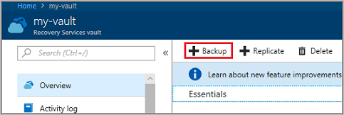

3. On the **Backup Goal** menu, set **Where is your workload running** to the default: **Azure**.

4. Expand the **What do you want to backup** drop-down list box and select **SQL Server in Azure VM**.

    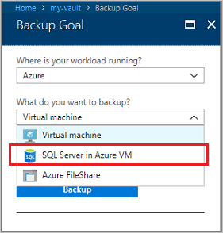

    The **Backup Goal** menu displays two steps: **Discover DBs in VMs** and **Configure Backup**. The **Discover DBs in VMs** step start a search for Azure virtual machines.

    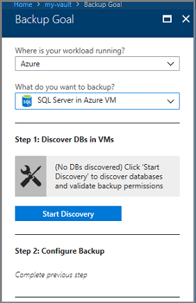

5. Under **Discover DBs in VMs**, select **Start Discovery** to search for unprotected virtual machines in the subscription. It can take a while to search all of the virtual machines. The search time depends on the number of unprotected virtual machines in the subscription.

    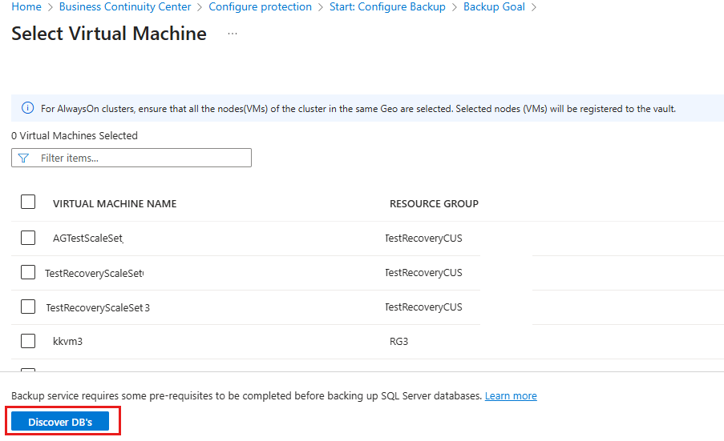
 
    After an unprotected virtual machine is discovered, it appears in the list. Unprotected virtual machines are listed by their virtual machine name and resource group. It's possible for multiple virtual machines to have the same name. However, virtual machines with the same name belong to different resource groups. If an expected virtual machine isn't listed, see if the virtual machine's already protected to a vault.

6. In the list of virtual machines, select the VM that has the SQL database to back up, and then select **Discover DBs**. 

    The discovery process installs the **AzureBackupWindowsWorkload** extension on the virtual machine. The extension allows the Azure Backup service to communicate with the virtual machine so it can back up the SQL databases. After the extension installs, Azure Backup creates the Windows virtual service account **NT Service\AzureWLBackupPluginSvc** on the virtual machine. The virtual service account requires SQL sysadmin permission. During the virtual service account installation process, if you receive the error `UserErrorSQLNoSysadminMembership`, see [Fix SQL sysadmin permissions](backup-azure-sql-database.md#fix-sql-sysadmin-permissions).

    The **Notifications** area shows the progress of the database discovery. It can take a while for the job to complete. The job time depends on how many databases are on the virtual machine. When the selected databases are discovered, a success message appears.

    

After you associate the database with the Recovery Services vault, the next step is to [configure the backup job](backup-azure-sql-database.md#configure-backup-for-sql-server-databases).

### Fix SQL sysadmin permissions

During the installation process, if you receive the error `UserErrorSQLNoSysadminMembership`, use an account with SQL Server sysadmin permissions to sign in to SQL Server Management Studio (SSMS). Unless you need special permissions, Windows authentication should work.

1. On the SQL Server, open the Security/Logins folder.

    

2. Right-click the Logins folder and select **New Login**. In the **Login - New** dialog box, select **Search**.

    

3. The Windows virtual service account **NT Service\AzureWLBackupPluginSvc** was created during the virtual machine registration and SQL discovery phase. Enter the account name as shown in the **Enter the object name to select** box. Select **Check Names** to resolve the name. 

    

4. Select **OK** to close the dialog box.

5. In the **Server Roles** box, make sure the **sysadmin** role is selected. Select **OK** to close the dialog box.

    

    The required permissions should now exist.

6. Although you fixed the permissions error, you need to associate the database with the Recovery Services vault. In the Azure portal, in the **Protected Servers** list, right-click the server that's in an error state and select **Rediscover DBs**.

    

    The **Notifications** area shows the progress of the database discovery. It can take a while for the job to complete. The job time depends on how many databases are on the virtual machine. When the selected databases are found, a success message appears.

    

After you associate the database with the Recovery Services vault, the next step is to [configure the backup job](backup-azure-sql-database.md#configure-backup-for-sql-server-databases).

[!INCLUDE [How to create a Recovery Services vault](../../includes/backup-create-rs-vault.md)]

## Discover SQL Server databases

Azure Backup discovers all databases on a SQL Server instance. You can protect the databases according to your backup requirements. Use the following procedure to identify the virtual machine that hosts the SQL databases. After you identify the virtual machine, Azure Backup installs a lightweight extension to discover the SQL Server databases.

1. Sign in to your subscription in the [Azure portal](https://portal.azure.com/).

2. On the left menu, select **All services**.

    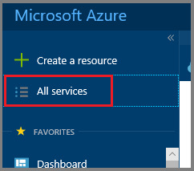 <br/>

3. In the **All services** dialog box, enter **Recovery Services**. As you type, your input filters the list of resources. Select **Recovery Services vaults** in the list.

    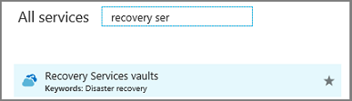 <br/>

    The list of Recovery Services vaults in the subscription appears. 

4. In the list of Recovery Services vaults, select the vault to use to protect your SQL databases.

5. On the **Recovery Services vault** dashboard, select **Backup**. The **Backup Goal** menu opens.

   

6. On the **Backup Goal** menu, set **Where is your workload running** to the default: **Azure**.

7. Expand the **What do you want to back up** drop-down list box and select **SQL Server in Azure VM**.

    

    The **Backup Goal** menu displays two steps: **Discover DBs in VMs** and **Configure Backup**.
    
    

8. Under **Discover DBs in VMs**, select **Start Discovery** to search for unprotected virtual machines in the subscription. It can take a while to search through all of the virtual machines. The search time depends on the number of unprotected virtual machines in the subscription.

    
 
    After an unprotected virtual machine is discovered, it appears in the list. Multiple virtual machines can have the same name. However, virtual machines with the same name belong to different resource groups. Unprotected virtual machines are listed by their virtual machine name and resource group. If an expected virtual machine isn't listed, see if that virtual machine's already protected to a vault.

9. In the list of virtual machines, select the VM that has the SQL database to back up, and then select **Discover DBs**.

    Azure Backup discovers all SQL databases on the virtual machine. For information about what happens during the database discovery phase, see [Background operations](backup-azure-sql-database.md#background-operations). After the SQL databases are discovered, you're ready to [configure the backup job](backup-azure-sql-database.md#configure-backup-for-sql-server-databases).

### Background operations

When you use the **Discover DBs** tool, Azure Backup executes the following operations in the background:

- Register the virtual machine with the Recovery Services vault for workload backup. All databases on the registered virtual machine can be backed up to this Recovery Services vault only. 

- Install the **AzureBackupWindowsWorkload** extension on the virtual machine. Back up of a SQL database is an agentless solution. The extension is installed on the virtual machine and no agent's installed on the SQL database.

- Create the service account **NT Service\AzureWLBackupPluginSvc** on the virtual machine. All backup and restore operations use the service account. **NT Service\AzureWLBackupPluginSvc** needs SQL sysadmin permissions. All SQL Marketplace virtual machines come with the **SqlIaaSExtension** installed. The **AzureBackupWindowsWorkload** extension uses the **SQLIaaSExtension** to automatically get the required permissions. If your virtual machine doesn't have the **SqlIaaSExtension** installed, the Discover DB operation fails with the error message `UserErrorSQLNoSysAdminMembership`. To add the sysadmin permission for backup, follow the instructions in [Set up Azure Backup permissions for non-Marketplace SQL VMs](backup-azure-sql-database.md#set-permissions-for-non-marketplace-sql-vms).

    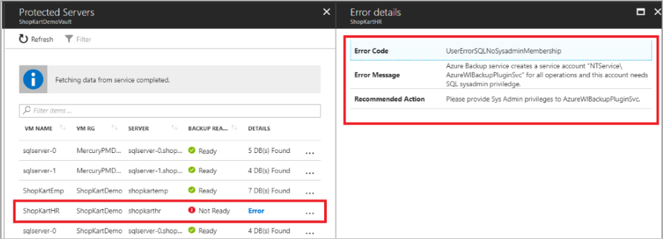

## Configure backup for SQL Server databases

Azure Backup provides management services to protect your SQL Server databases and manage backup jobs. The management and monitoring functions depend on your Recovery Services vault. 

> [!NOTE]
> You can have only one backup solution at a time to back up SQL Server databases. Disable all other SQL backups before you use this feature; otherwise, the backups will interfere and fail. You can enable Azure Backup for IaaS VM along with SQL backup without any conflict.
>

To configure protection for a SQL database:

1. Open the Recovery Services vault that's registered with the SQL virtual machine.

2. On the **Recovery Services vault** dashboard, select **Backup**. The **Backup Goal** menu opens.

   

3. On the **Backup Goal** menu, set **Where is your workload running** to the default: **Azure**.

4. Expand the **What do you want to back up** drop-down list box and select **SQL Server in Azure VM**.

    

    The **Backup Goal** menu displays two steps: **Discover DBs in VMs** and **Configure Backup**.
    
    If you completed the steps in this article in order, you've discovered the unprotected virtual machines and this vault is registered with a virtual machine. Now you're ready to configure protection for the SQL databases.
    
5. On the **Backup Goal** menu, select **Configure Backup**.

    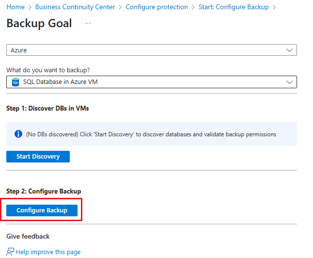

    The Azure Backup service displays all SQL Server instances with standalone databases and SQL Server Always On availability groups. To view the standalone databases in the SQL Server instance, select the chevron to the left of the instance name. The following images show examples of a standalone instance and an Always On availability group.

    > [!NOTE]
    > For a SQL Server Always On availability group, the SQL backup preference is honored. But, due to a SQL platform limitation, full and differential backups need to happen from the primary node. Log back up happens according to your backup preference. Due to this limitation, the primary node must always be registered for availability groups.
    >

    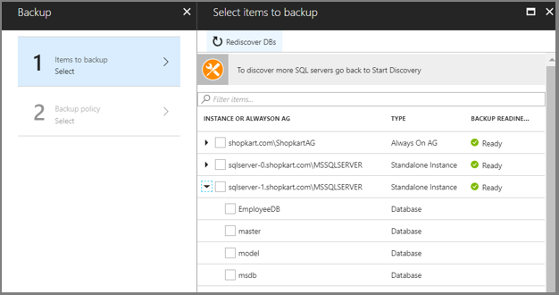

    Select the chevron to the left of the Always On availability group to view the list of databases.

    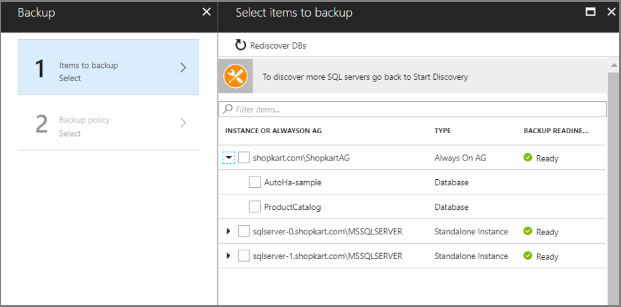

6. In the list of databases, select all of the databases to protect, and then select **OK**.

    

    Select up to 50 databases at a time. To protect more than 50 databases, make several passes. After you protect the first 50 databases, repeat this step to protect the next set of databases.

    > [!Note] 
    > To optimize backup loads, Azure Backup breaks large backup jobs into multiple batches. The maximum number of databases in one backup job is 50.
    >
    >

7. To create or choose a backup policy, on the **Backup** menu, select **Backup policy**. The **Backup policy** menu opens.

    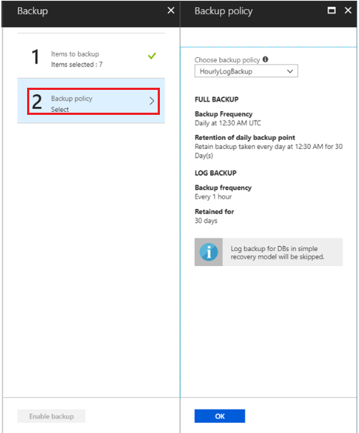

8. In the **Choose backup policy** drop-down list box, choose a backup policy, and then select **OK**. For information on how to create a backup policy, see [Define a backup policy](backup-azure-sql-database.md#define-a-backup-policy).

   > [!NOTE]
   > During Preview, you can't edit Backup policies. If you want a different policy than what's available in the list, you must create that policy. For information on creating a new backup policy, see the section, [Define a backup policy](backup-azure-sql-database.md#define-a-backup-policy).

    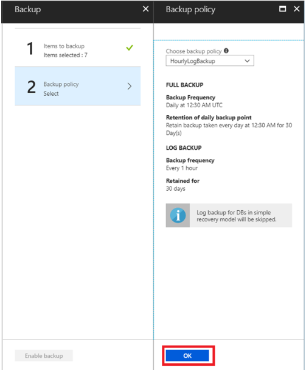

    On the **Backup policy** menu, in the **Choose backup policy** drop-down list box, you can: 
    - Select the default policy: **HourlyLogBackup**.
    - Choose an existing backup policy previously created for SQL.
    - [Define a new policy](backup-azure-sql-database.md#define-a-backup-policy) based on your RPO and retention range. 

    > [!Note]
    > Azure Backup supports long-term retention that's based on the grandfather-father-son backup scheme. The scheme optimizes back-end storage consumption while meeting compliance needs.
    >

9. After you choose a backup policy, on the **Backup menu**, select **Enable backup**.

    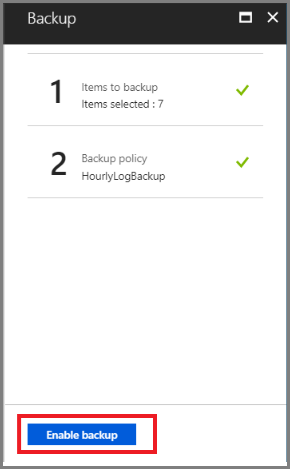

    Track the configuration progress in the **Notifications** area of the portal.

    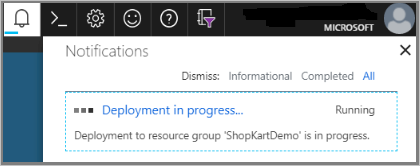


### Define a backup policy

A backup policy defines a matrix of when backups are taken and how long they're retained. Use Azure Backup to schedule three types of backup for SQL databases:

* Full backup: A full database backup backs up the entire database. A full backup contains all of the data in a specific database, or a set of filegroups or files, and enough logs to recover that data. At most, you can trigger one full backup per day. You can choose to take a full backup on a daily or weekly interval. 
* Differential backup: A differential backup is based on the most recent, previous full data backup. A differential backup captures only the data that's changed since the full backup. At most, you can trigger one differential backup per day. You can't configure a full backup and a differential backup on the same day.
* Transaction log backup: A log backup enables point-in-time restoration up to a specific second. At most, you can configure transactional log backups every 15 minutes.

The policy's created at the Recovery Services vault level. Multiple vaults can use the same backup policy, but you must apply the backup policy to each vault. When you create a backup policy, the daily full backup is the default. You can add a differential backup, but only if you configure full backups to occur weekly. The following procedure explains how to create a backup policy for a SQL Server instance in an Azure virtual machine. 

> [!NOTE]
> In Preview, you can't edit a Backup policy. Instead, you must create a new policy with the desired details.  
 
To create a backup policy:

1. In the Recovery Services vault that protects the SQL database, click **Backup policies**, and then click **Add**. 

   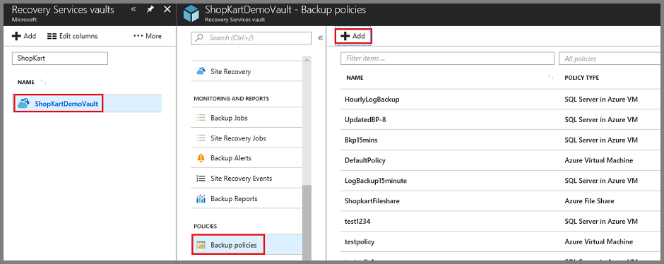

   The **Add** menu appears.

2. In the **Add** menu, click **SQL Server in Azure VM**.

   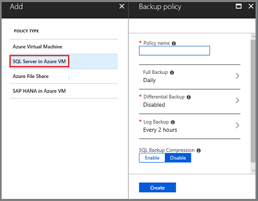

   Selecting SQL Server in Azure VM defines the policy type, and opens the Backup policy menu. The **Backup policy** menu shows the fields that are necessary for a new SQL Server backup policy.

3. In **Policy name**, enter a name for the new policy.

4. A Full backup is mandatory; you can't turn off the **Full Backup** option. Click **Full Backup** to view and edit the policy. Even if you don't change the Backup policy, you should view the policy details.

    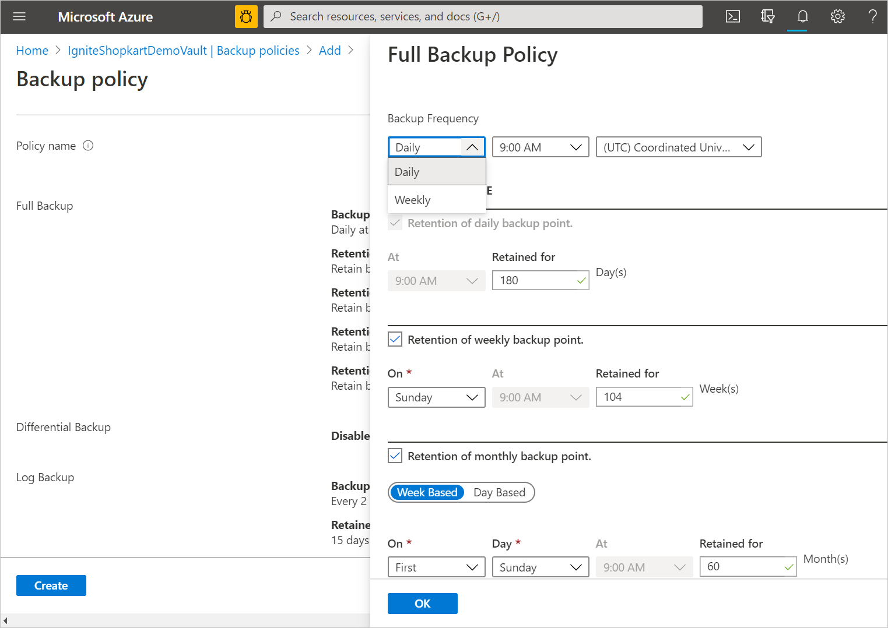

    In the **Full Backup policy** menu, for **Backup Frequency**, choose **Daily** or **Weekly**. For **Daily**, select the hour and time zone when the backup job begins. You can't create differential backups for daily full backups.

   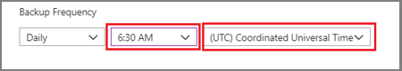

    For **Weekly**, select the day of the week, hour, and time zone when the backup job begins.

   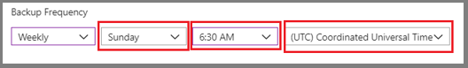

5. By default, all **Retention Range** options are selected: daily, weekly, monthly, and yearly. Deselect any undesired retention range limits. Set the intervals to use. In the **Full Backup policy** menu, select **OK** to accept the settings.

   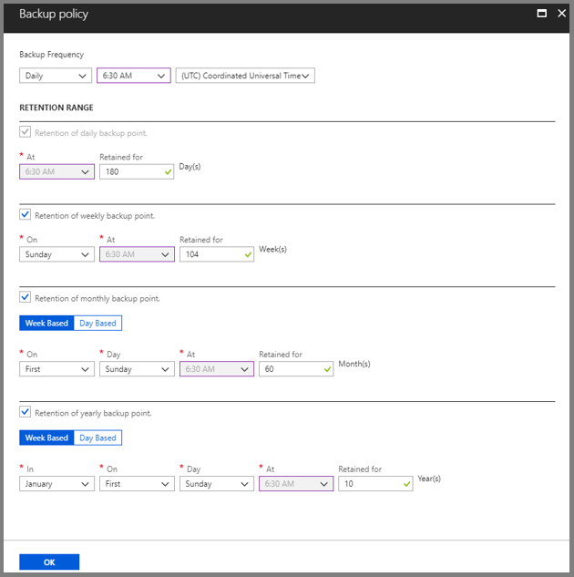

    Recovery points are tagged for retention based on their retention range. For example, if you select a daily full backup, only one full backup is triggered each day. The backup for a specific day is tagged and retained based on the weekly retention range and your weekly retention setting. The monthly and yearly retention ranges behave in a similar way.

6. To add a differential backup policy, select **Differential Backup**. The **Differential Backup policy** menu opens. 

   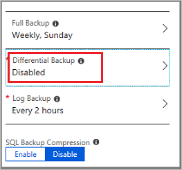

    On the **Differential Backup policy** menu, select **Enable** to open the frequency and retention controls. At most, you can trigger one differential backup per day.
    
    > [!Important] 
    > Differential backups can be retained for a maximum of 180 days. If you need longer retention, you must use full backups.
    >

   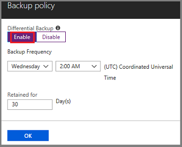

    Select **OK** to save the policy and return to the main **Backup policy** menu.

7. To add a transactional log backup policy, select **Log Backup**. The **Log Backup** menu opens.

    In the **Log Backup** menu, select **Enable**, and then set the frequency and retention controls. Log backups can occur as often as every 15 minutes, and can be retained for up to 35 days. Select **OK** to save the policy and return to the main **Backup policy** menu.

   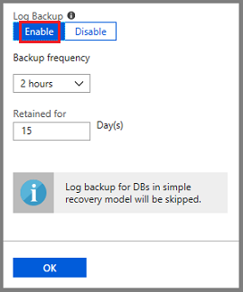

8. On the **Backup policy** menu, choose whether to enable **SQL Backup Compression**. Compression is disabled by default.

    On the back end, Azure Backup uses SQL native backup compression.

9. After you complete the edits to the backup policy, select **OK**. 

   

## Restore a SQL database
Azure Backup provides functionality to restore individual databases to a specific date or time (to the second) by using transaction log backups. Azure Backup automatically determines the appropriate full differential and the chain of log backups that are required to restore your data based on your restore times.

You can also select a specific full or differential backup to restore to a specific recovery point, rather than a specific time.

### Pre-requisite before triggering a restore

1. You can restore the database to an instance of a SQL Server in the same Azure region. The destination server must be registered to the same Recovery Services vault as the source.  
2. To restore a TDE encrypted database to another SQL Server, please first restore the certificate to the destination server by following steps documented [here](https://docs.microsoft.com/sql/relational-databases/security/encryption/move-a-tde-protected-database-to-another-sql-server?view=sql-server-2017).
3. Before you trigger a restore of the "master" database, start the SQL Server instance in single-user mode with startup option `-m AzureWorkloadBackup`. The argument to the `-m` option is the name of the client. Only this client is allowed to open the connection. For all system databases (model, master, msdb), stop the SQL Agent service before you trigger the restore. Close any applications that might try to steal a connection to any of these databases.

### Steps to restore a database:

1. Open the Recovery Services vault that's registered with the SQL virtual machine.

2. On the **Recovery Services vault** dashboard, under **Usage**, select **Backup Items** to open the **Backup Items** menu.

    .

3. On the **Backup Items** menu, under **Backup Management Type**, select **SQL in Azure VM**. 

    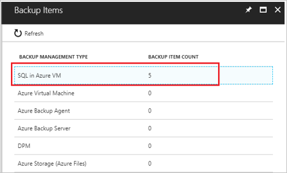

    The **Backup Items** menu shows the list of SQL databases. 

4. In the list of SQL databases, select the database to restore.

    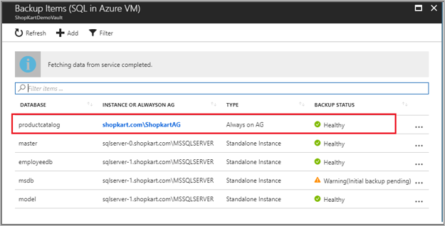

    When you select the database, its menu opens. The menu provides the backup details for the database, including:

    * The oldest and latest restore points.
    * Log backup status for the last 24 hours (for databases in full and bulk-logged recovery model, if configured for transactional log backups).

5. On the menu for the selected database, select **Restore DB**. The **Restore** menu opens.

    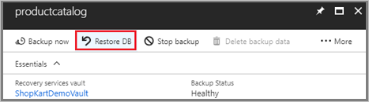

    When the **Restore** menu opens, the **Restore Configuration** menu also opens. The **Restore Configuration** menu is the first step to configure the restoration. Use this menu to select where to restore the data. The options are:
    - **Alternate Location**: Restore the database to an alternate location and retain the original source database.
    - **Overwrite DB**: Restore the data to the same SQL Server instance as the original source. The effect of this option is to overwrite the original database.

    > [!Important]
    > If the selected database belongs to an Always On availability group, SQL Server doesn't allow the database to be overwritten. In this case, only the **Alternate Location** option is enabled.
    >

    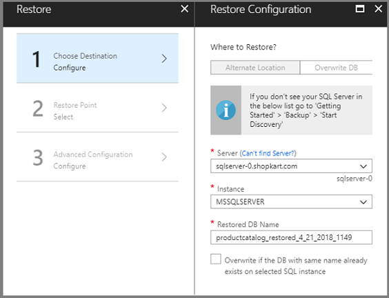

### Restore to an alternate location

This procedure walks you through restoring data to an alternate location. To overwrite the database during the restore, continue to [Restore and overwrite the database](backup-azure-sql-database.md#restore-and-overwrite-the-database). At this stage, your Recovery Services vault is open and the **Restore Configuration** menu is visible. If you're not at this stage, start by [restoring a SQL database](backup-azure-sql-database.md#restore-a-sql-database).

> [!NOTE]
> You can restore the database to an instance of a SQL Server in the same Azure region. The destination server needs to be registered to the Recovery Services vault. 
>

On the **Restore Configuration** menu, the **Server** drop-down list box shows only the SQL Server instances that are registered with the Recovery Services vault. If the server that you want isn't in the list, see [Discover SQL Server databases](backup-azure-sql-database.md#discover-sql-server-databases) to find the server. During the discovery process, new servers are registered to the Recovery Services vault.

1. In the **Restore Configuration** menu:

    * Under **Where to Restore**, select **Alternate Location**.
    * Open the **Server** drop-down list box and choose the SQL Server instance to restore the database.
    * Open the **Instance** drop-down list box and choose a SQL Server instance.
    * In the **Restored DB Name** box, enter the name of the target database.
    * As applicable, select **Overwrite if the DB with the same name already exists on selected SQL instance**.
    * Select **OK** to complete the configuration of the destination and continue to choose a restore point.

    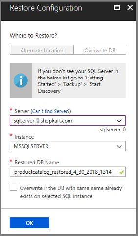

2. On the **Select restore point** menu, choose **Logs (Point in Time)** or **Full & Differential** as the restore point. To restore to a specific point-in-time log, continue with this step. To restore a full and differential restore point, continue to step 3.

    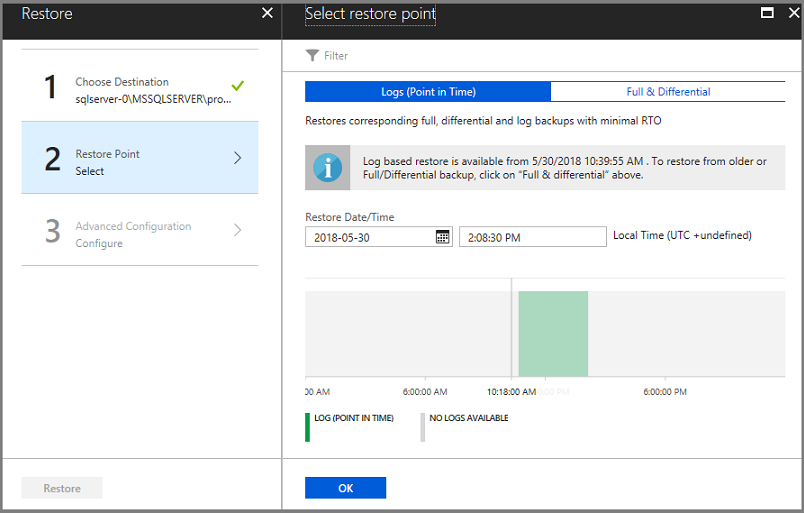

    The point-in-time restore is available only for log backups for databases with a full and bulk-logged recovery model. To restore to a specific point in time:

    1. Select **Logs (Point in Time)** as the restore type.

        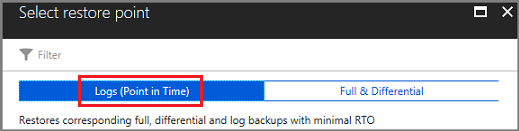

    2. Under **Restore Date/Time**, select the mini calendar to open the **Calendar**. On the **Calendar**, the bold dates have recovery points and the current date is highlighted. Select a date with recovery points. Dates without recovery points can't be selected.

        

        After you select a date, the timeline graph displays the available recovery points in a continuous range.

    3. Use the timeline graph or the **Time** dialog box to specify a specific time for the recovery point. Select **OK** to complete the restore point step.
    
       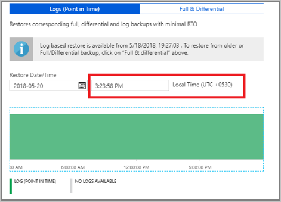

        The **Select restore point** menu closes, and the **Advanced Configuration** menu opens.

       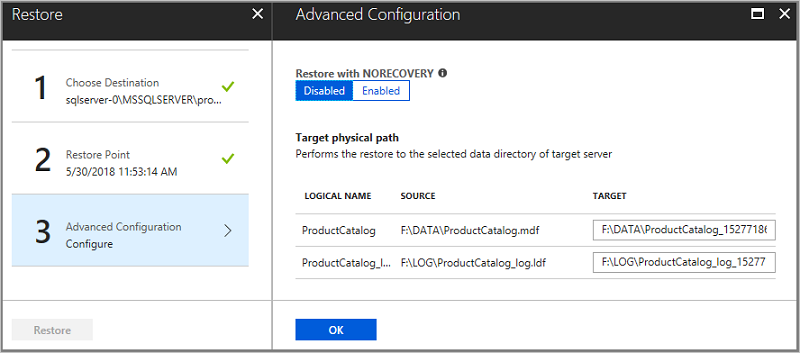

    4. On the **Advanced Configuration** menu:

        * To keep the database non-operational after the restore, set **Restore with NORECOVERY** to **Enabled**.
        * To change the restore location on the destination server, enter a new path in the **Target** column.
        * Select **OK** to approve the settings. Close the **Advanced Configuration** menu.

    5. On the **Restore** menu, select **Restore** to start the restore job. Track the progress of the restore in the **Notifications** area or select **Restore jobs** on the database menu.

       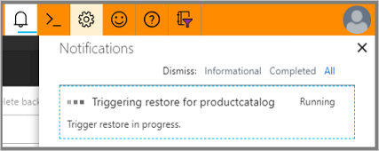

3. On the **Select restore point** menu, choose **Logs (Point in Time)** or **Full & Differential** as the restore point. To restore a point-in-time log, go back to step 2. This step restores a specific full or differential restore point. You can see all of the full and differential recovery points for the last 30 days. To see recovery points older than 30 days, select **Filter** to open the **Filter restore points** menu. For a differential recovery point, Azure Backup first restores the appropriate full recovery point, and then applies the selected differential recovery point.

    

    1. In the **Select restore point** menu, select **Full & Differential**.

       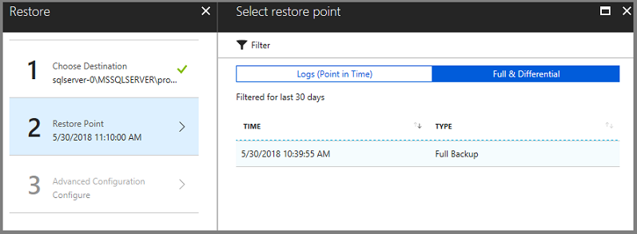

        The menu shows the list of available recovery points.

    2. Select a recovery point from the list, and select **OK** to complete the restore point procedure. 

        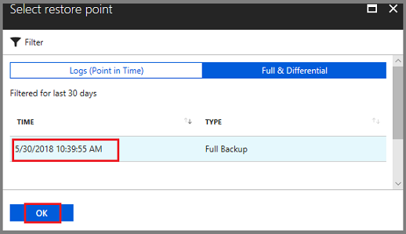

        The **Restore Point** menu closes, and the **Advanced Configuration** menu opens.

        

    3. On the **Advanced Configuration** menu:

        * To keep the database non-operational after the restore, set **Restore with NORECOVERY** to **Enabled**. **Restore with NORECOVERY** is disabled by default.
        * To change the restore location on the destination server, enter a new path in the **Target** column.
        * Select **OK** to approve the settings. Close the **Advanced Configuration** menu.

    4. On the **Restore** menu, select **Restore** to start the restore job. Track the progress of the restore in the **Notifications** area or select **Restore jobs** on the database menu.

       

### Restore and overwrite the database

This procedure walks you through restoring data and overwriting a database. To restore to an alternate location, continue to [Restore to an alternate location](backup-azure-sql-database.md#restore-to-an-alternate-location). At this stage, your Recovery Services vault is open and the **Restore Configuration** menu is visible (see the following image). If you're not at this stage, start by [restoring a SQL database](backup-azure-sql-database.md#restore-a-sql-database).

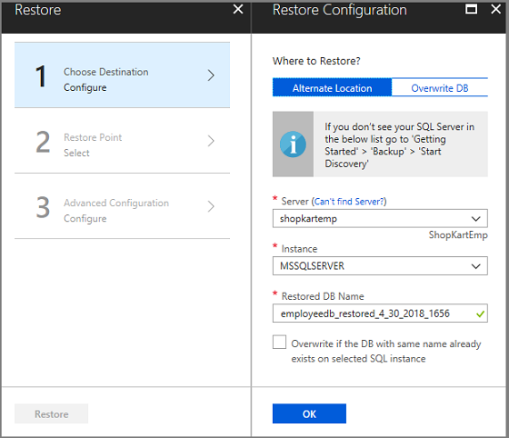

On the **Restore Configuration** menu, the **Server** drop-down list box shows only the SQL Server instances that are registered with the Recovery Services vault. If the server that you want isn't in the list, see [Discover SQL Server databases](backup-azure-sql-database.md#discover-sql-server-databases) to find the server. During the discovery process, new servers are registered to the Recovery Services vault.

1. In the **Restore Configuration** menu, select **Overwrite DB**, and then select **OK** to complete the configuration of the destination. 

   

    The **Server**, **Instance**, and **Restored DB Name** settings aren't necessary.

2. On the **Select restore point** menu, choose **Logs (Point in Time)** or **Full & Differential** as the restore point. To restore to a specific point-in-time log, continue with this step. To restore a full and differential restore point, continue to step 3.

    

    The point-in-time restore is available only for log backups for databases with a full and bulk-logged recovery model. To restore to a specific second:

    1. Select **Logs (Point in Time)** as the restore point.

        

    2. Under **Restore Date/Time**, select the mini calendar to open the **Calendar**. On the **Calendar**, the bold dates have recovery points and the current date is highlighted. Select a date with recovery points. Dates without recovery points can't be selected.

        

        After you select a date, the timeline graph displays the available recovery points.

    3. Use the timeline graph or the **Time** dialog box to specify a specific time for the recovery point. Select **OK** to complete the restore point step.
    
       

        The **Select restore point** menu closes, and the **Advanced Configuration** menu opens.

       

    4. On the **Advanced Configuration** menu:

        * To keep the database non-operational after the restore, set **Restore with NORECOVERY** to **Enabled**.
        * To change the restore location on the destination server, enter a new path in the **Target** column.
        * Select **OK** to approve the settings. Close the **Advanced Configuration** menu.

    5. On the **Restore** menu, select **Restore** to start the restore job. Track the progress of the restore in the **Notifications** area or select **Restore jobs** on the database menu.

       

3. On the **Select restore point** menu, choose **Logs (Point in Time)** or **Full & Differential** as the restore point. To restore a point-in-time log, go back to step 2. This step restores a specific full or differential restore point. You can see all of the full and differential recovery points for the last 30 days. To see recovery points older than 30 days, select **Filter** to open the **Filter restore points** menu. For a differential recovery point, Azure Backup first restores the appropriate full recovery point, and then applies the selected differential recovery point.

    

    1. In the **Select restore point** menu, select **Full & Differential**.

       

        The menu shows the list of available recovery points.

    2. Select a recovery point from the list, and select **OK** to complete the restore point procedure. 

        

        The **Restore Point** menu closes, and the **Advanced Configuration** menu opens.

        

    3. On the **Advanced Configuration** menu:

        * To keep the database non-operational after the restore, set **Restore with NORECOVERY** to **Enabled**. **Restore with NORECOVERY** is disabled by default.
        * To change the restore location on the destination server, enter a new path in the **Target** column.
        * Select **OK** to approve the settings. Close the **Advanced Configuration** menu.

    4. On the **Restore** menu, select **Restore** to start the restore job. Track the progress of the restore in the **Notifications** area or by selecting **Restore jobs** on the database menu.

       

## Manage Azure Backup operations for SQL on Azure VMs

This section provides information about the various Azure Backup management operations that are available for SQL on Azure virtual machines. The following high-level operations exist:

* Monitor jobs
* Backup alerts
* Stop protection on a SQL database
* Resume protection for a SQL database
* Trigger an adhoc backup job
* Unregister a server that's running SQL Server

### Monitor backup jobs
Azure Backup is an enterprise class solution that provides advanced backup alerts and notifications for any failures. (See [View backup alerts](backup-azure-sql-database.md#view-backup-alerts).) To monitor specific jobs, use any of the following options according to your requirements.

#### Use the Azure portal for adhoc operations
Azure Backup shows all manually triggered, or adhoc, jobs in the **Backup jobs** portal. The jobs that are available in the **Backup jobs** portal include:
- All configure backup operations.
- Manually triggered backup operations.
- Restore operations.
- Registration and discover database operations.
- Stop backup operations. 

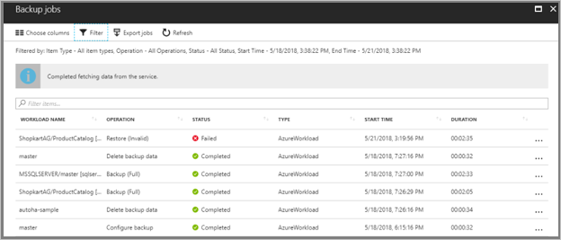

> [!NOTE]
> All scheduled backup jobs, including full, differential, and log backup, aren't shown in the **Backup jobs** portal. Use SQL Server Management Studio to monitor scheduled backup jobs, as described in the next section.
>

#### Use SQL Server Management Studio for backup jobs
Azure Backup uses SQL native APIs for all backup operations. Use the native APIs to fetch all job information from the [SQL backupset table](https://docs.microsoft.com/sql/relational-databases/system-tables/backupset-transact-sql?view=sql-server-2017) in the msdb database.

The following example is a query that fetches all backup jobs for a database named **DB1**. Customize the query for advanced monitoring.

```
select CAST (
Case type
                when 'D' 
                                 then 'Full'
                when  'I'
                               then 'Differential' 
                ELSE 'Log'
                END         
                AS varchar ) AS 'BackupType',
database_name, 
server_name,
machine_name,
backup_start_date,
backup_finish_date,
DATEDIFF(SECOND, backup_start_date, backup_finish_date) AS TimeTakenByBackupInSeconds,
backup_size AS BackupSizeInBytes
  from msdb.dbo.backupset where user_name = 'NT SERVICE\AzureWLBackupPluginSvc' AND database_name =  <DB1>  
 
```

### View backup alerts

Because log backups occur every 15 minutes, occasionally, monitoring backup jobs can be tedious. Azure Backup provides help in this situation. Email alerts are triggered for all backup failures. Alerts are consolidated at the database level by error code. An email alert is sent only for the first backup failure for a database. Sign in to the Azure portal to monitor all failures for a database. 

To monitor backup alerts:

1. Sign in to your Azure subscription in the [Azure portal](https://portal.azure.com).

2. Open the Recovery Services vault that's registered with the SQL virtual machine.

3. On the **Recovery Services vault** dashboard, select **Alerts and Events**. 

   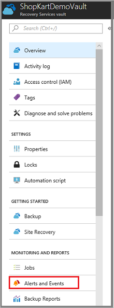

4. On the **Alerts and Events** menu, select **Backup Alerts** to view the list of alerts.

   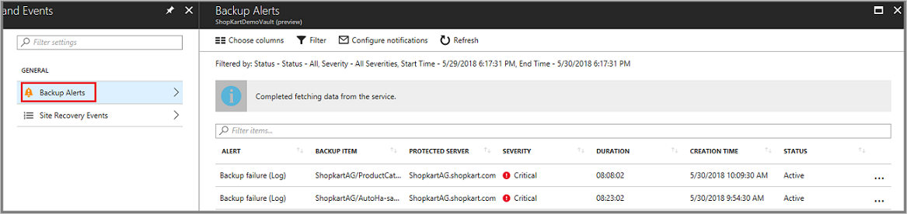

### Stop protection for a SQL Server database

When you stop protection for a SQL Server database, Azure Backup requests whether to retain the recovery points. There are two ways to stop protection for a SQL database:

* Stop all future backup jobs and delete all recovery points.
* Stop all future backup jobs, but leave the recovery points.

There's a cost to leave the recovery points. The recovery points for SQL incur the SQL protected instance pricing charge, plus the storage consumed. For more information about Azure Backup pricing for SQL, see the [Azure Backup pricing page](https://azure.microsoft.com/pricing/details/backup/). 

To stop protection for a database:

1. Open the Recovery Services vault that's registered with the SQL virtual machine.

2. On the **Recovery Services vault** dashboard, under **Usage**, select **Backup Items** to open the **Backup Items** menu.

    .

3. On the **Backup Items** menu, under **Backup Management Type**, select **SQL in Azure VM**. 

    

    The **Backup Items** menu shows the list of SQL databases. 

4. In the list of SQL databases, select the database to stop protection.

    

    When you select the database, its menu opens.

5. On the menu for the selected database, select **Stop backup**. 

    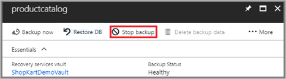

    The **Stop Backup** menu opens.

6. On the **Stop Backup** menu, choose to **Retain Backup Data** or **Delete Backup Data**. As an option, provide a reason for stopping the protection and a comment.

    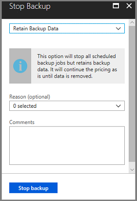

7. Select **Stop backup** to stop protection on the database. 

### Resume protection for a SQL database

If the **Retain Backup Data** option was selected when protection for the SQL database was stopped, you can resume protection. If the backup data wasn't retained, protection can't resume. 

1. To resume protection for the SQL database, open the backup item and select **Resume backup**.

    

   The **Backup policy** menu opens.

2. On the **Backup policy** menu, select a policy, and then select **Save**.

### Trigger an adhoc backup

Trigger adhoc backups as needed. There are four types of adhoc backups:

* Full backup
* Copy-only full backup
* Differential backup
* Log backup

For details on each type, see [Types of SQL backups](https://docs.microsoft.com/sql/relational-databases/backup-restore/backup-overview-sql-server?view=sql-server-2017#types-of-backups).

### Unregister a SQL Server instance

To unregister a SQL Server instance after you remove protection, but before you delete the vault:

1. Open the Recovery Services vault that's registered with the SQL virtual machine.

2. On the **Recovery Services vault** dashboard, under  **Manage**, select **Backup Infrastructure**.  

   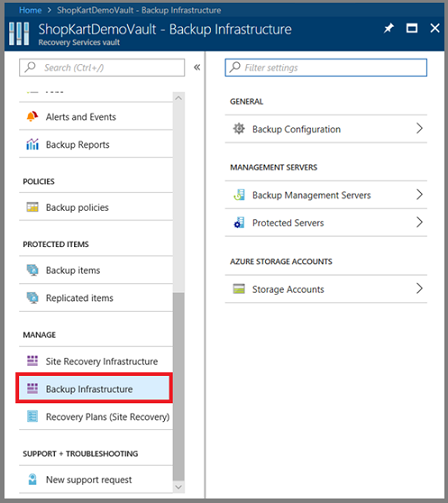

3. Under **Management Servers**, select **Protected Servers**.

   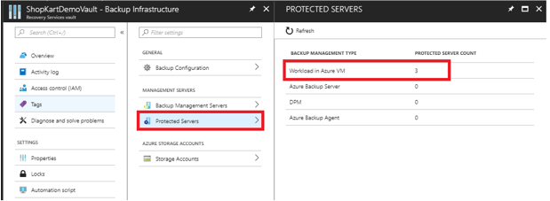

    The **Protected Servers** menu opens. 

4. On the **Protected Servers** menu, select the server to unregister. To delete the vault, you must unregister all servers.

5. On the **Protected Servers** menu, right-click the protected server, and select **Delete**. 

   

## FAQ

The following section provides additional information about SQL database backup.

### Can I throttle the speed of the SQL Server backup policy?

Yes. You can throttle the rate at which the backup policy executes to minimize the impact on a SQL Server instance.

To change the setting:

1. On the SQL Server instance, in the C:\Program Files\Azure Workload Backup\bin folder, open the **TaskThrottlerSettings.json** file.

2. In the TaskThrottlerSettings.json file, change the **DefaultBackupTasksThreshold** setting to a lower value (for example, 5).

3. Save your changes. Close the file.

4. On the SQL Server instance, open **Task Manager**. Restart the **Azure Backup Workload Coordinator Service**.

### Can I run a full backup from a secondary replica?

No. This feature isn't supported.

### Do successful backup jobs create alerts?

No. Successful backup jobs don't generate alerts. Alerts are sent only for backup jobs that fail.

### Can I see details for scheduled backup jobs in the Jobs menu?

No. The **Backup Jobs** menu shows adhoc job details, but not scheduled backup jobs. If any scheduled backup jobs fail, the details are available in the failed job alerts. To monitor all scheduled and adhoc backup jobs, use [SQL Server Management Studio](backup-azure-sql-database.md#use-sql-server-management-studio-for-backup-jobs).

### When I select a SQL Server instance are future databases automatically added?

No. When you configure protection for a SQL Server instance, if you select the server level option, all databases are added. If you add databases to a SQL Server instance after you configure protection, you must manually add the new databases to protect them. The databases aren't automatically included in the configured protection.

### If I change the recovery model, how do I restart protection?

Trigger a full backup. Log backups begin as expected.

### Can I protect SQL Always On Availability Groups where the primary replica is on premises

No. Azure Backup protects SQL Servers running in Azure. If an Availability Group (AG) is spread between Azure and on-premises machines, the AG can be protected only if the primary replica is running in Azure. Additionally, Azure Backup only protects the nodes running in the same Azure region as the Recovery Services vault.

### Can I protect SQL Always On Availability Groups which are spread across Azure regions
Azure Backup Recovery Services Vault can detect and protect all nodes which are in the same region as the Recovery Services Vault. If you have a SQL Always On Availability group spanning multiple Azure regions, you need to configure backup from the region which has the primary node. Azure Backup will be able to detect and protect all databases in the availability group as per backup preference. If the backup preference is not met, backups will fail and you will get the failure alert.


## Next steps

To learn more about Azure Backup, see the Azure PowerShell sample to back up encrypted virtual machines.

> [!div class="nextstepaction"]
> [Back up an encrypted VM](./scripts/backup-powershell-sample-backup-encrypted-vm.md)
