# About SQL Server Backup in Azure VMs

[Azure Backup](backup-overview.md) offers a stream-based, specialized solution to back up SQL Server running in Azure VMs. This solution aligns with Azure Backup's benefits of zero-infrastructure backup, long-term retention, and central management. It additionally provides the following advantages specifically for SQL Server:

1. Workload aware backups that support all backup types - full, differential, and log
2. 15 minute RPO (recovery point objective) with frequent log backups
3. Point-in-time recovery up to a second
4. Individual database level back up and restore

>[!Note]
>Snapshot-based backup for SQL databases in Azure VM is now in preview. This unique offering combines the goodness of snapshots, leading to a better RTO and low impact on the server along with the benefits of frequent log backups for low RPO. For any queries/access, write to us at  [AskAzureBackupTeam@microsoft.com](mailto:AskAzureBackupTeam@microsoft.com).

To view the backup and restore scenarios that we support today, see the [support matrix](sql-support-matrix.md#scenario-support).

## Backup process

This solution leverages the SQL native APIs to take backups of your SQL databases.

* Once you specify the SQL Server VM that you want to protect and query for the databases in it, Azure Backup service will install a workload backup extension on the VM by the name `AzureBackupWindowsWorkload` extension.
* This extension consists of a coordinator and a SQL plugin. While the coordinator is responsible for triggering workflows for various operations like configure backup, backup and restore, the plugin is responsible for actual data flow.
* To be able to discover databases on this VM, Azure Backup creates the account `NT SERVICE\AzureWLBackupPluginSvc`. This account is used for backup and restore and requires SQL sysadmin permissions. The `NT SERVICE\AzureWLBackupPluginSvc` account is a [Virtual Service Account](/windows/security/identity-protection/access-control/service-accounts#virtual-accounts), and so doesn't require any password management. Azure Backup uses the `NT AUTHORITY\SYSTEM` account for database discovery/inquiry, so this account needs to be a public login on SQL. If you didn't create the SQL Server VM from Azure Marketplace, you might receive an error **UserErrorSQLNoSysadminMembership**. If this occurs [follow these instructions](#set-vm-permissions).
* Once you trigger configure protection on the selected databases, the backup service sets up the coordinator with the backup schedules and other policy details, which the extension caches locally on the VM.
* At the scheduled time, the coordinator communicates with the plugin and it starts streaming the backup data from the SQL server using VDI.  
* The plugin sends the data directly to the Recovery Services vault, thus eliminating the need for a staging location. The data is encrypted and stored by the Azure Backup service in storage accounts.
* When the data transfer is complete, coordinator confirms the commit with the backup service.

  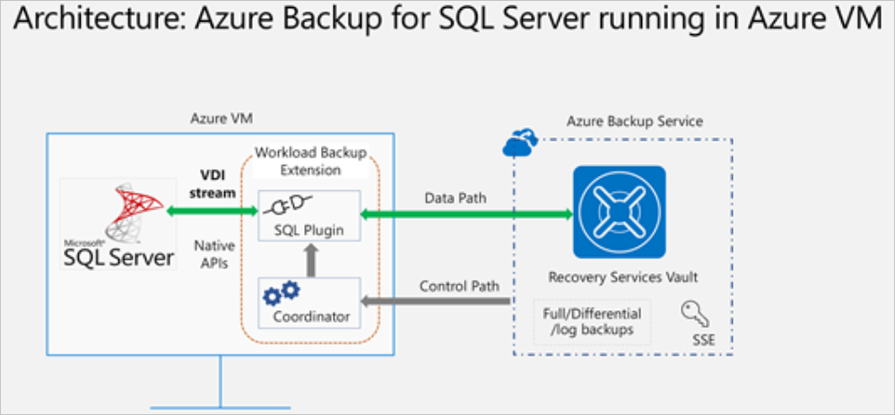

## Before you start

Before you start, verify the following requirements:

1. Make sure you have a SQL Server instance running in Azure. You can [quickly create a SQL Server instance](/azure/azure-sql/virtual-machines/windows/sql-vm-create-portal-quickstart) in the marketplace.
2. Review the [feature considerations](sql-support-matrix.md#feature-considerations-and-limitations) and [scenario support](sql-support-matrix.md#scenario-support).
3. [Review common questions](faq-backup-sql-server.yml) about this scenario.

## Set VM permissions

  When you run discovery on a SQL Server, Azure Backup does the following:

* Adds the AzureBackupWindowsWorkload extension.
* Creates an NT SERVICE\AzureWLBackupPluginSvc account to discover databases on the virtual machine. This account is used for a backup and restore and requires SQL sysadmin permissions.
* Discovers databases that are running on a VM, Azure Backup uses the NT AUTHORITY\SYSTEM account. This account must be a public sign-in on SQL.

If you didn't create the SQL Server VM in Azure Marketplace or if you're on SQL 2008 or 2008 R2, you might receive a **UserErrorSQLNoSysadminMembership** error.

For giving permissions in the case of **SQL 2008** and **2008 R2** running on Windows 2008 R2, refer to [here](#give-sql-sysadmin-permissions-for-sql-2008-and-sql-2008-r2).

For all other versions, fix permissions with the following steps:

  1. Use an account with SQL Server sysadmin permissions to sign in to SQL Server Management Studio (SSMS). Unless you need special permissions, Windows authentication should work.
  2. On the SQL Server, open the **Security/Logins** folder.

      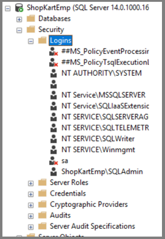

  3. Right-click the **Logins** folder and select **New Login**. In **Login - New**, select **Search**.

      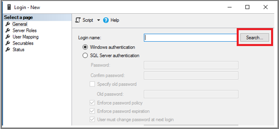

  4. The Windows virtual service account **NT SERVICE\AzureWLBackupPluginSvc** was created during the virtual machine registration and SQL discovery phase. Enter the account name as shown in **Enter the object name to select**. Select **Check Names** to resolve the name. Select **OK**.

      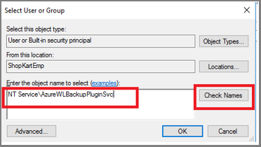

  5. In **Server Roles**, make sure the **sysadmin** role is selected. Select **OK**. The required permissions should now exist.

      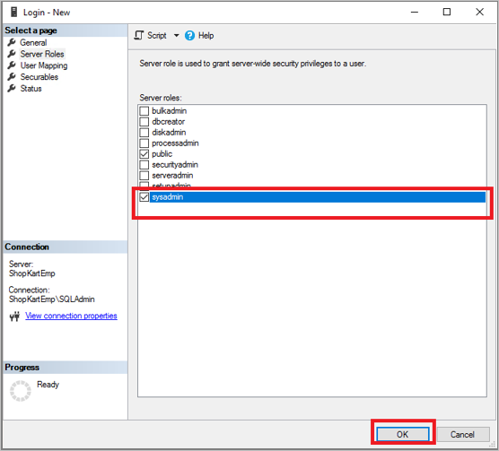

  6. Now associate the database with the Recovery Services vault. In the Azure portal, in the **Protected Servers** list, right-click the server that's in an error state > **Rediscover DBs**.

      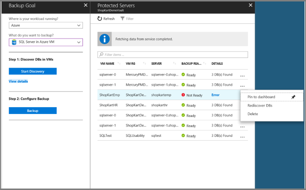

  7. Check progress in the **Notifications** area. When the selected databases are found, a success message appears.

      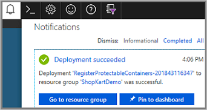

> [!NOTE]
> If your SQL Server has multiple instances of SQL Server installed, then you must add sysadmin permission for **NT Service\AzureWLBackupPluginSvc** account to all SQL instances.

### Give SQL sysadmin permissions for SQL 2008 and SQL 2008 R2

Add **NT AUTHORITY\SYSTEM** and **NT Service\AzureWLBackupPluginSvc** logins to the SQL Server Instance:

1. Go the SQL Server Instance in the Object explorer.
2. Navigate to Security -> Logins
3. Right-click the logins and select *New Login…*

    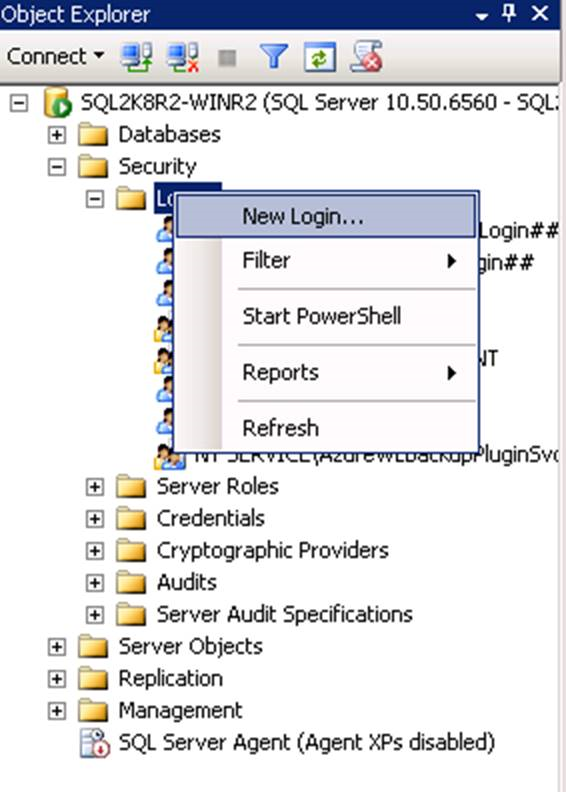

4. Go to the General tab and enter **NT AUTHORITY\SYSTEM** as the Login Name.

    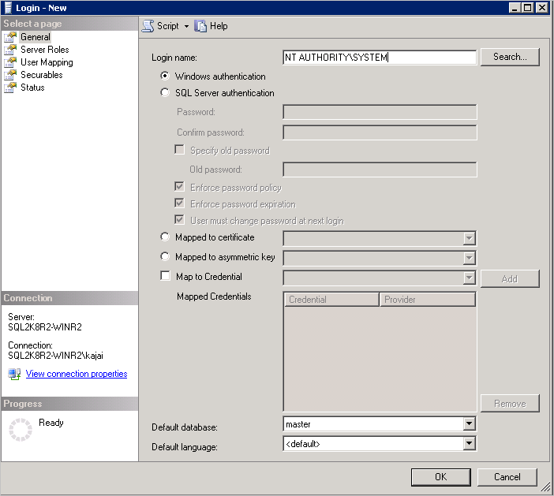

5. Go to *Server Roles* and choose *public* and *sysadmin* roles.

    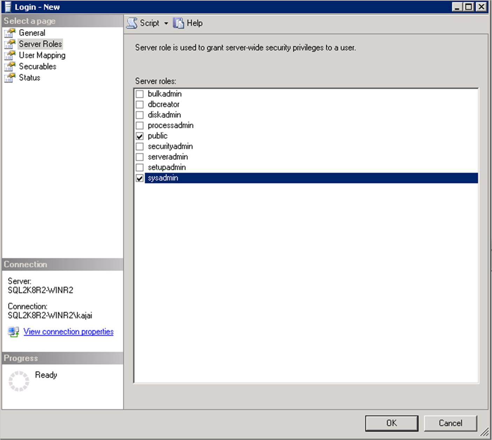

6. Go to *Status*. *Grant* the Permission to connect to database engine and Login as *Enabled*.

    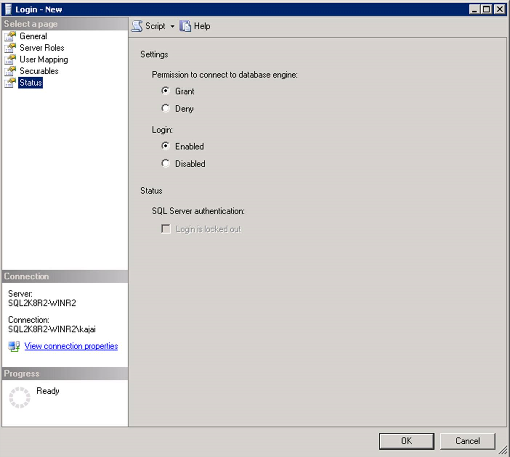

7. Select OK.
8. Repeat the same sequence of steps (1-7 above) to add NT Service\AzureWLBackupPluginSvc login to the SQL Server instance. If the login already exists, make sure it has the sysadmin server role and under Status it has Grant the Permission to connect to database engine and Login as Enabled.
9. After granting permission, **Rediscover DBs** in the portal: Vault **->** Backup Infrastructure **->** Workload in Azure VM:

    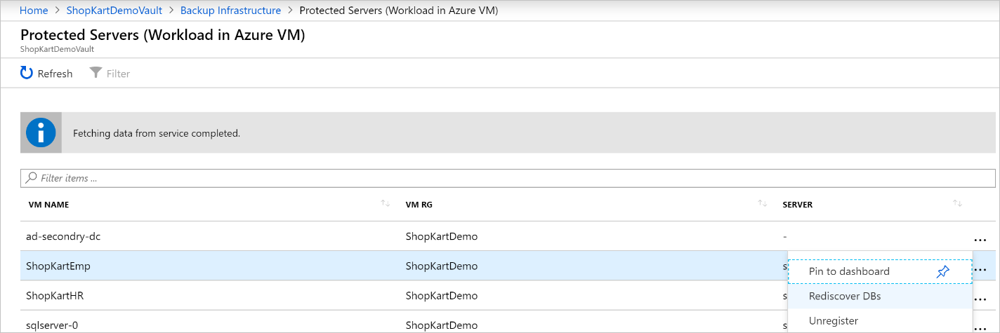

Alternatively, you can automate giving the permissions by running the following PowerShell commands in admin mode. The instance name is set to MSSQLSERVER by default. Change the instance name argument in script if needed.

```powershell
param(
    [Parameter(Mandatory=$false)]
    [string] $InstanceName = "MSSQLSERVER"
)
if ($InstanceName -eq "MSSQLSERVER")
{
    $fullInstance = $env:COMPUTERNAME   # In case it is the default SQL Server Instance
}
else
{
    $fullInstance = $env:COMPUTERNAME + "\" + $InstanceName   # In case of named instance
}
try
{
    sqlcmd.exe -S $fullInstance -Q "sp_addsrvrolemember 'NT Service\AzureWLBackupPluginSvc', 'sysadmin'" # Adds login with sysadmin permission if already not available
}
catch
{
    Write-Host "An error occurred:"
    Write-Host $_.Exception|format-list -force
}
try
{
    sqlcmd.exe -S $fullInstance -Q "sp_addsrvrolemember 'NT AUTHORITY\SYSTEM', 'sysadmin'" # Adds login with sysadmin permission if already not available
}
catch
{
    Write-Host "An error occurred:"
    Write-Host $_.Exception|format-list -force
}
```

## Configure simultaneous backups

You can now configure backups to save the SQL server recovery points and logs in a local storage and Recovery Services vault simultaneously.

To configure simultaneous backups, follow these steps:

1. Go to the `C:\Program Files\Azure Workload Backup\bin\plugins` location, and then create the file **PluginConfigSettings.json**, if it's not present.
2. Add the comma separated key value entities, with keys `EnableLocalDiskBackupForBackupTypes` and `LocalDiskBackupFolderPath` to the JSON file.

   - Under `EnableLocalDiskBackupForBackupTypes`, list the backup types that you want to store locally.

     For example, if you want to store the *Full* and *Log* backups, mention `["Full", "Log"]`. To store only the log backups, mention `["Log"]`.

   - Under `LocalDiskBackupFolderPath`, mention the *path to the local folder*. Ensure that you use the *double forward slash* while mentioning the path in the JSON file.
   
     For example, if the preferred path for local backup is `E:\LocalBackup`, mention the path in JSON as `E:\\LocalBackup`.

     The final JSON should appear as:
 
     ```JSON
     {
             "EnableLocalDiskBackupForBackupTypes": ["Log"],
             "LocalDiskBackupFolderPath": "E:\\LocalBackup",
     }
	 
     ```	 
 
     If there are other pre-populated entries in the JSON file, add the above two entries at the bottom of the JSON file *just before the closing curly bracket*.

3. For the changes to take effect immediately instead of regular one hour, go to **TaskManager** > **Services**, right-click **AzureWLbackupPluginSvc** and select **Stop**.

   >[!Caution]
   >This action will cancel all the ongoing backup jobs.

   The naming convention of the stored backup file and the folder structure for it will be `{LocalDiskBackupFolderPath}\{SQLInstanceName}\{DatabaseName}`.

   For example, if you have a database `Contoso` under the SQL instance `MSSQLSERVER`, the files will be located at in `E:\LocalBackup\MSSQLSERVER\Contoso`.

   The name of the file is the `VDI device set guid`, which is used for the backup operation.

4. Check if the target location under `LocalDiskBackupFolderPath` has *read* and *write* permissions for `NT Service\AzureWLBackupPluginSvc`.

   >[!Note]
   >For a folder on the local VM disks, right-click the folder and configure the required permissions for `NT Service\AzureWLBackupPluginSvc` on the **Security** tab.
   
   If you're using a network or SMB share, configure the permissions by running the below PowerShell cmdlets from a user console that already has the permission to access the share:

   ```azurepowershell
   $cred = Get-Credential
   New-SmbGlobalMapping -RemotePath <FileSharePath> -Credential $cred -LocalPath <LocalDrive>:  -FullAccess @("<Comma Separated list of accounts>") -Persistent $true
   
   ```

   **Example**:
   
   ```azurepowershell
   $cred = Get-Credential
   New-SmbGlobalMapping -RemotePath \\i00601p1imsa01.file.core.windows.net\rsvshare -Credential $cred -LocalPath Y:  -FullAccess @("NT AUTHORITY\SYSTEM","NT Service\AzureWLBackupPluginSvc") -Persistent $true
    ```

## Next steps

* [Learn about](backup-sql-server-database-azure-vms.md) backing up SQL Server databases.
* [Learn about](restore-sql-database-azure-vm.md) restoring backed up SQL Server databases.
* [Learn about](manage-monitor-sql-database-backup.md) managing backed up SQL Server databases.
