# About SQL Server Backup in Azure VMs

[Azure Backup](backup-overview.md) offers a stream-based, specialized solution to back up SQL Server running in Azure Virtual Machines (VMs). This solution aligns with Azure Backup's benefits of zero-infrastructure backup, long-term retention, and central management. It additionally provides the following advantages specifically for SQL Server:

- Workload aware backups that support all backup types - full, differential, and log
- 15 minute RPO (recovery point objective) with frequent log backups
- Point-in-time recovery up to a second
- Individual-database-levels backup and restore

To view the backup and restore scenarios that we support today, see the [support matrix](sql-support-matrix.md#scenario-support). For common questions, see the [frequently asked questions](faq-backup-sql-server.yml).

>[!Note]
>Private Preview for Snapshot based backup is now available! Snapshot based backup will help you backup large sized databases in a performant way and will also ensure faster restores from instant restore tier.

## Backup process

This solution uses the SQL native APIs to take backups of your SQL databases.

* Once you specify the SQL Server VM that you want to protect and query for the databases in it, Azure Backup service installs a workload backup extension on the VM by the name `AzureBackupWindowsWorkload` extension.
* This extension consists of a coordinator and a SQL plugin. While the coordinator is responsible for triggering workflows for various operations like configure backup, backup, and restore, the plugin is responsible for actual data flow.
* To be able to discover databases on this VM, Azure Backup creates the account `NT SERVICE\AzureWLBackupPluginSvc`. This account is used for backup and restore and requires SQL sysadmin permissions. The `NT SERVICE\AzureWLBackupPluginSvc` account is a [Virtual Service Account](/windows/security/identity-protection/access-control/service-accounts#virtual-accounts), and so doesn't require any password management. Azure Backup uses the `NT AUTHORITY\SYSTEM` account for database discovery/inquiry, so this account needs to be a public login on SQL. If you didn't create the SQL Server VM from Azure Marketplace, you might receive an error **UserErrorSQLNoSysadminMembership**. If the error message appears, [follow these instructions](#set-vm-permissions).
* Once you trigger configure protection on the selected databases, the backup service sets up the coordinator with the backup schedules and other policy details, which the extension caches locally on the VM.
* At the scheduled time, the coordinator communicates with the plugin and it starts streaming the backup data from the SQL server using VDI(Virtual Device Interface).  
* The plugin sends the data directly to the Recovery Services vault, thus eliminating the need for a staging location. The Azure Backup service encrypts and stores the data in storage accounts.
* When the data transfer is complete, coordinator confirms the commit with the backup service.

  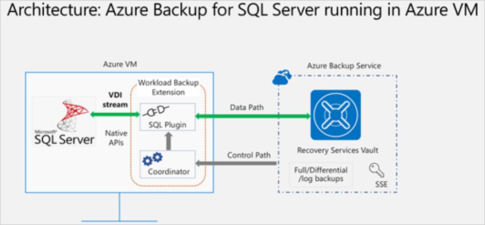

## Back up SQL Server instance snapshots (preview)

Azure Backup now offers a snapshot‑based SQL backup solution that enhances performance for large databases. By combining disk snapshots for rapid restores with frequent log backups for minimal data loss, this solution provides improved Recovery Time Objective (RTO) and low Recovery Point Objective (RPO). This feature is designed to meet the performance and resiliency needs of enterprise SQL deployments in Azure.

### Key benefits of snapshot backup for SQL databases in Azure VM

By using the Azure Backup service to back up and restore from snapshot of SQL databases in Azure VM, you get the following advantages:

- **Instance snapshot**: Create snapshot backups at the SQL instance level and select multiple databases in a single operation. Restore the entire instance or individual databases as needed.

- **Minimal impact on the source server**: Azure Backup briefly quiesces the database to capture an application-consistent snapshot. This process takes only a few seconds, unlike streaming backups that continuously consume resources.

- **Cost-effective**: Incremental snapshots reduce storage costs compared to streaming full backups, while providing higher durability through zone-redundant storage by default.

- **Improved RTO**: Restore operations complete faster because snapshots are retained within the customer subscription.

- **Faster RPO**: As with stream-based backups, log backups stream every 15 minutes and can be applied to the restored snapshot during recovery.

### How does the SQL Server instance snapshot backup work?

Azure Backup uses managed-disk incremental snapshots to protect SQL databases in Azure VMs. The backup policy controls snapshot creation, retention, and logs backup behavior to enable fast restores and point-in-time recovery.

The backup and restore flow provides a logical, end-to-end sequence—from snapshot creation and consistency to retention and restore that involves:

1.  Azure Backup creates managed-disk incremental snapshots based on the user-defined backup policy. Currently, the Azure Backup service supports one snapshot every six hours or higher.

2.  The service takes snapshot backups at the SQL instance level. You can select up to eight databases per snapshot operation.

3.  Azure Backup captures an application-consistent snapshot across all selected databases by snapping the underlying disks for the combined set of databases.

4.  The service retains snapshots in the Azure subscription within a specified resource group for a user-defined duration (up to seven days). Azure Backup then moves the data to the Recovery Services vault as vaulted backup for long-term retention based on the configured policy.

5.  Azure Backup streams log backups at the database level to the vault. During restore, the service restores the snapshot to an alternate VM and applies log backups to achieve point-in-time recovery.

### Pricing for snapshot backup of SQL databases in Azure VM

Backup of SQL in Azure VM snapshot incurs the following charges:

- **Snapshot storage cost (Managed Disks)**: Managed disk snapshots incur charges as per Managed Disk snapshot pricing (\$0.05 per GB per month) for the duration they're retained in your subscription. [Learn about Managed disk snapshot pricing](/pricing/details/managed-disks/).

- **Vault storage cost (Recovery Services vault)**: No storage charges apply after the snapshot moves to the Recovery Services vault during preview.

- **Snapshot data transfer / delta cost**: The first snapshot is a full snapshot, and all subsequent snapshots are incremental, reducing the cost for ongoing snapshot storage consumption.

- **Backup management cost**: During preview, Azure Backup doesn’t charge any other backup management fee for snapshot-only backups.

## Before you start

Before you start, verify the following requirements:

1. Make sure you have a SQL Server instance running in Azure. You can [quickly create a SQL Server instance](/azure/azure-sql/virtual-machines/windows/sql-vm-create-portal-quickstart) in the marketplace.
2. Review the [feature considerations](sql-support-matrix.md#feature-considerations-and-limitations) and [scenario support](sql-support-matrix.md#scenario-support).
3. [Review common questions](faq-backup-sql-server.yml) about this scenario.

## Set VM permissions

  When you run discovery on a SQL Server, Azure Backup performs the following actions:

* Adds the AzureBackupWindowsWorkload extension.
* Creates an NT SERVICE\AzureWLBackupPluginSvc account to discover databases on the virtual machine. This account is used for a backup and restore and requires SQL sysadmin permissions.
* Discovers databases that are running on a VM, Azure Backup uses the NT AUTHORITY\SYSTEM account. This account must be a public sign-in on SQL.

If you didn't create the SQL Server VM in Azure Marketplace or if you're on SQL 2008 or 2008 R2, you might receive a **UserErrorSQLNoSysadminMembership** error.

For giving permissions to **SQL 2008** and **2008 R2** running on Windows 2008 R2, see [this section](#give-sql-sysadmin-permissions-for-sql-2008-and-sql-2008-r2).

For all other versions, fix permissions with the following steps:

  1. Use an account with SQL Server sysadmin permissions to sign in to SQL Server Management Studio (SSMS). Unless you need special permissions, Windows authentication should work.
  2. On the SQL Server, open the **Security/Logins** folder.

      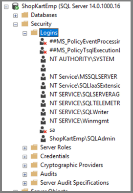

  3. Right-click the **Logins** folder and select **New Login**. In **Login - New**, select **Search**.

      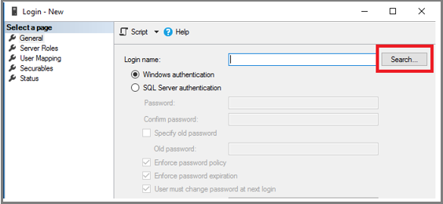

  4. The Windows virtual service account **NT SERVICE\AzureWLBackupPluginSvc** was created during the virtual machine registration and SQL discovery phase. Enter the account name as shown in **Enter the object name to select**. Select **Check Names** to resolve the name. Select **OK**.

      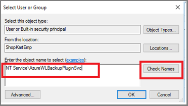

  5. In **Server Roles**, make sure the **sysadmin** role is selected. Select **OK**. The required permissions should now exist.

      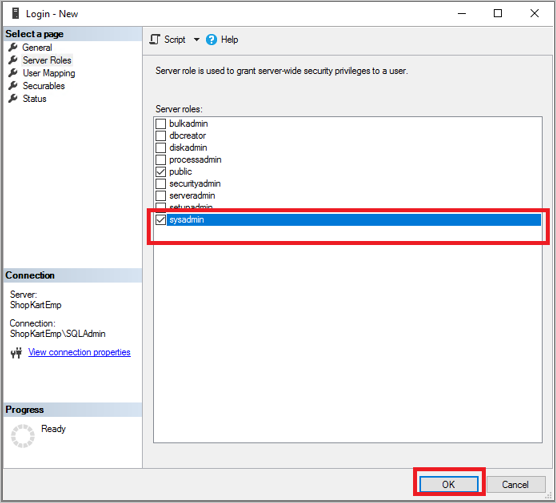
  
     If the SQL Server instance is part of an **Always-On Availability Group (AG)**, ensure that the **NT AUTHORITY\SYSTEM** account has the **VIEW SERVER STATE** permission enabled.

     :::image type="content" source="./media/backup-azure-sql-database/view-server-state-permission.png" alt-text="Screenshot shows how to check permission on a SQL server instance selected for backup." lightbox="./media/backup-azure-sql-database/view-server-state-permission.png":::

6. Now associate the database with the Recovery Services vault. In the Azure portal, in the **Protected Servers** list, right-click the server that's in an error state > **Rediscover DBs**.

      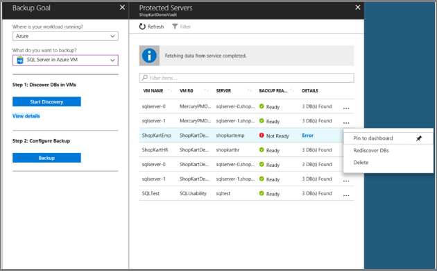

  7. Check progress in the **Notifications** area. When the selected databases are found, a success message appears.

      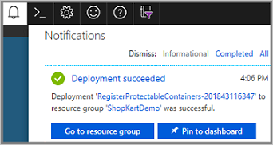

> [!NOTE]
> If your SQL Server has multiple instances of SQL Server installed, then you must add sysadmin permission for **NT Service\AzureWLBackupPluginSvc** account to all SQL instances.

### Give SQL sysadmin permissions for SQL 2008 and SQL 2008 R2

Add **NT AUTHORITY\SYSTEM** and **NT Service\AzureWLBackupPluginSvc** logins to the SQL Server Instance:

1. Go the SQL Server Instance in the Object explorer.
2. Navigate to Security -> Logins
3. Right-click the logins and select *New Login…*

    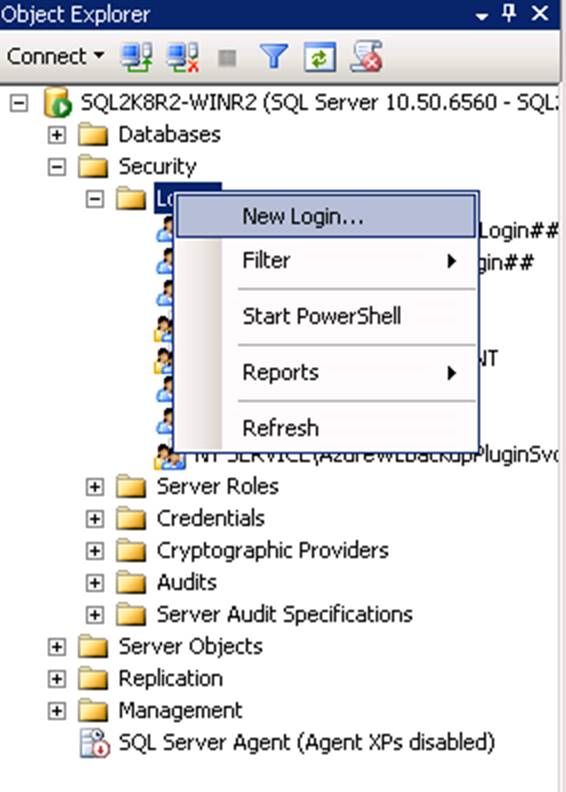

4. Go to the General tab and enter **NT AUTHORITY\SYSTEM** as the Login Name.

    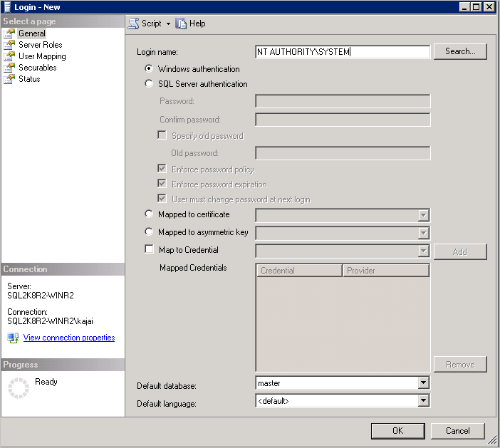

5. Go to *Server Roles* and choose *public* and *sysadmin* roles.

    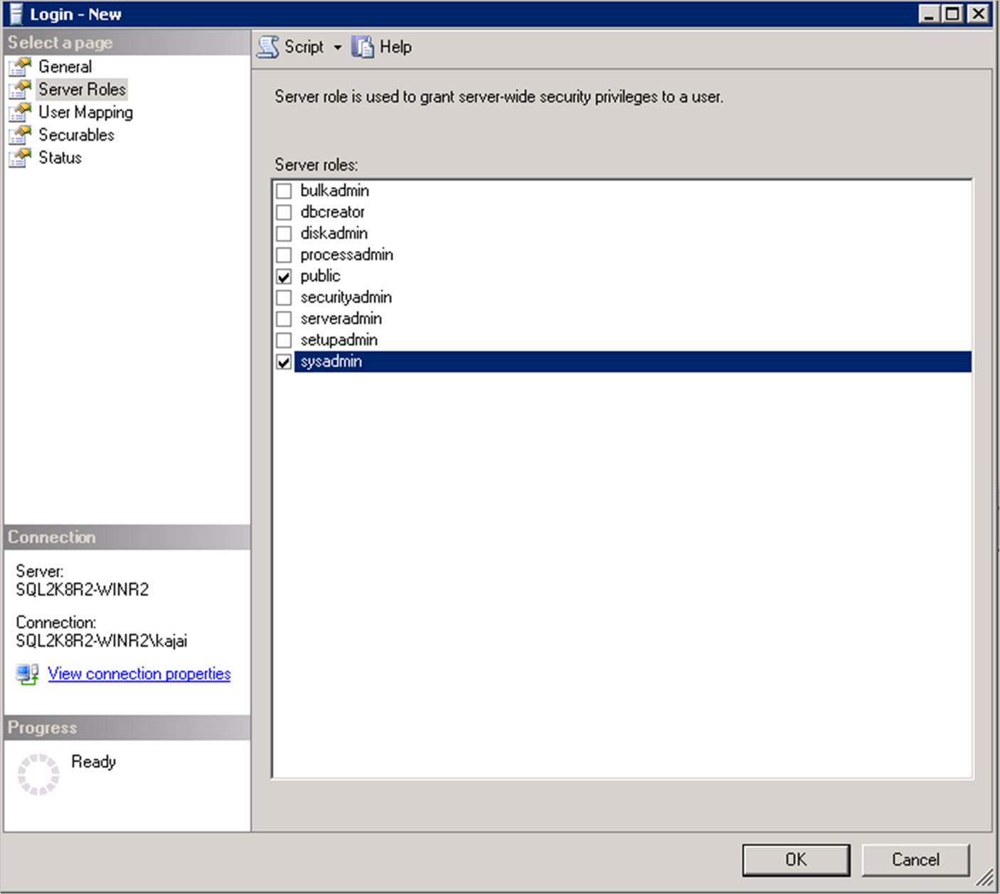

6. Go to *Status*. *Grant* the Permission to connect to database engine and Login as *Enabled*.

    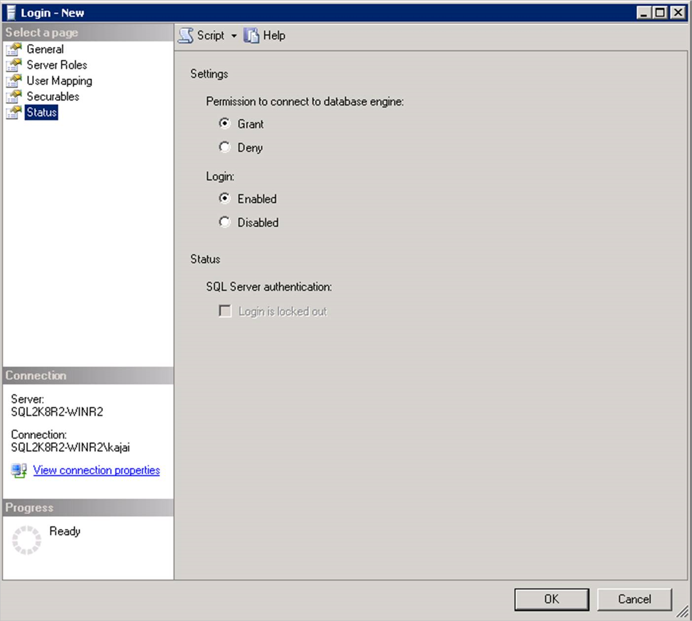

7. Select OK.
8. Repeat the same sequence of steps (1-7 above) to add NT Service\AzureWLBackupPluginSvc login to the SQL Server instance. If the login already exists, make sure it has the sysadmin server role and under Status it has Grant the Permission to connect to database engine and Login as Enabled.
9. After granting permission, **Rediscover DBs** in the portal: Vault **->** Manage **->** Backup Infrastructure **->** Workload in Azure VM:

    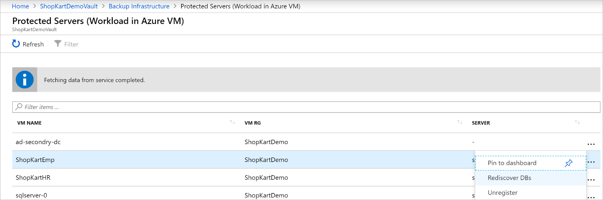

Alternatively, you can automate giving the permissions by running the following PowerShell commands in admin mode. The instance name is set to MSSQLSERVER by default. Change the instance name argument in script if needed.

```powershell
param(
    [Parameter(Mandatory=$false)]
    [string] $InstanceName = "MSSQLSERVER"
)
if ($InstanceName -eq "MSSQLSERVER")
{
    $fullInstance = $env:COMPUTERNAME   # In case it is the default SQL Server Instance
}
else
{
    $fullInstance = $env:COMPUTERNAME + "\" + $InstanceName   # In case of named instance
}
try
{
    sqlcmd.exe -S $fullInstance -Q "sp_addsrvrolemember 'NT Service\AzureWLBackupPluginSvc', 'sysadmin'" # Adds login with sysadmin permission if already not available
}
catch
{
    Write-Host "An error occurred:"
    Write-Host $_.Exception|format-list -force
}
try
{
    sqlcmd.exe -S $fullInstance -Q "sp_addsrvrolemember 'NT AUTHORITY\SYSTEM', 'sysadmin'" # Adds login with sysadmin permission if already not available
}
catch
{
    Write-Host "An error occurred:"
    Write-Host $_.Exception|format-list -force
}
```

## Configure simultaneous backups

You can now configure backups to save the SQL server recovery points and logs in a local storage and Recovery Services vault simultaneously.

To configure simultaneous backups, follow these steps:

1. Go to the `C:\Program Files\Azure Workload Backup\bin\plugins` location, and then create the file **PluginConfigSettings.json**, if it's not present.
2. Add the comma separated key value entities, with keys `EnableLocalDiskBackupForBackupTypes` and `LocalDiskBackupFolderPath` to the JSON file.

   - Under `EnableLocalDiskBackupForBackupTypes`, list the backup types that you want to store locally.

     For example, if you want to store the *Full* and *Log* backups, mention `["Full", "Log"]`. To store only the log backups, mention `["Log"]`.

   - Under `LocalDiskBackupFolderPath`, mention the *path to the local folder*. Ensure that you use the *double forward slash* while mentioning the path in the JSON file.
   
     For example, if the preferred path for local backup is `E:\LocalBackup`, mention the path in JSON as `E:\\LocalBackup`.

     The final JSON should appear as:
 
     ```json
     {
        "EnableLocalDiskBackupForBackupTypes": ["Log"],
        "LocalDiskBackupFolderPath": "E:\\LocalBackup",
     }
     ```

     If there are other prepopulated entries in the JSON file, add the above two entries at the bottom of the JSON file *just before the closing curly bracket*.

3. For the changes to take effect immediately instead of regular one hour, go to **TaskManager** > **Services**, right-click **AzureWLbackupPluginSvc**, and then select **Stop**.

   >[!Caution]
   >This action will cancel all the ongoing backup jobs.

   The naming convention of the stored backup file and the folder structure for it is `{LocalDiskBackupFolderPath}\{SQLInstanceName}\{DatabaseName}`.

   For example, if you have a database `Contoso` under the SQL instance `MSSQLSERVER`, the files are located at in `E:\LocalBackup\MSSQLSERVER\Contoso`.

   The name of the file is the `VDI device set guid`, which is used for the backup operation.

4. Check if the target location under `LocalDiskBackupFolderPath` has *read* and *write* permissions for `NT Service\AzureWLBackupPluginSvc`.

   >[!Note]
   >For a folder on the local VM disks, right-click the folder and configure the required permissions for `NT Service\AzureWLBackupPluginSvc` on the **Security** tab.
   
   If you're using a network or SMB share, configure the permissions by running the below PowerShell cmdlets from a user console that already has the permission to access the share:

   ```azurepowershell
   $cred = Get-Credential
   New-SmbGlobalMapping -RemotePath <FileSharePath> -Credential $cred -LocalPath <LocalDrive>:  -FullAccess @("<Comma Separated list of accounts>") -Persistent $true
   ```

   **Example**:
   
   ```azurepowershell
   $cred = Get-Credential
   New-SmbGlobalMapping -RemotePath \\i00601p1imsa01.file.core.windows.net\rsvshare -Credential $cred -LocalPath Y:  -FullAccess @("NT AUTHORITY\SYSTEM","NT Service\AzureWLBackupPluginSvc") -Persistent $true
   ```

## Next steps

* [Back up SQL Server databases running on an Azure VM](backup-sql-server-database-azure-vms.md).
* [Restore backed up SQL Server databases](restore-sql-database-azure-vm.md).
* [Manage backed up SQL Server databases](manage-monitor-sql-database-backup.md).


## Related content

- [Back up SQL server databases in Azure VMs using Azure Backup via REST API](backup-azure-sql-vm-rest-api.md).
- [Restore SQL Server databases in Azure VMs with REST API](restore-azure-sql-vm-rest-api.md).
- [Manage SQL server databases in Azure VMs with REST API](manage-azure-sql-vm-rest-api.md).

